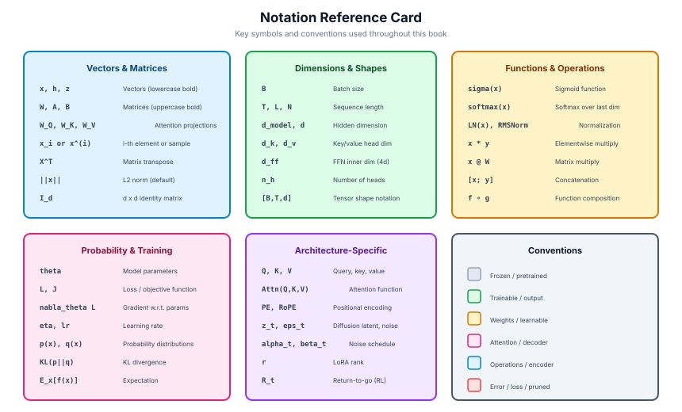

# Appendix: Notation Reference

The following table summarizes the mathematical notation used throughout this book. Symbols are grouped by category for easy reference.

---

## Scalars, Vectors, and Matrices

| Symbol | Meaning | First Appears |
|--------|---------|---------------|
| $x$, $y$, $z$ | Scalars | Ch01 |
| $\mathbf{x}$, $\mathbf{h}$, $\mathbf{z}$ | Vectors (bold lowercase) | Ch01 |
| $\mathbf{W}$, $\mathbf{A}$, $\mathbf{B}$ | Matrices (bold uppercase) | Ch01 |
| $\theta$ | Model parameters (generic) | Ch01 |
| $\phi$ | Encoder parameters | Ch02 |
| $d$ | Hidden dimension / feature dimension | Ch01 |
| $d_{\text{model}}$ | Transformer hidden dimension | Ch04 |
| $d_k$, $d_v$ | Key and value dimensions in attention | Ch04 |
| $n$ | Sequence length | Ch04 |
| $N$ | Number of model parameters | Ch05 |
| $D$ | Number of training tokens / dataset size | Ch05 |
| $C$ | Compute budget (FLOPs) | Ch05 |
| $B$ | Batch size | Ch01 |
| $V$ | Vocabulary size | Ch04 |
| $T$ | Number of timesteps (diffusion) | Ch08 |
| $r$ | LoRA rank | Ch09 |
| $E$ | Number of experts (MoE) | Ch05 |
| $K$ | Number of active experts (MoE) | Ch05 |

## Probability and Information Theory

| Symbol | Meaning | First Appears |
|--------|---------|---------------|
| $P$, $Q$ | Probability distributions | Ch01 |
| $p_\theta(x)$ | Model distribution parameterized by $\theta$ | Ch01 |
| $p_{\text{data}}(x)$ | True data distribution | Ch01 |
| $q_\phi(z \mid x)$ | Approximate posterior (encoder) | Ch02 |
| $p_\theta(x \mid z)$ | Likelihood (decoder) | Ch02 |
| $p(z)$ | Prior distribution over latents | Ch02 |
| $\mathcal{N}(\mu, \sigma^2)$ | Gaussian distribution | Ch01 |
| $\text{KL}(P \| Q)$ | Kullback-Leibler divergence from $Q$ to $P$ | Ch01 |
| $H(P)$ | Entropy of distribution $P$ | Ch01 |
| $H(P, Q)$ | Cross-entropy between $P$ and $Q$ | Ch01 |
| $\mathbb{E}[\cdot]$ | Expectation | Ch01 |

## Loss Functions and Objectives

| Symbol | Meaning | First Appears |
|--------|---------|---------------|
| $\mathcal{L}$ | Loss function (generic) | Ch01 |
| $\mathcal{L}(\theta, \phi; x)$ | ELBO (evidence lower bound) | Ch02 |
| $V(D, G)$ | GAN minimax objective | Ch03 |
| $\mathcal{L}_{\text{MLM}}$ | Masked language modeling loss | Ch05 |
| $\mathcal{L}_{\text{DPO}}$ | Direct preference optimization loss | Ch10 |
| $L^{\text{CLIP}}$ | PPO clipped surrogate objective | Ch10 |
| $\mathcal{L}_{\text{InfoNCE}}$ | Contrastive loss (InfoNCE) | Ch06 |

## Attention and Transformer

| Symbol | Meaning | First Appears |
|--------|---------|---------------|
| $\mathbf{Q}$, $\mathbf{K}$, $\mathbf{V}$ | Query, Key, Value matrices | Ch04 |
| $\mathbf{W}_Q$, $\mathbf{W}_K$, $\mathbf{W}_V$ | Projection matrices for Q, K, V | Ch04 |
| $\text{softmax}(\cdot)$ | Softmax function | Ch01 |
| $\text{Attention}(\mathbf{Q}, \mathbf{K}, \mathbf{V})$ | Scaled dot-product attention | Ch04 |
| $h$ | Number of attention heads | Ch04 |
| $\text{PE}(pos, i)$ | Positional encoding | Ch04 |

## Training and Optimization

| Symbol | Meaning | First Appears |
|--------|---------|---------------|
| $\alpha$, $\eta$ | Learning rate | Ch01 |
| $\nabla_\theta \mathcal{L}$ | Gradient of loss w.r.t. parameters | Ch01 |
| $\beta_1$, $\beta_2$ | Adam momentum coefficients | Ch01 |
| $\lambda$ | Regularization coefficient | Ch01 |
| $\epsilon$ | Small constant for numerical stability | Ch01 |
| $\|\mathbf{W}\|_F$ | Frobenius norm: $\sqrt{\sum_{ij} W_{ij}^2}$ | Ch01 |

## Diffusion Models

| Symbol | Meaning | First Appears |
|--------|---------|---------------|
| $\mathbf{x}_0$ | Clean data | Ch08 |
| $\mathbf{x}_t$ | Noised data at timestep $t$ | Ch08 |
| $\beta_t$ | Noise schedule at step $t$ | Ch08 |
| $\bar{\alpha}_t$ | Cumulative signal retention: $\prod_{s=1}^t (1 - \beta_s)$ | Ch08 |
| $\boldsymbol{\varepsilon}_\theta$ | Learned noise prediction network | Ch08 |
| $w$ | Classifier-free guidance scale | Ch08 |

## Reinforcement Learning

| Symbol | Meaning | First Appears |
|--------|---------|---------------|
| $s$, $a$, $r$ | State, action, reward | Ch10 |
| $\pi_\theta(a \mid s)$ | Policy (action distribution given state) | Ch10 |
| $V(s)$ | State value function | Ch10 |
| $Q(s, a)$ | Action-value function | Ch10 |
| $A_t$ | Advantage: $Q(s_t, a_t) - V(s_t)$ | Ch10 |
| $\gamma$ | Discount factor | Ch10 |
| $R(x, y)$ | Reward model score | Ch10 |
| $\pi_{\text{ref}}$ | Reference policy (for KL constraint) | Ch10 |

## LoRA and PEFT

| Symbol | Meaning | First Appears |
|--------|---------|---------------|
| $\Delta \mathbf{W}$ | Weight update matrix | Ch09 |
| $\mathbf{A} \in \mathbb{R}^{r \times d}$ | LoRA down-projection | Ch09 |
| $\mathbf{B} \in \mathbb{R}^{d \times r}$ | LoRA up-projection | Ch09 |
| $\alpha_{\text{LoRA}}$ | LoRA scaling factor | Ch09 |

---

*Conventions: Bold lowercase ($\mathbf{x}$) denotes vectors. Bold uppercase ($\mathbf{W}$) denotes matrices. Calligraphic ($\mathcal{L}$, $\mathcal{N}$) denotes loss functions and distributions. Subscripts denote indices or conditioning; superscripts denote layer indices or exponents (context makes the distinction clear).*
