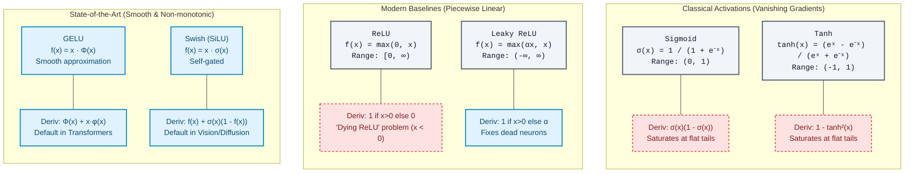
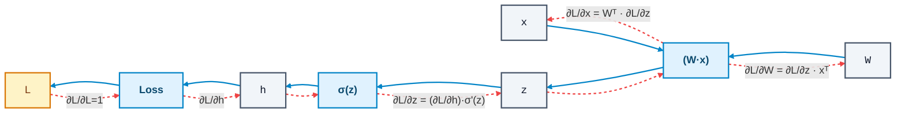
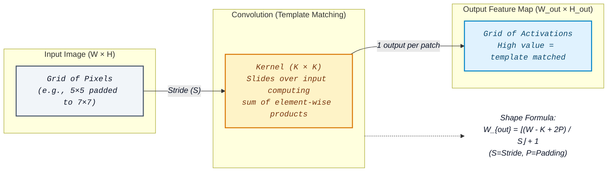
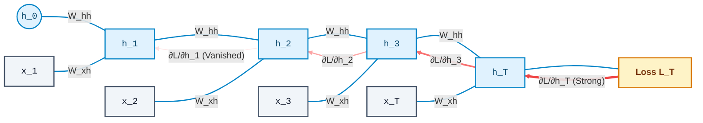
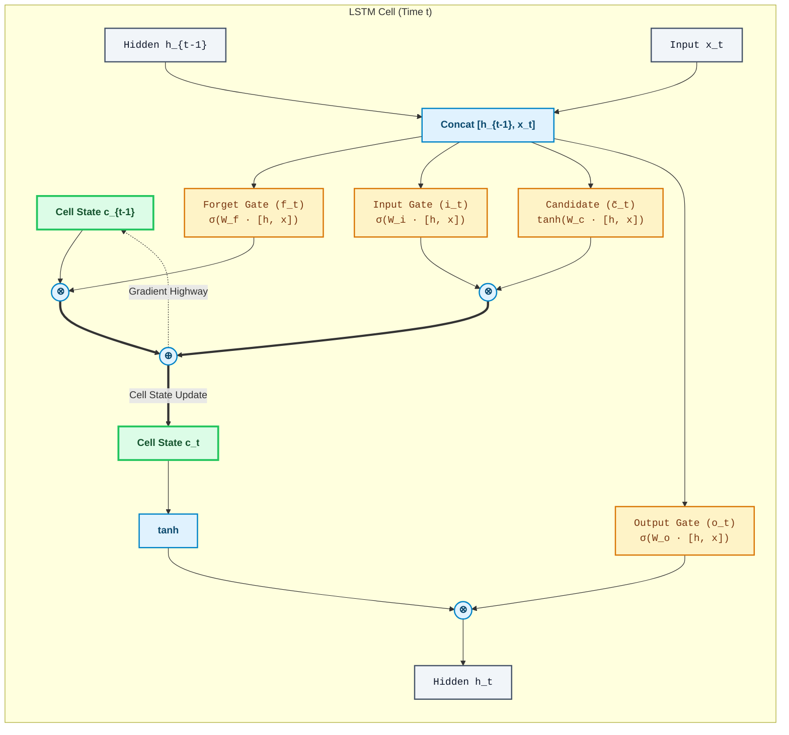
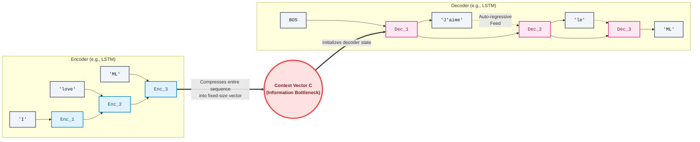

# Chapter 1: Foundations — From Software Systems to Learning Systems

**Self-Assessment**: If you can answer these questions, skim this chapter:
1. What is the gradient of $f(x,y) = x^2 y + \sin(y)$?
2. What does $\text{KL}(P\|Q) = 0$ imply?
3. Write the chain rule for $\frac{\partial \mathcal{L}}{\partial \mathbf{W}}$ in a two-layer network.
4. What problem do residual connections solve?
5. Why can't vanilla RNNs learn long-range dependencies?

If any are unfamiliar, read the corresponding section carefully.

---

## 1.1 The Paradigm Shift: From Explicit Programs to Learned Representations

You have spent a decade writing software that transforms inputs to outputs through explicitly coded logic. Every branch, every data structure choice, every algorithm selection — you made those decisions. Machine learning inverts this: you specify *what* the correct input-output mapping looks like (via data), define a parameterized function family, and let optimization find the parameters.

This is not as foreign as it sounds. Consider the distinction between imperative and declarative programming. In SQL, you declare *what* you want — `SELECT users WHERE active = true ORDER BY last_login` — and the query planner figures out *how* to execute it (index scans, join ordering, etc.). In machine learning, you declare *what* constitutes good behavior (a loss function and training data), define a computational graph with learnable parameters, and let gradient-based optimization figure out the parameter values.

The key insight: **a neural network is a parameterized program**. Training is a search over program space. The architecture defines the space of possible programs; the loss function defines which programs are good; the optimizer navigates that space.

Why would you choose this over hand-coded rules? Three reasons:

1. **Intractable specification.** Try writing rules to classify images of dogs vs. cats. You cannot enumerate the pixel-level conditions. But you can collect 10,000 labeled images and let the system discover the relevant features.

2. **Adaptability.** When the data distribution shifts, you retrain. You do not rewrite a rule engine. This is analogous to configuration-driven systems — except the "configuration" is learned from data rather than written by hand.

3. **Scalability of capability.** Empirically, learned systems improve with more data, more compute, and larger models in ways that hand-coded systems do not. This observation — scaling laws — is one of the most consequential findings in modern AI research.

The tradeoff is interpretability and guarantees. Your hand-coded sort algorithm has provable $O(n \log n)$ complexity. A learned system's behavior is characterized statistically, not formally. This tension between capability and verifiability runs through the entire field.

---

## 1.2 Mathematical Foundations

You already know this material. This section reframes it for the ML context and establishes notation used throughout the book.

### 1.2.1 Linear Algebra: Tensors as the Data Substrate *(Review)*

A tensor is a multidimensional array. You already work with these:

- **Scalar**: a single float — a 0-dimensional tensor
- **Vector**: $\mathbf{x} \in \mathbb{R}^n$ — a 1D array, shape `(n,)`
- **Matrix**: $\mathbf{W} \in \mathbb{R}^{m \times n}$ — a 2D array, shape `(m, n)`
- **Higher-order tensors**: a batch of RGB images is shape `(batch, channels, height, width)` — a 4D tensor

The operations you need:

**Matrix-vector multiplication** $\mathbf{y} = \mathbf{W}\mathbf{x}$ is a linear transformation. Every layer in a neural network begins with one. If $\mathbf{W}$ is shape `(m, n)` and $\mathbf{x}$ is shape `(n,)`, then $\mathbf{y}$ is shape `(m,)`. Each element $y_i = \sum_j W_{ij} x_j$. This maps an $n$-dimensional input to an $m$-dimensional output.

**Batched operations.** In practice, you process $B$ inputs simultaneously. If $\mathbf{X}$ is shape `(B, n)`, then $\mathbf{Y} = \mathbf{X}\mathbf{W}^\top$ gives shape `(B, m)`. This is why GPU parallelism matters — matrix multiplication is embarrassingly parallel.

**Tensor contractions.** Einstein summation notation (`einsum`) generalizes all these operations. The expression `torch.einsum('bij,bjk->bik', A, B)` performs batched matrix multiplication. If you have used NumPy's broadcasting rules, you already understand the mechanics. The `einsum` notation just makes the index contractions explicit.

**Norms.** The L2 norm $\lVert \mathbf{x} \rVert_2 = \sqrt{\sum_i x_i^2}$ measures vector magnitude. The Frobenius norm $\lVert \mathbf{W} \rVert_F = \sqrt{\sum_{ij} W_{ij}^2}$ extends this to matrices — it is the L2 norm of the matrix treated as a flattened vector. These appear everywhere: in regularization, in normalization layers, in distance metrics. The Frobenius norm reappears in the LoRA analysis (Chapter 9).

**Eigendecomposition and SVD.** A square matrix $\mathbf{A}$ can be decomposed as $\mathbf{A} = \mathbf{Q}\mathbf{\Lambda}\mathbf{Q}^{-1}$, where the columns of $\mathbf{Q}$ are eigenvectors and $\mathbf{\Lambda}$ is a diagonal matrix of eigenvalues. For non-square matrices, the more general **singular value decomposition (SVD)** applies: $\mathbf{A} = \mathbf{U}\mathbf{\Sigma}\mathbf{V}^\top$, where $\mathbf{U}$ and $\mathbf{V}$ are orthogonal matrices and $\mathbf{\Sigma}$ is diagonal with non-negative singular values. The singular values quantify how much "information" each dimension carries — truncating to the top $r$ singular values gives the best rank $r$ approximation of $\mathbf{A}$ (Eckart–Young theorem). This low-rank structure is the mathematical foundation for parameter-efficient fine-tuning methods like LoRA (Chapter 9), which approximate weight updates as low-rank matrix products.

### 1.2.2 Calculus: Gradients and the Chain Rule *(Review)*

The gradient of a scalar function $f: \mathbb{R}^n \to \mathbb{R}$ with respect to its input $\mathbf{x}$ is the vector of partial derivatives:

$$\nabla_{\mathbf{x}} f = \left[\frac{\partial f}{\partial x_1}, \frac{\partial f}{\partial x_2}, \ldots, \frac{\partial f}{\partial x_n}\right]$$

This vector points in the direction of steepest increase of $f$. To minimize a loss function $\mathcal{L}(\theta)$, you update parameters in the opposite direction: $\theta \leftarrow \theta - \alpha \nabla_\theta \mathcal{L}$. That is gradient descent.

**The chain rule** is the computational backbone of all neural network training. For composed functions $f(g(x))$:

$$\frac{df}{dx} = \frac{df}{dg} \cdot \frac{dg}{dx}$$

For vector-valued functions, derivatives become **Jacobian matrices**. If $g: \mathbb{R}^n \to \mathbb{R}^m$, the Jacobian $\mathbf{J}_g$ is the $(m \times n)$ matrix where $J_{ij} = \frac{\partial g_i}{\partial x_j}$. The chain rule generalizes to:

$$\mathbf{J}_{f \circ g} = \mathbf{J}_f \cdot \mathbf{J}_g$$

**Automatic differentiation** is not finite differences (too slow, numerically unstable) and not symbolic differentiation (expression swell). It is the mechanical application of the chain rule to a computational graph. Every operation in your forward pass (addition, multiplication, ReLU, etc.) has a known local derivative. Autodiff composes these local derivatives via the chain rule.

There are two modes:

- **Forward mode**: propagates derivatives input-to-output. Cost is $O(1)$ per input dimension. Efficient when you have few inputs, many outputs.
- **Reverse mode**: propagates derivatives output-to-input. Cost is $O(1)$ per output dimension. Efficient when you have many inputs, few outputs.

Neural network training has millions of parameters (inputs to the loss function) and one scalar loss (the output). Reverse mode wins overwhelmingly. Reverse-mode autodiff applied to neural networks is called **backpropagation** (Rumelhart, Hinton, & Williams, 1986). It is not a special algorithm — it is reverse-mode autodiff. PyTorch's `loss.backward()` is doing exactly this.

### 1.2.3 Probability and Statistics *(Review for basics, New Concepts for Bayesian inference primer)*

**Bayes' theorem** relates prior beliefs to posterior beliefs given evidence:

$$P(\theta \mid D) = \frac{P(D \mid \theta) \, P(\theta)}{P(D)}$$

where $P(D \mid \theta)$ is the likelihood, $P(\theta)$ is the prior, and $P(\theta \mid D)$ is the posterior. Maximum likelihood estimation (MLE) finds the $\theta$ that maximizes $P(D \mid \theta)$, ignoring the prior. Maximum a posteriori (MAP) estimation maximizes $P(D \mid \theta) \cdot P(\theta)$. L2 regularization is equivalent to MAP estimation with a Gaussian prior on the parameters — a relationship that reappears throughout the book, from VAE priors (Chapter 2) to weight decay in Transformer training (Chapter 4).

**Bayesian inference primer.** Bayes' theorem tells us how to update beliefs given evidence, but in practice, computing the posterior $P(\theta \mid D)$ requires evaluating the denominator $P(D) = \int P(D \mid \theta) P(\theta) \, d\theta$ — the marginal likelihood. This integral sums the likelihood over *every possible* parameter setting, weighted by the prior. For a model with a handful of parameters, this is tractable (you can use conjugate priors or numerical quadrature). But neural networks have millions of parameters, and the integral is over a million-dimensional space. There is no closed-form solution, and grid-based numerical methods are hopeless — the number of grid points grows exponentially with dimension (the "curse of dimensionality"). This is why exact Bayesian inference over neural network parameters is intractable in practice. The field has developed two main workarounds: **sampling methods** (MCMC) that are asymptotically exact but slow, and **variational inference** that trades exactness for speed by approximating the posterior with a simpler distribution. Variational inference is the approach that makes VAEs (Chapter 2) and many other modern generative models possible. If you take one thing from this paragraph: the reason we need approximate inference is not mathematical laziness — it is that exact inference requires solving integrals that are computationally impossible in high dimensions.

**KL divergence** measures how one probability distribution diverges from another:

$$\mathrm{KL}(P \| Q) = \sum_x P(x) \log \frac{P(x)}{Q(x)}$$

It is not symmetric: $\mathrm{KL}(P \| Q) \neq \mathrm{KL}(Q \| P)$. It is non-negative: $\mathrm{KL}(P \| Q) \geq 0$, with equality iff $P = Q$. KL divergence appears in variational inference, in the ELBO objective, in policy optimization (PPO's clipped objective bounds a KL divergence), and in distillation losses. You will see it in nearly every chapter of this book.

**Maximum Likelihood Estimation (MLE).** Given data $D = \{x_1, \ldots, x_N\}$ drawn i.i.d. from some unknown distribution, and a parameterized model $p_\theta(x)$, MLE finds:

$$\theta^* = \arg\max_\theta \sum_i \log p_\theta(x_i)$$

The log-sum form is more numerically stable than the product form. For classification with a softmax output, minimizing cross-entropy loss *is* MLE. For regression with a Gaussian likelihood, minimizing MSE loss *is* MLE. Loss functions are not arbitrary choices — they encode distributional assumptions.

### 1.2.4 Information Theory *(Likely New Concepts)*

**Entropy** measures the expected information content of a distribution:

$$H(P) = -\sum_x P(x) \log P(x)$$

Maximum entropy occurs for uniform distributions. Deterministic distributions have zero entropy. Entropy quantifies uncertainty.

**Cross-entropy** between a true distribution $P$ and a model distribution $Q$:

$$H(P, Q) = -\sum_x P(x) \log Q(x)$$

Note that $H(P, Q) = H(P) + \mathrm{KL}(P \| Q)$. Since $H(P)$ is constant with respect to model parameters, minimizing cross-entropy is equivalent to minimizing KL divergence from the true distribution. This is why cross-entropy is the standard classification loss.

**KL divergence in depth.** KL divergence is used so heavily throughout this book — in the VAE objective (Chapter 2), in PPO's policy constraint (Chapter 6), in knowledge distillation, in information bottleneck arguments — that it deserves a thorough treatment here.

*Intuition.* Suppose you design an encoding scheme optimized for distribution $P$: events that $P$ considers likely get short codes, unlikely events get long codes. Now data actually arrives from distribution $Q$. KL divergence $\text{KL}(Q \| P)$ measures how many *extra* bits per symbol you waste because you designed your code for $P$ instead of $Q$. Equivalently: **KL divergence measures how surprised you would be if data came from $Q$ but you had been expecting $P$.**

*Formal properties:*

1. **Non-negativity:** $\text{KL}(P \| Q) \geq 0$ for all distributions $P, Q$. This follows from Jensen's inequality applied to the concave $\log$ function.
2. **Zero iff equal:** $\text{KL}(P \| Q) = 0$ if and only if $P = Q$ (almost everywhere). If you are not surprised at all, the distributions must be identical.
3. **Not symmetric:** $\text{KL}(P \| Q) \neq \text{KL}(Q \| P)$ in general. The "surprise" of expecting $P$ and seeing $Q$ is different from expecting $Q$ and seeing $P$. This asymmetry has practical consequences: $\text{KL}(q \| p)$ (used in variational inference) tends to be *mode-seeking* (the approximation $q$ concentrates on a single mode of $p$), while $\text{KL}(p \| q)$ is *mode-covering* (the approximation $q$ spreads to cover all modes of $p$).
4. **Not a metric:** Because it is asymmetric and does not satisfy the triangle inequality, KL divergence is technically not a distance — though it is often informally called one.

*Connection to cross-entropy:*

$$\text{KL}(P \| Q) = H(P, Q) - H(P)$$

Cross-entropy $H(P, Q)$ is the total expected coding cost when encoding $P$-distributed data with a code optimized for $Q$. Entropy $H(P)$ is the optimal coding cost. The KL divergence is the *excess* cost — the penalty for using the wrong distribution. Since $H(P)$ does not depend on model parameters, minimizing cross-entropy $H(P, Q)$ with respect to $Q$ is equivalent to minimizing $\text{KL}(P \| Q)$.

*Worked example: fair vs. biased coin.*

Let $P$ be a fair coin: $P(\text{heads}) = 0.5$, $P(\text{tails}) = 0.5$. Let $Q$ be a biased coin: $Q(\text{heads}) = 0.9$, $Q(\text{tails}) = 0.1$.

First, $\text{KL}(P \| Q)$ — how surprised are we if we expected $Q$ (biased) but data comes from $P$ (fair)?

$$\text{KL}(P \| Q) = 0.5 \ln \frac{0.5}{0.9} + 0.5 \ln \frac{0.5}{0.1}$$

$$= 0.5 \times (-0.588) + 0.5 \times 1.609 = -0.294 + 0.805 = 0.511 \text{ nats}$$

Now $\text{KL}(Q \| P)$ — how surprised are we if we expected $P$ (fair) but data comes from $Q$ (biased)?

$$\text{KL}(Q \| P) = 0.9 \ln \frac{0.9}{0.5} + 0.1 \ln \frac{0.1}{0.5}$$

$$= 0.9 \times 0.588 + 0.1 \times (-1.609) = 0.529 - 0.161 = 0.368 \text{ nats}$$

Notice: $\text{KL}(P \| Q) = 0.511 \neq 0.368 = \text{KL}(Q \| P)$. The asymmetry is real and numerically significant. Intuitively, the fair coin produces tails 50% of the time, which the biased model $Q$ considers very unlikely (probability 0.1) — so $P$'s data is more surprising under $Q$ than vice versa.

We can verify the cross-entropy connection. $H(P) = -0.5 \ln 0.5 - 0.5 \ln 0.5 = 0.693$ nats. $H(P, Q) = -0.5 \ln 0.9 - 0.5 \ln 0.1 = 0.053 + 1.151 = 1.204$ nats. And indeed $\text{KL}(P \| Q) = H(P, Q) - H(P) = 1.204 - 0.693 = 0.511$ nats. Checks out.

**Mutual information** $I(X; Y) = H(X) - H(X \mid Y)$ measures how much knowing $Y$ reduces uncertainty about $X$. It appears in representation learning objectives and in information-theoretic analyses of neural networks.

---

## 1.3 Neural Networks as Function Approximators

### 1.3.1 The Universal Approximation Theorem

A feedforward network with a single hidden layer of sufficient width can approximate any continuous function on a compact subset of $\mathbb{R}^n$ to arbitrary precision. Cybenko (1989) proved this for sigmoid activations; Hornik (1991) generalized the result to arbitrary non-polynomial activation functions.

What this guarantees: the function family is expressive enough. A solution *exists* in the parameter space.

What this does *not* guarantee:
- That gradient descent will *find* that solution
- That the required width is practical (it may be exponentially large)
- That the network will *generalize* beyond the training data
- Anything about depth — deeper networks can be exponentially more efficient than shallow ones for certain function classes

Think of it as an existence proof, not a construction. It tells you the architecture is not the bottleneck — optimization and generalization are.

### 1.3.2 Layers as Composable Transformations

A neural network is a composition of parameterized functions:

$$f(\mathbf{x}) = f_L(f_{L-1}(\cdots f_2(f_1(\mathbf{x}))))$$

Each $f_l$ is a layer. This is a pipeline — conceptually identical to a chain of middleware handlers or a Unix pipe. Each stage transforms its input and passes the result forward.

```mermaid
graph LR
    classDef tensor fill:#f1f5f9,stroke:#475569,stroke-width:2px,color:#0f172a,font-family:monospace
    classDef layer fill:#fef3c7,stroke:#d97706,stroke-width:2px,color:#78350f,font-weight:bold

    X["Input x<br/>Shape: (B, d_in)"]:::tensor
    
    L1["Layer f_1<br/>σ(W₁x + b₁)"]:::layer
    H1["Hidden h_1<br/>Shape: (B, d_1)"]:::tensor
    
    L2["Layer f_2<br/>σ(W₂h₁ + b₂)"]:::layer
    H2["Hidden h_2<br/>Shape: (B, d_2)"]:::tensor
    
    Dots["..."]:::tensor
    
    H_Lm1["Hidden h_{L-1}<br/>Shape: (B, d_{L-1})"]:::tensor
    LL["Layer f_L<br/>W_L h_{L-1} + b_L"]:::layer
    Y["Output f(x)<br/>Shape: (B, d_out)"]:::tensor

    X -->|"Middleware 1"| L1 --> H1
    H1 -->|"Middleware 2"| L2 --> H2
    H2 --> Dots --> H_Lm1
    H_Lm1 -->|"Middleware L"| LL --> Y
```



A standard dense (fully connected) layer computes:

$$\mathbf{h} = \sigma(\mathbf{W}\mathbf{x} + \mathbf{b})$$

where $\mathbf{W}$ is a weight matrix, $\mathbf{b}$ is a bias vector, and $\sigma$ is a non-linear activation function. The forward pass in pseudocode:

```python
def forward(x, layers):
    h = x
    for W, b, activation in layers:
        h = activation(W @ h + b)
    return h
```

The parameters $\{\mathbf{W}_l, \mathbf{b}_l\}$ for all layers $l$ collectively define the function. Training adjusts these parameters to minimize a loss function evaluated on training data.

### 1.3.3 Activation Functions and Non-Linearity

Without activation functions, a composition of linear transformations is still linear:

$$\mathbf{W}_2(\mathbf{W}_1 \mathbf{x} + \mathbf{b}_1) + \mathbf{b}_2 = (\mathbf{W}_2 \mathbf{W}_1)\mathbf{x} + (\mathbf{W}_2 \mathbf{b}_1 + \mathbf{b}_2) = \mathbf{W}'\mathbf{x} + \mathbf{b}'$$

A 100-layer linear network is equivalent to a single-layer linear network. Non-linear activations break this degeneracy and make depth meaningful.

Common choices:



- **ReLU**: $\max(0, x)$. Simple, cheap to compute, no vanishing gradient for positive inputs. The default choice for hidden layers. Downside: "dead neurons" — units stuck at zero if they enter the negative regime permanently.
- **GELU**: $x \cdot \Phi(x)$ where $\Phi$ is the CDF of the standard normal distribution $\mathcal{N}(0,1)$. A smooth approximation to ReLU. Used in Transformers (BERT, GPT).
- **Sigmoid**: $\frac{1}{1 + e^{-x}}$. Outputs in $(0, 1)$. Used for binary classification outputs. Suffers from vanishing gradients at extremes.
- **Softmax**: $\text{softmax}(\mathbf{z})_i = \frac{e^{z_i}}{\sum_j e^{z_j}}$. Converts logits to a probability distribution. Used as the final layer for multi-class classification.

### 1.3.4 Loss Functions as Optimization Objectives

You define a loss function, and the training process minimizes it. This is exactly analogous to defining a cost function in operations research or an objective in constrained optimization.

**Cross-entropy loss** for classification:

$$\mathcal{L} = -\sum_c y_c \log p_c$$

where $\mathbf{y}$ is the one-hot true label and $\mathbf{p}$ is the predicted probability. For binary classification, this reduces to $\mathcal{L} = -[y \log p + (1-y) \log(1-p)]$.

**Mean squared error** for regression:

$$\mathcal{L} = \frac{1}{N} \sum_i (y_i - f(x_i))^2$$

**The choice of loss function encodes your assumptions.** MSE assumes Gaussian noise. Cross-entropy assumes categorical outputs. Huber loss assumes you want robustness to outliers. Choosing a loss function is choosing what "good" means — it is one of the most consequential design decisions in any ML system.

---

## 1.4 Training as Optimization

### 1.4.1 Stochastic Gradient Descent and Variants *(Review)*

Full-batch gradient descent computes the gradient over the entire dataset, then takes one step. With millions of examples, this is impractical. **Stochastic gradient descent (SGD)** approximates the full gradient with a minibatch:

$$\theta \leftarrow \theta - \alpha \cdot \frac{1}{|B|} \sum_{x \in B} \nabla_\theta \mathcal{L}(x, \theta)$$

where $B$ is a random subset (minibatch) of the training data. The gradient estimate is noisy but unbiased. The noise actually helps — it provides implicit regularization and helps escape shallow local minima.

**Momentum** accumulates a running average of past gradients:

$$v \leftarrow \beta v + \nabla_\theta \mathcal{L}$$

$$\theta \leftarrow \theta - \alpha v$$

This accelerates convergence along consistent gradient directions and dampens oscillation. Think of it as a low-pass filter on the gradient signal.

**Adam** (Kingma & Ba, 2015) adapts the learning rate per-parameter using first and second moment estimates:

$$m \leftarrow \beta_1 m + (1 - \beta_1) g \quad \text{(first moment — mean)}$$

$$v \leftarrow \beta_2 v + (1 - \beta_2) g^2 \quad \text{(second moment — uncentered variance)}$$

$$\hat{m} \leftarrow \frac{m}{1 - \beta_1^t} \quad \text{(bias correction)}$$

$$\hat{v} \leftarrow \frac{v}{1 - \beta_2^t} \quad \text{(bias correction)}$$

$$\theta \leftarrow \theta - \alpha \cdot \frac{\hat{m}}{\sqrt{\hat{v}} + \epsilon}$$

The per-parameter learning rate adaptation means that infrequent features get larger updates and frequent features get smaller updates. Defaults $\beta_1 = 0.9$, $\beta_2 = 0.999$, $\epsilon = 10^{-8}$ work well across a wide range of problems.

**AdamW** (Loshchilov & Hutter, 2019) decouples weight decay from the adaptive learning rate. Standard L2 regularization interacts poorly with Adam's per-parameter scaling. AdamW fixes this by applying weight decay directly to the parameters rather than through the gradient. It is the standard optimizer for Transformer training.

### 1.4.2 Backpropagation *(Review)*

Backpropagation (Rumelhart et al., 1986) computes $\nabla_\theta \mathcal{L}$ efficiently via reverse-mode autodiff. The algorithm:

1. **Forward pass**: compute the output and all intermediate activations, caching them.
2. **Backward pass**: starting from the loss, propagate gradients backward through the computational graph using the chain rule.

For a single layer $\mathbf{h} = \sigma(\mathbf{W}\mathbf{x} + \mathbf{b})$:

$$\frac{\partial \mathcal{L}}{\partial \mathbf{W}} = \frac{\partial \mathcal{L}}{\partial \mathbf{h}} \cdot \frac{\partial \mathbf{h}}{\partial (\mathbf{W}\mathbf{x}+\mathbf{b})} \cdot \frac{\partial (\mathbf{W}\mathbf{x}+\mathbf{b})}{\partial \mathbf{W}} = \delta \cdot \sigma'(\mathbf{W}\mathbf{x} + \mathbf{b}) \cdot \mathbf{x}^\top$$

where $\delta$ is the gradient flowing back from subsequent layers. Each layer receives the gradient from above, multiplies by the local Jacobian, and passes it further back.



The computational cost of the backward pass is roughly 2–3× the forward pass (and can be higher for attention layers, where the backward pass involves additional matrix operations over the full sequence length). You store intermediate activations during the forward pass to reuse them during the backward pass. This memory cost is why training requires more GPU memory than inference — a practical constraint that shapes many architectural decisions.

### 1.4.3 Regularization *(Review)*

Regularization prevents the model from memorizing the training data (overfitting). It is the ML analog of defensive programming against edge cases.

**L2 regularization** (weight decay) adds a penalty on parameter magnitude:

$$\mathcal{L}_{\text{total}} = \mathcal{L}_{\text{data}} + \lambda \sum_i \theta_i^2$$

This pushes parameters toward zero, favoring simpler solutions. As noted earlier, it is equivalent to a Gaussian prior on parameters in the Bayesian framing.

**L1 regularization** uses absolute values instead: $\lambda \sum_i |\theta_i|$. This induces sparsity — many parameters become exactly zero. Useful for feature selection but less common in deep learning.

**Dropout** (Srivastava et al., 2014) randomly zeroes each neuron's output with probability $p$ during training:

```python
def dropout(h, p, training):
    if training:
        mask = (np.random.rand(*h.shape) > p).astype(float)
        return h * mask / (1 - p)      # scale to maintain expected value
    return h
```

The scaling by $\frac{1}{1-p}$ ensures that expected activations are the same during training and inference. Dropout can be interpreted as training an implicit ensemble of $2^n$ sub-networks (where $n$ is the number of neurons). It is remarkably effective and nearly universal in practice.

### 1.4.4 Batch Normalization and Learning Rate Schedules *(Review)*

**Batch normalization** (Ioffe & Szegedy, 2015) normalizes activations within each minibatch:

$$\hat{\mathbf{h}} = \frac{\mathbf{h} - \mu_B}{\sqrt{\sigma_B^2 + \epsilon}}$$

$$\mathbf{y} = \gamma \hat{\mathbf{h}} + \beta$$

where $\mu_B$ and $\sigma_B^2$ are the minibatch mean and variance, and $\gamma$, $\beta$ are learnable scale and shift parameters. During inference, running averages replace minibatch statistics.

The original paper argued batch norm reduces "internal covariate shift." The actual mechanism is debated, but the empirical benefits are clear: it stabilizes training, allows higher learning rates, and reduces sensitivity to initialization. It acts as a mild regularizer due to the noise introduced by minibatch statistics.

**Layer normalization** normalizes across features rather than across the batch. It is the standard for Transformers because it does not depend on batch size and works naturally with variable-length sequences. You will encounter it repeatedly in subsequent chapters.

**Learning rate schedules** adjust the learning rate during training. Common strategies:

- **Warmup**: linearly increase from a small value over the first few thousand steps. Prevents early divergence.
- **Cosine annealing**: $\alpha_t = \alpha_{\min} + \frac{1}{2}(\alpha_{\max} - \alpha_{\min})\left(1 + \cos\frac{\pi t}{T}\right)$. Smooth decay that often outperforms step decay.
- **Linear decay**: simple, effective, widely used in Transformer training.

The learning rate is arguably the most important hyperparameter. Too high and training diverges. Too low and training stalls. Schedules offer a compromise: start moderately high for fast progress, decay to allow fine-grained convergence.

---

## 1.5 Key Architectural Patterns

### 1.5.1 Convolutional Neural Networks *(Review)*

CNNs (LeCun et al., 1998) exploit a structural prior: **translation equivariance**. A cat in the top-left corner should be detected the same way as a cat in the bottom-right. Rather than learning separate parameters for each spatial position, a convolutional layer applies the same small kernel across all positions:

$$\text{output}[i, j] = \sum_{m,\, n} \text{kernel}[m, n] \cdot \text{input}[i + m,\, j + n]$$



This has three consequences:

1. **Parameter sharing**: a $3 \times 3$ kernel has 9 parameters regardless of input size. A fully connected layer mapping a $224 \times 224$ image to even a modestly sized hidden layer would require billions of parameters.
2. **Local connectivity**: each output depends on a small spatial neighborhood, not the entire input.
3. **Hierarchical feature extraction**: stacking convolutional layers with pooling creates a hierarchy — early layers detect edges, middle layers detect textures and parts, later layers detect objects. This hierarchy emerges from training, not from explicit engineering.

Pooling layers (max pooling, average pooling) reduce spatial dimensions and provide a degree of translation invariance on top of the equivariance from convolution.

The typical CNN architecture alternates convolution and pooling layers, gradually reducing spatial dimensions while increasing channel depth, followed by fully connected layers for the final classification or regression output.

### 1.5.2 Recurrent Neural Networks and LSTMs *(Review)*

For sequential data (text, time series, audio), the input length varies. RNNs process sequences one element at a time, maintaining a hidden state:

$$\mathbf{h}_t = \tanh(\mathbf{W}_{hh} \mathbf{h}_{t-1} + \mathbf{W}_{xh} \mathbf{x}_t + \mathbf{b})$$

The hidden state $\mathbf{h}_t$ is a compressed summary of all inputs seen so far. This is analogous to a `reduce` or `fold` operation over the sequence.

The fundamental problem: **vanishing and exploding gradients**. To compute the gradient of the loss at time $T$ with respect to the hidden state at time $1$, you multiply the Jacobian matrices along the chain:

$$\frac{\partial \mathcal{L}}{\partial \mathbf{h}_1} = \frac{\partial \mathcal{L}}{\partial \mathbf{h}_T} \cdot \prod_{t=2}^{T} \frac{\partial \mathbf{h}_t}{\partial \mathbf{h}_{t-1}}$$

Each Jacobian factor can shrink or amplify the gradient. Over long sequences, this product either vanishes (gradient goes to zero, killing learning of long-range dependencies) or explodes (gradient becomes enormous, destabilizing training).



**LSTMs** (Hochreiter & Schmidhuber, 1997) address vanishing gradients with a gating mechanism. The key innovation is the **cell state** $\mathbf{c}_t$, which acts as a "highway" for gradient flow:

$$\mathbf{f}_t = \sigma(\mathbf{W}_f [\mathbf{h}_{t-1}, \mathbf{x}_t] + \mathbf{b}_f) \quad \text{(forget gate)}$$

$$\mathbf{i}_t = \sigma(\mathbf{W}_i [\mathbf{h}_{t-1}, \mathbf{x}_t] + \mathbf{b}_i) \quad \text{(input gate)}$$

$$\tilde{\mathbf{c}}_t = \tanh(\mathbf{W}_c [\mathbf{h}_{t-1}, \mathbf{x}_t] + \mathbf{b}_c) \quad \text{(candidate cell state)}$$

$$\mathbf{c}_t = \mathbf{f}_t \odot \mathbf{c}_{t-1} + \mathbf{i}_t \odot \tilde{\mathbf{c}}_t \quad \text{(cell state update)}$$

$$\mathbf{o}_t = \sigma(\mathbf{W}_o [\mathbf{h}_{t-1}, \mathbf{x}_t] + \mathbf{b}_o) \quad \text{(output gate)}$$

$$\mathbf{h}_t = \mathbf{o}_t \odot \tanh(\mathbf{c}_t) \quad \text{(hidden state)}$$



The forget gate $\mathbf{f}_t$ controls what to discard from the cell state. The input gate $\mathbf{i}_t$ controls what new information to store. The cell state update $\mathbf{c}_t = \mathbf{f}_t \odot \mathbf{c}_{t-1} + \cdots$ is additive, not multiplicative — this creates a gradient highway that mitigates vanishing gradients.

LSTMs dominated sequence modeling from 1997 through roughly 2017. Understanding their limitations — still fundamentally sequential processing, still imperfect at very long-range dependencies, and unable to parallelize across time steps — is essential context for understanding why the Transformer architecture (Chapter 4) was such a breakthrough.

### 1.5.3 Encoder-Decoder Architecture *(Review)*

Many tasks require mapping a variable-length input to a variable-length output: translation, summarization, image captioning. The **encoder-decoder** pattern addresses this:

1. **Encoder**: processes the input and produces a fixed-size (or variable-size) representation.
2. **Decoder**: generates the output conditioned on that representation.

In the original sequence-to-sequence framework (Sutskever et al., 2014), both encoder and decoder were LSTMs. The encoder's final hidden state served as the "context" for the decoder. The bottleneck of compressing an entire input sequence into a single vector motivated the **attention mechanism** — allowing the decoder to attend to all encoder hidden states at each generation step.



This encoder-decoder structure with attention recurs throughout modern AI: in Transformers, in vision-language models, in diffusion models. It is a fundamental design pattern — know it well.

---

## 1.6 The Training Infrastructure

As a software engineer, you will appreciate that training modern neural networks is as much an engineering challenge as a mathematical one.

**GPU parallelism.** Matrix multiplications — the dominant operation in neural networks — map naturally to GPU architectures with thousands of cores optimized for parallel floating-point operations. A single NVIDIA H100 SXM5 delivers approximately 989 TFLOPS at TF32 precision, or roughly 1,979 TFLOPS at dense FP8 precision. Training large models requires multiple GPUs or even multiple nodes.

**Distributed training** comes in two main flavors:

- **Data parallelism**: each GPU holds a full copy of the model and processes different minibatches. Gradients are synchronized (all-reduce) across GPUs. Scales linearly with the number of GPUs for sufficiently large batch sizes.
- **Model parallelism**: the model is split across GPUs. Necessary when a model does not fit in a single GPU's memory. Tensor parallelism splits individual layers; pipeline parallelism splits the model into sequential stages.

**Mixed precision training** uses FP16 or BF16 for most computations and FP32 for accumulation and master weights. This roughly doubles throughput and halves memory compared to full FP32 training, with minimal loss in accuracy. BF16 is preferred for its wider dynamic range (same exponent bits as FP32, fewer mantissa bits).

**Gradient checkpointing** trades compute for memory: instead of storing all intermediate activations for the backward pass, recompute them as needed. This reduces memory from $O(L)$ to $O(\sqrt{L})$ for an $L$-layer network, at the cost of one additional forward pass.

These are not just implementation details — they are constraints that shape architectural decisions. The Transformer's parallelizability across sequence positions (unlike RNNs) is a major reason for its dominance. Understanding the engineering stack helps you understand why certain design choices were made.

---

## 1.7 Looking Ahead

Every concept in this chapter is a building block for what follows. The Transformer architecture (Chapter 4) replaces recurrence with self-attention, solving the parallelization and long-range dependency problems of RNNs. Self-supervised pretraining leverages the mathematical framework of maximum likelihood estimation at massive scale. Reinforcement learning from human feedback (RLHF) applies policy gradient methods — optimization in a different flavor — to align language models with human preferences. Vision-language models combine CNN and Transformer backbones in encoder-decoder architectures to ground language in visual perception.

The foundations here are not prerequisites to be memorized and forgotten. They are active tools. When you read about KL divergence in PPO's clipped objective, about cross-entropy in next-token prediction, about Jacobians in diffusion model score functions, or about batch normalization choices in vision encoders — you will reach back to this chapter. The mathematics does not change. The architectures compose. The optimization principles scale.

Turn the page. We begin with the generative models that opened a new frontier — starting with variational autoencoders.

---

## Summary

- Neural networks are parameterized programs: the architecture defines the space of possible programs, the loss function defines which programs are good, and the optimizer navigates that space via gradient-based search.
- Linear algebra (tensors, matrix multiplication, SVD), calculus (gradients, the chain rule), and probability (Bayes' theorem, KL divergence) form the mathematical substrate for all subsequent chapters.
- Backpropagation is reverse-mode automatic differentiation applied to a computational graph. Its cost is roughly 2-3x the forward pass, and the need to cache intermediate activations is the primary reason training requires more memory than inference.
- KL divergence is asymmetric, non-negative, and zero if and only if two distributions are identical. Its two directions (mode-seeking vs. mode-covering) have distinct practical consequences that recur throughout generative modeling and policy optimization.
- Minimizing cross-entropy loss is equivalent to minimizing KL divergence from the true distribution, which is equivalent to maximum likelihood estimation. Loss functions encode distributional assumptions, not arbitrary design choices.
- CNNs exploit translation equivariance and locality for parameter-efficient image processing; RNNs and LSTMs process sequences with hidden states but suffer from vanishing gradients and sequential bottlenecks that the Transformer architecture later resolves.
- The encoder-decoder pattern with attention is a foundational design template that recurs in Transformers, diffusion models, and vision-language models.
- Training infrastructure (GPU parallelism, mixed precision, gradient checkpointing) is not an implementation detail but a constraint that shapes architectural decisions, including the Transformer's dominance due to its parallelizability.

---

## Key Equations Reference

| Name | Equation | Section |
|---|---|---|
| Gradient descent update | $\theta \leftarrow \theta - \alpha \nabla_\theta \mathcal{L}$ | 1.2.2 |
| KL divergence | $\mathrm{KL}(P \| Q) = \sum_x P(x) \log \frac{P(x)}{Q(x)}$ | 1.2.3 |
| Cross-entropy | $H(P, Q) = -\sum_x P(x) \log Q(x)$ | 1.2.4 |
| Cross-entropy and KL relationship | $H(P, Q) = H(P) + \mathrm{KL}(P \| Q)$ | 1.2.4 |
| Dense layer forward pass | $\mathbf{h} = \sigma(\mathbf{W}\mathbf{x} + \mathbf{b})$ | 1.3.2 |
| Adam parameter update | $\theta \leftarrow \theta - \alpha \cdot \frac{\hat{m}}{\sqrt{\hat{v}} + \epsilon}$ | 1.4.1 |
| Backpropagation (single layer) | $\frac{\partial \mathcal{L}}{\partial \mathbf{W}} = \delta \cdot \sigma'(\mathbf{W}\mathbf{x} + \mathbf{b}) \cdot \mathbf{x}^\top$ | 1.4.2 |
| LSTM cell state update | $\mathbf{c}_t = \mathbf{f}_t \odot \mathbf{c}_{t-1} + \mathbf{i}_t \odot \tilde{\mathbf{c}}_t$ | 1.5.2 |
| Batch normalization | $\hat{\mathbf{h}} = \frac{\mathbf{h} - \mu_B}{\sqrt{\sigma_B^2 + \epsilon}}$ | 1.4.4 |

---

## Exercises

**Exercise 1.1** *(Computation)*

Compute the gradient of the loss $\mathcal{L} = (y - \mathbf{w}^\top \mathbf{x})^2$ with respect to the weight vector $\mathbf{w}$, where $y \in \mathbb{R}$ is a scalar label, $\mathbf{x} \in \mathbb{R}^3 = [1, 2, -1]^\top$, $\mathbf{w} \in \mathbb{R}^3 = [0.5, -1, 2]^\top$, and the target is $y = 3$.

(a) Compute the scalar prediction $\hat{y} = \mathbf{w}^\top \mathbf{x}$ and the loss $\mathcal{L}$.

(b) Derive $\nabla_{\mathbf{w}} \mathcal{L}$ analytically. Show that $\nabla_{\mathbf{w}} \mathcal{L} = -2(y - \hat{y})\mathbf{x}$.

(c) Compute the numerical gradient vector. If you take one gradient descent step with learning rate $\alpha = 0.1$, what is the updated $\mathbf{w}$?

---

**Exercise 1.2** *(Computation)*

Trace backpropagation by hand through a 2-layer network. Let:

$$\mathbf{h} = \text{ReLU}(\mathbf{W}_1 \mathbf{x} + \mathbf{b}_1), \qquad \hat{y} = \mathbf{w}_2^\top \mathbf{h}, \qquad \mathcal{L} = (\hat{y} - y)^2$$

with $\mathbf{W}_1 = \begin{bmatrix} 1 & 0 \\ -1 & 2 \end{bmatrix}$, $\mathbf{b}_1 = \mathbf{0}$, $\mathbf{w}_2 = [1, 1]^\top$, $\mathbf{x} = [3, -1]^\top$, and $y = 2$.

(a) Run the forward pass: compute $\mathbf{h}$ and $\hat{y}$.

(b) Compute $\frac{\partial \mathcal{L}}{\partial \hat{y}}$, then $\frac{\partial \mathcal{L}}{\partial \mathbf{w}_2}$, then $\frac{\partial \mathcal{L}}{\partial \mathbf{h}}$.

(c) Apply the ReLU backward pass (the "local Jacobian" is a diagonal mask) to find $\frac{\partial \mathcal{L}}{\partial (\mathbf{W}_1 \mathbf{x})}$.

(d) Compute $\frac{\partial \mathcal{L}}{\partial \mathbf{W}_1}$. Verify the shape is $2 \times 2$.

---

**Exercise 1.3** *(Implementation)*

Count the trainable parameters in a small CNN for $32 \times 32$ grayscale images ($C_{\text{in}} = 1$):

- Conv layer 1: 16 filters of size $3 \times 3$, no bias
- Conv layer 2: 32 filters of size $3 \times 3$, no bias
- After both conv layers (no pooling), the spatial size is $28 \times 28$
- Fully connected layer: maps to 10 output classes

(a) How many parameters does each conv layer have? Recall that a conv layer with $C_{\text{out}}$ filters of size $k \times k$ applied to a $C_{\text{in}}$-channel input has $C_{\text{out}} \times C_{\text{in}} \times k \times k$ parameters (ignoring bias).

(b) How many parameters does the fully connected layer have? What is the input dimension to this layer?

(c) What is the total parameter count? Now compare: how many parameters would a single fully connected layer mapping the raw $32 \times 32$ input directly to 10 classes have? What does this tell you about parameter efficiency in CNNs?

---

**Exercise 1.4** *(Conceptual)*

Consider an LSTM processing the sequence "The bank by the river bank charged a fee." Focus on the word "bank" (the second occurrence).

(a) At the second "bank", the model must resolve the ambiguity that "bank" now refers to a financial institution, not a riverbank. Which LSTM gate is primarily responsible for *discarding* the earlier "river" context from the cell state? Write out the gate equation and explain in terms of the gate value (near 0 vs. near 1) what behavior you expect.

(b) The cell state update at time $t$ is $\mathbf{c}_t = \mathbf{f}_t \odot \mathbf{c}_{t-1} + \mathbf{i}_t \odot \tilde{\mathbf{c}}_t$. Explain why this *additive* update (rather than, say, $\mathbf{c}_t = \mathbf{f}_t \odot \tanh(\mathbf{c}_{t-1})$) is critical for gradient flow over long sequences.

(c) Despite LSTMs, very long sequences (length > 500) still suffer from degraded performance. Why? What architectural property of Transformers directly addresses this?

---

**Exercise 1.5** *(Computation)*

Compute the KL divergence between two discrete distributions over three outcomes $\{A, B, C\}$:

$$P = [0.5, \, 0.3, \, 0.2], \qquad Q = [0.4, \, 0.4, \, 0.2]$$

(a) Compute $\mathrm{KL}(P \| Q) = \sum_x P(x) \log \frac{P(x)}{Q(x)}$ using natural logarithms. Leave your answer to three decimal places.

(b) Compute $\mathrm{KL}(Q \| P)$. Confirm that $\mathrm{KL}(P \| Q) \neq \mathrm{KL}(Q \| P)$.

(c) In the VAE objective (Chapter 2), we minimize $\mathrm{KL}(q_\phi(z|x) \| p(z))$ rather than $\mathrm{KL}(p(z) \| q_\phi(z|x))$. Using what you know about the asymmetry of KL divergence, explain one practical consequence of this choice: what happens to the approximate posterior when $q_\phi$ assigns probability mass to a region where $p(z)$ is very small?

---

**Exercise 1.6** *(Connection)*

The chapter states that "minimizing cross-entropy is equivalent to minimizing KL divergence from the true distribution."

(a) Let $P$ be the empirical data distribution (a one-hot over the training set) and $Q = p_\theta$ be the model. Write out $\mathrm{KL}(P \| Q)$ in terms of $H(P)$ and $H(P, Q)$.

(b) Since $H(P)$ does not depend on model parameters $\theta$, show that $\arg\min_\theta \mathrm{KL}(P \| Q) = \arg\min_\theta H(P, Q)$.

(c) For a classification model with softmax output, $H(P, Q) = -\sum_c y_c \log p_c$ where $\mathbf{y}$ is the one-hot label. Show that this is exactly the cross-entropy loss. What implicit assumption about the data-generating distribution does this loss encode?

---

## References

- Cybenko, G. (1989). Approximation by superpositions of a sigmoidal function. *Mathematics of Control, Signals and Systems*, 2(4), 303-314.
- Hochreiter, S., & Schmidhuber, J. (1997). Long short-term memory. *Neural Computation*, 9(8), 1735-1780.
- Hornik, K. (1991). Approximation capabilities of multilayer feedforward networks. *Neural Networks*, 4(2), 251-257.
- Ioffe, S., & Szegedy, C. (2015). Batch normalization: Accelerating deep network training by reducing internal covariate shift. *ICML*.
- Kingma, D. P., & Ba, J. (2015). Adam: A method for stochastic optimization. *ICLR*.
- LeCun, Y., Bottou, L., Bengio, Y., & Haffner, P. (1998). Gradient-based learning applied to document recognition. *Proceedings of the IEEE*, 86(11), 2278-2324.
- Loshchilov, I., & Hutter, F. (2019). Decoupled weight decay regularization. *ICLR*.
- Rumelhart, D. E., Hinton, G. E., & Williams, R. J. (1986). Learning representations by back-propagating errors. *Nature*, 323(6088), 533-536.
- Srivastava, N., Hinton, G., Krizhevsky, A., Sutskever, I., & Salakhutdinov, R. (2014). Dropout: A simple way to prevent neural networks from overfitting. *JMLR*, 15(1), 1929-1958.
- Sutskever, I., Vinyals, O., & Le, Q. V. (2014). Sequence to sequence learning with neural networks. *NeurIPS*.
