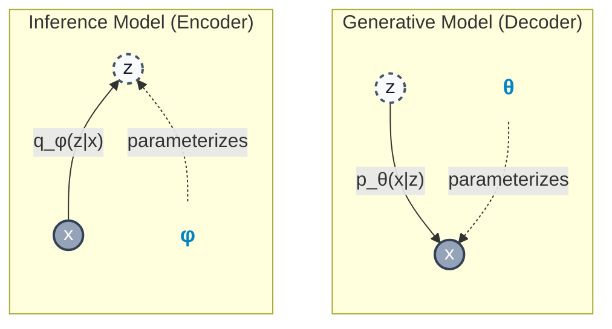
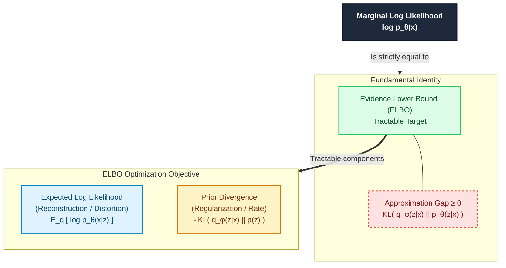

# Chapter 2: Variational Autoencoders — Learning to Generate by Learning to Compress

> "The key insight is that we can learn a generative model by optimizing a lower bound on the log-likelihood."
> — Kingma & Welling (2013)

---

## 2.1 Why Generative Models?

You have spent a career building systems that *recognize* patterns. A classifier takes input $x$ and produces a label $y$. A regression model maps inputs to outputs. These are **discriminative models**: they learn the conditional distribution $p(y|x)$ — given the data, what is the label?

**Generative models** invert this. They learn the joint distribution $p(x)$ — or $p(x, y)$ — and ask: *where does data like this come from?* More precisely, a generative model learns the data-generating distribution well enough to *sample new instances from it*.

This matters for several reasons that go beyond "make pretty pictures":

**1. Representation learning.** To generate plausible data, a model must develop an internal understanding of structure. A model that can generate faces has, in some sense, learned what makes a face a face. That understanding becomes useful for downstream tasks.

**2. Density estimation.** If you have $p(x)$, you can detect anomalies: inputs with low $p(x)$ are out-of-distribution. This is useful in fraud detection, medical imaging, and system monitoring — domains you likely encounter.

**3. Data augmentation.** Generative models can synthesize training data. If labeled examples are scarce, generating plausible variations can improve discriminative model performance.

**4. Compressed representations.** The latent space of a generative model is a compact encoding of structure. Latent codes can be used as features, for retrieval, or as the basis for downstream models.

The fundamental framing: given a dataset $\mathcal{D} = \{x_1, x_2, \ldots, x_n\}$ drawn i.i.d. from some unknown distribution $p_\text{data}(x)$, we want to learn a parametric model $p_\theta(x) \approx p_\text{data}(x)$. The challenge is that $x$ lives in a high-dimensional space (a $256 \times 256$ RGB image has ~200,000 dimensions), and interesting data occupies a tiny, highly structured manifold within that space.

---

## 2.2 Autoencoders: Compression as Representation

Before deriving the VAE, it helps to understand the simpler structure it extends.

### 2.2.1 The Autoencoder as a Bottleneck

A standard **autoencoder** is a neural network trained to reconstruct its own input through a constrained intermediate representation. The architecture has two components:

- **Encoder** $f_\phi: \mathcal{X} \to \mathcal{Z}$ maps input $x \in \mathbb{R}^d$ to a latent code $z \in \mathbb{R}^k$, where $k \ll d$.
- **Decoder** $g_\theta: \mathcal{Z} \to \mathcal{X}$ maps the latent code back to a reconstruction $\hat{x} \in \mathbb{R}^d$.

Training minimizes reconstruction loss:

$$\mathcal{L}(\theta, \phi) = \mathbb{E}_{x \sim p_\text{data}} \left[ \|x - g_\theta(f_\phi(x))\|^2 \right]$$

The bottleneck — the fact that $z$ has lower dimensionality than $x$ — forces the encoder to discard noise and preserve structure. This is analogous to principal component analysis (PCA), which finds the linear subspace that minimizes reconstruction error (equivalently, maximizes the variance of the projected data). The autoencoder finds a *nonlinear* manifold.

### 2.2.2 What the Latent Space Represents

After training, $z = f_\phi(x)$ is a compressed representation. Similar inputs tend to have similar latent codes. The decoder has learned to map points in latent space back to plausible data.

This looks like the foundation for a generative model: pick a $z$, run $g_\theta(z)$, get a sample. But there is a fundamental problem.

---

## 2.3 The Problem with Vanilla Autoencoders

Consider what the latent space of a trained autoencoder actually looks like. The encoder has learned a mapping from data to codes that minimizes reconstruction loss. There is no constraint on *where* in latent space the codes land, or how they are distributed.

In practice, the encoder learns to map each training example to a tight cluster of points, with large empty gaps between clusters. The decoder has learned to handle points in those clusters — but never points in the gaps.

If you sample $z$ uniformly from the latent space and decode it, you are very likely to land in one of those gaps, and the decoder produces garbage.

More precisely, vanilla autoencoders have three compounding problems:

**1. Discontinuous latent space.** There is no regularity constraint. The manifold of valid latent codes has no predictable structure. Interpolating between two valid codes traverses uncharted territory.

**2. No probabilistic interpretation.** There is no $p(z)$. You cannot ask "what is the probability of this latent code?" You cannot define a proper generative process: sample $z$, then decode.

**3. No way to measure the quality of generated samples.** Without a probability model, you cannot compute likelihoods or compare how well different models capture the data distribution.

```mermaid
graph TD
    classDef space fill:#f8fafc,stroke:#cbd5e1,stroke-width:2px,stroke-dasharray: 4 4,color:#64748b,font-style:italic
    classDef cluster fill:#e0f2fe,stroke:#0284c7,stroke-width:2px,color:#0c4a6e,font-weight:bold
    classDef point fill:#fef3c7,stroke:#d97706,stroke-width:2px,color:#78350f
    classDef interp fill:#dcfce7,stroke:#22c55e,stroke-width:2px,color:#14532d

    subgraph AE ["(a) Standard Autoencoder Latent Space"]
        direction LR
        AE_C1["Tight Cluster A<br/>(e.g., Cats)"]:::cluster
        AE_Gap["Uncharted Gap<br/>(Decodes to Garbage)"]:::space
        AE_C2["Tight Cluster B<br/>(e.g., Dogs)"]:::cluster
        
        AE_C1 -.->|"Interpolation Path"| AE_Gap -.-> AE_C2
    end

    subgraph V_AE ["(b) VAE Latent Space (KL Regularized)"]
        direction LR
        VAE_C1["Distribution A<br/>p(z|x) ≈ N(μ, σ²)"]:::cluster
        VAE_O["Overlapping Support<br/>Smooth transition boundary"]:::interp
        VAE_C2["Distribution B<br/>p(z|x) ≈ N(μ, σ²)"]:::cluster
        
        VAE_C1 -->|"Interpolation Path<br/>(Decodes to Cat-Dog morph)"| VAE_O --> VAE_C2
    end
```



The Variational Autoencoder (Kingma & Welling, 2013) addresses all three by grounding the autoencoder in probabilistic latent variable models and approximating inference with a neural network.

---

## 2.4 The VAE Framework

### 2.4.1 The Generative Model

The VAE posits a **latent variable generative model**. We assume data $x$ is generated by a two-step process:

1. Sample a latent variable $z$ from a **prior** distribution: $z \sim p(z)$
2. Sample $x$ from the **likelihood** conditioned on $z$: $x \sim p_\theta(x|z)$

Typically we choose $p(z) = \mathcal{N}(0, I)$ — a standard isotropic Gaussian. This is a design choice: it is simple, well-understood, and covers the space. The prior regularizes the latent space; we will return to this.

The decoder network parameterizes $p_\theta(x|z)$. For continuous data, this might be a Gaussian with mean $\mu_\theta(z)$ and diagonal covariance. For binary data, a Bernoulli with probabilities $p_\theta(x|z)$.

The **marginal likelihood** (or model evidence) is:

$$p_\theta(x) = \int p_\theta(x|z)\, p(z)\, dz$$

This integral is the fundamental quantity we want to maximize. If $p_\theta(x)$ is high for data points in our dataset, the model has learned the data distribution.

The problem: **this integral is intractable**. The latent space is high-dimensional, and $p_\theta(x|z)$ is a complex neural network. There is no closed form, and naive Monte Carlo estimation has too high a variance to be useful.

### 2.4.2 Why Is Inference Hard?

Before diving into the solution, it is worth building intuition for *why* the integral $p_\theta(x) = \int p_\theta(x|z)\, p(z)\, dz$ is so difficult. This is the central obstacle that motivates the entire VAE framework.

Consider a concrete example. Suppose $x$ is a $64 \times 64$ grayscale image of a handwritten digit, and $z$ is a 32-dimensional latent code. The integral asks: for *every possible* 32-dimensional vector $z$, compute the probability that the decoder would produce image $x$ from that code, weight it by the prior probability of $z$, and sum all of these contributions.

Imagine trying to enumerate all possible latent codes that could have generated this image. Most of the 32-dimensional space is "dead" — random points in $\mathbb{R}^{32}$ will produce garbled outputs with near-zero probability of matching $x$. Only a tiny region of latent space produces outputs resembling $x$. But you do not know *where* that region is without searching the entire space.

In low dimensions (say, $z$ is 1D or 2D), you could lay down a dense grid and numerically evaluate the integral. But the volume of space grows exponentially with dimension. A grid with 100 points per dimension in 32 dimensions would require $100^{32} = 10^{64}$ evaluations — more than the number of atoms in the observable universe. This is the **curse of dimensionality** applied to integration.

Monte Carlo estimation (sample random $z$ values, average $p_\theta(x|z)$) does not help much either. Because the relevant region of $z$-space is so small, almost all random samples contribute essentially zero to the estimate. You would need an astronomically large number of samples to get a useful estimate.

What we really want is the **posterior** $p_\theta(z|x)$ — the distribution over latent codes that *could have* generated this specific $x$. If we had it, we could sample $z$ only from the relevant region, making everything tractable. But computing the posterior requires Bayes' theorem, which requires $p_\theta(x)$ in the denominator — the very integral we cannot compute. This is the circular dependency that variational inference breaks.

### 2.4.3 The Inference Problem

To maximize $\log p_\theta(x)$, we would ideally use the EM algorithm: alternate between computing the posterior $p_\theta(z|x)$ (E-step) and maximizing the expected log-likelihood (M-step).

By Bayes' theorem:

$$p_\theta(z|x) = \frac{p_\theta(x|z)\, p(z)}{p_\theta(x)}$$

But computing this requires $p_\theta(x)$, which is the intractable integral we started with. We are stuck.

### 2.4.4 Variational Inference: Approximate the Posterior

**Variational inference** breaks this circularity by replacing the true posterior with a tractable approximation. We introduce a family of distributions $q_\phi(z|x)$ — the **inference model** or **encoder** — and find the member of this family closest to the true posterior.

> **Variational inference in plain English.** Instead of computing the true posterior $p_\theta(z|x)$ — which would require solving an intractable integral — we train a neural network $q_\phi(z|x)$ to *approximate* it. Given an input $x$, the encoder network directly outputs the parameters (mean and variance) of an approximate posterior distribution over $z$. The ELBO objective (derived below) measures how good this approximation is: it simultaneously rewards the approximation for (a) enabling accurate reconstruction and (b) staying close to the prior. Maximizing the ELBO is guaranteed to both improve the generative model and tighten the approximation. This "replace an intractable computation with a learned approximation" strategy is the core idea of amortized variational inference, and it recurs throughout modern deep learning.

"Closest" means minimizing the KL divergence:

$$\text{KL}(q_\phi(z|x) \| p_\theta(z|x))$$

We choose $q_\phi(z|x)$ to be a diagonal Gaussian: $q_\phi(z|x) = \mathcal{N}(z;\, \mu_\phi(x),\, \sigma^2_\phi(x) \cdot I)$. Two neural networks produce the mean vector $\mu_\phi(x) \in \mathbb{R}^k$ and log-variance vector $\log \sigma^2_\phi(x) \in \mathbb{R}^k$ as functions of input $x$.

This is the **mean-field approximation**: we model the posterior over $z$ as a product of independent Gaussians, one per dimension. It is not exact — the true posterior may have correlations — but it is expressive enough in practice and computationally tractable.

The full model now has:
- A **generative model** $p_\theta(x|z)\, p(z)$: the decoder + prior
- An **inference model** $q_\phi(z|x)$: the encoder / approximate posterior
- Parameters $\theta$ (decoder) and $\phi$ (encoder) to learn jointly



### 2.4.5 Deriving the ELBO

We want to maximize $\log p_\theta(x)$. Let us derive a tractable lower bound.

**Step 1: Write the log-evidence as an integral.** Start with any distribution $q_\phi(z|x)$ and write:

$$\log p_\theta(x) = \log \int p_\theta(x|z)\, p(z)\, dz$$

This is just the definition of the marginal likelihood — the quantity we want to maximize but cannot compute directly.

**Step 2: Introduce the approximate posterior.** Multiply and divide by $q_\phi(z|x)$ inside the integral. This is a mathematical identity — it changes nothing, but it lets us rewrite the integral as an expectation under $q$:

$$= \log \int \frac{p_\theta(x|z)\, p(z)}{q_\phi(z|x)} \cdot q_\phi(z|x)\, dz$$

$$= \log\, \mathbb{E}_{z \sim q_\phi(z|x)} \!\left[ \frac{p_\theta(x|z)\, p(z)}{q_\phi(z|x)} \right]$$

Why do this? Because now the integral is an expectation over $q_\phi(z|x)$, which we *can* sample from (it is our encoder network). The fraction inside measures how much the generative model $p_\theta(x|z)\,p(z)$ and the approximate posterior $q_\phi(z|x)$ agree on the importance of each $z$.

**Step 3: Apply Jensen's inequality.** The $\log$ function is concave, so by Jensen's inequality, $\log \mathbb{E}[\cdot] \geq \mathbb{E}[\log \cdot]$. Moving the $\log$ inside the expectation gives us a lower bound:

$$\geq \mathbb{E}_{z \sim q_\phi(z|x)} \!\left[ \log p_\theta(x|z) + \log p(z) - \log q_\phi(z|x) \right]$$

This step is where the "lower bound" comes from. We have traded an exact but intractable quantity ($\log p_\theta(x)$) for a bound that we *can* estimate and optimize. The bound is tight when $q_\phi(z|x) = p_\theta(z|x)$, i.e., when our approximation is exact.

**Step 4: Rearrange into interpretable terms.** Group the terms to reveal the structure:

$$\mathcal{L}(\theta, \phi; x) = \underbrace{\mathbb{E}_{z \sim q_\phi(z|x)} \!\left[ \log p_\theta(x|z) \right]}_{\text{reconstruction term}} - \underbrace{\text{KL}\!\left( q_\phi(z|x) \| p(z) \right)}_{\text{regularization term}}$$

This is the **Evidence Lower Bound (ELBO)**, often denoted $\mathcal{L}(\theta, \phi; x)$. We **maximize** the ELBO with respect to $\theta$ and $\phi$. In practice, this means minimizing $-\mathcal{L}$ as a loss function. This is the central object of VAE training. Let us understand each term.

**Reconstruction term:** $\mathbb{E}[\log p_\theta(x|z)]$ is the expected log-likelihood of $x$ under the decoder, with $z$ sampled from the encoder. This measures how well the decoder can reconstruct $x$ from compressed codes. Maximizing this term pushes the encoder to produce codes from which $x$ is recoverable.

**KL term:** $\text{KL}(q_\phi(z|x) \| p(z))$ measures how much the approximate posterior deviates from the prior. Minimizing this term (the negative sign means we subtract it) pushes the encoder to produce codes consistent with the prior $\mathcal{N}(0, I)$. This regularizes the latent space.



The gap between $\log p_\theta(x)$ and the ELBO is exactly $\text{KL}(q_\phi(z|x) \| p_\theta(z|x)) \geq 0$. Maximizing the ELBO simultaneously:
1. Maximizes $\log p_\theta(x)$ (tightens the bound from below)
2. Minimizes $\text{KL}(q_\phi(z|x) \| p_\theta(z|x))$ (improves the approximation quality)

**Rate-distortion perspective.** The ELBO reveals a fundamental tradeoff from information theory. The reconstruction term $\mathbb{E}[\log p_\theta(x|z)]$ measures *distortion* — how much information is lost in the encoding. The KL term $\text{KL}(q_\phi(z|x) \| p(z))$ measures *rate* — how many bits the latent code uses beyond the prior. These two objectives pull in opposite directions: the encoder wants to produce informative codes (low distortion, good reconstruction) but also codes that are close to $\mathcal{N}(0, I)$ (low rate, low KL). The optimal encoder balances both. This is exactly the rate-distortion tradeoff from lossy compression — the VAE is learning a compression scheme where the "codebook" is the prior distribution. The $\beta$-VAE variant (Higgins et al., 2017) makes this tradeoff explicit by weighting the KL term with a coefficient $\beta$: higher $\beta$ compresses more aggressively, often producing more disentangled but blurrier representations.

### 2.4.6 The Reparameterization Trick

We need to compute gradients of the ELBO with respect to $\phi$ (encoder parameters). The reconstruction term involves an expectation over $z \sim q_\phi(z|x)$:

$$\nabla_\phi\, \mathbb{E}_{z \sim q_\phi(z|x)} \!\left[ \log p_\theta(x|z) \right]$$

The problem: the expectation depends on $\phi$ through the *distribution* we sample from. We cannot simply move the gradient inside the expectation because the sampling operation is not differentiable.

Concretely: $z$ is sampled stochastically. Backpropagating through a sampling operation yields zero gradients — there is no path from the loss to the encoder parameters.

**The reparameterization trick** (Kingma & Welling, 2013; Rezende et al., 2014) separates the stochasticity from the parameters. Instead of sampling $z$ directly:

$$z \sim \mathcal{N}\!\left(\mu_\phi(x),\, \sigma^2_\phi(x)\right)$$

We write $z$ as a deterministic function of the parameters and a separate noise variable:

$$\varepsilon \sim \mathcal{N}(0, I)$$

$$z = \mu_\phi(x) + \sigma_\phi(x) \odot \varepsilon$$

where $\odot$ denotes elementwise multiplication.

Now $z$ is a *deterministic* function of $\phi$ (through $\mu_\phi$ and $\sigma_\phi$) and $\varepsilon$ (which has no parameters). The stochasticity is "pushed outside" the computation graph. Gradients flow cleanly from the loss through $z$ back to $\mu_\phi$ and $\sigma_\phi$.

```mermaid
graph TD
    classDef param fill:#e0f2fe,stroke:#0284c7,stroke-width:2px,color:#0c4a6e,font-weight:bold
    classDef sample fill:#fef3c7,stroke:#d97706,stroke-width:2px,color:#78350f,stroke-dasharray: 4 4
    classDef var fill:#f1f5f9,stroke:#475569,stroke-width:2px,color:#0f172a
    classDef op fill:#cbd5e1,stroke:#475569,stroke-width:2px,color:#0f172a,font-weight:bold

    subgraph Blocked ["(a) Original Form: Gradients Blocked"]
        direction TB
        Mu1["μ"]:::param
        Sig1["σ"]:::param
        Samp1{{"Sampling<br/>z ~ N(μ, σ²)"}}:::sample
        Z1["z"]:::var
        L1["Loss"]:::var
        
        Mu1 --> Samp1
        Sig1 --> Samp1
        Samp1 --> Z1
        Z1 --> L1
        
        %% Red gradients blocked
        L1 -.->|"∂L/∂z"| Z1
        Z1 -.->|"Stochastic Node<br/>(No backprop)"| X(("blocked")):::sample
        style X fill:#ef4444,stroke:#7f1d1d,color:#fff
        X -.-> Samp1
    end

    subgraph Reparam ["(b) Reparameterized Form: Gradients Flow"]
        direction TB
        Mu2["μ"]:::param
        Sig2["σ"]:::param
        Eps2{{"Noise ε<br/>ε ~ N(0, 1)"}}:::sample
        
        Mul(("×")):::op
        Add(("o")):::op
        
        Z2["z"]:::var
        L2["Loss"]:::var
        
        Eps2 --> Mul
        Sig2 --> Mul
        Mul --> Add
        Mu2 --> Add
        Add --> Z2
        Z2 --> L2
        
        %% Green/Red gradients flow smoothly
        L2 -.->|"∂L/∂z"| Z2
        Z2 -.->|"∂z/∂μ = 1"| Add -.->|"∂L/∂μ"| Mu2
        Z2 -.->|"∂z/∂σ = ε"| Add -.-> Mul -.->|"∂L/∂σ"| Sig2
    end
    
    linkStyle 4,5,6 stroke:#ef4444,stroke-width:2px,stroke-dasharray: 4 4
    linkStyle 13,14,15,16,17,18,19 stroke:#22c55e,stroke-width:2px,stroke-dasharray: 4 4
```

This is the key technical innovation that makes VAEs trainable end-to-end. The expectation becomes:

$$\mathbb{E}_{z \sim q_\phi(z|x)} \!\left[ \log p_\theta(x|z) \right] = \mathbb{E}_{\varepsilon \sim \mathcal{N}(0,I)} \!\left[ \log p_\theta\!\left(x \mid \mu_\phi(x) + \sigma_\phi(x) \odot \varepsilon\right) \right]$$

In practice, we use a single sample of $\varepsilon$ per training step and treat it as a Monte Carlo estimate of the expectation. This is low-variance enough to train effectively.

---

## 2.5 Architecture and Training

### 2.5.1 Encoder Architecture

The encoder takes $x$ as input and outputs two vectors: $\mu_\phi(x)$ and $\log \sigma^2_\phi(x)$, each of dimension $k$ (the latent dimension). A common choice:

```python
h = MLP(x)              # shared trunk
mu = W_mu @ h + b_mu       # mean head
log_var = W_sigma @ h + b_sigma  # log-variance head
```

Outputting $\log \sigma^2$ rather than $\sigma^2$ ensures positivity without a constraint (exp of any real number is positive).

### 2.5.2 Decoder Architecture

The decoder takes $z \in \mathbb{R}^k$ and produces parameters of $p_\theta(x|z)$. For continuous data modeled as Gaussian, it outputs a mean vector (and sometimes a variance). For image data, it is common to use a fixed variance and treat the reconstruction loss as MSE.

### 2.5.3 The KL Term in Closed Form

With $q_\phi(z|x) = \mathcal{N}(\mu, \operatorname{diag}(\sigma^2))$ and $p(z) = \mathcal{N}(0, I)$, the KL divergence has a closed form. For a $k$-dimensional diagonal Gaussian:

$$\text{KL}\!\left( \mathcal{N}(\mu, \operatorname{diag}(\sigma^2)) \| \mathcal{N}(0, I) \right) = -\frac{1}{2} \sum_{i=1}^{k} \left(1 + \log \sigma_i^2 - \mu_i^2 - \sigma_i^2\right)$$

This sum runs over all $k$ latent dimensions. Each term penalizes:
- $\mu_i^2$ : mean deviating from zero
- $\sigma_i^2 - 1 - \log \sigma_i^2$ : variance deviating from one (this term is minimized at $\sigma_i^2 = 1$)

No sampling is needed for this term — it is computed analytically. This is a significant advantage: the KL gradient is exact, not a noisy estimate.

### 2.5.4 The Full Training Objective

For a mini-batch of examples, the loss per example is:

$$\mathcal{L}(\theta, \phi; x) = \mathbb{E}_{\varepsilon \sim \mathcal{N}(0,I)} \!\left[ \log p_\theta\!\left(x \mid \mu_\phi(x) + \sigma_\phi(x) \odot \varepsilon\right) \right] + \frac{1}{2} \sum_{i=1}^{k} \left(1 + \log \sigma_i^2 - \mu_i^2 - \sigma_i^2\right)$$

The first term is the reconstruction loss (approximated with one or a few samples of $\varepsilon$). For images with pixel values in $[0,1]$ modeled as Bernoulli, this becomes binary cross-entropy. For Gaussian outputs, it becomes (negative) MSE up to a constant.

The second term is the closed-form KL, which acts as a regularizer.

Both terms are differentiable with respect to $\theta$ and $\phi$. Standard gradient descent applies.

### 2.5.5 β-VAE and KL Annealing

**β-VAE** (Higgins et al., 2017) introduces a weight $\beta$ on the KL term:

$$\mathcal{L}_\beta = \mathbb{E}\!\left[\log p_\theta(x|z)\right] - \beta \cdot \text{KL}\!\left(q_\phi(z|x) \| p(z)\right)$$

When $\beta > 1$, the regularization pressure is increased, forcing the latent space to be more compact and "disentangled." When $\beta < 1$, reconstruction quality is prioritized at the cost of latent space regularity.

Higgins et al. found that $\beta > 1$ encourages **disentanglement**: different latent dimensions capture independent factors of variation (e.g., one dimension controls orientation, another controls color). The intuition is that high KL pressure forces the model to use only dimensions it truly needs and to use them efficiently.

**KL annealing** is a training trick: start $\beta$ at $0$ (pure reconstruction) and increase it to $1$ (or beyond) over training. This prevents the model from collapsing to the prior at initialization before the decoder has learned anything useful.

### 2.5.6 Posterior Collapse

**Posterior collapse** is a failure mode where, for some latent dimensions, the encoder's posterior $q_\phi(z|x)$ collapses to the prior $p(z) = \mathcal{N}(0, I)$. The KL for that dimension goes to zero. The decoder simply ignores that dimension.

This happens because the KL term can be minimized to zero trivially: make $\mu = 0$, $\sigma = 1$. If the decoder is powerful enough to reconstruct $x$ without using $z$ (or using only some dimensions of $z$), the optimizer may find this degenerate solution.

Bowman et al. (2016) documented this in text VAEs with LSTM decoders: the autoregressive decoder learned to model language without using the latent code at all, collapsing the entire posterior to the prior.

Mitigations include:
- KL annealing (ramp up the KL weight slowly)
- Weakening the decoder (use a lower-capacity model)
- KL free bits: do not penalize KL dimensions below a threshold (allow each dimension up to $\lambda$ nats for free)
- Using non-autoregressive decoders for text

Posterior collapse reveals a fundamental tension in the VAE objective: the KL term and reconstruction term can be jointly minimized in a degenerate way if the decoder is too powerful. The latent code only gets used when it is *needed* to reconstruct $x$.

---

## 2.6 The Latent Space

With a well-trained VAE, the latent space has structure that vanilla autoencoders lack.

### 2.6.1 Sampling

To generate new samples: draw $z \sim \mathcal{N}(0, I)$, compute $\hat{x} = g_\theta(z)$ (or sample from $p_\theta(x|z)$). Because the KL term has pushed the aggregate posterior $q(z) = \mathbb{E}_x[q_\phi(z|x)]$ toward $\mathcal{N}(0, I)$, random points in latent space correspond to plausible data.

This is the key structural consequence of the KL regularization: it ensures the decoder is trained on a distribution of $z$ that matches the prior. At generation time, sampling from the prior hits regions the decoder has seen during training.

### 2.6.2 Interpolation

Given two data points $x_1$ and $x_2$, encode them to $\mu_1 = \mu_\phi(x_1)$ and $\mu_2 = \mu_\phi(x_2)$. Interpolate:

$$z(t) = (1 - t)\,\mu_1 + t\,\mu_2, \qquad t \in [0, 1]$$

Decode $z(t)$ for varying $t$. In a well-trained VAE, this produces a smooth morphing between $x_1$ and $x_2$ through plausible intermediate states. Vanilla autoencoders produce artifacts in the gaps between clusters; VAEs do not, because the KL pressure ensures the space between encoded points is populated with valid codes.

### 2.6.3 Disentanglement

A **disentangled** representation is one where individual latent dimensions correspond to independent, interpretable factors of variation in the data. Perturbing dimension $i$ changes one aspect of the output (e.g., rotation) while leaving others (color, shape) unchanged.

$\beta$-VAE (Higgins et al., 2017) achieves disentanglement by increasing the regularization pressure. The information bottleneck forces the model to find the most efficient encoding. When the latent dimension is significantly smaller than the data dimension, the model is forced to reuse dimensions for distinct factors, potentially discovering independent structure.

Disentanglement is not guaranteed and depends on the data, architecture, and $\beta$. But the VAE framework provides a principled path toward it, unlike vanilla autoencoders.

### 2.6.4 What Makes a Good Latent Space?

From a machine learning engineering perspective, a useful latent space has:

1. **Compactness.** Similar inputs have similar codes. The latent space is a meaningful metric space.
2. **Coverage.** No large empty regions that produce garbage when decoded.
3. **Smoothness.** Small perturbations to $z$ produce small, coherent changes in the output.
4. **Factorization.** Independent factors of variation in the data correspond to independent directions in latent space (disentanglement).

The VAE's KL term directly enforces coverage and smoothness by anchoring the aggregate posterior to the prior. Compactness comes from the reconstruction term. Factorization requires additional inductive bias ($\beta$-VAE, or architectural choices).

---

## 2.7 Connections Forward

The VAE is not just a standalone model — it is a foundational building block that reappears throughout modern deep learning.

### 2.7.1 VAE in Stable Diffusion

Stable Diffusion (Rombach et al., 2022) does not operate in pixel space. It operates in a compressed **latent space** produced by a VAE. The diffusion process adds and removes noise in the latent space, and the VAE decoder maps the denoised latent back to pixels.

This is computationally critical: diffusion in $512 \times 512$ pixel space is 786,432 dimensions ($512 \times 512 \times 3$ for RGB). Diffusion in $64 \times 64 \times 4$ latent space is 16,384 dimensions — approximately $48\times$ fewer. The VAE makes latent diffusion tractable.

We will cover this in depth in Chapter 8. The key takeaway: the VAE is not just for generation in isolation; it is a learned compression codec that other models build on.

### 2.7.2 Conditional VAEs

A **Conditional VAE (CVAE)** conditions both the encoder and decoder on an auxiliary variable $y$ (a class label, a text prompt, etc.):

$$\text{Encoder: } q_\phi(z|x, y)$$

$$\text{Decoder: } p_\theta(x|z, y)$$

$$\text{Prior: } p(z|y)$$

The ELBO extends naturally. CVAEs can generate samples of a specific class, fill in missing data conditioned on observed data, or perform structured prediction. The framework is identical to the unconditional VAE with $y$ concatenated to the inputs.

### 2.7.3 VQ-VAE

The **Vector Quantized VAE (VQ-VAE)** (van den Oord et al., 2017) replaces the continuous Gaussian latent space with a discrete codebook. The encoder maps $x$ to a continuous vector, which is then replaced by the nearest entry in a learned discrete codebook $\mathcal{C} = \{e_1, e_2, \ldots, e_n\}$.

The discrete latent removes the need for the reparameterization trick (there is nothing to differentiate through in the same way) and instead uses a straight-through estimator for gradients. The training objective includes a commitment loss to keep encoder outputs close to codebook entries.

VQ-VAE motivations:
1. **Discrete representations** are natural for many modalities (text, music, actions).
2. **Codebooks** are compact and interpretable.
3. The discrete bottleneck is more aggressive in forcing compression.

VQ-VAE2 (Razavi et al., 2019) extends this to hierarchical codebooks, achieving competitive image generation. VQ-VAE's discrete latent space is also the foundation for models like DALL-E (which uses a VQ-VAE to tokenize images for an autoregressive transformer).

---

## 2.8 Summary and Key Takeaways

The VAE is the product of two ideas meeting: **latent variable models** (the generative story) and **variational inference** (the training algorithm). The neural network is what makes both tractable at scale.

The key steps of the derivation:
1. Define a generative model $p(z)\, p_\theta(x|z)$.
2. Note that $p_\theta(x) = \int p_\theta(x|z)\, p(z)\, dz$ is intractable.
3. Introduce an inference model $q_\phi(z|x)$ to approximate the posterior.
4. Derive the ELBO by applying Jensen's inequality to $\log p_\theta(x)$.
5. Decompose the ELBO as reconstruction + KL terms.
6. Use the reparameterization trick to backpropagate through sampling.

The ELBO training objective forces two behaviors simultaneously:
- The encoder and decoder cooperate to minimize reconstruction error.
- The encoder is regularized to keep its outputs close to the prior.

The result is a continuous, smooth latent space that supports sampling, interpolation, and (with care) disentanglement.

The VAE framework's influence extends well beyond image generation: it established variational inference as a practical tool for deep learning, introduced the reparameterization trick as a general technique for differentiating through stochastic nodes, and provided the architectural template for latent-space methods that underpin the current generation of large-scale generative models.

---

## Code: Minimal VAE in PyTorch

> **Dependencies:** `pip install torch torchvision`

The following is a complete, self-contained VAE trained on MNIST. Run it directly; it will download the dataset automatically and print loss values each epoch. After 5 epochs you will see reconstruction loss decreasing and KL loss stabilizing, confirming the ELBO is being optimized.

```python
import torch
import torch.nn as nn
import torch.nn.functional as F
from torch.utils.data import DataLoader
from torchvision import datasets, transforms

# ── Hyperparameters ──────────────────────────────────────────────────────────
LATENT_DIM = 16    # dimensionality of z
HIDDEN_DIM = 256   # width of each hidden layer
BATCH_SIZE = 128
EPOCHS     = 5
LR         = 1e-3
DEVICE     = "cuda" if torch.cuda.is_available() else "cpu"


# ── Encoder: x → (mu, log_var) ───────────────────────────────────────────────
class Encoder(nn.Module):
    def __init__(self, input_dim=784, hidden_dim=HIDDEN_DIM, latent_dim=LATENT_DIM):
        super().__init__()
        self.fc1    = nn.Linear(input_dim, hidden_dim)   # shared trunk
        self.fc_mu  = nn.Linear(hidden_dim, latent_dim)  # mean head
        self.fc_lv  = nn.Linear(hidden_dim, latent_dim)  # log-variance head

    def forward(self, x):
        h       = F.relu(self.fc1(x))
        mu      = self.fc_mu(h)   # q_φ(z|x) mean,     shape: [B, LATENT_DIM]
        log_var = self.fc_lv(h)   # q_φ(z|x) log-var,  shape: [B, LATENT_DIM]
        return mu, log_var


# ── Reparameterization trick: z = mu + σ * ε,  ε ~ N(0,I) ──────────────────
def reparameterize(mu, log_var):
    std = torch.exp(0.5 * log_var)   # σ = exp(log_var / 2)
    eps = torch.randn_like(std)      # ε ~ N(0, I), same shape as std
    return mu + std * eps            # deterministic function of (mu, std, ε)


# ── Decoder: z → x_hat ───────────────────────────────────────────────────────
class Decoder(nn.Module):
    def __init__(self, latent_dim=LATENT_DIM, hidden_dim=HIDDEN_DIM, output_dim=784):
        super().__init__()
        self.fc1 = nn.Linear(latent_dim, hidden_dim)
        self.fc2 = nn.Linear(hidden_dim, output_dim)

    def forward(self, z):
        h     = F.relu(self.fc1(z))
        x_hat = torch.sigmoid(self.fc2(h))  # pixel values in [0, 1]
        return x_hat


# ── VAE: wires encoder, reparameterization, and decoder together ──────────────
class VAE(nn.Module):
    def __init__(self):
        super().__init__()
        self.encoder = Encoder()
        self.decoder = Decoder()

    def forward(self, x):
        x_flat      = x.view(x.size(0), -1)         # flatten MNIST: [B, 784]
        mu, log_var = self.encoder(x_flat)
        z           = reparameterize(mu, log_var)    # sample via reparam trick
        x_hat       = self.decoder(z)
        return x_hat, mu, log_var


# ── ELBO loss = reconstruction loss + KL divergence ──────────────────────────
def elbo_loss(x_hat, x, mu, log_var):
    x_flat = x.view(x.size(0), -1)
    # Reconstruction: binary cross-entropy (treats pixels as Bernoulli)
    recon = F.binary_cross_entropy(x_hat, x_flat, reduction="sum")
    # KL: closed form for q ~ N(mu, diag(sigma^2)) vs p ~ N(0, I)
    # KL = -0.5 * sum(1 + log_var - mu^2 - exp(log_var))
    kl    = -0.5 * torch.sum(1 + log_var - mu.pow(2) - log_var.exp())
    return (recon + kl) / x.size(0)  # average over batch


# ── Data ──────────────────────────────────────────────────────────────────────
transform  = transforms.ToTensor()
train_data = datasets.MNIST(root="./data", train=True, download=True, transform=transform)
loader     = DataLoader(train_data, batch_size=BATCH_SIZE, shuffle=True)

# ── Training loop ─────────────────────────────────────────────────────────────
model     = VAE().to(DEVICE)
optimizer = torch.optim.Adam(model.parameters(), lr=LR)

for epoch in range(1, EPOCHS + 1):
    total_loss = 0.0
    for x, _ in loader:                         # labels not needed for VAE
        x                  = x.to(DEVICE)
        x_hat, mu, log_var = model(x)
        loss               = elbo_loss(x_hat, x, mu, log_var)
        optimizer.zero_grad()
        loss.backward()
        optimizer.step()
        total_loss += loss.item()
    avg = total_loss / len(loader)
    print(f"Epoch {epoch}/{EPOCHS}  avg ELBO loss: {avg:.2f}")

# ── Quick sanity check: sample from prior and decode ─────────────────────────
model.eval()
with torch.no_grad():
    z_sample = torch.randn(1, LATENT_DIM).to(DEVICE)  # z ~ N(0, I)
    sample   = model.decoder(z_sample)                 # decode to pixel space
    print(f"\nSampled image tensor shape: {sample.shape}")   # → [1, 784]
    print(f"Pixel range: [{sample.min():.3f}, {sample.max():.3f}]")
```

**What to observe when running this:**

- The ELBO loss drops sharply in epoch 1 (roughly 200 → 100 range, depending on hardware) and continues decreasing each epoch.
- The reconstruction term dominates early; the KL term grows from near-zero as the encoder learns to use the latent space.
- After training, sampling `z ~ N(0, I)` and decoding produces pixel arrays in `[0, 1]` — reshape to `28 × 28` and visualize with matplotlib if desired.

**Key implementation notes:**

- We output `log_var` (not `sigma` or `var`) because it is unbounded, making it numerically well-behaved as a network output. We exponentiate only when needed.
- The reparameterization trick makes `z` a deterministic function of `(mu, log_var, eps)`. Gradients flow through `mu` and `log_var` because `eps` is sampled independently.
- `binary_cross_entropy` with `reduction="sum"` followed by dividing by batch size gives a per-example ELBO. Using `reduction="mean"` instead would implicitly scale the reconstruction term differently relative to KL, equivalent to adjusting $\beta$ in $\beta$-VAE.

---

## Summary

- Generative models learn the data distribution $p(x)$ rather than a conditional $p(y|x)$, enabling sampling, density estimation, data augmentation, and compressed representation learning.
- Vanilla autoencoders learn compressed representations but have discontinuous latent spaces with no probabilistic structure, making them unsuitable for generation.
- The VAE framework grounds the autoencoder in a latent variable generative model $p(z)\,p_\theta(x|z)$ and approximates the intractable posterior $p_\theta(z|x)$ with a learned encoder $q_\phi(z|x)$ via variational inference.
- The Evidence Lower Bound (ELBO) decomposes into a reconstruction term (how well the decoder recovers $x$ from $z$) and a KL regularization term (how close the approximate posterior stays to the prior), providing a tractable training objective.
- The reparameterization trick ($z = \mu + \sigma \odot \varepsilon$, $\varepsilon \sim \mathcal{N}(0,I)$) enables backpropagation through the stochastic sampling operation by separating randomness from learnable parameters.
- The KL term enforces a smooth, continuous latent space that supports sampling from the prior, interpolation between data points, and (with $\beta$-VAE) disentangled representations.
- Posterior collapse occurs when a powerful decoder ignores the latent code entirely, collapsing $q_\phi(z|x)$ to the prior. Mitigations include KL annealing, decoder weakening, and free-bits thresholds.
- The VAE is not merely a standalone generative model but a foundational component: its latent space serves as the compressed operating space for latent diffusion models (Stable Diffusion), and its extensions (CVAE, VQ-VAE) underpin modern image generation pipelines.

---

## Key Equations Reference

| Name | Equation | Section |
|---|---|---|
| Marginal likelihood | $p_\theta(x) = \int p_\theta(x|z)\, p(z)\, dz$ | 2.4.1 |
| ELBO | $\mathcal{L}(\theta, \phi; x) = \mathbb{E}_{q_\phi(z|x)}[\log p_\theta(x|z)] - \mathrm{KL}(q_\phi(z|x) \| p(z))$ | 2.4.5 |
| Reparameterization trick | $z = \mu_\phi(x) + \sigma_\phi(x) \odot \varepsilon, \quad \varepsilon \sim \mathcal{N}(0, I)$ | 2.4.6 |
| KL divergence (closed form) | $\mathrm{KL} = -\frac{1}{2}\sum_{i=1}^{k}(1 + \log \sigma_i^2 - \mu_i^2 - \sigma_i^2)$ | 2.5.3 |
| $\beta$-VAE objective | $\mathcal{L}_\beta = \mathbb{E}[\log p_\theta(x|z)] - \beta \cdot \mathrm{KL}(q_\phi(z|x) \| p(z))$ | 2.5.5 |
| Autoencoder reconstruction loss | $\mathcal{L} = \mathbb{E}_{x}[\|x - g_\theta(f_\phi(x))\|^2]$ | 2.2.1 |
| ELBO gap | $\log p_\theta(x) - \mathcal{L} = \mathrm{KL}(q_\phi(z|x) \| p_\theta(z|x))$ | 2.4.5 |

---

## Exercises

**1. Deriving the ELBO from first principles.**
Starting from $\log p_\theta(x) = \log \int p_\theta(x|z)\, p(z)\, dz$, introduce an arbitrary approximate posterior $q_\phi(z|x)$ and apply Jensen's inequality to arrive at the Evidence Lower BOund:

$$\log p_\theta(x) \geq \mathbb{E}_{q_\phi(z|x)}\left[\log p_\theta(x|z)\right] - D_\text{KL}\!\left(q_\phi(z|x) \,\|\, p(z)\right)$$

Identify the two terms and explain the role of each. At what condition does the bound become tight (equality holds)?

**2. KL divergence in closed form.**
For a Gaussian encoder $q_\phi(z|x) = \mathcal{N}(\mu, \text{diag}(\sigma^2))$ and a standard normal prior $p(z) = \mathcal{N}(0, I)$ over $d$-dimensional $z$, derive the closed-form expression for $D_\text{KL}(q_\phi \| p)$:

$$D_\text{KL} = \frac{1}{2}\sum_{j=1}^{d}\left(\sigma_j^2 + \mu_j^2 - 1 - \log \sigma_j^2\right)$$

Start from the definition $D_\text{KL}(q \| p) = \mathbb{E}_q[\log q - \log p]$ and use the known moments of the Gaussian. Verify the result approaches 0 as $\mu \to 0$ and $\sigma \to 1$.

**3. The reparameterization trick — why it matters.**
Consider estimating the gradient $\nabla_\phi\, \mathbb{E}_{q_\phi(z|x)}[f(z)]$ where $z \sim q_\phi(z|x) = \mathcal{N}(\mu_\phi(x), \sigma_\phi^2(x))$.

(a) Explain why the REINFORCE (score function) estimator $\nabla_\phi\, \mathbb{E}_q[f(z)] = \mathbb{E}_q[f(z)\, \nabla_\phi \log q_\phi(z|x)]$ is unbiased but exhibits high variance.

(b) Write out the reparameterization: express $z$ as a deterministic function of $\phi$ and a noise variable $\varepsilon \sim \mathcal{N}(0, I)$, then show how $\nabla_\phi$ passes through the expectation.

(c) In one sentence: why does this make backpropagation through a sampling operation possible?

**4. Posterior collapse and the $\beta$-VAE tradeoff.**
In practice, VAEs sometimes exhibit *posterior collapse*: the encoder ignores the input and outputs the prior, $q_\phi(z|x) \approx p(z)$, for some or all latent dimensions.

(a) Show that posterior collapse is a valid ELBO optimum: if the decoder becomes powerful enough to model $p(x)$ independently of $z$, what happens to the reconstruction term and the KL term individually?

(b) The $\beta$-VAE modifies the objective to $\mathbb{E}[\log p_\theta(x|z)] - \beta\, D_\text{KL}(q_\phi \| p)$. Describe qualitatively what increasing $\beta > 1$ does to the learned latent space. Why might a more disentangled representation be worth the reconstruction quality cost?

**5. Implement a convolutional VAE.**
Extend the MNIST VAE from the chapter to use convolutional layers. Your encoder should use three `Conv2d` layers (stride-2 for downsampling) before the linear layers that produce $\mu$ and $\log\sigma^2$; your decoder should use transposed convolutions. Keep the latent dimension at 16.

(a) Implement and train the model. Report final ELBO, reconstruction loss, and KL term after 10 epochs.

(b) Perform a *latent space interpolation*: encode two held-out images $x_a$ and $x_b$, then decode $z(\alpha) = (1-\alpha)\mu_a + \alpha\mu_b$ for $\alpha \in \{0, 0.1, 0.2, \ldots, 1.0\}$. Does the interpolation pass through plausible-looking images? What does this tell you about the geometry of the learned latent space?

(c) Compare the convolutional VAE's reconstruction quality (visually and by loss) to the MLP VAE from the chapter. What does the improvement suggest about the role of inductive bias?

---

## References

- Kingma, D. P., & Welling, M. (2013). Auto-encoding variational Bayes. *arXiv:1312.6114*.
- Rezende, D. J., Mohamed, S., & Wierstra, D. (2014). Stochastic backpropagation and approximate inference in deep generative models. *ICML 2014*.
- Higgins, I., Matthey, L., Pal, A., Burgess, C., Glorot, X., Botvinick, M., Mohamed, S., & Lerchner, A. (2017). β-VAE: Learning basic visual concepts with a constrained variational framework. *ICLR 2017*.
- van den Oord, A., Vinyals, O., & Kavukcuoglu, K. (2017). Neural discrete representation learning. *NeurIPS 2017*.
- Bowman, S. R., Vilnis, L., Vinyals, O., Dai, A. M., Jozefowicz, R., & Bengio, S. (2016). Generating sentences from a continuous space. *CoNLL 2016*.
- Rombach, R., Blattmann, A., Lorenz, D., Esser, P., & Ommer, B. (2022). High-resolution image synthesis with latent diffusion models. *CVPR 2022*.
- Razavi, A., van den Oord, A., & Vinyals, O. (2019). Generating diverse high-fidelity images with VQ-VAE-2. *NeurIPS 2019*.
