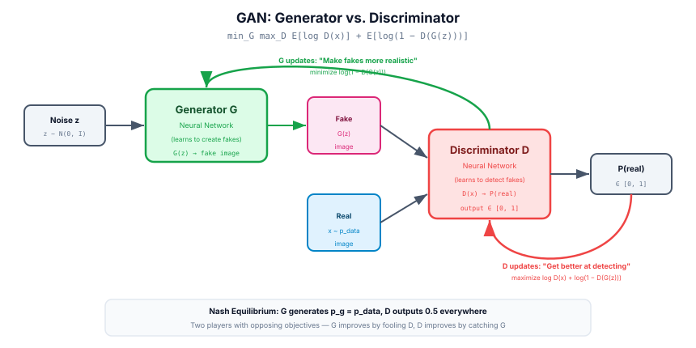
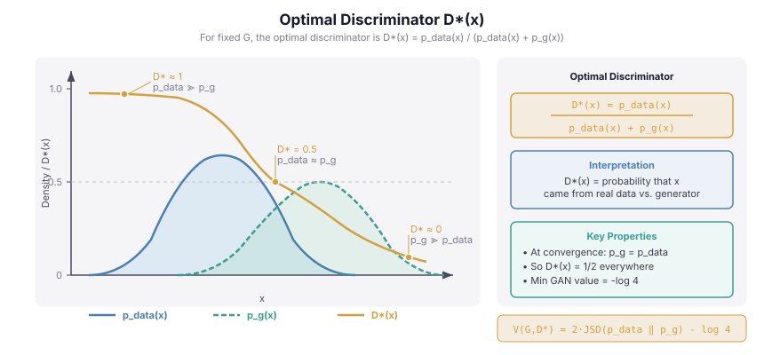
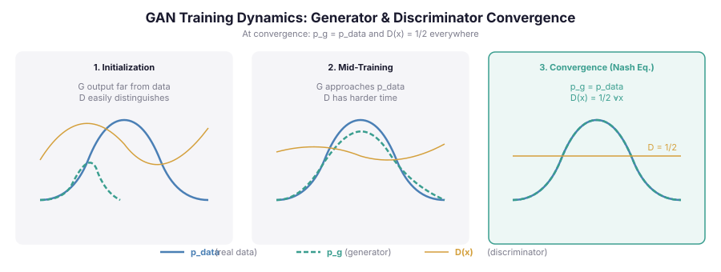
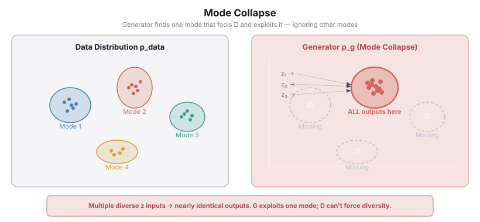
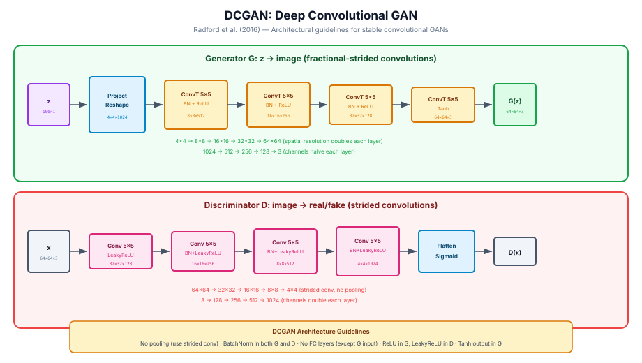
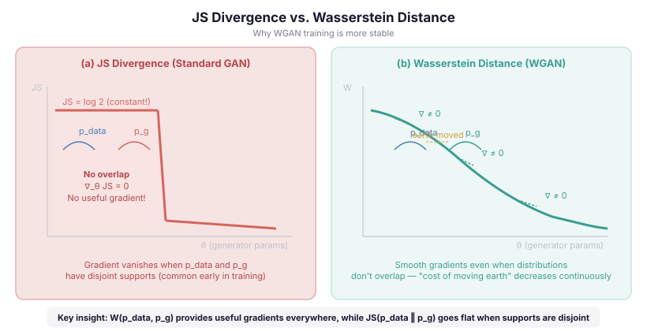
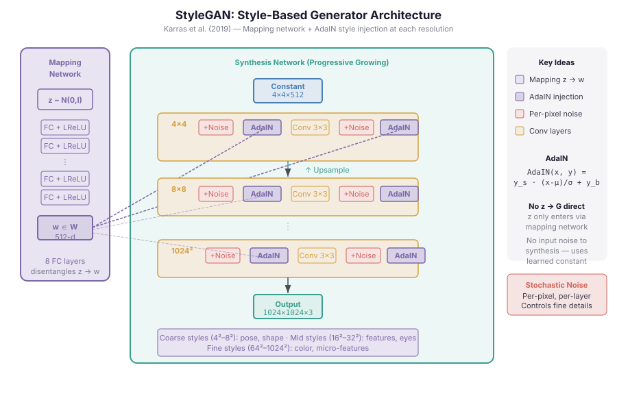
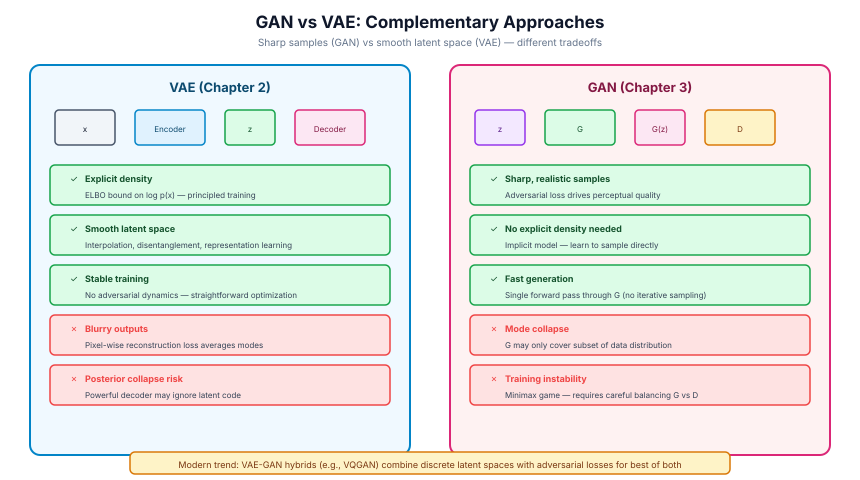

# Chapter 3: Generative Adversarial Networks — Learning Through Competition

> *"What I cannot create, I do not understand."* — Richard Feynman

---

## 3.1 Motivation: Learning to Generate by Learning to Discriminate

By 2014, generative models of images were producing blurry, low-resolution samples. The dominant approach — maximum likelihood estimation — asked a model to directly assign high probability to every training example. This worked, but it had a subtle structural problem: to avoid assigning zero probability anywhere in pixel space, models spread probability mass broadly, producing averages of many plausible images rather than any one sharp one.

Ian Goodfellow's insight was to reframe the problem entirely. Instead of asking "does this model assign high likelihood to real data?", ask "can a classifier tell real data from fake data?" These two questions sound related, but they lead to fundamentally different training signals.

The idea is competitive: train two neural networks against each other. A **Generator** G tries to produce realistic samples. A **Discriminator** D tries to distinguish real samples from generated ones. As D gets better at spotting fakes, G is forced to produce better fakes. The competition drives both networks toward an equilibrium where generated samples are indistinguishable from real ones.

This is game theory applied to machine learning. The language is precise: two players, opposing objectives, a Nash equilibrium as the solution concept. The elegance is that you never need to explicitly define what a "good" image looks like. The discriminator learns that definition implicitly from data, and the generator learns to satisfy it.

Before diving in, establish the notation. We have:
- A real data distribution $p_{\text{data}}(x)$ — the distribution we want to learn
- A latent noise distribution $p_z(z)$, typically $\mathcal{N}(0, I)$
- Generator $G: \mathcal{Z} \to \mathcal{X}$, a differentiable function (neural network) mapping noise to data space
- The induced distribution of generated samples: $p_g(x)$, where $x = G(z), z \sim p_z$
- Discriminator $D: \mathcal{X} \to [0, 1]$, outputting the probability that input $x$ is real

The goal: train G so that $p_g \approx p_{\text{data}}$.



---

## 3.2 The GAN Objective: A Minimax Game

### 3.2.1 Deriving the Value Function

The discriminator's job is binary classification: real vs. fake. Given a real sample $x \sim p_{\text{data}}$, D should output a value close to 1. Given a generated sample $x = G(z), z \sim p_z$, D should output a value close to 0.

The natural loss for binary classification is binary cross-entropy. D wants to maximize:

$$\mathbb{E}_{x \sim p_{\text{data}}}[\log D(x)] + \mathbb{E}_{z \sim p_z}[\log(1 - D(G(z)))]$$

The first term rewards D for correctly identifying real samples. The second term rewards D for correctly rejecting generated samples.

G, meanwhile, wants to fool D. When G produces $G(z)$, it wants D to output a value close to 1 (to be mistaken for real). So G wants to minimize $\mathbb{E}_{z \sim p_z}[\log(1 - D(G(z)))]$, which is the same as maximizing $\mathbb{E}_{z \sim p_z}[\log D(G(z))]$.

Combining both objectives into a single value function $V(D, G)$:

$$\min_G \max_D V(D, G) = \mathbb{E}_{x \sim p_{\text{data}}}[\log D(x)] + \mathbb{E}_{z \sim p_z}[\log(1 - D(G(z)))]$$

This is the **minimax game**. G minimizes; D maximizes. They share the same objective with opposing signs.

### 3.2.2 The Optimal Discriminator

For a fixed generator G, what is the optimal discriminator $D^*$? We can solve for it analytically.

The quantity D is maximizing, written in terms of densities, is:

$$\int_x \left[ p_{\text{data}}(x) \log D(x) + p_g(x) \log(1 - D(x)) \right] dx$$

Since this is a pointwise integral (each x contributes independently), we can maximize the integrand at each x separately. Define $a = p_{\text{data}}(x)$ and $b = p_g(x)$. We want to maximize:

$$f(y) = a \log y + b \log(1 - y)$$

Taking the derivative and setting to zero:

$$\frac{a}{y} - \frac{b}{1-y} = 0 \implies a(1-y) = by \implies y = \frac{a}{a+b}$$

Therefore:

$$D^*(x) = \frac{p_{\text{data}}(x)}{p_{\text{data}}(x) + p_g(x)}$$

This result is intuitive: $D^*$ outputs the Bayesian posterior probability that $x$ is real, given a uniform prior over real vs. generated. If $p_{\text{data}}(x) \gg p_g(x)$, then $D^*(x) \approx 1$. If $p_g(x) \gg p_{\text{data}}(x)$, then $D^*(x) \approx 0$. At the ideal generator where $p_g = p_{\text{data}}$, we get $D^*(x) = 1/2$ everywhere — the discriminator is maximally confused.



### 3.2.3 The Generator Minimizes Jensen-Shannon Divergence

Substituting $D^*$ back into $V(D^*, G)$ reveals what G is actually minimizing. Let us carry out the algebra.

$$V(D^*, G) = \mathbb{E}_{x \sim p_{\text{data}}}\left[\log \frac{p_{\text{data}}(x)}{p_{\text{data}}(x) + p_g(x)}\right] + \mathbb{E}_{x \sim p_g}\left[\log \frac{p_g(x)}{p_{\text{data}}(x) + p_g(x)}\right]$$

Recall the **Jensen-Shannon divergence** (JSD):

$$\text{JSD}(p \| q) = \frac{1}{2} \text{KL}\left(p \,\Big\|\, \frac{p+q}{2}\right) + \frac{1}{2} \text{KL}\left(q \,\Big\|\, \frac{p+q}{2}\right)$$

where $\text{KL}(p \| q) = \mathbb{E}_{x \sim p}[\log(p(x)/q(x))]$.

Let $m = (p_{\text{data}} + p_g)/2$. Then:

$$\text{JSD}(p_{\text{data}} \| p_g) = \frac{1}{2}\mathbb{E}_{x \sim p_{\text{data}}}\left[\log \frac{p_{\text{data}}(x)}{m(x)}\right] + \frac{1}{2}\mathbb{E}_{x \sim p_g}\left[\log \frac{p_g(x)}{m(x)}\right]$$

Substituting $m(x) = (p_{\text{data}}(x) + p_g(x))/2$ into our expression for $V(D^*, G)$:

$$V(D^*, G) = -\log 4 + 2 \cdot \text{JSD}(p_{\text{data}} \| p_g)$$

This is the key theoretical result. **The GAN objective, under the optimal discriminator, is equivalent to minimizing Jensen-Shannon divergence between the real and generated distributions, plus a constant.**

The JSD has two important properties:
1. $\text{JSD}(p \| q) \geq 0$, with equality iff $p = q$
2. JSD is symmetric, unlike KL divergence

So the global minimum occurs when $p_g = p_{\text{data}}$, at which point $V(D^*, G) = -\log 4$ and $D^*(x) = 1/2$ everywhere.

### 3.2.4 Nash Equilibrium

The solution concept from game theory is **Nash equilibrium**: a pair of strategies where neither player can improve their outcome by unilaterally changing strategy.

In the GAN game, Nash equilibrium is $(G^*, D^*)$ where:
- $G^*$ achieves $p_g = p_{\text{data}}$
- $D^*(x) = 1/2$ for all $x$

At this point, G cannot improve (it has already matched the true distribution), and D cannot improve (its output is already the Bayes-optimal classifier). Neither player benefits from deviating.



This is theoretically elegant. In practice, reaching it is another matter entirely.

---

## 3.3 Training Dynamics

### 3.3.1 Alternating Gradient Descent

The standard training algorithm alternates between updating D and G:

```
for each training iteration:
    # Step 1: Update discriminator (k steps)
    for i in range(k):
        sample minibatch of m real examples {x^(1), ..., x^(m)} from p_data
        sample minibatch of m noise vectors {z^(1), ..., z^(m)} from p_z
        update D by ascending its stochastic gradient:
            ∇_θ_D [ (1/m) Σ log D(x^(i)) + (1/m) Σ log(1 - D(G(z^(i)))) ]

    # Step 2: Update generator (1 step)
    sample minibatch of m noise vectors {z^(1), ..., z^(m)} from p_z
    update G by descending its stochastic gradient:
        ∇_θ_G [ (1/m) Σ log(1 - D(G(z^(i)))) ]
```

The original paper recommends $k=1$ for simplicity (one D step per G step), though some implementations use $k=5$ or more to keep D ahead of G.

### 3.3.2 The Vanishing Gradient Problem

There is a fundamental problem with the generator's loss $\log(1 - D(G(z)))$.

Early in training, the generator is poor. D easily distinguishes fakes from reals, so $D(G(z)) \approx 0$. The generator's loss becomes:

$$\log(1 - D(G(z))) \approx \log(1 - 0) = \log(1) = 0$$

More precisely, the gradient of $\log(1 - y)$ with respect to $y$ is $\frac{-1}{1-y}$, which equals $-1$ at $y = 0$ — a bounded, weak signal. Compare this to the non-saturating alternative $-\log(y)$, whose gradient is $\frac{-1}{y}$, which provides an infinitely strong signal as $y \to 0$. The original loss saturates: its value is $\approx 0$ and its gradient is small when G is bad. G receives too little signal to learn effectively.

**The non-saturating loss trick**: Instead of minimizing $\log(1 - D(G(z)))$, train G to maximize $\log D(G(z))$. These objectives have the same fixed point (both are minimized when $D(G(z)) = 1$), but different gradients early in training.

The gradient of $\log y$ with respect to $y$ is $1/y$, which is large when $y \approx 0$. So when G is bad and D easily rejects it ($D(G(z)) \approx 0$), the gradient of $\log D(G(z))$ is actually large — G receives a strong learning signal.

In practice, nearly every GAN implementation uses the non-saturating loss for G:

$$\mathcal{L}_G = -\mathbb{E}_{z \sim p_z}[\log D(G(z))]$$

Note this changes the game: it's no longer a strict minimax game but a "heuristic, non-saturating" version. The theoretical analysis doesn't directly apply, but empirically it works much better.

### 3.3.3 Mode Collapse: The Generator Finds an Exploit

**Mode collapse** is GAN training's most notorious failure mode, and it's worth thinking about carefully because it reveals something deep about the optimization landscape.

The real data distribution $p_{\text{data}}$ is multimodal — there are many distinct types of images (different digit classes, different faces, different objects). Ideally, $p_g$ should cover all these modes.

But consider the discriminator's perspective. At any given training step, D has learned to identify current fakes. If G discovers a small region of data space where D consistently outputs high probability, G has found an **exploit**: it can concentrate all its probability mass there and receive good gradients.

The result: G generates diverse-looking noise to the human eye, but actually produces only one or a few modes of the distribution. This is called mode collapse (partial or full).



Mode collapse is a non-stationary dynamics problem. G moves to exploit D's weakness; D updates to close that weakness; G moves to a new exploit; the cycle continues. Instead of converging, G cycles through modes without ever learning the full distribution.

Why doesn't this happen with maximum likelihood? Because MLE directly minimizes $\text{KL}(p_{\text{data}} \| p_g)$, which is $+\infty$ whenever $p_{\text{data}}(x) > 0$ but $p_g(x) = 0$. The model is severely penalized for missing any mode. GANs (with JSD) don't have this penalty structure — a generator that covers one mode perfectly can score just as well as one that covers all modes partially.

**Practical mitigation strategies:**
- **Minibatch discrimination**: Feed D statistics about a batch of samples, not just individual ones. D can then penalize G for producing a batch with low diversity.
- **Feature matching**: Train G to match statistics of intermediate D activations, rather than optimizing the output directly. This reduces the incentive to exploit D's output layer.
- **Spectral normalization**: Constrain D's Lipschitz constant to stabilize training.
- **Unrolled GANs**: Train G against a D that has been "unrolled" several steps forward, so G cannot exploit D's current state without considering D's response.

### 3.3.4 Training Instability

Beyond mode collapse, GAN training is notoriously unstable:

- **Oscillation**: G and D don't converge to a fixed point but instead cycle. Since each network's optimal parameters depend on the other's current parameters, simultaneous gradient descent doesn't converge in general — even in simple two-player games.
- **G overwhelming D**: If G becomes too good too fast, D's gradient signal becomes useless. If D becomes too good, G's gradient vanishes (the original saturation problem). Balance is critical and fragile.
- **Hyperparameter sensitivity**: Learning rates, architecture choices, batch normalization, and activation functions all affect stability. GANs require careful tuning.

The core issue: gradient descent finds local minima in single-player optimization, but it's not guaranteed to find Nash equilibria in two-player games. The theory of GAN convergence assumes full optimization at each step, which gradient descent doesn't provide.

---

## 3.4 Theoretical Analysis

### 3.4.1 Convergence Proof Sketch

Goodfellow et al. prove that the minimax game has a global solution where $p_g = p_{\text{data}}$, and that alternating optimization converges to this solution — under idealized conditions.

The proof has two parts:

**Proposition 1** (Optimality of $D^*$): For fixed G, the optimal discriminator is $D^*(x) = p_{\text{data}}(x) / (p_{\text{data}}(x) + p_g(x))$. (Derived above.)

**Proposition 2** (Global optimum): The global minimum of $C(G) = \max_D V(D, G)$ is $-\log 4$, achieved when $p_g = p_{\text{data}}$.

*Proof sketch*: We showed $C(G) = -\log 4 + 2 \cdot \text{JSD}(p_{\text{data}} \| p_g)$. Since JSD $\geq 0$ with equality iff $p = q$, the minimum of $C(G)$ is $-\log 4$, achieved iff $p_g = p_{\text{data}}$. $\square$

**Theorem** (Convergence): If G and D have sufficient capacity, and at each step of Algorithm 1 the discriminator is allowed to reach its optimum given G, and G is updated to improve:

$$\mathbb{E}_{x \sim p_{\text{data}}}[\log D_G^*(x)] + \mathbb{E}_{x \sim p_g}[\log(1 - D_G^*(x))]$$

then $p_g$ converges to $p_{\text{data}}$.

The key conditions — "sufficient capacity" and "allowed to reach its optimum" — are both violated in practice:

1. **Finite-capacity neural networks** cannot represent arbitrary probability distributions. The optimal discriminator in parameter space is not the truly optimal discriminator.
2. **One gradient step does not find the optimum** of D. We do gradient descent, not global optimization.

So the theory establishes that the objective has a good fixed point but says nothing about whether gradient descent reaches it with the finite-capacity networks we actually use.

### 3.4.2 Why Convergence is Hard in Practice

The issue is deeper than just capacity and finite optimization. Even with linear models and convex objectives, **simultaneous gradient descent on two-player zero-sum games does not converge in general** — it orbits the Nash equilibrium.

Consider the simplest possible case: $\min_x \max_y xy$. The Nash equilibrium is $(0,0)$. Gradient descent update: $x \leftarrow x - \alpha y$, $y \leftarrow y + \alpha x$. With discrete step sizes, this system actually *diverges* — it spirals outward from the origin with increasing radius. (In the continuous-time limit the orbits are stable circles, but the discrete updates overshoot on each step.) This is even worse than mere non-convergence: the iterates actively move away from the equilibrium.

For GANs, which are highly non-convex non-concave, the situation is even worse. The landscape is full of local equilibria, saddle points, and limit cycles. This is why GAN training requires so many stabilization techniques.

### 3.4.3 Evaluating GANs: FID and Inception Score

Maximum likelihood gives you a number (log-likelihood) that directly measures model quality. GANs have no such natural scalar. Two metrics became standard:

**Inception Score (IS)** (Salimans et al., 2016): Feed generated images through a pretrained Inception-v3 classifier. Good images should:
1. Be clearly classifiable (low entropy $H(y|x)$ — the conditional class distribution is peaked)
2. Be diverse across the dataset (high entropy $H(y)$ — the marginal class distribution is flat)

$$\text{IS} = \exp\left(\mathbb{E}_x \left[\text{KL}(p(y|x) \| p(y))\right]\right)$$

IS is easy to compute but has known problems: it ignores the real data distribution entirely (a generator that perfectly reproduces the training set would score well even if it memorized), it's sensitive to the Inception network's biases, and it only measures what Inception considers "classifiable."

**Fréchet Inception Distance (FID)** (Heusel et al., 2017): Extract features from the second-to-last layer of Inception-v3 for both real and generated images. Model each feature distribution as a Gaussian (multivariate normal) and compute the Fréchet distance between the two Gaussians:

$$\text{FID} = \|\mu_r - \mu_g\|^2 + \text{Tr}\left(\Sigma_r + \Sigma_g - 2(\Sigma_r \Sigma_g)^{1/2}\right)$$

where $(\mu_r, \Sigma_r)$ and $(\mu_g, \Sigma_g)$ are the mean and covariance of the real and generated feature distributions.

FID is lower-is-better. It measures both fidelity (are generated images in the right region of feature space?) and diversity (do the generated image features span the same covariance as real images?). It's more sensitive to mode collapse than IS because mode collapse reduces $\Sigma_g$.

FID is now the standard metric for GANs, though it too has limitations: it's sensitive to sample size, requires a large enough sample to estimate covariances, and inherits the biases of Inception-v3 (trained on ImageNet).

---

## 3.5 Key Variants

### 3.5.1 DCGAN: Making GANs Work on Images

The original GAN paper used fully connected networks. Radford, Metz, and Chintala (2016) introduced **DCGAN** (Deep Convolutional GAN) with architectural guidelines that made image GANs stable enough to produce useful results:

- Replace pooling layers with strided convolutions (discriminator) and transposed convolutions (generator)
- Use batch normalization in both G and D (except G's output layer and D's input layer)
- Remove fully connected hidden layers for deeper architectures
- Use ReLU in G (Tanh for output), LeakyReLU in D

These changes aren't theoretically motivated — they're empirical engineering. But they stabilize training enough to produce $64 \times 64$ bedroom and face images that looked impressive in 2016.

DCGAN also showed that the GAN latent space has meaningful structure: interpolating between two latent vectors $z_1$ and $z_2$ produces a smooth transition between generated images, not random noise. The generator has learned a usable embedding.



### 3.5.2 WGAN: Fixing the Loss with Wasserstein Distance

**WGAN** (Arjovsky, Chintala, and Bottou, 2017) is one of the most theoretically important GAN variants, motivated by a precise diagnosis of what goes wrong.

The problem: when $p_{\text{data}}$ and $p_g$ have non-overlapping or near-non-overlapping support (which happens early in training when G produces garbage), the JSD equals $\log 2$ regardless of how different the distributions are. The gradient of JSD with respect to G's parameters is zero. G cannot learn.

The solution: use **Wasserstein-1 distance** (also called Earth Mover's distance) instead of JSD.

The Wasserstein-1 distance between $p$ and $q$:

$$W(p, q) = \inf_{\gamma \in \Pi(p,q)} \mathbb{E}_{(x,y) \sim \gamma}[\|x - y\|]$$

where $\Pi(p, q)$ is the set of joint distributions with marginals $p$ and $q$. Intuitively, it's the minimum cost to transport mass from $p$ to $q$, where cost is distance.

The key property: Wasserstein distance provides meaningful gradients even when the distributions have disjoint support. If $p$ is a Gaussian at $x=0$ and $q$ is a Gaussian at $x=5$, JSD is $\log 2$ (maximum, no gradient information), but $W(p, q) = 5$ and the gradient points directly toward decreasing that distance.



By the **Kantorovich-Rubinstein duality**, the Wasserstein-1 distance can be written as:

$$W(p_{\text{data}}, p_g) = \sup_{\|f\|_L \leq 1} \mathbb{E}_{x \sim p_{\text{data}}}[f(x)] - \mathbb{E}_{x \sim p_g}[f(x)]$$

where the supremum is over all 1-Lipschitz functions $f$.

In WGAN, the discriminator (called the **critic**) parametrizes this $f$. It doesn't output probabilities; it outputs real-valued scores. The critic must be kept 1-Lipschitz. Original WGAN enforces this by **weight clipping**: after each gradient step, clip all critic weights to $[-c, c]$ for some small $c$ (e.g., 0.01).

The WGAN critic loss:
$$\mathcal{L}_C = \mathbb{E}_{x \sim p_g}[C(x)] - \mathbb{E}_{x \sim p_{\text{data}}}[C(x)]$$

The generator loss:
$$\mathcal{L}_G = -\mathbb{E}_{z \sim p_z}[C(G(z))]$$

No log. No saturation. The generator's loss directly estimates Wasserstein distance and has meaningful gradients throughout training.

Weight clipping is crude and was quickly replaced by **gradient penalty** (WGAN-GP, Gulrajani et al., 2017): instead of clipping weights, add a penalty to the critic's loss that penalizes gradient norms deviating from 1:

$$\mathcal{L}_C = \mathbb{E}_{x \sim p_g}[C(x)] - \mathbb{E}_{x \sim p_{\text{data}}}[C(x)] + \lambda \mathbb{E}_{\hat{x} \sim p_{\hat{x}}}\left[(\|\nabla_{\hat{x}} C(\hat{x})\|_2 - 1)^2\right]$$

where $\hat{x}$ is sampled uniformly along straight lines between pairs of real and generated samples. This is much more stable than weight clipping and doesn't require tuning the clipping threshold.

WGAN-GP became a widely adopted baseline because of its training stability and meaningful loss curve — unlike original GAN loss, WGAN loss actually correlates with sample quality.

### 3.5.3 Conditional GAN: Controlling What Gets Generated

Standard GAN maps noise to data with no control over what is generated. **Conditional GAN** (cGAN, Mirza and Osindero, 2014) conditions both G and D on auxiliary information $y$ (class labels, text descriptions, segmentation maps):

$$\min_G \max_D V(D, G) = \mathbb{E}_{x \sim p_{\text{data}}}[\log D(x|y)] + \mathbb{E}_{z \sim p_z}[\log(1 - D(G(z|y)|y))]$$

The generator becomes $G(z, y)$ and the discriminator becomes $D(x, y)$. In practice, conditioning is implemented by concatenating a label embedding to the noise vector (for G) and to intermediate feature maps (for D).

cGANs enable controlled generation: given class label $y = \text{"cat"}$, G generates a cat. This is the basis of class-conditional image generation and, extended to other conditioning signals, image-to-image translation.

### 3.5.4 Pix2Pix: Image-to-Image Translation

**Pix2Pix** (Isola et al., 2017) extends cGAN to image-to-image translation tasks: maps to satellite photos, sketches to photos, day to night. Here we use different notation from the cGAN section above to avoid ambiguity: let $x_A$ denote the input image (e.g., a sketch) and $x_B$ the target image (e.g., the corresponding photo).

The key architectural choice is a U-Net generator (encoder-decoder with skip connections) and a PatchGAN discriminator that classifies whether each $N \times N$ patch of an image is real or fake (rather than classifying the whole image). The patch discriminator enforces local texture realism; the U-Net skip connections preserve global structure.

The loss combines adversarial loss with L1 reconstruction:

$$\mathcal{L}_{\text{Pix2Pix}} = \mathcal{L}_{cGAN}(G, D) + \lambda \mathcal{L}_{L1}(G)$$

where $\mathcal{L}_{L1}(G) = \mathbb{E}[\|x_B - G(x_A, z)\|_1]$.

The L1 term prevents the generator from ignoring the input image entirely to fool the discriminator — it anchors G to produce an output that is close to the target.

### 3.5.5 StyleGAN: State of the Art in High-Fidelity Synthesis

**StyleGAN** (Karras et al., 2019) produces photorealistic $1024 \times 1024$ face images and represents the most sophisticated GAN architecture. Its innovations:

**Mapping network**: Instead of feeding latent $z$ directly to G, first pass it through an 8-layer MLP to produce an intermediate latent $w \in \mathcal{W}$. The $\mathcal{W}$ space is less entangled than $\mathcal{Z}$ — factors of variation are more linearly separable.

**Adaptive Instance Normalization (AdaIN)**: Style is injected at each layer via AdaIN, which modulates the feature maps according to $w$:

$$\text{AdaIN}(x_i, y) = y_{s,i} \frac{x_i - \mu(x_i)}{\sigma(x_i)} + y_{b,i}$$

where $y_{s,i}$ and $y_{b,i}$ are style scale and bias derived from $w$. This separates "content" (controlled by the base synthesis network) from "style" (injected at every layer).

**Progressive growing** (introduced in ProGAN — Karras et al., 2018, and inherited by StyleGAN): Training starts at $4 \times 4$ resolution and gradually adds layers to increase resolution. This stabilizes training and allows lower resolutions to be learned before tackling fine details.

**Mixing regularization**: During training, use two different latent codes for different layers, discouraging correlations between layers and improving style control.

StyleGAN2 (Karras et al., 2020) later replaced progressive growing with feature map normalization and path length regularization, achieving superior image quality with fewer training artifacts.



---

## 3.6 GANs vs. VAEs: A Precise Trade-off

Variational Autoencoders (Chapter 2) and GANs are both deep generative models, but they have fundamentally different failure modes. Understanding the trade-off requires examining the divergence each one minimizes.

**VAEs maximize the evidence lower bound (ELBO)**, which can be shown to correspond to approximately minimizing $\text{KL}(p_{\text{data}} \| p_g)$ — the forward KL divergence. This divergence is infinite when $p_{\text{data}}(x) > 0$ but $p_g(x) = 0$. To avoid this, the model must cover all modes of $p_{\text{data}}$ — even regions where the model is uncertain. The result: **mode covering**. VAEs assign probability mass everywhere $p_{\text{data}}$ has mass, even between modes. This produces blurry samples — the model averages over its uncertainty rather than committing to a specific output.

**GANs minimize JSD (or Wasserstein distance)**. JSD penalizes the generator for placing probability mass in regions where $p_g(x) > p_{\text{data}}(x)$, but not asymmetrically for missing mass. The result: **mode dropping**. G can ignore entire modes of $p_{\text{data}}$ without being severely penalized, as long as what it does generate is indistinguishable from real data.



The trade-off:

| Property | VAE | GAN |
|---|---|---|
| Sample sharpness | Low (blurry) | High (sharp) |
| Mode coverage | High (covers all modes) | Low (drops modes) |
| Training stability | High (single objective, ELBO) | Low (adversarial, unstable) |
| Latent space structure | Explicit, regularized | Implicit, unstructured |
| Density estimation | Yes (tractable ELBO) | No |
| Inference (encode real x) | Yes (encoder $q(z|x)$) | No (no encoder) |
| Theoretical grounding | Strong (variational inference) | Moderate (game theory) |

This is not just practical observation — it reflects the underlying mathematics of the divergences. There is no free lunch: you're choosing between a model that covers the full distribution (but is blurry) and one that captures the texture of specific regions (but may miss large parts of the distribution).

**Hybrid approaches** attempt to get both. VAE-GAN (Larsen et al., 2016) uses a VAE encoder-decoder as the generator in a GAN framework. The VAE provides the latent structure and mode coverage; the GAN discriminator sharpens the output. In practice, hybrid models often inherit problems from both parents.

---

## 3.7 Connections Forward

### 3.7.1 Why Diffusion Models Replaced GANs

By 2021-2022, diffusion models (Chapter 8) had surpassed GANs on FID scores across essentially every domain, and had qualitatively better coverage of the data distribution. Why?

GANs face a fundamental tension: the discriminator must be good enough to provide useful gradients, but not so good that it saturates them. This is a moving target throughout training and requires constant balancing. The training signal is indirect — G learns by trying to fool D, not by directly maximizing any measure of match to the data.

Diffusion models, by contrast, learn with a direct denoising objective at every noise level. They're trained with standard maximum likelihood on a tractable surrogate. No adversarial dynamics, no mode collapse, no discriminator to balance. The optimization is much more stable.

Moreover, diffusion models' iterative sampling process allows them to allocate model capacity differently at each noise level — spend more compute on difficult denoising steps. GANs must generate in one shot.

The remaining advantage of GANs is speed: a GAN generates a sample in one forward pass. Diffusion models require hundreds of denoising steps. This is actively being addressed with consistency models and diffusion distillation (Chapter 8).

### 3.7.2 Adversarial Concepts in Reinforcement Learning

The adversarial training paradigm extends naturally to reinforcement learning. In **Generative Adversarial Imitation Learning (GAIL)** (Ho and Ermon, 2016), a discriminator is trained to distinguish between expert trajectories and policy rollouts, and the policy (generator) is trained to fool the discriminator. This avoids manually defining reward functions for imitation learning.

More broadly, the idea of two networks in opposition — one proposing, one critiquing — appears in self-play (AlphaGo, AlphaZero), adversarial training for robustness, and multi-agent RL. The game-theoretic framing that Goodfellow introduced is a recurring motif.

### 3.7.3 GAN Discriminators as Learned Loss Functions

One lasting contribution of GANs is the concept of a **learned perceptual loss**. Instead of defining a loss function by hand (L1 distance, L2 distance), train a discriminator to evaluate quality and use its gradient as the training signal.

This idea outlives standard GAN training. Feature matching losses from pretrained discriminators (or related networks like VGG-based perceptual loss) are used extensively in super-resolution, style transfer, and image restoration — tasks where L2 loss produces blur because it minimizes expected squared error over all plausible outputs.

In diffusion model guidance (Chapter 8), a pretrained classifier's gradient is used to steer generation — this is architecturally similar to using a discriminator's gradient to guide a generator. The discriminator-as-loss-function is a durable idea.

---

## Summary

GANs introduced a new paradigm: learn a generative model by pitting it against an adversary. The theoretical analysis is clean — the minimax game's equilibrium corresponds to minimizing Jensen-Shannon divergence, achieved when the generator exactly matches the data distribution. The discriminator's optimal solution is the Bayesian posterior; at Nash equilibrium it outputs 1/2 everywhere.

Practice is messier. Alternating gradient descent doesn't guarantee convergence to Nash equilibria. Mode collapse is a structural consequence of the JSD's asymmetric penalties. Vanishing gradients require the non-saturating loss hack. Training requires careful balancing of two networks with opposing objectives.

The key variants address specific failure modes: DCGAN adds architectural stability; WGAN replaces JSD with Wasserstein distance to get meaningful gradients; cGAN adds conditioning; StyleGAN pushes image quality to state-of-the-art through careful architectural design.

The fundamental trade-off — sharpness vs. coverage, mode dropping vs. mode covering — is not a bug to be fixed but a structural consequence of minimizing different divergences. VAEs cover all modes but blur; GANs produce sharp samples but drop modes.

By the early 2020s, diffusion models had surpassed GANs by offering stability, coverage, and quality without adversarial dynamics. But GANs' conceptual contributions — adversarial training, learned loss functions, game-theoretic framing of generation — remain foundational to the field.

---

## Key Equations Reference

| Concept | Equation |
|---|---|
| GAN objective | $\min_G \max_D \mathbb{E}[\log D(x)] + \mathbb{E}[\log(1-D(G(z)))]$ |
| Optimal discriminator | $D^*(x) = \frac{p_{\text{data}}(x)}{p_{\text{data}}(x) + p_g(x)}$ |
| Generator minimizes | $-\log 4 + 2\,\text{JSD}(p_{\text{data}} \| p_g)$ |
| Non-saturating G loss | $\mathcal{L}_G = -\mathbb{E}_z[\log D(G(z))]$ |
| Wasserstein distance | $W(p,q) = \sup_{\|f\|_L \leq 1} \mathbb{E}_p[f] - \mathbb{E}_q[f]$ |
| FID | $\|\mu_r - \mu_g\|^2 + \text{Tr}(\Sigma_r + \Sigma_g - 2(\Sigma_r\Sigma_g)^{1/2})$ |

---

## Code: Minimal WGAN-GP in PyTorch

> **Dependencies:** `pip install torch torchvision`

The following is a complete, self-contained WGAN-GP trained on MNIST. It uses simple MLP Generator and Critic networks. Run it directly; MNIST will be downloaded automatically. You will see the Wasserstein distance estimate printed each epoch — unlike vanilla GAN loss, this number correlates with actual sample quality and should increase (become less negative) as training progresses.

```python
import torch
import torch.nn as nn
from torch.utils.data import DataLoader
from torchvision import datasets, transforms

# ── Hyperparameters ──────────────────────────────────────────────────────────
LATENT_DIM   = 64    # noise vector dimension
HIDDEN_DIM   = 256   # MLP hidden width
BATCH_SIZE   = 64
EPOCHS       = 5
LR           = 1e-4
N_CRITIC     = 5     # critic updates per generator update
LAMBDA_GP    = 10    # gradient penalty weight
DEVICE       = "cuda" if torch.cuda.is_available() else "cpu"


# ── Generator: z → x_fake ────────────────────────────────────────────────────
class Generator(nn.Module):
    def __init__(self, latent_dim=LATENT_DIM, hidden_dim=HIDDEN_DIM, output_dim=784):
        super().__init__()
        self.net = nn.Sequential(
            nn.Linear(latent_dim, hidden_dim),
            nn.ReLU(),
            nn.Linear(hidden_dim, hidden_dim),
            nn.ReLU(),
            nn.Linear(hidden_dim, output_dim),
            nn.Tanh(),   # output in [-1, 1] to match normalized MNIST
        )

    def forward(self, z):
        return self.net(z)   # [B, 784]


# ── Critic: x → scalar score (NOT a probability) ─────────────────────────────
# The critic must NOT use BatchNorm — it breaks the Lipschitz constraint.
# Use LayerNorm or no normalization instead.
class Critic(nn.Module):
    def __init__(self, input_dim=784, hidden_dim=HIDDEN_DIM):
        super().__init__()
        self.net = nn.Sequential(
            nn.Linear(input_dim, hidden_dim),
            nn.LeakyReLU(0.2),
            nn.Linear(hidden_dim, hidden_dim),
            nn.LeakyReLU(0.2),
            nn.Linear(hidden_dim, 1),   # real-valued score, no sigmoid
        )

    def forward(self, x):
        return self.net(x)   # [B, 1]


# ── Gradient penalty: enforce ||∇C(x_hat)||_2 ≈ 1 ───────────────────────────
def gradient_penalty(critic, real, fake, device):
    B = real.size(0)
    # Sample interpolation coefficient α ~ Uniform[0, 1] per example
    alpha = torch.rand(B, 1, device=device)           # [B, 1]
    # Interpolate between real and fake along straight lines
    x_hat = alpha * real + (1 - alpha) * fake         # [B, 784]
    x_hat.requires_grad_(True)                        # need grad w.r.t. x_hat

    score = critic(x_hat)                             # [B, 1]

    # Compute gradient of critic output w.r.t. interpolated input
    grads = torch.autograd.grad(
        outputs=score,
        inputs=x_hat,
        grad_outputs=torch.ones_like(score),
        create_graph=True,   # keep graph for second-order gradient through penalty
        retain_graph=True,
    )[0]                                              # [B, 784]

    grad_norm = grads.norm(2, dim=1)                  # L2 norm per example: [B]
    penalty   = ((grad_norm - 1) ** 2).mean()         # penalize deviation from 1
    return penalty


# ── Data: normalize to [-1, 1] to match Generator's Tanh output ──────────────
transform  = transforms.Compose([
    transforms.ToTensor(),
    transforms.Normalize((0.5,), (0.5,)),   # [0,1] → [-1, 1]
])
train_data = datasets.MNIST(root="./data", train=True, download=True, transform=transform)
loader     = DataLoader(train_data, batch_size=BATCH_SIZE, shuffle=True, drop_last=True)

# ── Models and optimizers ─────────────────────────────────────────────────────
G         = Generator().to(DEVICE)
C         = Critic().to(DEVICE)
opt_G     = torch.optim.Adam(G.parameters(), lr=LR, betas=(0.0, 0.9))
opt_C     = torch.optim.Adam(C.parameters(), lr=LR, betas=(0.0, 0.9))
# betas=(0.0, 0.9): WGAN-GP paper recommends no momentum (β1=0) for stability

# ── Training loop ─────────────────────────────────────────────────────────────
for epoch in range(1, EPOCHS + 1):
    total_w_dist = 0.0
    n_batches    = 0

    for real_imgs, _ in loader:
        real = real_imgs.view(BATCH_SIZE, -1).to(DEVICE)  # flatten: [B, 784]

        # ── Step 1: Update Critic N_CRITIC times ─────────────────────────────
        for _ in range(N_CRITIC):
            z    = torch.randn(BATCH_SIZE, LATENT_DIM, device=DEVICE)
            fake = G(z).detach()   # detach: don't update G during critic step

            # Wasserstein distance estimate: E[C(real)] - E[C(fake)]
            w_dist  = C(real).mean() - C(fake).mean()
            gp      = gradient_penalty(C, real, fake, DEVICE)
            loss_C  = -w_dist + LAMBDA_GP * gp   # maximize w_dist → minimize -w_dist

            opt_C.zero_grad()
            loss_C.backward()
            opt_C.step()

        # ── Step 2: Update Generator once ────────────────────────────────────
        z       = torch.randn(BATCH_SIZE, LATENT_DIM, device=DEVICE)
        fake    = G(z)
        loss_G  = -C(fake).mean()   # G wants critic to score fakes highly

        opt_G.zero_grad()
        loss_G.backward()
        opt_G.step()

        # Track Wasserstein estimate (positive = critic can distinguish real/fake)
        with torch.no_grad():
            total_w_dist += (C(real).mean() - C(fake.detach()).mean()).item()
        n_batches += 1

    avg_w = total_w_dist / n_batches
    print(f"Epoch {epoch}/{EPOCHS}  Wasserstein estimate: {avg_w:.4f}  "
          f"G loss: {loss_G.item():.4f}")

# ── Quick sanity check: generate a sample ────────────────────────────────────
G.eval()
with torch.no_grad():
    z      = torch.randn(1, LATENT_DIM, device=DEVICE)
    sample = G(z)
    print(f"\nGenerated sample shape: {sample.shape}")        # → [1, 784]
    print(f"Value range: [{sample.min():.3f}, {sample.max():.3f}]")  # → near [-1, 1]
```

**What to observe when running this:**

- The Wasserstein estimate starts negative or near zero (critic cannot distinguish real from fake) and should increase toward a positive value as the generator improves.
- Unlike vanilla GAN loss, this number has meaning: it is an estimate of the Wasserstein distance between real and generated distributions. A decreasing number means the generator is getting worse; increasing means it is improving.
- G loss should decrease (become more negative) over training as the generator learns to fool the critic.

**Key implementation notes:**

- `N_CRITIC = 5`: The critic is updated 5 times per generator update. This keeps the critic closer to its optimum so the Wasserstein estimate is accurate before G takes a step.
- `betas=(0.0, 0.9)`: The WGAN-GP paper recommends disabling Adam's first-moment estimate (setting $\beta_1 = 0$) to reduce oscillation in the adversarial setting.
- The Critic has no `BatchNorm` — batch normalization introduces correlations across examples in a batch, which violates the per-sample independence assumption needed for the Lipschitz constraint.
- `create_graph=True` in the gradient penalty: computing the penalty requires differentiating through the gradient itself (a second-order operation). This is necessary so the optimizer can compute $\nabla_\theta \|\nabla_x C(x)\|^2$.

---

## Exercises

**1. The optimal discriminator and Jensen-Shannon divergence.**
For a fixed generator $G$, the optimal discriminator is $D^*(x) = \frac{p_\text{data}(x)}{p_\text{data}(x) + p_g(x)}$.

(a) Derive this result by differentiating the value function $V(D, G)$ with respect to $D(x)$ pointwise.

(b) Substitute $D^*$ back into $V(D^*, G)$ and show that:

$$V(D^*, G) = -\log 4 + 2\, D_\text{JS}(p_\text{data} \,\|\, p_g)$$

where $D_\text{JS}$ is the Jensen-Shannon divergence. What does this imply about the global minimum of the GAN objective?

(c) The global minimum is achieved when $p_g = p_\text{data}$. Explain why this is a Nash equilibrium: neither player can improve their objective by unilaterally deviating.

**2. Vanishing gradients and the non-saturating heuristic.**
In early GAN training, the generator is far from the data distribution. In this regime, $D(G(z)) \approx 0$, so $\log(1 - D(G(z))) \approx 0$.

(a) Compute $\frac{\partial}{\partial \theta_G} \mathbb{E}_z[\log(1 - D(G(z)))]$ and explain why the gradient vanishes when $D$ is well-trained and $G$ is weak.

(b) The non-saturating alternative replaces the generator objective with $\max_G \mathbb{E}_z[\log D(G(z))]$. Argue informally that this objective provides stronger gradients in the same regime. Does this change the Nash equilibrium?

**3. Mode collapse: a formal perspective.**
Mode collapse occurs when the generator maps all (or most) inputs $z$ to a single mode of $p_\text{data}$.

(a) Suppose $p_\text{data}$ is a mixture of 10 Gaussians and $p_g$ concentrates all mass on one of them. Compute $D_\text{JS}(p_\text{data} \,\|\, p_g)$ qualitatively — is it large or small? Does the discriminator have a strong signal to penalize this?

(b) Explain why the Wasserstein distance $W_1(p_\text{data}, p_g)$ provides a more informative gradient signal than JSD in this scenario. You do not need to derive the full Kantorovich duality — an intuitive argument about distances between non-overlapping distributions is sufficient.

**4. WGAN-GP: the gradient penalty derivation.**
The Wasserstein GAN with gradient penalty enforces the 1-Lipschitz constraint via:

$$\lambda\, \mathbb{E}_{\hat{x} \sim \mathbb{P}_{\hat{x}}}\left[\left(\|\nabla_{\hat{x}} C(\hat{x})\|_2 - 1\right)^2\right]$$

where $\hat{x} = \epsilon x + (1-\epsilon)G(z)$ with $\epsilon \sim \text{Uniform}(0, 1)$.

(a) Why are samples interpolated between real and fake used rather than sampling from either distribution alone? What property of the optimal critic motivates this choice?

(b) The original WGAN used weight clipping to enforce the Lipschitz constraint. List two failure modes of weight clipping that the gradient penalty addresses.

(c) In the implementation from the chapter, `create_graph=True` is required when computing the gradient penalty. Explain what this flag does computationally — why is a second-order graph needed?

**5. Implement FID evaluation.**
Fréchet Inception Distance (FID) measures the distance between the distributions of real and generated images in the feature space of a pretrained Inception network:

$$\text{FID} = \|\mu_r - \mu_g\|^2 + \text{Tr}\!\left(\Sigma_r + \Sigma_g - 2(\Sigma_r \Sigma_g)^{1/2}\right)$$

(a) Write a Python function `compute_fid(real_images, fake_images, inception_model)` that: extracts Inception features from both sets, computes the mean and covariance of each, and returns the FID score. Use `scipy.linalg.sqrtm` for the matrix square root.

(b) Generate 1000 samples from your trained WGAN-GP (from the chapter implementation or your own). Compute FID against 1000 held-out MNIST test images. What FID score do you obtain, and how does it change across training epochs?

(c) FID is sensitive to the number of samples used for estimation. Run your FID computation with $N \in \{100, 500, 1000, 5000\}$ real/fake samples. Plot the FID estimate vs. $N$. At what sample size does the estimate stabilize? What does this imply for comparing models fairly?

---

## Additional Exercises

**Exercise 3.1** *(Computation)*

Derive the optimal discriminator from first principles.

(a) Given fixed generator $G$, the discriminator maximizes:
$$\int_x \left[ p_{\text{data}}(x) \log D(x) + p_g(x) \log(1 - D(x)) \right] dx$$
Treating this as a pointwise optimization problem (each $x$ independently), define $a = p_{\text{data}}(x)$, $b = p_g(x)$, and find the $y \in (0,1)$ that maximizes $f(y) = a \log y + b \log(1-y)$. Show all steps including the derivative and setting it to zero.

(b) Verify that your answer matches $D^*(x) = \frac{p_{\text{data}}(x)}{p_{\text{data}}(x) + p_g(x)}$.

(c) Evaluate $D^*(x)$ in three cases: (i) $p_{\text{data}}(x) = 0.8$, $p_g(x) = 0.2$; (ii) $p_{\text{data}}(x) = p_g(x)$; (iii) $p_g(x) \to 0$. Interpret each case: what is the discriminator signaling about this region of data space?

---

**Exercise 3.2** *(Conceptual)*

Identify mode collapse in a concrete scenario.

You train a GAN on MNIST (10 digit classes). After training, you generate 1,000 samples and run a classifier on them. The class distribution you observe is: class 1 appears 820 times, classes 0 and 7 appear about 90 times each, and all other classes appear 0 times.

(a) Is this mode collapse? What distinguishes partial mode collapse from full mode collapse?

(b) Explain the mechanism: why would the generator concentrate on digit "1"? Frame your answer in terms of the discriminator's behavior at a specific point in training and the exploit the generator found.

(c) You compute FID using 1,000 generated samples vs. the full MNIST test set. Would you expect FID to be higher or lower compared to a generator with uniform coverage of all 10 classes but slightly blurrier samples? Explain which component of the FID formula ($\|\mu_r - \mu_g\|^2$ or the trace term) is most affected by mode collapse.

---

**Exercise 3.3** *(Computation)*

WGAN gradient penalty.

The WGAN-GP critic loss adds a gradient penalty term:
$$\mathcal{L}_C = \mathbb{E}_{x \sim p_g}[C(x)] - \mathbb{E}_{x \sim p_{\text{data}}}[C(x)] + \lambda \mathbb{E}_{\hat{x}}\left[(\|\nabla_{\hat{x}} C(\hat{x})\|_2 - 1)^2\right]$$

(a) The interpolated point $\hat{x}$ is constructed as $\hat{x} = \epsilon x_{\text{real}} + (1-\epsilon) x_{\text{fake}}$ where $\epsilon \sim \text{Uniform}(0,1)$. Why sample along the line between real and fake points specifically, rather than sampling $\hat{x}$ uniformly from the data distribution?

(b) The penalty enforces $\|\nabla_{\hat{x}} C(\hat{x})\|_2 \approx 1$, not $\leq 1$. Explain why the 1-Lipschitz constraint for Wasserstein distance requires the gradient norm to be at most 1 everywhere, but the practical penalty pushes it toward exactly 1. What does a critic with gradient norm exactly 1 everywhere mean geometrically?

(c) Weight clipping (the original WGAN) clips all critic weights to $[-c, c]$. Describe one failure mode of weight clipping that the gradient penalty avoids. (Hint: think about what a network with all weights at the clipping boundary looks like.)

---

**Exercise 3.4** *(Computation)*

FID computation walkthrough.

Suppose you extract Inception features for 500 real images and 500 generated images, and obtain the following 2D summary statistics (pretend the feature space is 2D for tractability):

$$\mu_r = [1.0, 0.5], \quad \Sigma_r = \begin{bmatrix} 2.0 & 0.5 \\ 0.5 & 1.0 \end{bmatrix}$$
$$\mu_g = [1.2, 0.3], \quad \Sigma_g = \begin{bmatrix} 1.5 & 0.3 \\ 0.3 & 0.8 \end{bmatrix}$$

(a) Compute the first term $\|\mu_r - \mu_g\|^2$.

(b) The full FID formula is $\|\mu_r - \mu_g\|^2 + \text{Tr}(\Sigma_r + \Sigma_g - 2(\Sigma_r \Sigma_g)^{1/2})$. Without computing the matrix square root, evaluate $\text{Tr}(\Sigma_r + \Sigma_g)$ as a partial bound on the covariance term.

(c) A mode-collapsed generator produces samples from only one mode of a bimodal distribution, so $\Sigma_g \approx \mathbf{0}$ (near-zero covariance). How does this affect FID? Which term dominates, and in which direction does FID change relative to a generator with full coverage?

---

**Exercise 3.5** *(Connection)*

GAN vs. VAE trade-offs in a practical setting.

You are building a system to generate synthetic medical images for augmenting a training dataset for a tumor detection classifier. The real dataset has 10,000 images: 8,000 healthy tissue and 2,000 tumor-positive (a class-imbalanced problem).

(a) You train a GAN and a VAE, both unconditional. The GAN produces sharper images but you suspect mode collapse. Describe a concrete test — using only generated samples and a pre-trained classifier — that would let you detect whether the GAN has dropped the tumor-positive mode.

(b) For this application, is mode dropping or mode blurring the more dangerous failure? Justify your answer in terms of what a downstream tumor detection model would learn from the augmented data.

(c) You consider training a conditional GAN (cGAN) conditioned on class label $y \in \{0, 1\}$. Explain how conditioning structurally addresses mode collapse for the minority class, and write the modified generator and discriminator inputs that enable this conditioning.

---

## Further Reading

- Goodfellow et al. (2014), "Generative Adversarial Nets" — the original paper. Section 4's theoretical analysis is compact and worth reading line-by-line.
- Arjovsky et al. (2017), "Wasserstein GAN" — Section 2's analysis of what goes wrong with JSD is particularly clear.
- Goodfellow (2017), "NIPS 2016 Tutorial: Generative Adversarial Networks" — a longer pedagogical treatment by the original author.
- Heusel et al. (2017), "GANs Trained by a Two Time-Scale Update Rule Converge to a Local Nash Equilibrium" — introduces FID.
- Karras et al. (2019), "A Style-Based Generator Architecture for Generative Adversarial Networks" — StyleGAN; Section 2 on the mapping network and AdaIN is the key contribution.
- Lucic et al. (2018), "Are GANs Created Equal? A Large-Scale Study" — careful empirical comparison showing most GAN variants perform similarly under matched compute budgets.
