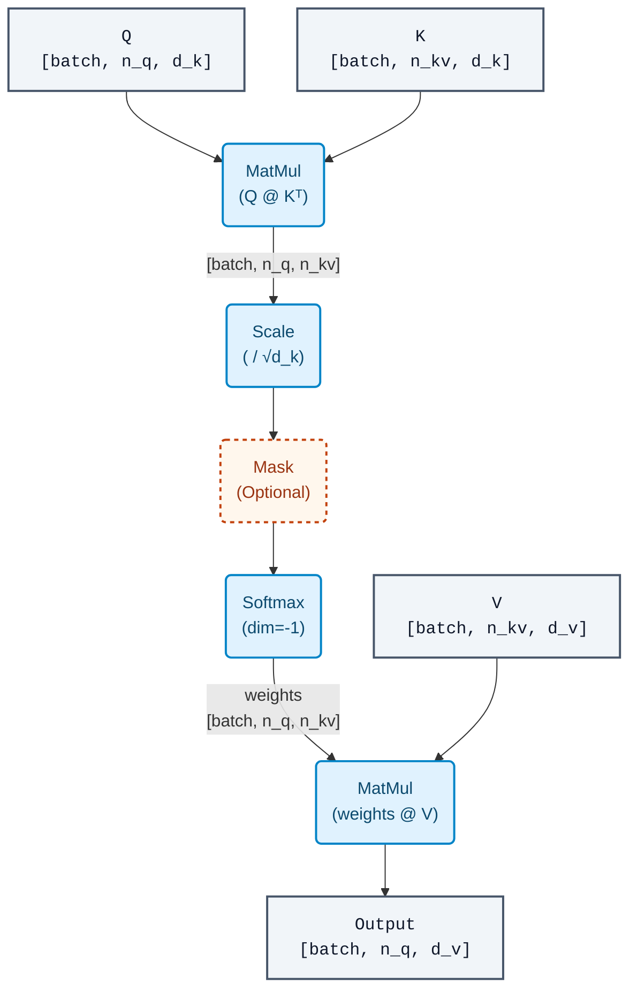
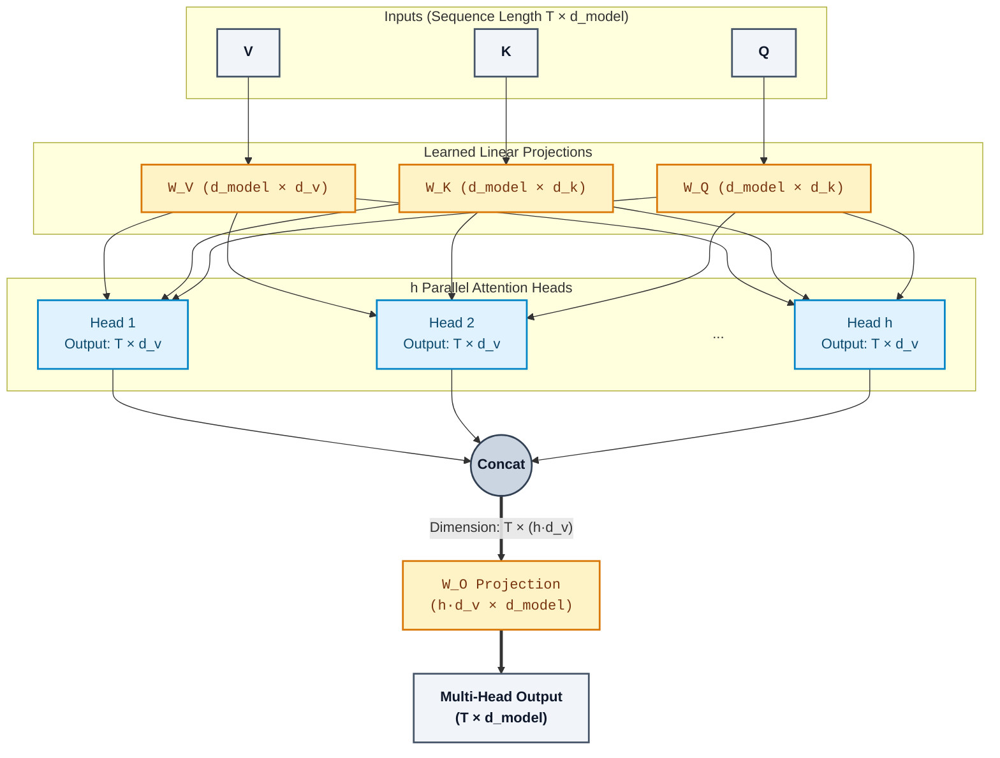
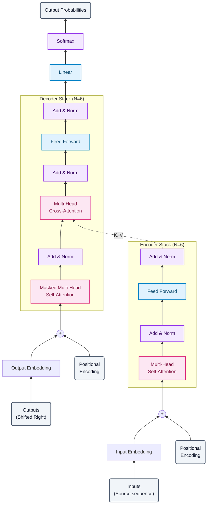
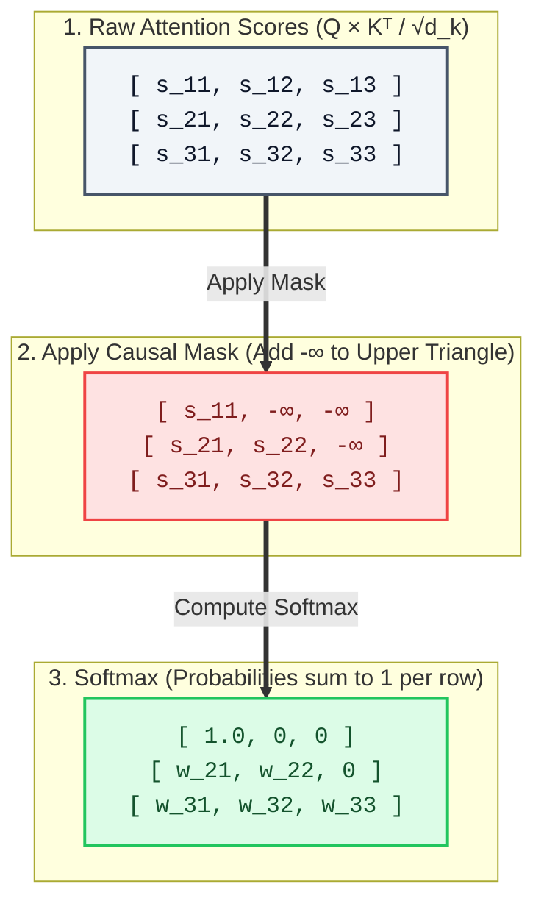
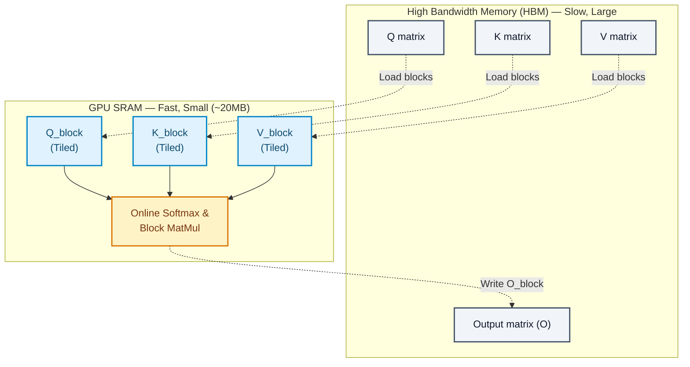

# Chapter 4: The Transformer — Attention Is All You Need

## 4.1 The Problem with Sequential Processing

By 2017, sequence-to-sequence models built on LSTMs and GRUs had become the dominant paradigm for machine translation, summarization, and language modeling. They worked. But they had a fundamental architectural bottleneck that no amount of engineering could fix.

Consider processing a sentence of length $n$. An RNN computes hidden states sequentially:

$$\mathbf{h}_t = f(\mathbf{h}_{t-1}, \mathbf{x}_t) \quad \text{for } t = 1, 2, \ldots, n$$

This creates three problems:

**Sequential dependency.** The computation of $\mathbf{h}_t$ depends on $\mathbf{h}_{t-1}$. You cannot compute $\mathbf{h}_{100}$ until you have computed $\mathbf{h}_{99}$. This means $O(n)$ sequential steps that cannot be parallelized. On modern GPUs — massively parallel processors with thousands of cores — this is a severe underutilization of hardware. Training time is dominated by the length of the longest sequence in the batch.

**Vanishing gradients.** To propagate gradient information from token $t$ back to token $1$, the gradient must flow through $t-1$ multiplicative steps. Even with LSTM's gating mechanisms, empirical gradient flow degrades over long distances. The effective receptive field is bounded. A token at position 500 has a weak gradient connection to position 1, regardless of what the theory says about LSTMs "solving" vanishing gradients. They mitigate it; they do not eliminate it.

**Information bottleneck.** In encoder-decoder architectures (Sutskever et al., 2014), the entire source sentence must be compressed into a single fixed-dimensional vector $\mathbf{h}_n$ before decoding begins. For a 50-word sentence, this might be fine. For a 500-word paragraph, you are asking a 1024-dimensional vector to faithfully represent every nuance of the input.

Bahdanau et al. (2015) partially addressed the third problem by introducing *attention* — allowing the decoder to look back at all encoder hidden states rather than just the final one. This was a significant advance, but the sequential computation bottleneck of the encoder and decoder remained.

The Transformer (Vaswani et al., 2017) asked a radical question: what if we remove recurrence entirely and build the entire model from attention?

---

## 4.2 Attention as a Database Query

The core mechanism of the Transformer is *scaled dot-product attention*. The cleanest way to understand it is as a soft dictionary lookup.

### 4.2.1 Hard vs. Soft Lookup

In a traditional key-value store (a hash map, a database), you have a query $q$, a set of keys $\{k_1, \ldots, k_n\}$, and corresponding values $\{v_1, \ldots, v_n\}$. You find the key that exactly matches your query, then return the associated value. This is a *hard* lookup — one match, one result.

Attention performs a *soft* lookup. Instead of finding one exact match, you compute a similarity score between your query and *every* key, normalize those scores into a probability distribution, and return the weighted sum of all values. Think of it as a fuzzy JOIN where every row contributes, weighted by relevance.

### 4.2.2 The Computation

Given:
- Queries $\mathbf{Q} \in \mathbb{R}^{n_q \times d_k}$ — what we are looking for
- Keys $\mathbf{K} \in \mathbb{R}^{n_{kv} \times d_k}$ — what each position advertises
- Values $\mathbf{V} \in \mathbb{R}^{n_{kv} \times d_v}$ — the content at each position

Scaled dot-product attention computes:

$$\text{Attention}(\mathbf{Q}, \mathbf{K}, \mathbf{V}) = \text{softmax}\!\left(\frac{\mathbf{Q}\mathbf{K}^\top}{\sqrt{d_k}}\right) \mathbf{V}$$

Step by step, with tensor shapes annotated:



Each query position produces a weighted combination of all value positions, where the weights are determined by the query-key similarity. In self-attention, $\mathbf{Q}$, $\mathbf{K}$, and $\mathbf{V}$ all derive from the same input sequence, so every token attends to every other token (including itself).

### 4.2.3 Why Scale by $\sqrt{d_k}$

This is not arbitrary. Consider the dot product of two random vectors $\mathbf{q}, \mathbf{k} \in \mathbb{R}^{d_k}$ where each component is drawn independently from $\mathcal{N}(0, 1)$.

The dot product $\mathbf{q} \cdot \mathbf{k} = \sum_{i=1}^{d_k} q_i k_i$ is a sum of $d_k$ independent terms, each with mean 0 and variance 1 (since $\text{Var}(q_i k_i) = \text{Var}(q_i)\text{Var}(k_i) = 1$, by independence and zero mean). Therefore:

$$\mathbb{E}[\mathbf{q} \cdot \mathbf{k}] = 0, \quad \text{Var}(\mathbf{q} \cdot \mathbf{k}) = d_k$$

So the standard deviation of the dot product grows as $\sqrt{d_k}$. For $d_k = 64$, the dot products have standard deviation 8. When you feed values with standard deviation 8 into a softmax, the distribution becomes extremely peaked — nearly one-hot. The softmax saturates, gradients vanish, and the model cannot learn smooth attention patterns.

Dividing by $\sqrt{d_k}$ normalizes the variance back to 1, keeping the softmax in a regime where gradients are healthy. This is a principled fix, not a hyperparameter.

---

## 4.3 Multi-Head Attention

A single attention function computes one set of weights — one "view" of how tokens relate. This is limiting. A token might need to simultaneously attend to a syntactic neighbor, a semantic synonym, and a coreference antecedent. One attention distribution cannot express all of these at once.

Multi-head attention runs $h$ independent attention functions in parallel, each operating on a different learned linear projection of the input:

$$\text{MultiHead}(\mathbf{Q}, \mathbf{K}, \mathbf{V}) = \text{Concat}(\text{head}_1, \ldots, \text{head}_h) \, \mathbf{W}^O$$

where each head is:

$$\text{head}_i = \text{Attention}(\mathbf{Q} \mathbf{W}_i^Q, \, \mathbf{K} \mathbf{W}_i^K, \, \mathbf{V} \mathbf{W}_i^V)$$

with projection matrices:
- $\mathbf{W}_i^Q \in \mathbb{R}^{d_{\text{model}} \times d_k}$
- $\mathbf{W}_i^K \in \mathbb{R}^{d_{\text{model}} \times d_k}$
- $\mathbf{W}_i^V \in \mathbb{R}^{d_{\text{model}} \times d_v}$
- $\mathbf{W}^O \in \mathbb{R}^{h \cdot d_v \times d_{\text{model}}}$

Vaswani et al. use $h = 8$ heads with $d_k = d_v = d_{\text{model}} / h = 64$ (for $d_{\text{model}} = 512$).



### 4.3.1 Parameter Count Analysis

Each head has three projection matrices of size $d_{\text{model}} \times d_k$, contributing $3 \times d_{\text{model}} \times d_k$ parameters. With $h$ heads, the total for projections is $3 \times h \times d_{\text{model}} \times d_k = 3 \times d_{\text{model}}^2$ (since $h \times d_k = d_{\text{model}}$). The output projection $\mathbf{W}^O$ adds another $d_{\text{model}}^2$.

Total parameters for one multi-head attention layer: $4 \, d_{\text{model}}^2$. For $d_{\text{model}} = 512$, that is $4 \times 512^2 \approx 1.05\text{M}$ parameters. This is the same cost as running a single head with the full $d_{\text{model}}$ dimensionality — multi-head attention adds representational capacity without additional parameter cost.

### 4.3.2 Pseudocode

```python
class MultiHeadAttention:
    def __init__(self, d_model, h):
        self.h = h
        self.d_k = d_model // h
        self.W_Q = Linear(d_model, d_model)  # Fused: all heads at once
        self.W_K = Linear(d_model, d_model)
        self.W_V = Linear(d_model, d_model)
        self.W_O = Linear(d_model, d_model)

    def forward(self, Q, K, V, mask=None):
        batch = Q.shape[0]

        # Project and reshape: [batch, seq, d_model] -> [batch, h, seq, d_k]
        Q = self.W_Q(Q).view(batch, -1, self.h, self.d_k).transpose(1, 2)
        K = self.W_K(K).view(batch, -1, self.h, self.d_k).transpose(1, 2)
        V = self.W_V(V).view(batch, -1, self.h, self.d_k).transpose(1, 2)

        # Scaled dot-product attention per head
        scores = Q @ K.transpose(-2, -1) / sqrt(self.d_k)  # [batch, h, n_q, n_kv]
        if mask is not None:
            scores = scores.masked_fill(mask == 0, -1e9)
        weights = softmax(scores, dim=-1)                   # [batch, h, n_q, n_kv]
        context = weights @ V                                # [batch, h, n_q, d_k]

        # Concatenate heads: [batch, n_q, d_model]
        context = context.transpose(1, 2).contiguous().view(batch, -1, self.h * self.d_k)

        return self.W_O(context)                             # [batch, n_q, d_model]
```

Each head learns to project queries, keys, and values into a different $d_k$-dimensional subspace. Empirically, different heads specialize: some track positional proximity, others track syntactic dependencies, others capture rare but semantically important long-range links.

---

## 4.4 The Full Transformer Architecture



The Transformer follows the encoder-decoder structure standard in sequence-to-sequence models. Both encoder and decoder are stacks of identical layers, but with different attention patterns.

### 4.4.1 Encoder

The encoder consists of $N = 6$ identical layers. Each layer has two sublayers:

1. **Multi-head self-attention.** Every token attends to every other token in the input sequence.
2. **Position-wise feed-forward network (FFN).** An independent two-layer MLP applied identically to each position.

Each sublayer is wrapped with a residual connection and layer normalization. The original Transformer paper used *post-norm* (normalize after the residual addition):

$$\text{sublayer output} = \text{LayerNorm}(\mathbf{x} + \text{Sublayer}(\mathbf{x})) \quad \text{(post-norm, original paper)}$$

However, most modern large models use *pre-norm* (normalize before the sublayer, with the residual bypassing the norm), which trains more stably:

$$\text{sublayer output} = \mathbf{x} + \text{Sublayer}(\text{LayerNorm}(\mathbf{x})) \quad \text{(pre-norm, modern standard)}$$

The pseudocode throughout this chapter implements pre-norm.

The feed-forward network is:

$$\text{FFN}(\mathbf{x}) = \text{ReLU}(\mathbf{x} \mathbf{W}_1 + \mathbf{b}_1) \mathbf{W}_2 + \mathbf{b}_2$$

where $\mathbf{W}_1 \in \mathbb{R}^{d_{\text{model}} \times d_{\text{ff}}}$, $\mathbf{W}_2 \in \mathbb{R}^{d_{\text{ff}} \times d_{\text{model}}}$, and $d_{\text{ff}} = 2048$ (4x expansion from $d_{\text{model}} = 512$).

A useful mental model: **attention is token-to-token communication** (each token gathers information from all other tokens), while **FFN is per-token computation** (each token independently processes the information it gathered). The encoder alternates between these two modes: communicate, compute, communicate, compute — six times.

FFN parameter count per layer: $2 \times d_{\text{model}} \times d_{\text{ff}} = 2 \times 512 \times 2048 \approx 2.1\text{M}$. This is roughly double the attention parameters, making the FFN the majority of the encoder's parameters.

### 4.4.2 Decoder

The decoder also has $N = 6$ identical layers, but each layer has three sublayers:

1. **Masked multi-head self-attention.** Tokens can only attend to previous positions (and themselves). This is enforced by setting the upper-triangular portion of the attention score matrix to $-\infty$ before softmax, producing zero weights for future positions. This preserves the autoregressive property: the prediction for position $t$ depends only on positions $1, \ldots, t$.



2. **Multi-head cross-attention.** Queries come from the decoder's previous sublayer; keys and values come from the encoder output. This is where the decoder "reads" the source sentence.

3. **Position-wise FFN.** Same architecture as the encoder's FFN.

Each sublayer again uses residual connections and layer normalization.

### 4.4.3 Residual Connections: Gradient Highways

The residual connection $y = \mathbf{x} + f(\mathbf{x})$ (He et al., 2016) solves a critical problem in deep networks. Without it, gradient must flow through every sublayer's nonlinearity. With it, there is always a direct additive path from any layer's output to any earlier layer's input. During backpropagation:

$$\frac{\partial y}{\partial \mathbf{x}} = \mathbf{I} + \frac{\partial f(\mathbf{x})}{\partial \mathbf{x}}$$

The identity term $\mathbf{I}$ guarantees that gradients can flow unimpeded even if $\frac{\partial f}{\partial \mathbf{x}}$ is small. This is what makes stacking 6+ layers feasible. Without residual connections, Transformers do not train.

### 4.4.4 LayerNorm vs. BatchNorm

Batch normalization (Ioffe and Szegedy, 2015) normalizes across the batch dimension: for each feature, compute mean and variance across all examples in the batch. This works well for CNNs but poorly for sequences because:

- Sequences have variable lengths, so computing batch statistics across the sequence dimension is ill-defined.
- At inference time with batch size 1, batch statistics are undefined (you must use running averages, which introduces train/test mismatch).

Layer normalization (Ba et al., 2016) normalizes across the feature dimension: for each token in each example, compute mean and variance across its $d_{\text{model}}$ features.

$$\text{LayerNorm}(\mathbf{x}) = \frac{\mathbf{x} - \mu}{\sigma + \epsilon} \odot \boldsymbol{\gamma} + \boldsymbol{\beta}$$

where $\mu, \sigma$ are computed per-token across the feature dimension, and $\boldsymbol{\gamma}, \boldsymbol{\beta} \in \mathbb{R}^{d_{\text{model}}}$ are learned affine parameters. This is independent of batch size and sequence length.

### 4.4.5 Full Encoder-Decoder Pseudocode

The following pseudocode implements *pre-norm*, which is the standard in most modern large models (see Section 4.4.1 for the distinction from the original paper's post-norm).

```python
class TransformerEncoder:
    def __init__(self, N, d_model, h, d_ff):
        self.layers = [EncoderLayer(d_model, h, d_ff) for _ in range(N)]
        self.norm = LayerNorm(d_model)

    def forward(self, x, mask):            # x: [batch, src_len, d_model]
        for layer in self.layers:
            x = layer(x, mask)
        return self.norm(x)                # [batch, src_len, d_model]

class EncoderLayer:
    def forward(self, x, mask):
        # Sublayer 1: self-attention (pre-norm)
        x = x + self.self_attn(self.norm1(x), self.norm1(x), self.norm1(x), mask)
        # Sublayer 2: FFN (pre-norm)
        x = x + self.ffn(self.norm2(x))
        return x

class TransformerDecoder:
    def __init__(self, N, d_model, h, d_ff):
        self.layers = [DecoderLayer(d_model, h, d_ff) for _ in range(N)]
        self.norm = LayerNorm(d_model)

    def forward(self, x, enc_output, src_mask, tgt_mask):
        for layer in self.layers:
            x = layer(x, enc_output, src_mask, tgt_mask)
        return self.norm(x)                # [batch, tgt_len, d_model]

class DecoderLayer:
    def forward(self, x, enc_output, src_mask, tgt_mask):
        # Sublayer 1: masked self-attention (pre-norm)
        x = x + self.self_attn(self.norm1(x), self.norm1(x), self.norm1(x), tgt_mask)
        # Sublayer 2: cross-attention (Q from decoder, K/V from encoder) (pre-norm)
        x = x + self.cross_attn(self.norm2(x), enc_output, enc_output, src_mask)
        # Sublayer 3: FFN (pre-norm)
        x = x + self.ffn(self.norm3(x))
        return x
```

---

## 4.5 Positional Encoding

### 4.5.1 Why Position Information Is Needed

Attention is *permutation-equivariant*. Given an input matrix $\mathbf{X} \in \mathbb{R}^{n \times d}$ and any permutation matrix $\mathbf{P}$:

$$\text{Attention}(\mathbf{P}\mathbf{X}, \mathbf{P}\mathbf{X}, \mathbf{P}\mathbf{X}) = \mathbf{P} \cdot \text{Attention}(\mathbf{X}, \mathbf{X}, \mathbf{X})$$

Proof sketch: $\mathbf{Q}\mathbf{K}^\top = (\mathbf{P}\mathbf{X} \mathbf{W}^Q)(\mathbf{P}\mathbf{X} \mathbf{W}^K)^\top = \mathbf{P}(\mathbf{X}\mathbf{W}^Q)(\mathbf{X}\mathbf{W}^K)^\top \mathbf{P}^\top = \mathbf{P} \, \mathbf{S} \, \mathbf{P}^\top$, where $\mathbf{S}$ is the original score matrix. After softmax (applied row-wise), the result is $\mathbf{P} \, \text{softmax}(\mathbf{S}) \, \mathbf{P}^\top$. Multiplying by $\mathbf{V} = \mathbf{P}\mathbf{X}\mathbf{W}^V$ gives $\mathbf{P} \, \text{softmax}(\mathbf{S}) \, \mathbf{X}\mathbf{W}^V = \mathbf{P} \cdot \text{Attention}(\mathbf{X}, \mathbf{X}, \mathbf{X})$.

This means the self-attention layer treats the input as a *set*, not a sequence. Without positional information, "the cat sat on the mat" and "mat the on sat cat the" produce equivalent outputs (up to the same permutation). We must inject position information explicitly.

### 4.5.2 Sinusoidal Encoding (Vaswani et al., 2017)

The original Transformer adds a fixed positional encoding to the input embeddings:

$$PE_{(pos, 2i)} = \sin\!\left(\frac{pos}{10000^{2i/d_{\text{model}}}}\right)$$

$$PE_{(pos, 2i+1)} = \cos\!\left(\frac{pos}{10000^{2i/d_{\text{model}}}}\right)$$

where $pos$ is the position index and $i$ is the dimension index. Each dimension oscillates at a different frequency. Lower dimensions (small $i$) have high frequency and short wavelength; higher dimensions (large $i$) have low frequency and long wavelength. Concretely, the wavelengths range from $2\pi$ (for $i=0$, shortest wavelength / highest frequency) to $10000 \cdot 2\pi$ (for $i = d_{\text{model}}/2 - 1$, longest wavelength / lowest frequency). Note that $10000$ controls the longest wavelength, not a frequency — higher dimensions oscillate more slowly, allowing the model to encode coarse positional differences.

The key property: for any fixed offset $k$, the mapping $PE_{pos} \mapsto PE_{pos+k}$ can be represented as a linear transformation. This means the model can learn to attend to relative positions through linear operations on these encodings. The sinusoidal choice also generalizes to sequence lengths longer than those seen during training, since the functions are defined for any $pos$.

### 4.5.3 Learned Positional Embeddings

An alternative: learn a position embedding matrix $\mathbf{E}_{\text{pos}} \in \mathbb{R}^{L_{\max} \times d_{\text{model}}}$ where $L_{\max}$ is the maximum sequence length. This is a standard embedding lookup. Vaswani et al. found nearly identical performance to sinusoidal encodings. GPT-2 and BERT both use learned positional embeddings.

The downside: no extrapolation beyond $L_{\max}$. If you train with $L_{\max} = 512$, you cannot process position 513.

### 4.5.4 Rotary Position Embeddings (RoPE)

Su et al. (2021) proposed encoding position by *rotating* the query and key vectors in 2D subspaces. For a pair of dimensions $(2i, 2i+1)$, the rotation for position $m$ is:

$$\begin{pmatrix} q_{2i}^{(m)} \\ q_{2i+1}^{(m)} \end{pmatrix} = \begin{pmatrix} \cos m\theta_i & -\sin m\theta_i \\ \sin m\theta_i & \cos m\theta_i \end{pmatrix} \begin{pmatrix} q_{2i} \\ q_{2i+1} \end{pmatrix}$$

where $\theta_i = 10000^{-2i/d}$. The same rotation is applied to keys. The critical insight: the dot product between the rotated query at position $m$ and the rotated key at position $n$ depends only on the *relative* position $m - n$:

$$(\mathbf{R}_m \mathbf{q})^\top (\mathbf{R}_n \mathbf{k}) = \mathbf{q}^\top \mathbf{R}_m^\top \mathbf{R}_n \, \mathbf{k} = \mathbf{q}^\top \mathbf{R}_{n-m} \, \mathbf{k}$$

since rotation matrices satisfy $\mathbf{R}_m^\top \mathbf{R}_n = \mathbf{R}_{n-m}$.

RoPE encodes *relative* position without requiring explicit relative position biases, applies naturally to any sequence length, and has become the standard in modern LLMs (LLaMA, PaLM, etc.).

### 4.5.5 Relative Position Representations

Shaw et al. (2018) proposed adding learned relative position biases directly to the attention scores:

$$e_{ij} = \frac{(\mathbf{x}_i \mathbf{W}^Q)(\mathbf{x}_j \mathbf{W}^K + \mathbf{a}_{i-j}^K)^\top}{\sqrt{d_k}}$$

where $\mathbf{a}_{i-j}^K$ is a learned embedding indexed by the relative position $i - j$, typically clipped to some maximum distance. This approach is conceptually clean but adds complexity to the attention computation and requires modification of the attention kernel.

---

## 4.6 Training Details

Vaswani et al. trained their base model on the WMT 2014 English-German and English-French translation tasks.

### 4.6.1 Optimizer and Learning Rate Schedule

They used Adam ($\beta_1 = 0.9$, $\beta_2 = 0.98$, $\epsilon = 10^{-9}$) with a custom learning rate schedule:

$$\text{lr} = d_{\text{model}}^{-0.5} \cdot \min(\text{step}^{-0.5}, \, \text{step} \cdot \text{warmup\_steps}^{-1.5})$$

This produces a linear warmup for the first $\text{warmup\_steps}$ steps (4000 in the paper), followed by inverse-square-root decay. The warmup is critical: without it, the large initial gradient updates (before the model has learned meaningful attention patterns) can destabilize training. Adam's moment estimates need time to calibrate, and warmup gives them that time.

### 4.6.2 Regularization

**Dropout.** Applied to attention weights, sublayer outputs, and the sum of embeddings + positional encodings. Rate: $P_{\text{drop}} = 0.1$ for the base model, $0.3$ for the big model.

**Label smoothing.** Instead of training against hard one-hot targets, they use a smoothed distribution: $\epsilon_{\text{ls}} = 0.1$. For a vocabulary of size $V$, the target for the correct class becomes $1 - \epsilon_{\text{ls}} + \epsilon_{\text{ls}}/V \approx 0.9$, and each incorrect class gets $\epsilon_{\text{ls}}/V \approx 0.0000027$ (for the WMT vocabulary of $V \approx 37{,}000$ subword units). This hurts perplexity (which measures confidence in the correct answer) but improves BLEU score (which measures translation quality) by preventing the model from becoming overconfident. The model assigns more probability mass to plausible alternatives, producing better-calibrated output distributions.

### 4.6.3 Results

On WMT 2014 English-to-German: **28.4 BLEU** (big model), surpassing the previous best ensemble by 2+ BLEU points. On English-to-French: **41.0 BLEU**, exceeding all prior single models.

Training time for the base model: 12 hours on 8 P100 GPUs ($\sim$0.5 days). The big model took 3.5 days. For comparison, the best LSTM-based systems required weeks of training. The parallelism of attention made wall-clock training dramatically faster even though the total compute (FLOPs) was comparable.

---

## 4.7 Complexity Analysis

### 4.7.1 Self-Attention Is $O(n^2)$ in Sequence Length

The attention score matrix $\mathbf{Q}\mathbf{K}^\top$ has shape $[n, n]$, where $n$ is the sequence length. Computing it requires $O(n^2 d)$ operations, and storing it requires $O(n^2)$ memory (per head).

For $n = 512$ (original Transformer), this is manageable: $512^2 = 262\text{K}$ entries per head. For $n = 2048$ (GPT-2), it is $\sim$4M entries. For $n = 32768$ (long-context models), it is $\sim$1 billion entries. The quadratic scaling becomes the dominant bottleneck for long sequences.

Comparison with RNNs: a recurrent layer has $O(n \cdot d^2)$ computation and $O(1)$ memory per step (not counting the hidden state history). For short sequences where $n < d$, self-attention is actually cheaper. The crossover point is approximately $n \approx d$. For typical $d = 512\text{--}1024$ and $n > 1024$, the quadratic cost of attention dominates.

### 4.7.2 Efficient Attention Variants

**Sparse Attention (Child et al., 2019).** Instead of attending to all $n$ positions, each token attends to a sparse subset: a combination of local neighbors (a sliding window) and strided positions. This reduces the effective attention from $O(n^2)$ to $O(n\sqrt{n})$. The key insight is that full dense attention is often unnecessary — attention weights are typically concentrated on a small fraction of positions.

**FlashAttention (Dao et al., 2022).** The $O(n^2)$ memory bottleneck is not inherent to the algorithm — it comes from materializing the full $n \times n$ attention matrix. FlashAttention computes attention in a *tiled* fashion, processing blocks of the attention matrix that fit in GPU SRAM (fast on-chip memory) rather than reading/writing the full matrix to HBM (slow off-chip memory).



The core technique: for each block of queries, iterate over blocks of keys/values, computing partial softmax results and accumulating them using the *online softmax* trick (which avoids needing the full row of scores to compute the normalization constant). This reduces HBM reads/writes from $O(n^2)$ to $O(n^2 d / M)$ where $M$ is the SRAM size and $d$ is the head dimension. Although $O(n^2 d / M)$ appears to be *larger* than $O(n^2)$ at first glance, the key is that $d/M \ll 1$: typical head dimensions are $d = 64$ or $128$, while SRAM is tens of megabytes, so the factor $d/M$ can be on the order of $10^{-5}$. This achieves 2-4x wall-clock speedup for typical sequence lengths with *exact* attention (no approximation).

FlashAttention is now the default attention implementation in most production Transformer training. It is a pure systems optimization — the mathematical computation is identical, but the memory access pattern is fundamentally different.

**Linear attention, Performer, and related methods** attempt to decompose the softmax attention kernel to achieve $O(n)$ scaling, but typically trade off model quality. As of this writing, exact attention with FlashAttention remains dominant for high-quality models, with sparse attention used primarily for very long context windows (100K+ tokens).

---

## 4.8 Why the Transformer Worked

The Transformer's success was not just about attention. Several properties combined to make it the dominant architecture:

**Parallelism.** Self-attention processes all positions simultaneously. Training on GPUs went from being bottlenecked by sequence length to being bottlenecked by total compute. This meant that, in the ideal case, doubling GPUs approximately halved training time — a property RNNs fundamentally lacked.

**Direct long-range connections.** In an RNN, information from token 1 must traverse $n-1$ sequential steps to reach token $n$. In a Transformer, every token is one attention step away from every other token. The maximum path length between any two positions is $O(1)$ per layer. This is not just a theoretical property — it manifests as empirically better performance on tasks requiring long-range dependencies (coreference, document-level reasoning, code understanding with distant variable definitions).

**Scalability.** The architecture scales cleanly with compute. You can add layers, increase $d_{\text{model}}$, add heads — and performance improves predictably. This property is what enabled the scaling laws (Kaplan et al., 2020) discussed in Chapter 5. RNNs, with their sequential bottleneck, hit diminishing returns from additional compute much earlier.

**Modularity.** The encoder-decoder structure can be decomposed. Use just the encoder for classification (BERT). Use just the decoder for generation (GPT). Use neither and replace the architecture entirely with cross-attention between different modalities (ViT, Flamingo, DALL-E). The attention mechanism is a general-purpose differentiable communication primitive that transfers across domains.

**Hardware alignment.** Matrix multiplications — the core operation of attention — are exactly what modern GPUs and TPUs are optimized for. The transition from sequential RNN operations to batched matrix multiplies aligned the architecture with hardware trends. As accelerator FLOPS grew exponentially, Transformers captured that growth directly.

---

## 4.9 Connections Forward

The Transformer is the foundation for nearly everything that follows in this book.

**Language models (Chapter 5).** GPT (Radford et al., 2018) uses a decoder-only Transformer for autoregressive language modeling — predicting the next token. BERT (Devlin et al., 2019) uses an encoder-only Transformer with masked language modeling. The architectural modifications are minimal; the revolution is in training objective and scale.

**Vision Transformers (Chapter 6).** ViT (Dosovitskiy et al., 2020) splits images into 16x16 patches, treats each patch as a "token," and feeds them into a standard Transformer encoder. This collapses the distinction between vision and language architectures, enabling VLMs like CLIP and LLaVA that process both modalities with shared or parallel Transformer stacks.

**Diffusion models (Chapter 8).** The U-Net architecture commonly used in latent diffusion models (notably Stable Diffusion) incorporates Transformer cross-attention blocks for conditioning on text. DALL-E 2 uses a different architecture — a CLIP text encoder, a diffusion prior that maps CLIP text embeddings to image embeddings, and an unCLIP decoder. DiT (Peebles and Xie, 2023) replaces the U-Net entirely with a Transformer, applying it directly to image latent patches.

**Reinforcement learning.** The Decision Transformer (Chen et al., 2021) reframes RL as sequence modeling: given a trajectory of (return-to-go, state, action) tokens, predict the next action autoregressively. This eliminates the need for value functions and Bellman backups entirely, replacing them with the Transformer's general-purpose sequence modeling capability. This is a direct bridge between the Transformer architecture and the RL topics in later chapters.

The Transformer is not the final architecture — state-space models (Mamba), mixture-of-experts, and other approaches are active research areas. But understanding the Transformer is not optional. It is the reference point against which everything else is measured.

---

## 4.10 Summary

| Component | Purpose | Complexity |
|---|---|---|
| Scaled dot-product attention | Soft dictionary lookup between all token pairs | $O(n^2 d)$ |
| Multi-head attention | Parallel attention in $h$ subspaces | Same total as single head |
| Position-wise FFN | Per-token nonlinear computation | $O(n \cdot d \cdot d_{\text{ff}})$ |
| Residual connections | Gradient flow through deep stacks | No additional FLOPs |
| Layer normalization | Training stability per token | $O(n \cdot d)$ |
| Positional encoding | Inject sequence order into a permutation-equivariant architecture | Varies by method |

The Transformer replaced recurrence with attention, trading sequential computation for parallelism and direct long-range connections. The $O(n^2)$ cost is real but manageable through systems optimizations (FlashAttention) and sparse patterns. The architecture's modularity and scalability made it the universal backbone for modern AI.

---

## 4.11 Beyond Attention: State Space Models and Mamba

### 4.11.1 What If We Did Not Need Attention at All?

The preceding sections built the case for the Transformer: attention enables parallel training, direct long-range connections, and clean scalability. But attention has a fundamental cost that no systems optimization can eliminate. The $\mathbf{Q}\mathbf{K}^\top$ matrix has $n^2$ entries. FlashAttention reduces the *memory* footprint, but the *computation* remains $O(n^2 d)$ in sequence length $n$. For a 4,096-token context, this is tolerable. For 100,000 tokens — an entire codebase, a legal contract, an hour of audio — the quadratic cost becomes the dominant training and inference bottleneck.

This observation led a subset of the research community to revisit an old idea: what if we returned to recurrence, but did it correctly this time? Not the ad hoc gating of LSTMs and GRUs, but recurrence grounded in continuous-time dynamical systems — specifically, *state space models* (SSMs). The result is a family of architectures that achieve $O(n)$ scaling in sequence length while matching or approaching Transformer quality on many benchmarks. The most prominent of these is Mamba (Gu & Dao, 2023).

This section traces the line of research from classical state space models through S4 and HiPPO to Mamba and its successors, then examines how hybrid architectures combine the strengths of both paradigms.

### 4.11.2 State Space Models: From Control Theory to Sequence Modeling

A *linear time-invariant* (LTI) state space model is a standard object in control theory and signal processing. It maps a continuous-time input signal $x(t) \in \mathbb{R}$ to an output signal $y(t) \in \mathbb{R}$ through a latent state $\mathbf{h}(t) \in \mathbb{R}^N$:

$$\mathbf{h}'(t) = \mathbf{A}\mathbf{h}(t) + \mathbf{B}x(t)$$
$$y(t) = \mathbf{C}\mathbf{h}(t) + Dx(t)$$

where $\mathbf{A} \in \mathbb{R}^{N \times N}$ is the *state matrix* governing the dynamics of the hidden state, $\mathbf{B} \in \mathbb{R}^{N \times 1}$ controls how input enters the state, $\mathbf{C} \in \mathbb{R}^{1 \times N}$ reads from the state to produce output, and $D \in \mathbb{R}$ is a direct feed-through (skip connection) from input to output.

If you have a background in signal processing, you will recognize this immediately: the SSM is a *learned infinite impulse response (IIR) filter*. The state $\mathbf{h}(t)$ acts as a memory that integrates over the entire input history with exponentially decaying weights determined by the eigenvalues of $\mathbf{A}$. Unlike a finite impulse response (FIR) filter — which looks at a fixed window of past inputs — the IIR filter's response extends, in principle, infinitely into the past. The matrix $\mathbf{A}$ determines the filter's poles, and learning $\mathbf{A}$ is equivalent to learning the filter's frequency response.

Alternatively, if you think in terms of neural networks: this is a *continuous-time linear RNN*. The hidden state evolves according to a first-order ODE rather than a discrete recurrence. Setting $D = 0$ and discretizing with Euler's method at step size $\Delta$ yields:

$$\mathbf{h}_k = (\mathbf{I} + \Delta \mathbf{A})\mathbf{h}_{k-1} + \Delta \mathbf{B} x_k$$
$$y_k = \mathbf{C}\mathbf{h}_k$$

This is precisely a linear RNN with transition matrix $\bar{\mathbf{A}} = \mathbf{I} + \Delta \mathbf{A}$ and input matrix $\bar{\mathbf{B}} = \Delta \mathbf{B}$. The continuous-time formulation is not merely aesthetic — it provides a principled framework for initialization (Section 4.11.3) and enables the *dual* computation modes that make SSMs practical (Section 4.11.4).

### 4.11.3 HiPPO: How to Initialize State Dynamics

The matrix $\mathbf{A}$ is the most important component of a state space model. It determines how the hidden state integrates past inputs — which information is retained, which is forgotten, and at what timescales. A random initialization of $\mathbf{A}$ performs poorly because the eigenvalues may cause the state to either explode (eigenvalues with positive real part) or forget too quickly (eigenvalues with large negative real part).

Gu et al. (2020) introduced the *HiPPO* (High-order Polynomial Projection Operators) framework, which derives $\mathbf{A}$ analytically from a specific objective: at every time $t$, the hidden state $\mathbf{h}(t)$ should optimally approximate the *history* of the input signal $x(\tau)$ for $\tau \leq t$ by projecting it onto a basis of orthogonal polynomials.

The most important instance is HiPPO-LegS (Legendre Scaled), which maintains a running projection onto scaled Legendre polynomials over the interval $[0, t]$. The resulting state matrix has entries:

$$A_{nk} = \begin{cases} -(2n+1)^{1/2}(2k+1)^{1/2} & \text{if } n > k \\ -(n+1) & \text{if } n = k \\ 0 & \text{if } n < k \end{cases}$$

This matrix has two crucial properties. First, it is *stable*: all eigenvalues have negative real parts, so the state does not explode. Second, it provides *uniform approximation* of the input history — the state encodes both recent and distant inputs without the exponential decay that plagues vanilla RNNs. In practice, initializing $\mathbf{A}$ with the HiPPO matrix and then allowing the model to fine-tune it through gradient descent yields dramatically better long-range dependency modeling than random initialization.

The analogy to software engineering is initialization as *prior knowledge baked into architecture*. Just as Xavier/He initialization (Chapter 2) sets weight scales to preserve gradient magnitudes, HiPPO initialization sets the state dynamics to preserve input history. The principle is the same: structure the initial conditions so that gradient descent starts in a productive region of parameter space.

### 4.11.4 S4: Structured State Spaces for Sequences

The Structured State Space for Sequences model (S4; Gu et al., 2022) made SSMs practical for deep learning by solving two problems: computational efficiency and numerical stability.

**The efficiency problem.** A naive implementation of the discretized SSM processes tokens sequentially — exactly the $O(n)$ sequential bottleneck that the Transformer was designed to avoid. However, because the LTI system is *linear*, the SSM has a dual representation as a *convolution*. Unrolling the recurrence:

$$y_k = \mathbf{C}\bar{\mathbf{A}}^k \bar{\mathbf{B}} x_0 + \mathbf{C}\bar{\mathbf{A}}^{k-1}\bar{\mathbf{B}} x_1 + \cdots + \mathbf{C}\bar{\mathbf{B}} x_k$$

This is a standard (non-circular) convolution $y = \bar{K} * x$ with kernel:

$$\bar{K}_j = \mathbf{C}\bar{\mathbf{A}}^j \bar{\mathbf{B}}, \quad j = 0, 1, \ldots, n-1$$

Once the kernel $\bar{K}$ is precomputed, the convolution can be executed in $O(n \log n)$ time using the Fast Fourier Transform (FFT). This is the key insight: during *training*, the SSM operates as a global convolution (parallelizable, like attention), while during *inference*, it operates as a recurrence (constant memory per step, unlike attention's growing KV cache).

**The stability problem.** Computing $\bar{\mathbf{A}}^j$ for large $j$ is numerically unstable unless the state matrix has specific structure. S4 restricts $\mathbf{A}$ to be *diagonal plus low-rank* (DPLR), which admits closed-form computation of the convolution kernel via the Cauchy kernel trick. Subsequent work (S4D; Gu et al., 2022b) simplified this further by restricting $\mathbf{A}$ to be purely diagonal in complex space. Each diagonal entry $a_i \in \mathbb{C}$ governs an independent one-dimensional state that decays at rate $\text{Re}(a_i)$ and oscillates at frequency $\text{Im}(a_i)$. The full state dynamics decompose into $N$ independent damped oscillators — simple to implement, stable to compute, and embarrassingly parallel.

**S4 results.** S4 achieved breakthrough performance on the Long Range Arena benchmark, a suite of tasks specifically designed to test long-range dependency modeling at sequence lengths of 1,024 to 16,384. On the Path-X task (classifying whether two points on a 128x128 image are connected by a path — a sequence of 16,384 tokens), S4 achieved 94% accuracy where Transformers failed to exceed random chance. This demonstrated that the SSM's $O(n)$ scaling was not merely an efficiency gain — it enabled modeling of dependencies at lengths where the quadratic cost of attention was prohibitive.

### 4.11.5 Mamba: Selective State Spaces

S4 had a significant limitation: the state dynamics are *time-invariant*. The matrices $\mathbf{A}$, $\mathbf{B}$, $\mathbf{C}$ are fixed regardless of the input. This means the model applies the same linear filter to every sequence, regardless of content. It cannot, for instance, decide to "pay more attention" to a particular token based on what that token contains. In Transformer terms, S4 is like attention with fixed, data-independent weights — a substantial expressiveness bottleneck.

Mamba (Gu & Dao, 2023) removed this limitation by making the SSM parameters *input-dependent*. Specifically, $\mathbf{B}$, $\mathbf{C}$, and the discretization step size $\Delta$ are computed as functions of the current input:

$$\mathbf{B}_k = \text{Linear}_B(\mathbf{x}_k), \quad \mathbf{C}_k = \text{Linear}_C(\mathbf{x}_k), \quad \Delta_k = \text{softplus}(\text{Linear}_\Delta(\mathbf{x}_k))$$

The step size $\Delta_k$ is particularly important. It controls how much of the current input is incorporated into the state versus how much the state retains from the past. A large $\Delta_k$ means "write this input strongly into memory"; a small $\Delta_k$ means "retain existing memory and largely ignore this input." This is the *selection mechanism* — the model dynamically gates which inputs to remember and which to skip, analogous to the forget gate in an LSTM but derived from the continuous-time SSM framework.

The selection mechanism has a critical consequence for computation: with input-dependent parameters, the system is no longer time-invariant, and the convolution representation from Section 4.11.4 no longer applies. Mamba cannot use the FFT trick. Instead, Gu and Dao developed a *hardware-aware parallel scan* algorithm that computes the selective SSM recurrence in $O(n)$ work with $O(\log n)$ parallel depth, carefully orchestrating data movement between GPU HBM and SRAM — the same IO-awareness principle behind FlashAttention, applied to the recurrence rather than to attention.

The Mamba architecture wraps the selective SSM in a simplified block design:

```
Input x: [batch, seq_len, d_model]
    |-- Linear projection -> [batch, seq_len, d_inner]  (expand)
    |       |-- 1D causal convolution (short kernel, e.g., k=4)
    |       |-- SiLU activation
    |       +-- Selective SSM
    |-- Linear projection -> [batch, seq_len, d_inner]  (gate)
    |       +-- SiLU activation
    +-- Element-wise multiply (gated output)
            +-- Linear projection -> [batch, seq_len, d_model]  (contract)
```

There is no attention sublayer and no MLP sublayer in the traditional sense. The entire block combines gating, convolution, and the selective state space into a single fused unit. The 1D causal convolution with a short kernel (typically 4) captures local patterns, while the SSM handles long-range dependencies.

**Mamba results.** Mamba matched or exceeded Transformer quality on language modeling at scales up to 2.8B parameters, with significantly better throughput. On a 1.4B parameter model, Mamba achieved the same perplexity as a Transformer++ baseline (a Transformer with modern improvements such as RMSNorm, SwiGLU, and RoPE) while generating tokens 3-5x faster at long sequence lengths, because inference requires no KV cache — only the fixed-size state $\mathbf{h} \in \mathbb{R}^{N}$ is carried forward.

### 4.11.6 Mamba-2: Structured State Space Duality

A natural question arose after Mamba: what is the precise relationship between selective state spaces and attention? Mamba-2 (Dao & Gu, 2024) answered this by proving a formal duality between the two.

The key result: a selective SSM with scalar-valued states and diagonal structure is mathematically equivalent to a form of *linear attention* with a specific *structured mask*. More precisely, the SSM output can be written as a matrix multiplication $\mathbf{y} = \mathbf{M} \mathbf{x}$, where $\mathbf{M}$ is a *semiseparable matrix* — a structured matrix whose $(i,j)$ entry for $i \geq j$ factors as $\mathbf{C}_i^\top \left(\prod_{k=j+1}^{i} \bar{\mathbf{A}}_k\right) \bar{\mathbf{B}}_j$. This is the SSM's analogue of the attention score matrix, but with structure imposed by the state dynamics. The products of $\bar{\mathbf{A}}_k$ terms enforce a form of *causal decay* — distant tokens contribute less unless the state dynamics explicitly preserve them.

This duality is not merely theoretical. It implies that SSMs and attention are two instantiations of a common algebraic framework, and that one can interpolate between them. Mamba-2 exploits this by using larger head dimensions (matching multi-head attention conventions) and a block-decomposition algorithm that processes chunks of the sequence with matrix multiplications (the "attention-like" view) while connecting chunks via the recurrence (the "SSM-like" view). The result is 2-8x faster training throughput than Mamba-1 at the same model quality.

### 4.11.7 Hybrid Architectures: Jamba and the Emerging Consensus

Pure SSM architectures and pure Transformer architectures each have distinct strengths and weaknesses. Attention excels at *in-context retrieval* — tasks that require a token at position $k$ to look up specific information deposited at position $j$, such as copying a name mentioned earlier in a document, or performing few-shot learning from examples in the prompt. The explicit $\mathbf{Q}\mathbf{K}^\top$ lookup is well-suited to this: the model can learn to match a query against all keys and retrieve the corresponding value. SSMs, by contrast, compress history into a fixed-size state vector, which makes precise retrieval of specific tokens harder — analogous to the information bottleneck of RNN encoder-decoder models that motivated attention in the first place (Section 4.1).

Conversely, SSMs excel at tasks requiring *smooth integration* over long contexts: summarization, perplexity modeling over long documents, and tasks where the relevant information is distributed across the entire sequence rather than concentrated at specific positions. The $O(n)$ cost and constant-memory inference also make SSMs strictly superior for deployment at very long context lengths.

This complementarity led to *hybrid* architectures that interleave attention and SSM layers. Jamba (Lieber et al., 2024) from AI21 Labs is the most prominent example. Jamba interleaves Mamba layers with Transformer attention layers in a ratio of approximately 7:1 (seven Mamba layers per one attention layer), and further incorporates mixture-of-experts (MoE) on the feed-forward components. The design rationale is explicit: use cheap Mamba layers for the bulk of the computation and insert sparse attention layers where in-context retrieval is needed.

At 52B total parameters (12B active due to MoE), Jamba fits on a single 80GB GPU while supporting context lengths up to 256K tokens — a regime where a pure Transformer of equivalent quality would require multiple GPUs for the KV cache alone. The hybrid approach captures the best of both worlds: the attention layers provide retrieval capability, and the Mamba layers provide efficient long-range modeling.

The emerging consensus in the field, as of this writing, is that the future likely belongs to hybrid architectures rather than to either paradigm in isolation.

### 4.11.8 Advantages, Limitations, and Open Questions

**Key advantages of SSMs:**

- **$O(n)$ time and memory.** Both training (via convolution or parallel scan) and inference (via recurrence) scale linearly in sequence length. There is no quadratic bottleneck.
- **No KV cache.** During autoregressive generation, a Transformer must store key and value vectors for every past token at every layer — the KV cache grows as $O(n \cdot L \cdot d)$ where $L$ is the number of layers. An SSM carries only the fixed-size state $\mathbf{h} \in \mathbb{R}^N$, independent of sequence length. For long-context deployment, this difference dominates memory cost.
- **Principled long-range modeling.** The HiPPO initialization and continuous-time formulation provide a theoretically grounded approach to long-range dependencies, in contrast to attention's brute-force pairwise comparison.
- **Dual computation modes.** The same model can operate as a convolution (training) or a recurrence (inference), choosing whichever is more efficient for the hardware and use case.

**Key limitations:**

- **In-context retrieval.** As discussed in Section 4.11.7, the fixed-size state creates an information bottleneck for tasks requiring exact recall of specific tokens from the context. Attention's explicit lookup mechanism remains superior for these tasks.
- **Attention still dominates at scale.** As of this writing, the largest and most capable language models (GPT-4, Claude, Gemini) remain primarily Transformer-based. SSMs have demonstrated competitive quality at scales up to tens of billions of parameters, but the scaling behavior at hundreds of billions and beyond is less established.
- **Ecosystem maturity.** Transformers benefit from nearly a decade of engineering investment: optimized kernels (FlashAttention, cuBLAS), serving infrastructure, quantization techniques, and extensive empirical knowledge about training dynamics. The SSM ecosystem is younger and less optimized, though this gap is closing rapidly.
- **Theoretical understanding.** Despite the duality results of Mamba-2, the question of *which inductive biases are better for which tasks* remains incompletely answered. The field does not yet have a clean characterization of when attention is necessary and when it is wasteful.

The state space model line of research demonstrates a broader lesson: architectural innovation in deep learning is rarely a linear progression. The field moved from recurrence (RNNs) to attention (Transformers) and is now circling back to a structured form of recurrence informed by continuous-time dynamics and control theory. Each iteration incorporates the lessons of the previous one — and the most practical outcome may be architectures that combine both.

---

## Summary

- The Transformer replaces recurrence with self-attention, eliminating the sequential bottleneck of RNNs and enabling full parallelization across sequence positions during training.
- Scaled dot-product attention performs a soft dictionary lookup: each query computes similarity with all keys, normalizes via softmax, and returns a weighted sum of values. Scaling by $1/\sqrt{d_k}$ prevents softmax saturation.
- Multi-head attention runs $h$ independent attention functions in parallel subspaces, enabling the model to simultaneously capture syntactic, semantic, and positional relationships. The total parameter cost equals that of a single full-dimensional head.
- The encoder-decoder architecture alternates between token-to-token communication (attention) and per-token computation (FFN), with residual connections and layer normalization ensuring stable gradient flow through deep stacks.
- Positional encodings are necessary because attention is permutation-equivariant. Sinusoidal encodings support relative position via linear transformations; RoPE encodes relative position through query-key rotations and has become the modern standard.
- The $O(n^2)$ cost of self-attention in sequence length is the architecture's primary scaling limitation. FlashAttention reduces memory via tiled computation without approximation; sparse attention patterns reduce computation for very long contexts.
- State space models (S4, Mamba) achieve $O(n)$ scaling by replacing attention with structured recurrence derived from continuous-time dynamical systems. Mamba's selective state spaces make parameters input-dependent, recovering much of attention's expressiveness.
- Hybrid architectures (Jamba) interleave attention and SSM layers, using cheap Mamba layers for bulk computation and sparse attention layers where in-context retrieval is required, capturing the strengths of both paradigms.

---

## Key Equations Reference

| Name | Equation | Section |
|---|---|---|
| Scaled dot-product attention | $\text{Attention}(\mathbf{Q}, \mathbf{K}, \mathbf{V}) = \text{softmax}\!\left(\frac{\mathbf{Q}\mathbf{K}^\top}{\sqrt{d_k}}\right)\mathbf{V}$ | 4.2.2 |
| Multi-head attention | $\text{MultiHead} = \text{Concat}(\text{head}_1, \ldots, \text{head}_h)\,\mathbf{W}^O$ | 4.3 |
| Feed-forward network | $\text{FFN}(\mathbf{x}) = \text{ReLU}(\mathbf{x}\mathbf{W}_1 + \mathbf{b}_1)\mathbf{W}_2 + \mathbf{b}_2$ | 4.4.1 |
| Residual connection gradient | $\frac{\partial y}{\partial \mathbf{x}} = \mathbf{I} + \frac{\partial f(\mathbf{x})}{\partial \mathbf{x}}$ | 4.4.3 |
| Sinusoidal positional encoding | $PE_{(pos, 2i)} = \sin(pos / 10000^{2i/d_{\text{model}}})$ | 4.5.2 |
| RoPE rotation | $(\mathbf{R}_m \mathbf{q})^\top (\mathbf{R}_n \mathbf{k}) = \mathbf{q}^\top \mathbf{R}_{n-m}\,\mathbf{k}$ | 4.5.4 |
| Transformer learning rate schedule | $\text{lr} = d_{\text{model}}^{-0.5} \cdot \min(\text{step}^{-0.5},\, \text{step} \cdot \text{warmup}^{-1.5})$ | 4.6.1 |
| SSM state equation | $\mathbf{h}'(t) = \mathbf{A}\mathbf{h}(t) + \mathbf{B}x(t)$ | 4.11.2 |

---

## Exercises

**1. Attention complexity and the quadratic bottleneck.**
Scaled dot-product attention over a sequence of length $n$ with model dimension $d$ and key dimension $d_k$ requires computing $\mathbf{Q}\mathbf{K}^\top \in \mathbb{R}^{n \times n}$.

(a) Derive the time complexity $O(n^2 d_k)$ and space complexity $O(n^2)$ for a single attention head. Show your work in terms of the matrix multiplications involved.

(b) For a sequence length of $n = 8192$ and $d_k = 64$, estimate the memory required to store the attention matrix in float32. How does this compare to a typical GPU's 80 GB VRAM?

(c) FlashAttention avoids materializing the full $n \times n$ matrix by tiling computation across SRAM. Describe at a high level how this achieves $O(n^2)$ FLOPs with $O(n)$ memory. You do not need to reproduce the tiling algorithm — explain the key insight about fused softmax computation.

**2. Positional encoding: sinusoidal properties.**
The original Transformer uses fixed sinusoidal positional encodings:

$$PE_{(pos, 2i)} = \sin\!\left(\frac{pos}{10000^{2i/d}}\right), \quad PE_{(pos, 2i+1)} = \cos\!\left(\frac{pos}{10000^{2i/d}}\right)$$

(a) Show that the encoding for position $pos + k$ can be expressed as a linear function of the encoding for position $pos$. Specifically, find a matrix $M_k$ such that $PE_{pos+k} = M_k \cdot PE_{pos}$. Use the angle addition formulas $\sin(\alpha+\beta) = \sin\alpha\cos\beta + \cos\alpha\sin\beta$.

(b) Why does this linearity property make sinusoidal encodings attractive for relative position reasoning? What does it imply about the attention dot products between positions $i$ and $j$?

(c) Rotary Position Embedding (RoPE) encodes position by rotating query and key vectors. In one paragraph, explain the conceptual advantage of RoPE over additive positional encodings for long-context generalization.

**3. Multi-head attention: what do the heads learn?**
Multi-head attention projects into $h$ subspaces before computing attention:

$$\text{MultiHead}(\mathbf{Q}, \mathbf{K}, \mathbf{V}) = \text{Concat}(\text{head}_1, \ldots, \text{head}_h)\mathbf{W}^O$$

(a) With $d_\text{model} = 512$ and $h = 8$ heads, what is $d_k = d_v$ per head? Show that the total parameter count for all projection matrices $\mathbf{W}_i^Q, \mathbf{W}_i^K, \mathbf{W}_i^V, \mathbf{W}^O$ equals the parameter count of a single-head attention with the same $d_\text{model}$.

(b) If all heads had identical weight matrices, multi-head attention would collapse to a single weighted average. Explain why random initialization and independent gradient flows lead heads to specialize — and describe two qualitatively different attention patterns that have been empirically observed in trained Transformers.

**4. Implement masked self-attention from scratch.**
Without using `torch.nn.MultiheadAttention`, implement a single-head masked self-attention layer in PyTorch. Your implementation must:

- Accept inputs $\mathbf{X} \in \mathbb{R}^{B \times n \times d}$
- Compute $\mathbf{Q}, \mathbf{K}, \mathbf{V}$ via learned linear projections
- Apply the causal mask (upper triangular, filled with $-\infty$ before softmax)
- Return the attended output and the attention weights

Test it on a batch of random inputs and verify that: (a) no position attends to future positions (check the attention weight matrix), and (b) the output shape is $[B, n, d_v]$.

**5. Layer norm vs. batch norm in Transformers.**
The Transformer uses Layer Normalization rather than Batch Normalization, normalizing across the feature dimension rather than the batch dimension.

(a) For a sequence batch of shape $[B, n, d]$, write out the normalization axes for LayerNorm (normalizes over $d$) vs. BatchNorm (normalizes over $B \times n$). Explain why BatchNorm's statistics are unreliable when sequences in a batch have variable lengths.

(b) "Pre-LN" Transformers (LN before the attention/FFN sublayer) vs. "Post-LN" (LN after, as in the original paper) have different training stability profiles. The gradient norm at layer $\ell$ from the output in Post-LN scales as $O(\sqrt{L})$ where $L$ is depth. Explain qualitatively why Pre-LN addresses this and enables training without learning rate warmup.

---

## Code: Self-Attention from Scratch

> **Dependencies:** `pip install torch`

The following builds scaled dot-product attention and multi-head attention from first principles, then runs a worked example with random tensors so you can inspect shapes and weight distributions at each step. No training data needed — just run it.

```python
import math
import torch
import torch.nn as nn
import torch.nn.functional as F

# ── Scaled dot-product attention ─────────────────────────────────────────────
# The core operation: soft lookup of values weighted by query-key similarity.
def scaled_dot_product_attention(Q, K, V, mask=None):
    """
    Args:
        Q: [batch, n_q,  d_k]  — queries
        K: [batch, n_kv, d_k]  — keys
        V: [batch, n_kv, d_v]  — values
        mask: optional [batch, n_q, n_kv] bool tensor; True = keep, False = mask out
    Returns:
        output:  [batch, n_q, d_v]
        weights: [batch, n_q, n_kv]  — attention distribution (sums to 1 over n_kv)
    """
    d_k = Q.size(-1)

    # Step 1: raw similarity scores via dot product
    scores = Q @ K.transpose(-2, -1)          # [batch, n_q, n_kv]

    # Step 2: scale to keep softmax in healthy gradient range
    scores = scores / math.sqrt(d_k)          # variance of scores → 1

    # Step 3: optionally zero out future positions (causal) or padding
    if mask is not None:
        scores = scores.masked_fill(mask == 0, float('-inf'))

    # Step 4: softmax over key dimension → attention weights (probability distribution)
    weights = F.softmax(scores, dim=-1)       # [batch, n_q, n_kv], rows sum to 1

    # Step 5: weighted sum of values
    output = weights @ V                       # [batch, n_q, d_v]

    return output, weights


# ── Multi-head attention ──────────────────────────────────────────────────────
# Run h independent attention functions in parallel on learned projections.
class MultiHeadAttention(nn.Module):
    def __init__(self, d_model, num_heads):
        super().__init__()
        assert d_model % num_heads == 0, "d_model must be divisible by num_heads"

        self.num_heads = num_heads
        self.d_k       = d_model // num_heads  # dimension per head

        # Fused projection matrices — all heads computed in one matmul
        self.W_Q = nn.Linear(d_model, d_model, bias=False)
        self.W_K = nn.Linear(d_model, d_model, bias=False)
        self.W_V = nn.Linear(d_model, d_model, bias=False)
        self.W_O = nn.Linear(d_model, d_model, bias=False)  # output projection

    def split_heads(self, x):
        """Reshape [batch, seq, d_model] → [batch, heads, seq, d_k]"""
        B, T, _ = x.shape
        x = x.view(B, T, self.num_heads, self.d_k)  # [B, T, h, d_k]
        return x.transpose(1, 2)                      # [B, h, T, d_k]

    def forward(self, Q, K, V, mask=None):
        B = Q.size(0)

        # Project inputs into query, key, value spaces
        Q = self.split_heads(self.W_Q(Q))  # [B, h, n_q,  d_k]
        K = self.split_heads(self.W_K(K))  # [B, h, n_kv, d_k]
        V = self.split_heads(self.W_V(V))  # [B, h, n_kv, d_k]

        # Run attention independently per head
        # scaled_dot_product_attention broadcasts over the heads dimension
        context, weights = scaled_dot_product_attention(Q, K, V, mask)
        # context: [B, h, n_q, d_k],  weights: [B, h, n_q, n_kv]

        # Concatenate heads: [B, h, n_q, d_k] → [B, n_q, d_model]
        context = context.transpose(1, 2).contiguous()   # [B, n_q, h, d_k]
        context = context.view(B, -1, self.num_heads * self.d_k)

        # Final linear projection mixes head outputs
        output = self.W_O(context)   # [B, n_q, d_model]

        return output, weights


# ── Worked example ────────────────────────────────────────────────────────────
torch.manual_seed(42)

# Configuration matching Vaswani et al. base model
BATCH     = 2
SEQ_LEN   = 6      # short sequence for readability
D_MODEL   = 512
NUM_HEADS = 8
D_K       = D_MODEL // NUM_HEADS   # 64 per head

print("=" * 60)
print("Part 1: Scaled dot-product attention (single head, no projection)")
print("=" * 60)

# Create random Q, K, V tensors directly (no projection)
Q = torch.randn(BATCH, SEQ_LEN, D_K)   # [2, 6, 64]
K = torch.randn(BATCH, SEQ_LEN, D_K)   # [2, 6, 64]
V = torch.randn(BATCH, SEQ_LEN, D_K)   # [2, 6, 64]

print(f"\nInput shapes:")
print(f"  Q: {tuple(Q.shape)}  (batch, seq_len, d_k)")
print(f"  K: {tuple(K.shape)}  (batch, seq_len, d_k)")
print(f"  V: {tuple(V.shape)}  (batch, seq_len, d_k)")

output, weights = scaled_dot_product_attention(Q, K, V)

print(f"\nOutput shapes:")
print(f"  output:  {tuple(output.shape)}   (batch, seq_len, d_k)")
print(f"  weights: {tuple(weights.shape)}  (batch, seq_len_q, seq_len_kv)")

# Inspect attention weights for first example, first query position
w0 = weights[0, 0]   # [seq_len_kv] — how much query 0 attends to each key
print(f"\nAttention weights for example 0, query position 0:")
print(f"  {w0.detach().numpy().round(4)}")
print(f"  sum = {w0.sum().item():.6f}  (should be 1.0)")

# Show the effect of scaling: compare score magnitudes with and without
scores_raw    = (Q @ K.transpose(-2, -1))[0, 0]              # [seq_len_kv]
scores_scaled = scores_raw / math.sqrt(D_K)
print(f"\nScore statistics (example 0, query 0, before softmax):")
print(f"  Unscaled — mean: {scores_raw.mean():.3f}, std: {scores_raw.std():.3f}")
print(f"  Scaled   — mean: {scores_scaled.mean():.3f}, std: {scores_scaled.std():.3f}")
print(f"  (std should drop by ~sqrt({D_K}) = {math.sqrt(D_K):.1f}x after scaling)")

print("\n" + "=" * 60)
print("Part 2: Causal (masked) attention")
print("=" * 60)

# Build a causal mask: lower-triangular — position i can only attend to j <= i
causal_mask = torch.tril(torch.ones(BATCH, SEQ_LEN, SEQ_LEN)).bool()
# causal_mask[b, i, j] = True if position i is allowed to attend to position j

output_causal, weights_causal = scaled_dot_product_attention(Q, K, V, mask=causal_mask)

print(f"\nCausal mask (example 0) — True = allowed to attend:")
print(causal_mask[0].int().numpy())

print(f"\nCausal attention weights (example 0):")
print(weights_causal[0].detach().numpy().round(3))
print("(Upper triangle should be 0.0 — future positions are masked)")

print("\n" + "=" * 60)
print("Part 3: Multi-head attention with learned projections")
print("=" * 60)

# Now use full d_model with 8 heads
X = torch.randn(BATCH, SEQ_LEN, D_MODEL)   # [2, 6, 512] — input token embeddings
print(f"\nInput X: {tuple(X.shape)}  (batch, seq_len, d_model)")

mha = MultiHeadAttention(d_model=D_MODEL, num_heads=NUM_HEADS)
out, attn_weights = mha(X, X, X)   # self-attention: Q = K = V = X

print(f"Output:         {tuple(out.shape)}          (batch, seq_len, d_model)")
print(f"Attention maps: {tuple(attn_weights.shape)}  (batch, heads, seq_len_q, seq_len_kv)")

# Show how different heads produce different attention distributions
print(f"\nPer-head attention entropy (example 0, query position 0):")
print(f"{'Head':>6}  {'Entropy':>10}  {'Max weight':>12}  {'Argmax':>8}")
for h in range(NUM_HEADS):
    w   = attn_weights[0, h, 0]              # [seq_len_kv] — weights for query pos 0
    ent = -(w * (w + 1e-9).log()).sum()      # entropy in nats
    print(f"  {h:>4}  {ent.item():>10.4f}  {w.max().item():>12.4f}  {w.argmax().item():>8}")

print(f"\nParameter count:")
total = sum(p.numel() for p in mha.parameters())
print(f"  MultiHeadAttention(d_model={D_MODEL}, heads={NUM_HEADS}): {total:,} parameters")
print(f"  = 4 x d_model^2 = 4 x {D_MODEL}^2 = {4 * D_MODEL**2:,}  (confirmed)")
```

**Expected output (values vary with random seed, shapes are deterministic):**

```
Part 1: Scaled dot-product attention (single head, no projection)
  Q: (2, 6, 64)   K: (2, 6, 64)   V: (2, 6, 64)
  output:  (2, 6, 64)
  weights: (2, 6, 6)
  sum = 1.000000  (should be 1.0)
  Unscaled std: ~8.0    Scaled std: ~1.0   (drops by sqrt(64) = 8x)

Part 2: Causal (masked) attention
  Upper triangle of weights is 0.0 — confirmed

Part 3: Multi-head attention
  Output: (2, 6, 512)
  Attention maps: (2, 8, 6, 6)
  MultiHeadAttention parameters: 1,048,576 = 4 x 512^2  (confirmed)
```

**Key things to notice:**

- Unscaled scores have `std ≈ sqrt(d_k)` (≈ 8 for `d_k=64`); after dividing by `sqrt(d_k)` the std drops back to ~1. This keeps softmax out of the saturation regime where gradients vanish.
- Causal mask: the upper-triangular entries of the weight matrix are exactly 0 — position $i$ cannot see position $j > i$. This is what makes autoregressive generation correct.
- Multi-head attention has exactly $4 \times d_{\text{model}}^2$ parameters regardless of how many heads are used, because $h \times d_k = d_{\text{model}}$. Number of heads trades head width for quantity, not total capacity.
- Different heads show different entropy values in the output — some spread attention broadly (high entropy), others spike on a single position (low entropy). This is the head specialization discussed in Section 4.3.

---

## Additional Exercises

**Exercise 4.1** *(Computation)*

Compute attention weights by hand for the following toy example. You have three tokens with $d_k = 2$:

$$\mathbf{Q} = \begin{pmatrix} 1 & 0 \\ 0 & 1 \\ 1 & 1 \end{pmatrix}, \quad \mathbf{K} = \begin{pmatrix} 1 & 0 \\ 0 & 1 \\ 1 & 1 \end{pmatrix}, \quad \mathbf{V} = \begin{pmatrix} 1 & 0 \\ 0 & 1 \\ 1 & 1 \end{pmatrix}$$

(a) Compute the raw score matrix $\mathbf{Q}\mathbf{K}^\top \in \mathbb{R}^{3 \times 3}$. What does entry $(i, j)$ represent geometrically?

(b) Scale the scores by $\frac{1}{\sqrt{d_k}} = \frac{1}{\sqrt{2}}$. Apply row-wise softmax to obtain the attention weight matrix $\mathbf{A}$.

(c) Compute the output $\mathbf{A}\mathbf{V}$. Verify that row 3 of the output is a weighted combination of all three value vectors, and explain why token 3 attends most strongly to itself.

(d) Apply a causal mask (set upper-triangular entries to $-\infty$ before softmax). Recompute $\mathbf{A}$ and the output. What changes about the representation of token 1?

---

**Exercise 4.2** *(Computation)*

Count parameters in the base Transformer ($d_{\text{model}} = 512$, $d_{\text{ff}} = 2048$, $h = 8$ heads, $N = 6$ encoder layers, $N = 6$ decoder layers, vocabulary size $V = 37{,}000$).

(a) One encoder layer: compute parameters for (i) multi-head self-attention, (ii) position-wise FFN, and (iii) two LayerNorm layers (each has $2 \times d_{\text{model}}$ parameters for scale and bias). Sum to get per-layer total.

(b) One decoder layer: same as encoder but adds a cross-attention sublayer and a third LayerNorm. What is the per-layer total?

(c) The token embedding matrix $\mathbf{E} \in \mathbb{R}^{V \times d_{\text{model}}}$ is shared with the pre-softmax output projection (weight tying). How many parameters does this save compared to having separate matrices?

(d) Estimate the total parameter count for the base model (6 encoder + 6 decoder layers + embeddings). The paper reports ~65M parameters. How close is your estimate?

---

**Exercise 4.3** *(Conceptual)*

Analyze the sinusoidal positional encoding for a sequence of length $n = 4$ and $d_{\text{model}} = 4$ (so $i \in \{0, 1\}$).

(a) Compute the $4 \times 4$ PE matrix where rows are positions ($pos \in \{0, 1, 2, 3\}$) and columns are dimensions. Use:
$$PE_{(pos, 0)} = \sin(pos), \quad PE_{(pos, 1)} = \cos(pos), \quad PE_{(pos, 2)} = \sin(pos/100), \quad PE_{(pos, 3)} = \cos(pos/100)$$

(b) The wavelengths range from $2\pi$ to $10000 \cdot 2\pi$. Explain intuitively why using multiple frequencies at very different scales helps the model represent both local (adjacent-token) and global (document-level) position information.

(c) Suppose you train with $n_{\text{train}} = 512$ and at inference encounter $n_{\text{test}} = 1024$. Which positional encoding scheme handles this gracefully — sinusoidal, learned, or RoPE — and why? What breaks for the other two?

(d) RoPE encodes position by rotating query and key vectors so that $(\mathbf{R}_m \mathbf{q})^\top (\mathbf{R}_n \mathbf{k})$ depends only on $m - n$. Why is encoding *relative* rather than *absolute* position particularly valuable for tasks like question answering over long documents?

---

**Exercise 4.4** *(Computation)*

Analyze the $O(n^2)$ attention cost and compare it to alternative architectures.

(a) Fill in the following table for single-head attention with $d_k = 64$, storing the attention matrix in float32 (4 bytes per entry):

| Sequence length $n$ | Attention matrix entries | Memory (MB) |
|---|---|---|
| 512 | | |
| 2,048 | | |
| 8,192 | | |
| 32,768 | | |

(b) An LSTM has $O(n \cdot d^2)$ computation per layer (one matmul per step). For $d = 512$, at what sequence length $n$ does attention become more expensive than the LSTM in FLOPs? Show your calculation.

(c) Swin Transformer uses local window attention with window size $w = 7$ (for image patches). If the total sequence length is $n = 196$ patches, how many times fewer attention FLOPs does window attention use compared to full attention? Give the ratio in terms of $n$ and $w$.

(d) FlashAttention reorders computation to avoid materializing the full $n \times n$ matrix. It achieves the same mathematical result as standard attention but reduces HBM memory reads/writes from $O(n^2)$ to $O(n^2 d / M)$ where $M$ is SRAM size. For $d = 64$ and $M = 20\text{MB}$, estimate the memory traffic reduction factor for $n = 8192$ sequences stored in float32.

---

**Exercise 4.5** *(Conceptual)*

Trace the tensor shapes through the `MultiHeadAttention` class in Section 4.3.2.

(a) For a batch of $B = 2$, sequence length $n = 10$, $d_{\text{model}} = 512$, $h = 8$ heads: write out the shape of the tensor after each line of the `forward` method, from the initial `Q` input through to `self.W_O(context)`. There are 6 shape-changing operations.

(b) After `context = weights @ V`, the tensor has shape $[B, h, n, d_k]$. The code calls `.transpose(1, 2).contiguous().view(B, -1, h \cdot d_k)`. Why is `.contiguous()` necessary before `.view()`? What does "contiguous" mean in PyTorch memory layout, and what error would you see without it?

(c) Different heads empirically specialize. Design a simple probing experiment: given a trained Transformer (e.g., a pretrained BERT available via `transformers`), describe step by step how you would test whether any head has learned a "previous-token" pattern (high attention weight on position $t-1$ for each query position $t$). What metric would you compute, and what threshold would suggest specialization?

---

## References

- Bahdanau, D., Cho, K., & Bengio, Y. (2015). Neural machine translation by jointly learning to align and translate. *ICLR 2015*.
- Ba, J. L., Kiros, J. R., & Hinton, G. E. (2016). Layer normalization. *arXiv:1607.06450*.
- Chen, L., Lu, K., Rajeswaran, A., Lee, K., Grover, A., Laskin, M., Abbeel, P., Srinivas, A., & Mordatch, I. (2021). Decision Transformer: Reinforcement learning via sequence modeling. *NeurIPS 2021*.
- Child, R., Gray, S., Radford, A., & Sutskever, I. (2019). Generating long sequences with sparse transformers. *arXiv:1904.10509*.
- Dao, T., Fu, D. Y., Ermon, S., Rudra, A., & Re, C. (2022). FlashAttention: Fast and memory-efficient exact attention with IO-awareness. *NeurIPS 2022*.
- Dao, T., & Gu, A. (2024). Transformers are SSMs: Generalized models and efficient algorithms through structured state space duality. *ICML 2024*.
- Gu, A., Goel, K., & Re, C. (2022). Efficiently modeling long sequences with structured state spaces. *ICLR 2022*.
- Gu, A., & Dao, T. (2023). Mamba: Linear-time sequence modeling with selective state spaces. *arXiv:2312.00752*.
- Gu, A., Dao, T., Ermon, S., Rudra, A., & Re, C. (2020). HiPPO: Recurrent memory with optimal polynomial projections. *NeurIPS 2020*.
- He, K., Zhang, X., Ren, S., & Sun, J. (2016). Deep residual learning for image recognition. *CVPR 2016*.
- Ioffe, S., & Szegedy, C. (2015). Batch normalization: Accelerating deep network training by reducing internal covariate shift. *ICML 2015*.
- Lieber, O., Lenz, B., Bata, H., Cohen, G., Osin, J., Dalmedigos, I., Safahi, E., Meirom, E., Belinkov, Y., Shalev-Shwartz, S., & Shoham, Y. (2024). Jamba: A hybrid Transformer-Mamba language model. *arXiv:2403.19887*.
- Shaw, P., Uszkoreit, J., & Vaswani, A. (2018). Self-attention with relative position representations. *NAACL 2018*.
- Su, J., Lu, Y., Pan, S., Murtadha, A., Wen, B., & Liu, Y. (2021). RoFormer: Enhanced transformer with rotary position embedding. *arXiv:2104.09864*.
- Vaswani, A., Shazeer, N., Parmar, N., Uszkoreit, J., Jones, L., Gomez, A. N., Kaiser, L., & Polosukhin, I. (2017). Attention is all you need. *NeurIPS 2017*.
