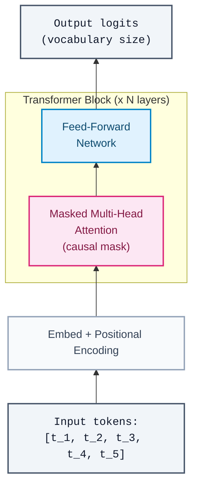
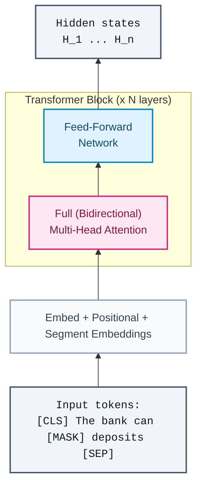

# Chapter 5: Pre-trained Language Models — GPT and BERT

> "You shall know a word by the company it keeps." — J.R. Firth, 1957

---

## 5.1 The Pre-Training Revolution

Before 2018, NLP looked like a collection of independent engineering problems. Named entity recognition used one architecture. Sentiment analysis used another. Question answering used a third. Each task demanded labeled data, custom features, and significant domain expertise to tune. The field was fragmented by design — practitioners assumed that language understanding was so task-specific that general representations were impossible.

This assumption was wrong.

The key insight of GPT and BERT is deceptively simple: **text itself is the supervision signal**. The internet contains hundreds of billions of words arranged by humans who understood language. If a model can learn to predict the next word (or a masked word) across that corpus, it must internalize grammar, world knowledge, reasoning patterns, and discourse structure — because that's what predicting text requires. Once this general model exists, adapting it to a specific task requires only a small labeled dataset and a few gradient steps.

This is transfer learning finally working for NLP.

The analogy to computer vision is instructive. In 2012, AlexNet demonstrated that features learned on ImageNet — 1.2M images, 1000 classes — transferred well to other vision tasks (Krizhevsky et al., 2012). By 2015, it was standard practice to initialize vision models from ImageNet weights and fine-tune (Deng et al., 2009). The pre-trained backbone encoded general visual primitives: edges, textures, object parts. Task-specific data provided only the final mapping.

GPT and BERT are the NLP equivalent. The pre-trained backbone encodes linguistic primitives: syntax, semantics, coreference, entailment. The difference is that vision needed curated labeled data (ImageNet has human-assigned labels), while NLP pre-training is entirely self-supervised — the labels are the text itself.

**Why did this take so long?** Two prerequisites had to converge: (1) Transformer architectures capable of modeling long-range dependencies across hundreds of tokens (Chapter 4), and (2) sufficient compute and data to train billions of parameters. Both arrived in 2017-2018. GPT and BERT were first movers in the resulting Cambrian explosion.

---

## 5.2 Tokenization: From Characters to Subwords

Before a Transformer can process text, the text must be converted into a sequence of discrete integer IDs — tokens. The choice of tokenization algorithm determines the model's fundamental unit of input and output, affecting vocabulary size, sequence length, multilingual coverage, and even reasoning capability. Tokenization is the first transformation in every language model pipeline, and its design has consequences that propagate through the entire system.

The core problem is representing an open vocabulary with a fixed-size token set. Word-level tokenization fails because natural language has an effectively unbounded vocabulary: misspellings, neologisms, technical terms, URLs, code, and multilingual text guarantee that any fixed word list will encounter unknown tokens. Character-level tokenization avoids this problem but produces sequences that are 4-5x longer, straining the Transformer's $O(n^2)$ attention complexity and making it harder for the model to learn long-range dependencies (each "step" of attention covers less semantic ground).

Subword tokenization is the standard solution. It operates between word and character granularity, representing common words as single tokens and decomposing rare words into frequently occurring subword pieces. The result is a fixed vocabulary (typically 30,000-100,000 tokens) that can represent any input string — including strings in languages, scripts, or domains never seen during tokenizer training.

For software engineers, the closest analogy is a **greedy compression algorithm**. Subword tokenizers identify frequently recurring byte sequences in a training corpus and assign them short codes (token IDs), exactly as Huffman coding or LZ77 assign short codes to frequent patterns. The difference is that the "codebook" is learned from data and must balance compression efficiency against the model's ability to learn useful representations of each token.

### 5.2.1 Byte Pair Encoding (BPE)

Sennrich et al. (2016) adapted Byte Pair Encoding — originally a data compression algorithm (Gage, 1994) — for subword segmentation. The algorithm is straightforward:

**Training (building the vocabulary):**

1. Initialize the vocabulary with all individual characters (or bytes) present in the training corpus.
2. Count every adjacent symbol pair in the corpus.
3. Merge the most frequent pair into a single new symbol. Add it to the vocabulary.
4. Repeat steps 2-3 until the vocabulary reaches the desired size $V$.

```
Training corpus (simplified): "low low low lower newest"

Initial vocabulary: {l, o, w, e, r, n, s, t, _}

Step 1: Most frequent pair: (l, o) → merge into "lo"
        Corpus: "lo w  lo w  lo w  lo w e r  n e w e s t"
Step 2: Most frequent pair: (lo, w) → merge into "low"
        Corpus: "low  low  low  low e r  n e w e s t"
Step 3: Most frequent pair: (e, s) → merge into "es"
        Corpus: "low  low  low  low e r  n e w es t"
Step 4: Most frequent pair: (es, t) → merge into "est"
        ...
Final vocabulary: {l, o, w, e, r, n, s, t, _, lo, low, es, est, ...}
```

**Inference (tokenizing new text):** Apply the learned merges in the order they were learned. Common words that appeared frequently in the training corpus will be represented as single tokens; rare words will be decomposed into subword pieces that the model has seen in other contexts:

```
"lowest"  → ["low", "est"]       (both subwords learned as merges)
"lowest"  is unseen as a whole word, but its parts are familiar

"GPU"     → ["G", "P", "U"]     (rare token, decomposed to characters)
"running" → ["running"]          (common enough to be a single token)
```

The merge criterion is purely **frequency-based**: BPE always merges the most frequent adjacent pair. This is a greedy algorithm — it does not globally optimize the vocabulary for any downstream objective. Despite this simplicity, BPE produces vocabularies that empirically work well across many languages and domains.

### 5.2.2 Byte-Level BPE

The original BPE operates on Unicode characters, which means the base vocabulary must include every character that might appear in the input. For multilingual models, this base vocabulary can be large (tens of thousands of Unicode code points), and any character not in the training corpus is still out-of-vocabulary.

Radford et al. (2019) introduced **byte-level BPE** for GPT-2, operating on raw bytes (256 possible values) rather than Unicode characters. Every possible input — any language, any script, any binary sequence — can be represented as a sequence of bytes, so the base vocabulary is exactly 256 symbols. BPE merges are then learned on top of this byte-level representation.

This guarantees complete coverage: byte-level BPE can tokenize any string without an out-of-vocabulary token. GPT-2 uses a vocabulary of 50,257 tokens (256 byte tokens + 50,000 BPE merges + 1 special token). GPT-3 and most subsequent models in the GPT lineage use byte-level BPE.

The tradeoff is that rare scripts (e.g., Thai, Burmese) may be encoded inefficiently — a single character that occupies 3 UTF-8 bytes becomes 3 tokens if no merges have been learned for that byte sequence. This directly impacts sequence length and therefore inference cost for languages with poor byte-level merge coverage.

### 5.2.3 SentencePiece

Kudo and Richardson (2018) introduced **SentencePiece**, a language-agnostic tokenization library that treats the input as a raw stream of Unicode characters (including whitespace) rather than pre-tokenized words. Traditional BPE implementations assume whitespace-delimited words as a preprocessing step, which fails for languages without explicit word boundaries (Chinese, Japanese, Thai). SentencePiece removes this assumption by including whitespace as a regular character (represented as the `▁` symbol).

SentencePiece supports both BPE and a unigram language model algorithm as its segmentation method. The unigram model starts with a large vocabulary and iteratively prunes tokens that contribute least to the corpus likelihood — the reverse direction of BPE's bottom-up merging. Many modern models (LLaMA, T5, mBART) use SentencePiece with either BPE or unigram segmentation.

### 5.2.4 WordPiece vs. BPE

BERT uses **WordPiece** (Wu et al., 2016), which is structurally similar to BPE but differs in the merge criterion. Where BPE merges the most *frequent* pair, WordPiece merges the pair that most increases the *language model likelihood* of the training corpus. Concretely, WordPiece selects the merge that maximizes:

$$\text{score}(a, b) = \frac{P(ab)}{P(a) \cdot P(b)}$$

where $P(ab)$ is the corpus frequency of the merged token and $P(a)$, $P(b)$ are the frequencies of the individual pieces. This is pointwise mutual information — it favors merging pairs that co-occur more than chance would predict, rather than pairs that simply co-occur frequently. In practice, the vocabularies produced by BPE and WordPiece are similar, and both achieve comparable downstream performance.

WordPiece uses the `##` prefix to denote continuation subwords (pieces that are not the start of a word):

```
"unbelievable" → ["un", "##believ", "##able"]
"GPU"          → ["G", "##P", "##U"]
```

This explicit word-boundary marking lets the model distinguish "un" as a word prefix from "un" as an independent word, providing a signal that BPE's flat merging does not encode directly.

### 5.2.5 Practical Implications

Tokenization choices have consequences that surface in surprising ways during deployment:

**Multilingual performance.** A tokenizer trained predominantly on English text will allocate most of its vocabulary budget to English subwords. Text in other languages is fragmented into many small tokens, increasing sequence length (and therefore cost and latency) by 2-10x. This is sometimes called the "fertility" problem — the ratio of tokens to words is much higher for underrepresented languages. Modern multilingual models (mBART, BLOOM, LLaMA-3) address this by training the tokenizer on balanced multilingual corpora.

**Arithmetic and numerical reasoning.** The tokenizer's treatment of numbers significantly impacts arithmetic capability. If "1234" is tokenized as ["12", "34"], the model must implicitly learn to parse multi-token numbers and perform digit-level operations across token boundaries. Different tokenizers segment numbers differently and inconsistently — "380" might be one token while "381" is split into ["38", "1"]. This inconsistency is a known contributor to arithmetic failures in language models.

**Token-level reasoning.** Tasks that require character-level or byte-level awareness — spelling, counting letters, reversing strings — are difficult because the model operates on tokens, not characters. The model literally cannot "see" individual characters within a multi-character token. When GPT-4 struggles to count the letters in "strawberry," the root cause is tokenization: the word is likely a single token or split at subword boundaries that obscure individual characters.

**Vocabulary size tradeoffs.** Larger vocabularies mean shorter sequences (better for attention efficiency) but larger embedding matrices (more parameters, sparser gradient signal per token). Smaller vocabularies mean longer sequences but denser embeddings. The optimal vocabulary size depends on the model's scale, the training data distribution, and the deployment latency budget. Typical choices range from 32,000 (LLaMA) to 100,000+ (GPT-4).

---

## 5.3 GPT: Generative Pre-Training

Radford et al. (2018) introduced GPT with a clean hypothesis: a single large language model, pre-trained on diverse text and fine-tuned minimally, could outperform task-specific architectures across many NLP benchmarks. The paper validated this hypothesis across twelve tasks.

### 5.3.1 Architecture: Decoder-Only Transformer

GPT uses a **decoder-only Transformer** — the right half (decoder side) of the architecture from Vaswani et al. (2017), stripped of cross-attention. It consists of stacked Transformer blocks with causal (masked) self-attention:



The **causal mask** is the critical structural choice. When processing token t_i, the attention mechanism can only attend to t_1 through t_i — never to future tokens. This is enforced by masking the attention score matrix:

```
Attention mask (4 tokens):
        t_1  t_2  t_3  t_4
t_1  [  1    0    0    0  ]
t_2  [  1    1    0    0  ]
t_3  [  1    1    1    0  ]
t_4  [  1    1    1    1  ]
```

Positions marked 0 are set to -infinity before the softmax, zeroing out their contribution. This enforces strict left-to-right information flow.

GPT (original) used 12 Transformer layers, 768-dimensional hidden states, 12 attention heads — 117M parameters total. Pre-trained on BooksCorpus: ~7,000 unpublished books, ~800M words.

### 5.3.2 Tokenization: Byte Pair Encoding (BPE)

GPT uses **Byte Pair Encoding (BPE)** tokenization (Sennrich et al., 2016), a subword segmentation algorithm. Starting from a character-level vocabulary, BPE iteratively merges the most frequent adjacent symbol pair in the training corpus, building a vocabulary of subword units. Common words appear as single tokens; rare words are split into frequently occurring subword pieces:

```
"unbelievable" -> ["un", "believ", "able"]
"GPU"          -> ["G", "PU"]
"running"      -> ["running"]    (common enough to keep whole)
```

This gives GPT a fixed vocabulary of 40,000 subword units (GPT-2 uses 50,257) that handles arbitrarily rare words without an explicit out-of-vocabulary token. BPE operates directly on byte sequences, making it language-agnostic and robust to arbitrary Unicode text. BERT uses a related but distinct algorithm (WordPiece, Section 5.4.4); both produce similar subword vocabularies but differ in their merge criterion.

### 5.3.3 Pre-Training Objective: Autoregressive Language Modeling

The pre-training objective is maximum likelihood over the corpus using a left-to-right factorization:

$$L_1(\mathcal{U}) = \sum_i \log P(u_i \mid u_{i-k}, \ldots, u_{i-1};\, \Theta)$$

where $\mathcal{U}$ is the token sequence, $k$ is the context window size, and $\Theta$ are model parameters. This is standard autoregressive language modeling — predict the next token given all previous tokens. No labels, no annotations, no human effort beyond collecting text.

Why is this a good pre-training objective? Because it forces the model to compress everything useful about language into its weights. To predict "The bank can guarantee deposits will eventually **cover**..." the model must understand: (1) "bank" is likely financial, not riverbank, (2) the passive construction constrains what verbs make sense, (3) "cover" in financial contexts means absorb losses. The model internalizes all of this because it improves the prediction loss.

### 5.3.4 Fine-Tuning: Task Heads and Input Reformulation

After pre-training, GPT adds a **task-specific linear head** — a single matrix $\mathbf{W}_y$ mapping the final hidden state to task outputs — and fine-tunes the entire model end-to-end on labeled data:

$$L_2(\mathcal{C}) = \sum_{(x,y)} \log P(y \mid x^1, \ldots, x^m)$$

The full fine-tuning objective combines task loss with language modeling as an auxiliary:

$$L_3(\mathcal{C}) = L_2(\mathcal{C}) + \lambda \cdot L_1(\mathcal{C})$$

This auxiliary LM loss prevents catastrophic forgetting and regularizes fine-tuning.

The elegant part is **input reformulation**: GPT reframes diverse NLP tasks as text sequence problems so the same pre-trained model handles all of them with minimal structural change.

```
Classification:
  [Start] sentence [Extract] --> linear head --> class label

Entailment (premise/hypothesis):
  [Start] premise [Delim] hypothesis [Extract] --> entails/neutral/contradicts

Similarity (order-invariant):
  [Start] text_A [Delim] text_B [Extract]     --> similarity score
  [Start] text_B [Delim] text_A [Extract]     (both orderings, summed)

Multiple Choice (MCQ):
  [Start] context [Delim] answer_1 [Extract]  --> score_1
  [Start] context [Delim] answer_2 [Extract]  --> score_2
  ...softmax over scores...
```

Special delimiter tokens ([Start], [Delim], [Extract]) are added to the vocabulary and learned during fine-tuning. The model never sees structural differences between tasks — only different token sequences.

### 5.3.5 GPT Results

GPT improved state-of-the-art on 9 of 12 evaluated NLP tasks, including large gains on commonsense reasoning (Stories Cloze: +8.9%), question answering (RACE: +5.7%), and textual entailment (MultiNLI: +1.5%). The result was striking because the same 117M parameter model, with the same weights except the final linear head, dominated specialized models trained end-to-end for each task.

---

## 5.4 BERT: Bidirectional Encoder Representations from Transformers

Devlin et al. (2018) identified GPT's fundamental limitation: **causal attention is unidirectional**. When encoding the word "bank" in "I deposited money at the bank", GPT's representation of "bank" depends only on "I deposited money at the" — it cannot incorporate "the bank" from the right side of context. For language understanding (as opposed to generation), bidirectional context is strictly better.

BERT's central contribution is a pre-training strategy that enables bidirectional Transformers without the trivial "cheat" problem (a bidirectional model could simply copy the target token from context during training).

### 5.4.1 Architecture: Encoder-Only Transformer

BERT uses an **encoder-only Transformer** with full bidirectional attention — every token attends to every other token, no causal mask:



BERT-Base: 12 layers, 768 hidden, 12 heads — 110M parameters.
BERT-Large: 24 layers, 1024 hidden, 16 heads — 340M parameters.

Note: BERT-Base and GPT share the same layer configuration (12 layers, 768 hidden, 12 heads) yet differ in parameter count (110M vs. 117M). The discrepancy comes from differences in vocabulary size (BERT uses a 30,522-token WordPiece vocabulary; GPT uses a 40,478-token BPE vocabulary) and BERT's additional segment embedding table for distinguishing sentence pairs. Larger vocabulary means a larger embedding matrix, which accounts for most of the 7M parameter difference.

Pre-trained on BooksCorpus (800M words) + English Wikipedia (2,500M words).

### 5.4.2 Pre-Training Objective 1: Masked Language Modeling (MLM)

To train bidirectionally without the model trivially copying the answer, BERT randomly masks 15% of input tokens and trains the model to predict them. The masking strategy has three cases applied to each selected token:

- **80%**: Replace with [MASK] token
- **10%**: Replace with a random token from vocabulary
- **10%**: Keep the original token unchanged

Why this split? Consider the problem BERT faces during fine-tuning: the [MASK] token never appears in real text. If training always used [MASK], the model would learn representations conditioned on the presence of that artificial token, creating a train/test distribution mismatch. The 10% random replacement and 10% unchanged cases force the model to maintain useful representations for every token position, not just masked ones — because it doesn't know which positions will be evaluated. This is a form of denoising that generalizes to real text.

Mathematically, only the 15% selected tokens contribute to the MLM loss:

$$L_{\text{MLM}} = -\sum_{i \in \text{masked}} \log P(\text{token}_i \mid \text{context})$$

The model outputs a distribution over the vocabulary at each masked position, and cross-entropy is computed against the original token. Bidirectional context arguably makes this a different challenge than autoregressive prediction: each masked position has access to more context (both left and right), but the model must learn to integrate information from both directions simultaneously rather than following a simple left-to-right causal structure.

### 5.4.3 Pre-Training Objective 2: Next Sentence Prediction (NSP)

Many downstream tasks (question answering, natural language inference) require understanding relationships between sentence pairs. BERT adds a binary classification objective: given sentences A and B, is B the actual next sentence in the corpus (IsNext) or a random sentence (NotNext)?

```
Input: [CLS] Sentence A [SEP] Sentence B [SEP]
              ↓ (after all Transformer layers)
           H_[CLS]
              ↓
       Linear + Softmax
              ↓
       IsNext / NotNext
```

The [CLS] (classification) token plays a special role here. It is prepended to every input and its final hidden state is used as the aggregate sequence representation for classification tasks. Because it has no positional meaning, it learns to summarize the entire input through self-attention.

**Caveat on NSP**: Subsequent work showed NSP is less useful than originally thought. Liu et al. (2019) demonstrated in RoBERTa that removing NSP and training longer with larger batches improved performance. The current consensus is that NSP was not harmful but provided minimal benefit — possibly because the randomly-sampled negative sentences are too easily distinguished from true continuations.

### 5.4.4 WordPiece Tokenization

BERT uses **WordPiece tokenization** (Wu et al., 2016), a subword segmentation algorithm. The vocabulary is built by iteratively merging the pair of subword units that maximizes the language model likelihood on training data. Common words appear as single tokens; rare words are split into subword pieces:

```
"unbelievable" -> ["un", "##believ", "##able"]
"GPU"          -> ["G", "##P", "##U"]
"running"      -> ["running"]    (common enough to keep whole)
```

The `##` prefix signals continuation of a word. This design gives BERT a fixed vocabulary (30,000 subword units) that handles arbitrarily rare words without an explicit out-of-vocabulary token. It also lets the model learn morphological relationships — "##ing", "##ed", "##er" appear across thousands of words, and their embeddings capture grammatical meaning.

WordPiece differs from GPT's BPE (Section 5.3.2) primarily in the merge criterion: BPE merges the most *frequent* pair, while WordPiece merges the pair that most increases the language model likelihood. In practice both produce similar subword vocabularies.

### 5.4.5 Fine-Tuning BERT

BERT fine-tuning adds minimal task-specific structure on top of the pre-trained encoder:

```
Sequence Classification (e.g., sentiment, entailment):
  H_[CLS] --> Linear(hidden_size, num_labels) --> softmax

Token Classification (e.g., NER, POS tagging):
  H_1, H_2, ..., H_n --> Linear(hidden_size, num_labels) at each position

Question Answering (SQuAD-style extractive):
  H_1...H_n --> two Linear heads: P_start(i), P_end(i)
  Answer span = argmax over start < end of P_start(i) * P_end(j)
```

The entire model is fine-tuned end-to-end. BERT-Large achieved new state-of-the-art on SQuAD 1.1 (F1: 93.2), SQuAD 2.0 (F1: 83.1), GLUE benchmark (score: 80.4), and 11 other NLP tasks. The improvements were large and consistent.

---

## 5.5 GPT vs. BERT: Two Philosophies

GPT and BERT represent a fundamental architectural fork that shaped the field for years afterward. Understanding the tradeoffs is essential for applying these models correctly.

```
                    GPT                         BERT
         ┌─────────────────────┐    ┌─────────────────────────┐
Arch:    │  Decoder-only       │    │  Encoder-only           │
         │  Causal attention   │    │  Full attention         │
         └─────────────────────┘    └─────────────────────────┘
Pre-     │  Autoregressive LM  │    │  Masked LM + NSP        │
training:│  P(t_n|t_1..t_{n-1})│    │  P(t_masked|context)    │
         └─────────────────────┘    └─────────────────────────┘
Context: │  Left context only  │    │  Full bidirectional      │
         └─────────────────────┘    └─────────────────────────┘
Strength:│  Text generation    │    │  Understanding/encoding  │
         └─────────────────────┘    └─────────────────────────┘
Fine-    │  Linear head on     │    │  Task-specific heads,   │
tuning:  │  final token        │    │  [CLS] or token-level   │
         └─────────────────────┘    └─────────────────────────┘
```

**The "read vs. write" framing**: BERT learns to read — its objective is reconstruction, filling in missing pieces given full context. GPT learns to write — its objective is continuation, producing coherent text given a prefix. Both require deep language understanding, but the computational structure biases them differently.

**When to use which**:

- Use BERT-family models when the task requires mapping text to a label or extracting information: classification, NER, relation extraction, extractive QA. The bidirectional context produces richer token representations.

- Use GPT-family models when the task requires generating text: summarization, translation, dialogue, creative writing, code generation. Causal attention is not a limitation here — it's required for generation (you can't attend to tokens you haven't produced yet).

- The fusion point: encoder-decoder models like T5 (Raffel et al., 2019) use a BERT-like encoder and a GPT-like decoder, getting bidirectional encoding and autoregressive generation. This architecture dominates tasks requiring both understanding and generation.

**The information-theoretic view**: Autoregressive modeling defines a valid probability distribution over sequences — you can sample from it, compute exact likelihoods, and do generation. MLM does not define a valid joint distribution (the masked positions are predicted conditionally but not jointly). BERT is not a generative model in the strict sense. This distinction matters for tasks requiring calibrated probabilities or sampling.

---

## 5.6 The Scaling Trajectory

GPT and BERT established the paradigm. What followed was systematic exploration of scale.

### 5.6.1 GPT-2: Scale Reveals Zero-Shot Capabilities

Radford et al. (2019) scaled GPT to 1.5B parameters, pre-trained on WebText — 40GB of web text curated from Reddit outbound links with at least 3 upvotes. The architecture was unchanged; only scale increased.

The surprising finding: GPT-2 could perform tasks **without any fine-tuning**, by framing the task as text completion. For translation: "French: [sentence]. English:" as a prompt caused GPT-2 to translate. For QA: appending "A:" after a question extracted answers. This is **zero-shot transfer** — the model had learned task-solving implicitly through pre-training on diverse text.

GPT-2 did not surpass fine-tuned BERT on most benchmarks, but it demonstrated that scaling alone, without task-specific training, could produce capable models. This was a qualitative shift in what pre-training was understood to achieve.

### 5.6.2 GPT-3: In-Context Learning at 175B Parameters

Brown et al. (2020) scaled to 175B parameters — a 100x increase over GPT-2. Pre-trained on a filtered Common Crawl corpus (410B tokens), WebText2, Books, and Wikipedia. The training compute was approximately $3.14 \times 10^{23}$ FLOP.

GPT-3 introduced **in-context learning**: instead of fine-tuning, provide a few labeled examples directly in the prompt (few-shot), one example (one-shot), or no examples (zero-shot). The model conditions on these examples and performs the task without gradient updates:

```
Few-shot prompt for sentiment classification:

Review: "This movie was brilliant!"  Sentiment: Positive
Review: "A complete waste of time."  Sentiment: Negative
Review: "Incredible performances all around."  Sentiment: [model predicts: Positive]
```

No weights are updated. The model is "programmed" through its input. This is fundamentally different from fine-tuning — the model's parameters don't change, only its context changes. GPT-3 achieved competitive or state-of-the-art performance on dozens of NLP benchmarks in few-shot mode.

Why does in-context learning work? The model has seen so many examples of instruction-following patterns in pre-training text (tutorials, Q&A forums, textbooks, code comments) that it has learned to recognize and execute the pattern "given examples of this format, complete the next one." The mechanism is still an active research area, but the empirical fact is robust.

### 5.6.3 Scaling Laws: The Predictability of Progress

Kaplan et al. (2020) showed that language model performance follows **power laws** in compute (C), dataset size (D), and parameter count (N):

$$L(N) \sim \left(\frac{N_c}{N}\right)^{\alpha_N} \quad \text{performance vs params, fixed compute}$$

$$L(D) \sim \left(\frac{D_c}{D}\right)^{\alpha_D} \quad \text{performance vs data, fixed params}$$

$$L(C) \sim \left(\frac{C_c}{C}\right)^{\alpha_C} \quad \text{performance vs compute budget}$$

where $L$ is cross-entropy loss. The exponents $\alpha$ are empirically measured by Kaplan et al. as $\alpha_N \approx 0.076$, $\alpha_D \approx 0.095$, $\alpha_C \approx 0.050$. Note that Hoffmann et al. (2022, "Chinchilla") later found substantially different exponents (roughly $\alpha_N \approx 0.34$, $\alpha_D \approx 0.28$), implying data matters more than Kaplan et al. originally suggested. The qualitative picture — smooth power-law scaling — holds across both studies, but the quantitative exponents differ significantly. Key findings:

1. **Smooth, predictable improvement**: Performance improves as a smooth power law across many orders of magnitude. There are no phase transitions at arbitrary scales (though see Section 5.7 on emergent abilities).

2. **Compute-optimal allocation**: For a fixed compute budget, there is an optimal N/D ratio. Kaplan et al. initially suggested large N was more important; Hoffmann et al. (2022) ("Chinchilla") revised this, showing models are typically undertrained — optimal is roughly 20 tokens of training data per parameter.

3. **Predictability enables planning**: You can extrapolate model performance before training. If a 1B parameter model achieves loss L at compute C, a 10B model will achieve a predictably lower loss at 10x compute. This turns AI research partially into an engineering optimization problem.

The engineering implication: scaling is not just "more is better" — it's a constrained optimization problem over (N, D, C) subject to budget constraints and deployment requirements.

### 5.6.4 Mixture of Experts: Sparse Scaling

The scaling laws of Section 5.6.3 describe a world in which every parameter participates in every forward pass. Mixture of Experts (MoE) breaks this assumption. In an MoE model, each input token is routed to a small subset of the model's parameters, so the total parameter count can be vastly larger than the number of parameters active for any given token. This decouples model capacity from per-token compute cost — a shift with profound implications for the parameter-compute relationship.

The core idea has a direct analogue in systems engineering. A load balancer routes incoming requests to a subset of backend servers; not every server handles every request, but the aggregate system handles more traffic than any single server could. MoE applies this principle inside the neural network itself: a learned routing function dispatches each token to a subset of "expert" sub-networks, and only those experts execute.

**Architecture: Sparse Gating over Experts**

In a standard Transformer, every token passes through the same feed-forward network (FFN) in each layer. An MoE layer replaces this single FFN with $E$ parallel FFNs — the experts — and adds a **gating network** that decides which experts process each token. Formally, given an input representation $x$ (the hidden state of a token at a particular layer), the gating function computes:

$$G(x) = \text{TopK}\!\left(\text{softmax}(W_g x)\right)$$

where $W_g \in \mathbb{R}^{E \times d}$ is a learned gating weight matrix, the softmax produces a probability distribution over all $E$ experts, and the TopK operation retains only the $K$ highest-scoring experts (zeroing the rest). The layer output is a weighted combination of the selected experts' outputs:

$$y = \sum_{i \in \text{TopK}} G(x)_i \cdot \text{FFN}_i(x)$$

This is **conditional computation**: only $K$ out of $E$ expert FFNs execute for each token, so the computational cost per token scales with $K$, not $E$. The total parameter count scales with $E$ (all expert weights exist in memory), but the active parameter count per token scales with $K$.

```
Token hidden state x
        │
   ┌────▼────┐
   │  Gating  │   W_g x → softmax → TopK
   │  Network │
   └────┬────┘
        │  routing weights (sparse: K of E nonzero)
   ┌────┼─────────────────────────┐
   ▼    ▼    ▼                    ▼
┌─────┐┌─────┐┌─────┐      ┌─────┐
│FFN_1││FFN_2││FFN_3│ ...  │FFN_E│
│     ││ ✓   ││     │      │ ✓   │   (only K experts activated)
└──┬──┘└──┬──┘└──┬──┘      └──┬──┘
   │   ▼       │              ▼
   │  w_2·out_2│         w_E·out_E
   │      └────┴──────────┘
   │              │
   │         weighted sum
   │              │
   └──────────────▼
              Layer output y
```

**Switch Transformer: Top-1 Routing**

Fedus et al. (2022) simplified MoE routing to its extreme: $K = 1$. Each token is sent to exactly one expert. This **Switch Transformer** design maximizes sparsity — if there are 128 experts, each token uses only $\frac{1}{128}$ of the expert parameters. The authors demonstrated that this simplification, combined with careful engineering, achieved 7x speedups over the dense T5-Base model at equivalent compute budgets.

The critical engineering concept is the **expert capacity factor**. If tokens were distributed uniformly, each expert would process $\frac{n}{E}$ tokens per batch (where $n$ is the total token count). The capacity factor $c$ sets the buffer size for each expert at $c \cdot \frac{n}{E}$ tokens. Setting $c = 1.0$ means no buffer — any routing imbalance causes token drops. Setting $c > 1.0$ (typically 1.25) provides slack, at the cost of wasted compute on padding. Tokens that exceed an expert's capacity are either dropped (their representation passes through unchanged via the residual connection) or rerouted.

This is the same capacity planning problem that arises in distributed systems: provision for peak load (high $c$, wasteful at average load) or provision for average load (low $c$, dropping requests at peak). The Switch Transformer made this tradeoff explicit and tunable.

**GShard: Scaling MoE to Thousands of Experts**

Lepikhin et al. (2021) demonstrated MoE at unprecedented scale for multilingual machine translation, training a 600-billion-parameter model with top-2 routing across 2048 experts distributed over 2048 TPU cores. Each expert resided on a single device, and the gating function determined which device each token's hidden state was dispatched to.

The key engineering contribution was the **expert parallelism** paradigm: rather than replicating the full model across devices (data parallelism) or slicing layers across devices (model parallelism), GShard placed different experts on different devices and routed tokens accordingly. This maps naturally to the MoE architecture — the gating decision is simultaneously a routing decision in the distributed systems sense.

GShard also introduced auxiliary load-balancing losses (discussed below) and random routing for the second expert choice, both of which became standard practice in subsequent MoE work.

**Mixtral: What "8×7B" Means**

Jiang et al. (2024) released Mixtral 8×7B, which made MoE legible to the broader engineering community through its transparent naming. The model contains 8 expert FFNs, each approximately 7 billion parameters in size, with top-2 routing. The total parameter count is approximately 47 billion (8 experts plus shared attention layers and embeddings), but because only 2 of 8 experts activate per token, the active parameter count is approximately 13 billion per token.

This distinction is the crux of MoE's value proposition: Mixtral 8×7B achieves performance comparable to dense models in the 30-70B parameter range, while requiring only the inference compute of a ~13B dense model. The tradeoff is memory — all 47B parameters must reside in memory (or be loadable with sufficient bandwidth), even though most are idle for any given token.

```
Mixtral 8×7B: per-token compute flow

All layers share attention parameters (~same for every token)
     │
     ▼
┌──────────────────────────────────────────┐
│  Self-Attention (shared, always active)  │
└──────────────────┬───────────────────────┘
                   │
          Gating: pick 2 of 8 experts
                   │
     ┌─────────────┼─────────────┐
     ▼             ▼             │
  ┌───────┐   ┌───────┐         │  (6 experts idle)
  │Expert3│   │Expert7│         │
  │ ~7B   │   │ ~7B   │         │
  └───┬───┘   └───┬───┘         │
      └─────┬─────┘             │
      weighted sum              │
            │                   │
            ▼                   │
     Next layer ◄───────────────┘

Total params: ~47B   Active params: ~13B   Compute: ~13B-equivalent
```

**DeepSeek-V2/V3: Fine-Grained and Shared Experts**

DeepSeek-AI pushed MoE design further with two innovations in DeepSeek-V2 (2024) and DeepSeek-V3 (2024). First, **fine-grained experts**: instead of 8 large experts, DeepSeek-V2 uses 160 small experts with top-6 routing. Smaller, more numerous experts provide finer-grained specialization — analogous to microservices versus monolithic services, where smaller units allow more precise routing at the cost of increased coordination overhead.

Second, **shared experts**: a subset of experts are always active for every token, regardless of the gating decision. The architecture partitions experts into shared (always-on) and routed (conditionally activated) groups. Shared experts learn representations useful for all inputs, while routed experts specialize. This addresses a failure mode where commonly needed computations must be redundantly learned by every expert individually.

DeepSeek-V3 scaled this design to 671 billion total parameters with only 37 billion active per token, achieving performance competitive with much larger dense models at a fraction of the training and inference compute.

**Load Balancing: Why Unbalanced Routing Wastes Capacity**

Left to its own devices, the gating network tends toward **expert collapse**: a few experts receive the majority of tokens while others starve. This happens because popular experts receive more gradient signal, making them better, which makes them more popular — a positive feedback loop. In the extreme, one expert handles all tokens and the model degenerates to a dense network with $E - 1$ dead-weight parameter blocks.

This is the "thundering herd" problem from distributed systems: without load balancing, popular servers get overloaded while idle servers waste resources.

The standard remedy is an auxiliary **load-balancing loss** added to the training objective. Let $f_i$ be the fraction of tokens routed to expert $i$ and $p_i$ be the average gating probability assigned to expert $i$ across the batch. The balancing loss is:

$$L_{\text{balance}} = \alpha \cdot E \cdot \sum_{i=1}^{E} f_i \cdot p_i$$

where $\alpha$ is a small coefficient (typically $10^{-2}$). This loss is minimized when both $f_i$ and $p_i$ are uniform ($\frac{1}{E}$ each), gently pushing the gating network toward balanced routing without overriding its learned preferences. The scaling factor $E$ normalizes the loss to be $O(1)$ regardless of expert count.

DeepSeek-V3 introduced an alternative approach: a **bias term** added to the gating logits, adjusted during training to equalize expert utilization without an auxiliary loss. This avoids the hyperparameter sensitivity of loss-based balancing.

**Why MoE Changes the Parameter-Compute Relationship**

The scaling laws of Section 5.6.3 assume dense models, where total parameters $N$ equals active parameters. MoE breaks this identity:

| Metric | Dense Model | MoE Model |
|--------|-------------|-----------|
| Total parameters $N_{\text{total}}$ | 175B | 671B (DeepSeek-V3) |
| Active parameters per token $N_{\text{active}}$ | 175B | 37B |
| FLOPs per token | $\propto N_{\text{total}}$ | $\propto N_{\text{active}} \ll N_{\text{total}}$ |
| Memory required | $\propto N_{\text{total}}$ | $\propto N_{\text{total}}$ (all experts in memory) |

This means the Kaplan/Chinchilla scaling laws, which relate loss to parameter count and training tokens, do not directly apply to MoE models. A 671B MoE model does not behave like a 671B dense model (too few FLOPs per parameter) nor like a 37B dense model (more total capacity). MoE occupies a different region of the scaling landscape — one where you can increase model capacity (total parameters) with sublinear increases in compute, at the cost of linear increases in memory.

The practical implication for engineers: when evaluating MoE models, always ask two questions. First, what is the active parameter count? This determines inference latency and throughput. Second, what is the total parameter count? This determines memory requirements and whether the model fits on your hardware. The headline number (e.g., "671B parameters") can be misleading without this distinction.

### 5.6.5 BERT Variants

BERT's success spawned systematic improvements:

**RoBERTa** (Liu et al., 2019): Trained BERT with better hyperparameters — larger batches, more data, longer training, removed NSP, and used dynamic masking (different masks each epoch). Substantial gains on GLUE and SQuAD without architectural changes. Lesson: the original BERT was undertrained.

**ALBERT** (Lan et al., 2019): Factorized embedding parameterization (decompose large embedding matrix into two smaller matrices) and cross-layer parameter sharing. Reduced parameters 18x while maintaining performance. Useful when memory is constrained.

**DeBERTa** (He et al., 2021): Disentangled attention — separate content and position embeddings, combined at the attention score computation rather than the input. Enhanced mask decoder for MLM. State-of-the-art on SuperGLUE at time of publication. The architecture insight: position information should interact with content at attention time, not be baked in at embedding time.

---

## 5.7 In-Context Learning and Emergent Abilities

GPT-3's few-shot capabilities raised a deeper question: what else is in there?

Wei et al. (2022) documented **emergent abilities** — capabilities that appear abruptly as model scale increases, near zero below a threshold and substantially nonzero above it. Examples: multi-step arithmetic, analogical reasoning, chain-of-thought reasoning (when prompted with intermediate steps), word unscrambling. These abilities were not present in smaller models and were not explicitly trained for.

The word "emergent" is contentious. Schaeffer et al. (2023) provided a compelling counterargument: they showed that apparent emergence can be an artifact of nonlinear or discontinuous evaluation metrics. When the same underlying performance is measured with linear metrics (e.g., token-level accuracy rather than exact-match on multi-step problems), the "abrupt" jump often resolves into a smooth, predictable improvement — consistent with the scaling laws above. Their analysis suggests that the model's capability improves gradually, but the metric only registers success once performance crosses a threshold (like getting all steps of an arithmetic problem correct). This reframing is significant: it means emergence may say more about how we measure than about what the model learns. That said, from a deployment perspective the practical threshold still matters — a model that gets 30% of arithmetic steps right produces 0% correct answers, while one that gets 95% right produces many correct answers.

**Why in-context learning works: a mechanistic view**

In-context learning can be understood as a form of Bayesian inference that the model has learned to perform through attention. Given examples $(x_1, y_1), \ldots, (x_k, y_k)$ and query $x_{k+1}$, the model computes an implicit posterior over functions mapping $x$ to $y$ and evaluates it at $x_{k+1}$. The attention mechanism has the right structure for this — keys and queries can encode "find similar inputs" and values can encode "return corresponding outputs."

A more operational view: the model has learned many implicit "task programs" during pre-training. In-context examples activate the relevant program through pattern matching in attention. This is not learning in the gradient sense — it's selection from a pre-learned repertoire.

**The prompt engineering implication**: Because in-context learning is pattern-matching against pre-training distribution, prompt format matters significantly. "Q: ... A: ..." activates different patterns than "Input: ... Output: ...". Chain-of-thought prompting (Wei et al., 2022) — providing intermediate reasoning steps in the examples — activates programs that include reasoning chains, dramatically improving performance on multi-step tasks.

---

## 5.8 From Pre-Training to Alignment

Pre-trained language models are capable but misaligned — they generate the most likely continuation of text, which may be harmful, biased, or unhelpful. Getting models to reliably follow instructions required a new training paradigm.

### 5.8.1 RLHF: Reinforcement Learning from Human Feedback

Ouyang et al. (2022) introduced the InstructGPT training procedure, which connects directly to classical RL (the connection worth emphasizing for RL-interested readers):

```mermaid
graph TD
    classDef init fill:#f1f5f9,stroke:#475569,stroke-width:2px,color:#0f172a
    classDef s1 fill:#e0f2fe,stroke:#0284c7,stroke-width:2px,color:#0c4a6e
    classDef s2 fill:#fffbeb,stroke:#fbbf24,stroke-width:2px,color:#92400e
    classDef s3 fill:#fce7f3,stroke:#db2777,stroke-width:2px,color:#831843
    classDef data fill:#ffffff,stroke:#9ca3af,stroke-width:1px,stroke-dasharray: 4 4

    GPT3[Pretrained<br/>Language Model]:::init

    subgraph Phase1 ["Stage 1: Supervised Fine-Tuning (SFT)"]
        direction LR
        D1[(Prompt +<br/>Demonstration)]:::data
        SFT[SFT Model]:::s1
        D1 -->|"Cross Entropy"| SFT
    end

    subgraph Phase2 ["Stage 2: Reward Model (RM) Training"]
        direction LR
        D2[(Prompt +<br/>Multiple Responses)]:::data
        Rank[Human Ranking<br/>y_w > y_l]:::data
        RM[Reward Model]:::s2
        
        D2 --> Rank
        Rank -->|"Pairwise Ranking Loss"| RM
    end

    subgraph Phase3 ["Stage 3: PPO Fine-Tuning"]
        direction TB
        D3[(Prompts only)]:::data
        PPO[RL Policy<br/>(Initialized from SFT)]:::s3
        Response[Response y]:::data
        RM_E[Frozen<br/>Reward Model]:::s2
        
        D3 --> PPO
        PPO -.->|"Generate"| Response
        Response --> RM_E
        RM_E -.->|"Scalar Reward"| PPO
    end

    GPT3 --> SFT
    SFT --> RM
    SFT --> PPO
    SFT -.->|"KL Divergence<br/>Penalty Baseline"| PPO
```

**Stage 1: Supervised Fine-Tuning (SFT)**
Collect a dataset of (prompt, ideal response) pairs from human labelers. Fine-tune GPT-3 on this data with standard cross-entropy. This adapts the model's distribution toward instruction-following but is limited by the cost of collecting examples.

**Stage 2: Reward Model Training**
For each prompt, sample multiple responses from the SFT model. Human raters rank the responses by quality. Train a separate **reward model** $R(x, y)$ — a language model with a linear head predicting scalar reward — using a pairwise ranking loss:

$$L_{\text{RM}} = -\mathbb{E}_{(x,\, y_w,\, y_l)}\!\left[\log \sigma\!\left(R(x, y_w) - R(x, y_l)\right)\right]$$

where $y_w$ is the preferred response and $y_l$ is the less preferred. This learns to predict human preferences without requiring humans to annotate every training example.

**Stage 3: PPO Fine-Tuning**
Use Proximal Policy Optimization (PPO) to fine-tune the SFT model to maximize the reward model's score while staying close to the original SFT distribution:

$$\text{objective} = \mathbb{E}_{(x,y) \sim \pi_{\text{RL}}}\!\left[R(x,y)\right] - \beta\, D_{\text{KL}}\!\left[\pi_{\text{RL}}(y \mid x) \,\|\, \pi_{\text{SFT}}(y \mid x)\right]$$

Note: this is the **KL-penalized reward formulation** used in RLHF practice, not the clipped surrogate objective from the original PPO paper (Schulman et al., 2017). The original PPO uses a clipped probability ratio to constrain policy updates; the RLHF variant instead adds an explicit KL penalty to the reward. Both serve the same purpose — preventing the policy from changing too quickly — but the mechanisms differ. The KL penalty prevents the policy from exploiting reward model weaknesses (reward hacking) by deviating too far from the SFT baseline. $\beta$ controls the tradeoff between reward maximization and distribution fidelity.

**Why RL here?** Because reward optimization over sequences is a policy gradient problem. The reward signal is received at the end of a full response (a sequence of tokens), not at each token. Standard supervised learning cannot directly optimize this. PPO handles the sparse, end-of-sequence reward and the sequential action space (token generation).

The RL framing also clarifies what RLHF is doing: it is finding a policy (text generation strategy) that maximizes expected human preference score while remaining coherent. The reward model is a learned approximation of human judgment, and PPO is the optimizer. The challenges — reward misspecification, hacking, variance — are exactly the challenges of RL with learned reward functions.

### 5.8.2 The Alignment Tax

RLHF improves instruction-following and reduces harmful outputs, but at a cost: InstructGPT scored lower than GPT-3 on some NLP benchmarks (particularly academic ones with fixed formats). This **alignment tax** reflects a tradeoff — optimizing for human preference on diverse instructions slightly degrades performance on narrow benchmarks.

The alignment tax is a research priority. Later work (Constitutional AI — Bai et al., 2022; RLAIF; DPO — Rafailov et al., 2023) has reduced it by improving alignment training efficiency and stability. Direct Preference Optimization (DPO) reformulates RLHF as a supervised problem on preference data, eliminating the need for explicit reward model training and PPO, while achieving comparable alignment.

### 5.8.3 The Path to ChatGPT

InstructGPT (Ouyang et al., 2022) demonstrated the RLHF procedure on GPT-3. ChatGPT applied similar training to a more capable base model with a conversational framing. GPT-4 extended this further with multimodal inputs and improved alignment. The technical innovations were incremental relative to InstructGPT; the scale and data quality made the difference.

The key architectural insight that persists from GPT through GPT-4: **decoder-only autoregressive generation, scaled**. BERT's encoder-only architecture proved harder to scale to instruction-following because generation requires a decoder. The GPT lineage won the generation race by design.

---

## 5.9 Connections Forward

The pre-training paradigm established by GPT and BERT ramifies throughout the rest of this textbook:

**Fine-tuning efficiency (Chapter 9)**: Full fine-tuning of billion-parameter models is expensive — storing separate model copies per task is infeasible at scale. This pressure motivated parameter-efficient fine-tuning (PEFT): LoRA (Hu et al., 2021) adds low-rank adapter matrices to frozen weights, fine-tuning only 0.1-1% of parameters with minimal performance loss. The intuition: fine-tuning updates lie in a low-dimensional subspace of weight space. LoRA exploits this structure explicitly.

**Retrieval-Augmented Generation (Chapter 7)**: Pre-training internalizes world knowledge as model weights, but weights are static — they cannot be updated with new facts without retraining. RAG (Lewis et al., 2020) addresses this by coupling a retrieval system (dense vector search over a knowledge corpus) with a generator. The model learns to condition its generation on retrieved passages, separating parametric knowledge (weights) from non-parametric knowledge (retrieval index). This directly addresses a fundamental limitation of closed-parameter language models.

**Vision-Language Models (Chapter 6)**: The pre-training paradigm extends naturally to images. ViT (Dosovitskiy et al., 2020) applies the Transformer encoder architecture to image patches, pre-training with classification objectives. CLIP (Radford et al., 2021) aligns image and text encoders using contrastive pre-training on 400M image-text pairs. The architecture logic is the same: pre-train general representations on massive data, adapt to downstream tasks with minimal fine-tuning.

**Reasoning and Chain-of-Thought (Chapter 10)**: The emergent reasoning capabilities of large language models — and methods to elicit them through prompting — constitute an active research frontier. Chain-of-thought prompting (Wei et al., 2022), self-consistency (Wang et al., 2022), and tree-of-thought (Yao et al., 2023) are all techniques for extracting structured reasoning from models trained purely on next-token prediction. The surprising conclusion: sufficient scale on diverse text apparently instills reasoning patterns that can be activated through prompting.

---

## Summary

GPT and BERT represent two solutions to the same problem: how to build general language representations from text at scale. Their differences — autoregressive vs. masked, unidirectional vs. bidirectional, generative vs. encoding — stem from a single architectural choice (causal masking) that cascades through pre-training objectives, capabilities, and appropriate use cases.

The meta-lesson is the transfer learning framework: invest heavily in pre-training on diverse, large-scale data; invest minimally in task-specific adaptation. This framework has proven robust across scales (millions to hundreds of billions of parameters), modalities (text, image, code, audio), and tasks (classification, generation, retrieval, reasoning). Understanding why it works — and why the architectural choices matter — provides the foundation for every subsequent chapter.

The scaling laws add a second meta-lesson: progress is predictable. Performance is a smooth function of compute, data, and parameters. This converts the research question "will scaling help?" into an engineering question "how should I allocate my compute budget?" The answer from Chinchilla: train a smaller model on more data rather than a larger model on less data. The practical implication: data quality and quantity are often the binding constraint, not architectural cleverness.

---

## Key Equations Reference

| Name | Equation | Section |
|---|---|---|
| Autoregressive LM loss | $L_1(\mathcal{U}) = \sum_i \log P(u_i \mid u_{i-k}, \ldots, u_{i-1};\, \Theta)$ | 5.3.3 |
| Masked language modeling loss | $L_{\text{MLM}} = -\sum_{i \in \text{masked}} \log P(\text{token}_i \mid \text{context})$ | 5.4.2 |
| Scaling law (parameters) | $L(N) \sim (N_c / N)^{\alpha_N}$ | 5.6.3 |
| PPO / RLHF objective | $\mathbb{E}_{\pi_{\text{RL}}}[R(x,y)] - \beta\, D_{\text{KL}}[\pi_{\text{RL}}(y \mid x) \,\|\, \pi_{\text{SFT}}(y \mid x)]$ | 5.8.1 |
| DPO loss | $\mathcal{L}_{\text{DPO}} = -\mathbb{E}\!\left[\log \sigma\!\left(\beta\left(\log\frac{\pi_\theta(y_w \mid x)}{\pi_{\text{ref}}(y_w \mid x)} - \log\frac{\pi_\theta(y_l \mid x)}{\pi_{\text{ref}}(y_l \mid x)}\right)\right)\right]$ | 5.8.2 |
| Reward model pairwise loss | $L_{\text{RM}} = -\mathbb{E}\!\left[\log \sigma\!\left(R(x, y_w) - R(x, y_l)\right)\right]$ | 5.8.1 |
| MoE gating function | $G(x) = \text{TopK}\!\left(\text{softmax}(W_g x)\right)$ | 5.6.4 |
| MoE load-balancing loss | $L_{\text{balance}} = \alpha \cdot E \cdot \sum_{i=1}^{E} f_i \cdot p_i$ | 5.6.4 |

---

## Code: GPT-2 Text Generation and BERT Masked Language Modeling

> **Dependencies:** `pip install transformers torch`

Two short examples using HuggingFace `transformers`. The first uses GPT-2 for autoregressive text generation; the second uses BERT to predict masked tokens. Both illustrate the practical interface to the models discussed in this chapter.

```python
import torch
from transformers import (
    GPT2Tokenizer, GPT2LMHeadModel,
    BertTokenizer, BertForMaskedLM,
)

# ── Part 1: GPT-2 Text Generation ────────────────────────────────────────────
# GPT-2 is a decoder-only model: given a prompt, it extends it autoregressively.

gpt2_tokenizer = GPT2Tokenizer.from_pretrained("gpt2")
gpt2_model     = GPT2LMHeadModel.from_pretrained("gpt2")
gpt2_model.eval()

prompt = "The Transformer architecture changed natural language processing because"
# Tokenize the prompt; GPT-2 uses BPE with a 50,257-token vocabulary
input_ids = gpt2_tokenizer.encode(prompt, return_tensors="pt")  # [1, seq_len]

with torch.no_grad():
    output_ids = gpt2_model.generate(
        input_ids,
        max_new_tokens=60,
        do_sample=True,          # sample from the distribution (not greedy)
        temperature=0.8,          # lower = sharper distribution, less random
        top_p=0.9,                # nucleus sampling: keep top 90% probability mass
        pad_token_id=gpt2_tokenizer.eos_token_id,
    )

# Decode only the newly generated tokens (skip the prompt)
generated = gpt2_tokenizer.decode(
    output_ids[0][input_ids.shape[1]:],
    skip_special_tokens=True,
)
print("=== GPT-2 Generation ===")
print(f"Prompt: {prompt}")
print(f"Continuation: {generated}\n")

# You can also inspect the raw next-token logits for the first prediction:
with torch.no_grad():
    logits = gpt2_model(input_ids).logits   # [1, seq_len, vocab_size]
top5 = logits[0, -1].topk(5)               # top-5 logits at the last position
top5_tokens = [gpt2_tokenizer.decode([idx]) for idx in top5.indices]
print(f"Top-5 next tokens after prompt: {top5_tokens}")


# ── Part 2: BERT Masked Language Modeling ────────────────────────────────────
# BERT is an encoder-only model. We place [MASK] tokens and ask BERT to predict
# what word belongs there, using full bidirectional context.

bert_tokenizer = BertTokenizer.from_pretrained("bert-base-uncased")
bert_model     = BertForMaskedLM.from_pretrained("bert-base-uncased")
bert_model.eval()

# [MASK] marks the tokens we want BERT to fill in
masked_sentence = "The [MASK] was deposited at the [MASK] after the transaction."
tokens      = bert_tokenizer(masked_sentence, return_tensors="pt")
input_ids_b = tokens["input_ids"]           # [1, seq_len] with 103 = [MASK] id

# Locate the [MASK] positions
mask_positions = (input_ids_b == bert_tokenizer.mask_token_id).nonzero(as_tuple=True)[1]

with torch.no_grad():
    logits_b = bert_model(**tokens).logits  # [1, seq_len, vocab_size]

print("\n=== BERT Masked Language Modeling ===")
print(f"Input: {masked_sentence}")
for pos in mask_positions:
    # Top-5 predictions for each masked position
    top5_b      = logits_b[0, pos].topk(5)
    predictions = [bert_tokenizer.decode([idx]) for idx in top5_b.indices]
    print(f"Position {pos.item()} top-5 predictions: {predictions}")

# Expected: BERT uses both left and right context, so "deposited" and "transaction"
# should steer predictions toward "money"/"check" and "bank"/"vault" respectively.
```

**What to observe:**

- GPT-2 can only use left context — each new token is conditioned on all previously generated tokens. Temperature and `top_p` control the randomness/diversity tradeoff directly.
- BERT uses both left and right context simultaneously. The word "deposited" to the left and "after the transaction" to the right both inform the `[MASK]` prediction — this bidirectional attention is the core difference from GPT.
- Try replacing `"[MASK]"` in different positions to see how context on both sides shifts the probability distribution.

---

## Key Papers

| Paper | Contribution |
|-------|-------------|
| Radford et al. (2018) | GPT: generative pre-training + fine-tuning |
| Devlin et al. (2018) | BERT: masked LM, bidirectional pre-training |
| Radford et al. (2019) | GPT-2: zero-shot task performance at scale |
| Brown et al. (2020) | GPT-3: in-context learning, 175B parameters |
| Kaplan et al. (2020) | Neural scaling laws: power law relationships |
| Liu et al. (2019) | RoBERTa: robust BERT pre-training |
| Lan et al. (2019) | ALBERT: parameter-efficient BERT |
| He et al. (2021) | DeBERTa: disentangled attention |
| Ouyang et al. (2022) | InstructGPT: RLHF for alignment |
| Hoffmann et al. (2022) | Chinchilla: compute-optimal training |
| Wei et al. (2022) | Emergent abilities of large language models |
| Sennrich et al. (2016) | BPE for subword segmentation |
| Kudo & Richardson (2018) | SentencePiece: language-agnostic tokenization |
| Fedus et al. (2022) | Switch Transformer: top-1 MoE routing |
| Lepikhin et al. (2021) | GShard: scaling MoE to multilingual translation |
| Jiang et al. (2024) | Mixtral 8×7B: open-weight MoE |
| DeepSeek-AI (2024) | DeepSeek-V2/V3: fine-grained and shared experts |

---

## Exercises

**5.1** Implement causal self-attention from scratch in NumPy. Verify that masking the upper triangle of the attention matrix prevents information flow from future tokens. Compare runtime complexity with full attention.

**5.2** BERT's 80/10/10 masking strategy: design an experiment to test whether the 10% random replacement is necessary. What metric would you use, and what result would you expect? (Hint: consider what happens at fine-tuning time if the model has only seen [MASK] tokens in masked positions.)

**5.3** Derive the compute-optimal allocation ($D^*$ tokens, $N^*$ parameters) for a fixed FLOPs budget $C$ using the Chinchilla scaling law formulation, where $D^*$ denotes the optimal token count and $N^*$ the optimal parameter count. At what parameter count does doubling data become more efficient than doubling parameters?

**5.4** In-context learning via attention: sketch how a Transformer could implement $k$-nearest-neighbor classification using only attention operations. (Keys = training examples, queries = test input, values = labels. How does this relate to in-context learning?)

**5.5** The $D_{\text{KL}}$ penalty in the PPO objective for RLHF serves the same function as regularization in supervised learning. Reformulate the RLHF objective as a constrained optimization problem and derive the Lagrangian. What does the optimal policy look like in closed form?

**5.6** DeBERTa's disentangled attention computes attention scores as a function of both content-to-content and content-to-position interactions. Write out the attention score formula and compare it to standard attention. When would position-content disentanglement matter most?

**5.7** Implement BPE training from scratch: given a corpus of text, build a vocabulary of size $V$ by iteratively merging the most frequent adjacent pair. Then tokenize a held-out sentence using the learned merges. Compare the resulting token sequence length for English text versus text in a language with a different script (e.g., Chinese or Arabic). What does this reveal about the "fertility" problem?

**5.8** In a Mixture of Experts layer with $E = 64$ experts and top-2 routing, compute the expected FLOPs per token as a fraction of a dense layer's FLOPs. If the capacity factor is $c = 1.25$, what fraction of compute is wasted on padding in the worst case (maximally imbalanced routing) versus the best case (perfectly balanced routing)? How does the load-balancing loss $L_{\text{balance}}$ address this?
