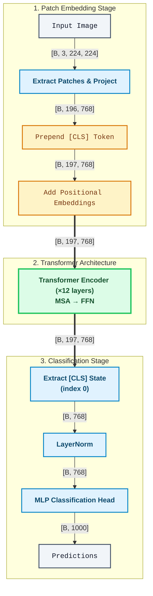
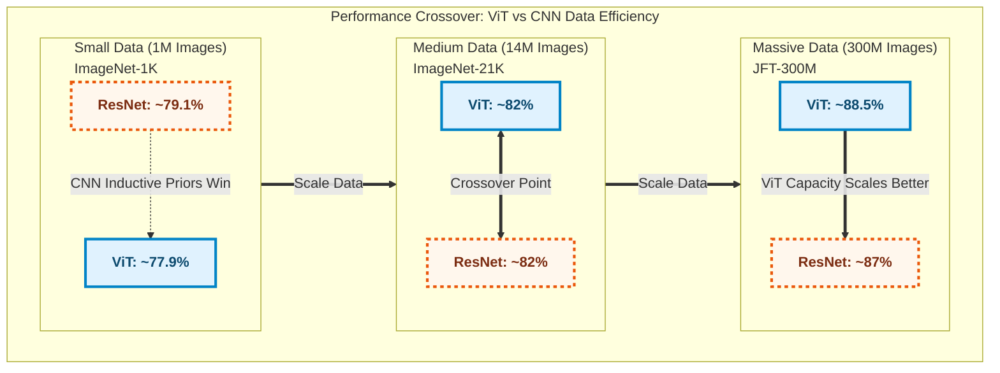
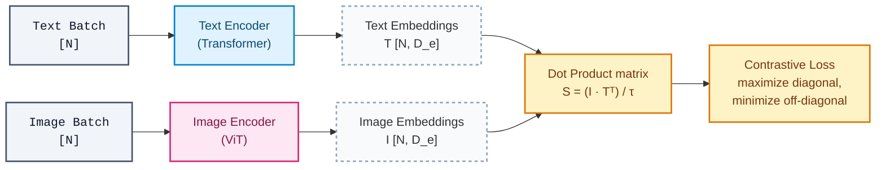

# Chapter 6: Vision Transformer — When Transformers Replaced Convolutions

> "An image is worth 16x16 words: Transformers for image recognition at scale."
> — Dosovitskiy et al. (2020)

---

## 6.1 The CNN Dominance Era: Inductive Biases as a Feature

Before 2020, the history of computer vision was effectively the history of convolutional neural networks. The progression was linear and relentless: LeNet-5 (LeCun et al., 1998) proved that learned spatial filters could recognize handwritten digits. AlexNet (Krizhevsky, Sutskever & Hinton, 2012) scaled this up with GPUs and won ImageNet by a margin that shocked the field — top-5 error dropped from 26.2% to 15.3%. VGGNet (Simonyan & Zisserman, 2014) showed that depth and small $3 \times 3$ kernels were the key variable, pushing to 16 and 19 layers. ResNet (He et al., 2016) solved the vanishing gradient problem with skip connections and scaled to 152 layers, surpassing reported human accuracy on ImageNet classification (though human performance varies considerably depending on the evaluation protocol and labeling conditions).

Each of these architectures shared two structural assumptions about images that nobody seriously questioned:

**Locality.** Pixels that are close together are more likely to be related than pixels far apart. A $3 \times 3$ convolutional filter learns a local feature detector: edge, corner, color transition. The assumption is baked in architecturally — a filter at position $(i, j)$ only sees a small neighborhood around $(i, j)$.

**Translation equivariance.** If you shift the input by $\Delta$ pixels, the feature maps shift by the same amount. Mathematically, for a convolution operator $C$ and a shift operator $T$:

$$C(T(\mathbf{x})) = T(C(\mathbf{x}))$$

This is not a goal CNNs are trained toward — it is a hard property of the convolution operation itself. The same filter applies everywhere, so the same pattern detected at the top-left will be detected at the bottom-right, using the same weights.

These two biases are powerful precisely because they encode real structure about natural images. Images are locally coherent and do not change meaning when shifted. CNNs exploit this structure for free — they do not need to learn it from data.

This is why, for a decade, the idea of applying a pure Transformer to raw image pixels was considered inefficient at best. Earlier attempts to combine attention with CNNs existed (Wang et al., 2018 — Non-local Neural Networks; Ramachandran et al., 2019 — Stand-Alone Self-Attention), but these were hybrids. The question of whether you could remove convolutions entirely — replace them with pure self-attention — remained open.

---

## 6.2 The ViT Hypothesis: Trading Inductive Bias for Scale

Dosovitskiy et al. (2020) at Google Brain posed a direct question: what happens if you apply a standard Transformer encoder — unchanged from Vaswani et al. (2017) — to images?

The hypothesis was not that Transformers are inherently better at vision. The hypothesis was more nuanced:

> CNNs' inductive biases (locality, translation equivariance) help when data is scarce. When data is abundant, these biases become a constraint. A model with fewer inductive biases, given enough data, can learn those biases from the data itself — and potentially learn richer representations that hardcoded convolutions cannot express.

This is a bet on data scale over architectural prior. It is also a bet on generality: a Transformer is a general-purpose sequence model. If images can be turned into sequences, the entire Transformer toolkit — pre-training at scale, transfer learning, attention analysis — applies directly.

The empirical result confirmed this: ViT trained on ImageNet (~1.3M images) underperforms ResNets of comparable size. ViT trained on JFT-300M (300 million images, Google-internal) matches or beats the best ResNets at a fraction of the pre-training compute. The crossover point is somewhere around 10-100M images. Below that threshold, inductive biases win. Above it, Transformers win.

This finding reframed the entire problem. The question stopped being "are Transformers good at vision?" and became "how do we get enough data or compute to reach the threshold?"

---

## 6.3 The ViT Architecture in Detail

### 6.3.1 Image Tokenization: Patches as Words

The central challenge in applying a Transformer to an image is that images are 2D grids, not 1D sequences. A $224 \times 224$ image has 50,176 pixels. Self-attention is $O(N^2)$ in sequence length $N$, so treating each pixel as a token would be computationally infeasible.

The solution is elegant: divide the image into non-overlapping fixed-size patches.

$$
\text{Input image: } \mathbf{x} \in \mathbb{R}^{B \times C \times H \times W} \quad \text{e.g., } B=32,\ C=3,\ H=W=224
$$

$$
\text{Patch size: } P \times P \quad \text{e.g., } 16 \times 16
$$

$$
N = \frac{H \times W}{P^2} = \frac{224 \times 224}{16^2} = 196
$$

Each patch is a $P \times P \times C$ block of pixels. The image is partitioned into $N$ such blocks, each of which becomes a token. Conceptually, this is exactly how text is tokenized — a sentence of 50,000 characters is tokenized into a few hundred subword units, and an image of 50,176 pixels is tokenized into 196 patch tokens.

Each patch is a vector of size $P^2 \cdot C$ when flattened:

$$
\text{Flattened patches: } \mathbf{x}_p \in \mathbb{R}^{B \times N \times (P^2 \cdot C)} \quad \text{e.g., } [32,\ 196,\ 768] \text{ for } P=16,\ C=3
$$

### 6.3.2 Patch Embedding

The flattened patches are projected into a $D$-dimensional embedding space via a learned linear transformation. This is the patch embedding layer:

```python
# Pseudocode
patch_embed = nn.Linear(P * P * C, D)   # e.g., Linear(768, 768)

patches = extract_patches(image, P)       # [B, N, P²·C]
x = patch_embed(patches)                  # [B, N, D]
```

In the original ViT, $D=768$ for ViT-Base, $D=1024$ for ViT-Large, and $D=1280$ for ViT-Huge. The linear projection is entirely equivalent to a non-overlapping convolution with kernel size $P$ and stride $P$ — some implementations use `nn.Conv2d(C, D, kernel_size=P, stride=P)` for efficiency. The resulting embedding is semantically identical.

Note what is not happening here: no weight sharing across spatial positions (unlike CNN filters), no built-in locality. Each patch is embedded independently as if it were a word.

### 6.3.3 The [CLS] Token

Borrowed directly from BERT (Devlin et al., 2018), a learnable [CLS] (classification) token is prepended to the sequence:

$$
\mathbf{x} = [\mathbf{x}_{\text{cls}},\ \mathbf{x}_1,\ \mathbf{x}_2,\ \ldots,\ \mathbf{x}_N] \in \mathbb{R}^{B \times (N+1) \times D}
$$

$\mathbf{x}_{\text{cls}}$ is initialized randomly and updated during training. It is not derived from any patch — it is a free parameter that the model learns to use as a global aggregator. After $N$ Transformer encoder layers, the [CLS] token output is used for classification.

The alternative is to use average pooling over all patch token outputs. The paper compares both; average pooling works roughly equivalently but requires architectural changes for fine-tuning at different resolutions. The [CLS] token approach is cleaner and was adopted as standard.

The full sequence after prepending [CLS]:

$$
\text{Sequence length: } N + 1 = 197 \quad \text{(for } 16 \times 16 \text{ patches on } 224 \times 224 \text{ image)}
$$

$$
\text{Shape: } \mathbb{R}^{B \times (N+1) \times D} = \mathbb{R}^{B \times 197 \times 768} \quad \text{(ViT-Base)}
$$

### 6.3.4 Positional Embeddings

Self-attention is permutation-invariant. Given the same set of patch embeddings in a different order, the self-attention output would be the same (modulo the order of outputs). This is catastrophically wrong for images — position is semantically critical.

Positional embeddings add position information to each token:

$$
\mathbf{x} \leftarrow \mathbf{x} + \mathbf{E}_{\text{pos}}, \qquad \mathbf{E}_{\text{pos}} \in \mathbb{R}^{1 \times (N+1) \times D} \text{ (broadcast over batch)}
$$

ViT evaluates several approaches:
- **No positional embedding:** Terrible, as expected.
- **1D learned embeddings:** A lookup table of $N+1$ learned vectors of size $D$, one per position (0 for [CLS], 1–196 for patches in raster order). This is the standard approach.
- **2D learned embeddings:** Separate row and column embeddings, concatenated or summed.
- **Relative positional embeddings:** Encoding relative distances between patches.

The surprising result: **1D learned embeddings work as well as 2D learned embeddings.** The model has enough capacity to learn 2D spatial structure from 1D position indices, because the mapping from 1D raster index to 2D spatial location is deterministic. Section 6.5 discusses the visualization of learned embeddings, which reveals that the model does, in fact, learn 2D spatial structure.

### 6.3.5 The Transformer Encoder

The Transformer encoder in ViT is the standard Vaswani et al. encoder — no modifications. Each layer consists of:

1. **Layer Normalization (pre-norm):** ViT uses pre-norm (LayerNorm before attention), which differs from the original "Attention is All You Need" post-norm. Pre-norm is more stable at scale.
2. **Multi-Head Self-Attention (MSA):** Standard QKV attention over all $N+1$ tokens.
3. **Residual connection.**
4. **Layer Normalization.**
5. **MLP (FFN):** Two-layer MLP with GELU activation, hidden dimension $4D$.
6. **Residual connection.**

Formally, for layer $l$:

$$\mathbf{z}'_l = \text{MSA}(\text{LN}(\mathbf{z}_{l-1})) + \mathbf{z}_{l-1}$$

$$\mathbf{z}_l = \text{MLP}(\text{LN}(\mathbf{z}'_l)) + \mathbf{z}'_l$$

The attention computation uses $h$ heads, where each head operates on a $D/h$-dimensional subspace. Given $\mathbf{Q}_h, \mathbf{K}_h, \mathbf{V}_h \in \mathbb{R}^{B \times (N+1) \times (D/h)}$ obtained by splitting the projected input $\mathbf{z}_{l-1} \mathbf{W}_{QKV}$, the per-head attention formula is:

$$\text{Attention}(\mathbf{Q}_h, \mathbf{K}_h, \mathbf{V}_h) = \text{softmax}\!\left(\frac{\mathbf{Q}_h \mathbf{K}_h^\top}{\sqrt{D/h}}\right)\mathbf{V}_h$$

producing attention weights of shape $[B, N+1, N+1]$ and output of shape $[B, N+1, D/h]$ per head.

Every token attends to every other token — including [CLS] attending to patches and patches attending to each other. This global receptive field from layer 1 is the fundamental difference from CNNs, where global receptive fields are only achieved in deeper layers.

ViT model variants and their parameters:

| Model | Layers | D | Heads | MLP dim | Params |
|---|---|---|---|---|---|
| ViT-Base/16 | 12 | 768 | 12 | 3072 | 86M |
| ViT-Large/16 | 24 | 1024 | 16 | 4096 | 307M |
| ViT-Huge/14 | 32 | 1280 | 16 | 5120 | 632M |

The `/16` and `/14` refer to patch size. ViT-Huge uses $14 \times 14$ patches (giving more patches and higher resolution representation).

### 6.3.6 Classification Head

After $L$ Transformer encoder layers, the [CLS] token output is passed through a classification head:

$$
\hat{\mathbf{y}} = \text{MLP}_{\text{head}}\!\left(\text{LN}\!\left(\mathbf{z}_L^{\text{cls}}\right)\right), \qquad \mathbf{z}_L^{\text{cls}} \in \mathbb{R}^{B \times D} \;\longrightarrow\; \hat{\mathbf{y}} \in \mathbb{R}^{B \times K}
$$

where $K$ is the number of classes. During pre-training, the MLP head is a two-layer network with one hidden layer. During fine-tuning on downstream tasks, it is replaced by a single linear layer. This is consistent with BERT-style transfer learning: pre-train a large model on a large dataset, then fine-tune on a small dataset with a lightweight task-specific head.

The full forward pass, summarized with shapes (ViT-Base/16, $224 \times 224$ input, 1000-class ImageNet):



---

## 6.4 Training Regime: The Critical Finding

Architecture alone does not explain ViT's impact. The training regime is equally important — and the empirical findings about data scale are what make ViT a landmark result rather than just a clever architecture.

### 6.4.1 The Data Efficiency Gap

The paper presents a clear scaling experiment across three datasets:

- **ImageNet** (~1.3M training images, 1000 classes): The standard benchmark. CNNs were extensively tuned and augmented for this scale.
- **ImageNet-21k** (~14M training images, 21,843 classes): A larger, noisier version of ImageNet.
- **JFT-300M** (~300M training images, 18,291 classes): Google's internal dataset, an order of magnitude larger.

Results: ViT-Base/16 trained only on ImageNet achieves ~77.9% top-1 accuracy on ImageNet (after fine-tuning), underperforming a BiT-L ResNet (a heavily augmented ResNet-152×4) which achieves ~79.1%. Pre-train on ImageNet-21k, and ViT-Base reaches 81.8%, roughly matching. Pre-train on JFT-300M, and ViT-L/16 reaches 87.12%, matching ResNet baselines while using significantly less TPU-time at inference. The largest model, ViT-H/14, achieves 88.55% top-1 on ImageNet when pre-trained on JFT-300M — surpassing all CNN baselines.

The interpretation is mechanistic: CNNs embed locality and translation equivariance as hard constraints. These constraints act as a strong prior that regularizes the model when data is limited. Transformers impose no such prior — every position can attend to every other position from layer 1. With 1.3M examples, there is not enough signal to learn spatial structure from scratch. With 300M examples, the model learns more flexible representations that CNNs cannot express.

This is the same tradeoff you see throughout machine learning: more assumptions (priors) → better sample efficiency, lower asymptotic performance. Fewer assumptions → worse sample efficiency, higher asymptotic performance. ViT is simply a more general model, and general models need more data to reach their potential.



### 6.4.2 Training Details

**Optimizer:** Adam with $\beta_1 = 0.9$, $\beta_2 = 0.999$. Weight decay 0.1 (applied to all parameters except LayerNorm and biases). Learning rate warmup for 10,000 steps, then linear decay.

**Pre-training resolution:** $224 \times 224$. Fine-tuning resolution: $384 \times 384$. When fine-tuning at higher resolution, the patch size $P$ stays fixed (so more patches are generated — 576 instead of 196 for $384 \times 384$ with $P=16$). The positional embeddings are 2D-interpolated to match the new sequence length.

**Data augmentation:** Standard augmentation during fine-tuning — random resize crop, horizontal flip, color jitter. Minimal augmentation during pre-training on JFT-300M (the dataset is large enough that augmentation adds little).

**Training duration:** Pre-training on JFT-300M for 7 epochs ($\approx 300\text{M} \times 7 \approx 2.1\text{B}$ image-steps). This is a long pre-training run by 2020 standards.

**Regularization:** Dropout on the FFN and on attention weights, but only during fine-tuning on smaller datasets.

---

## 6.5 Analysis from the Paper

### 6.5.1 Attention Distance Analysis

One of the most informative analyses in the paper examines the "attention distance" — the average distance (in pixels) between a query token and the keys it attends to, weighted by attention weight.

In early layers (layers 1–4 of a 12-layer ViT), some heads attend with high attention weight to nearby patches (short attention distance), while others attend globally. In later layers (layers 8–12), almost all heads attend globally.

This is significant: the model is not forced to attend locally by any architectural constraint. Yet some heads in early layers learn to attend locally anyway — because local features are useful. The model discovers locality as an emergent property, not an architectural constraint. The CNN inductive bias is learned, not hardcoded.

The global attention heads in early layers are also interesting: they appear to attend to the [CLS] token and global context aggregation channels that do not have clear CNN analogues. This is a hint that Transformers are doing something qualitatively different from CNNs, not just the same thing without the constraint.

### 6.5.2 Learned Positional Embeddings Show 2D Structure

The paper visualizes the cosine similarity between positional embeddings at different positions. The result is striking: the 1D learned positional embeddings spontaneously organize into a 2D grid. Patches that are close in 2D space have high cosine similarity between their positional embeddings. Patches in the same row or column show banded similarity patterns.

This is an empirical verification of the hypothesis that 1D positional embeddings are sufficient: the model learns the 2D-to-1D mapping from data and encodes it in the positional embedding space. The row/column structure is especially clear in the learned embeddings of models with enough capacity and data.

### 6.5.3 Computational Comparison with ResNets

ViT's computational cost scales differently from ResNets. For ResNet-50 (25M params), a forward pass on a $224 \times 224$ image costs roughly 4.1 GFLOPs. ViT-Base/16 costs roughly 17.6 GFLOPs — more expensive per image. However, ViT-Base performs significantly better when pre-trained at scale, and ViT-Large (307M params, 61.6 GFLOPs) achieves accuracy that ResNets cannot reach regardless of compute.

At the largest scale (ViT-Huge), the paper shows that ViT achieves better performance per TPU-core-day of total training cost than ResNet variants — including the compute-expensive BiT (Big Transfer) ResNets. The efficiency advantage is in pre-training compute at scale, not in per-image inference cost.

---

## 6.6 The ViT Ecosystem

ViT's publication created an immediate wave of follow-on work addressing its limitations and extending its principles.

### 6.6.1 DeiT: Data-Efficient Image Transformers (Touvron et al., 2021)

The Achilles heel of the original ViT was the data requirement. DeiT (Data-efficient Image Transformers) addressed this directly: how do you train ViT competitively on ImageNet alone, without JFT-300M?

The answer was knowledge distillation with a CNN teacher. DeiT adds a second special token — a "distillation token" (analogous to [CLS]) — and trains it to match the output of a pre-trained CNN teacher (RegNetY-16GF). The distillation token's output is trained to predict the teacher's hard label (argmax output), while the [CLS] token is trained with standard cross-entropy on the true labels.

This hybrid approach effectively transfers the CNN's inductive biases to the ViT through the distillation signal. DeiT-B (86M params) achieves 83.1% top-1 on ImageNet trained entirely on ImageNet — competitive with state-of-the-art CNNs. The data requirement barrier was broken within months of ViT's publication.

### 6.6.2 Swin Transformer: Hierarchical ViT (Liu et al., 2021)

The original ViT produces a single-scale feature map — all patches at the same resolution throughout the network. This is fine for classification but problematic for dense prediction tasks (detection, segmentation) that benefit from multi-scale feature hierarchies (like FPN over ResNet).

Swin Transformer reintroduced hierarchical feature maps to the Transformer paradigm, along with a key efficiency innovation: **shifted window attention**.

Instead of global self-attention (all $N+1$ tokens attend to each other), Swin partitions the image into non-overlapping windows and applies attention within each window. An $8 \times 8$ window of $4 \times 4$ patches has 16 tokens — attention cost is $O(16^2)$ rather than $O(N^2)$. This makes Swin linear in image size.

The "shifted" part handles cross-window communication. In alternating layers, the window partition is shifted by $\left(\lfloor M/2 \rfloor, \lfloor M/2 \rfloor\right)$ where $M$ is the window size, so windows overlap with their neighbors and information flows across window boundaries.

Swin produces hierarchical feature maps by merging patches across stages (like strided convolutions in ResNet), giving $4\times$, $8\times$, $16\times$, and $32\times$ downsampled representations. This makes it a drop-in backbone for detection and segmentation pipelines.

Swin-B achieves 83.5% on ImageNet (trained only on ImageNet) and dominates the COCO detection and ADE20K segmentation benchmarks. It represents a partial return to locality as an efficiency mechanism, but implemented through attention windows rather than convolution kernels.

### 6.6.3 BEiT: BERT Pre-training for Vision (Bao et al., 2021)

BERT's success in NLP rested on masked language modeling (MLM): mask some input tokens, train the model to predict the masked tokens from context. BEiT (BERT pre-training of Image Transformers) directly adapts this for vision.

The challenge is that pixels don't have discrete vocabulary entries like words. BEiT's solution: use a discrete VAE (dVAE, from OpenAI's DALL-E) to tokenize image patches into a discrete vocabulary of 8,192 visual tokens. Pre-training objective: mask random patches, predict their dVAE token IDs.

```
Pre-training:  mask 40% of patches  →  predict discrete visual tokens
Fine-tuning:   linear head for classification
```

BEiT achieves 83.2% on ImageNet without labeled pre-training data. The BERT analogy is explicit and principled: just as BERT pre-trains by reconstructing masked words, BEiT pre-trains by reconstructing masked visual tokens. This connection mattered conceptually — it showed that the BERT pre-training recipe transfers to vision.

### 6.6.4 MAE: Masked Autoencoders (He et al., 2022)

MAE (Masked Autoencoders, He et al., 2022) took the BEiT idea and pushed it to an extreme. Key differences from BEiT:

1. **Masking ratio: 75%.** BEiT masked 40%. MAE masks three-quarters of all patches. This is a much harder task.
2. **Pixel reconstruction.** No discrete tokenizer — the model directly reconstructs normalized pixel values of masked patches.
3. **Asymmetric encoder-decoder.** The encoder (standard ViT) only processes unmasked patches (25% of patches). A lightweight decoder reconstructs the full image. This makes pre-training efficient: the encoder processes only $N/4$ tokens.

$$
\text{Encoder input (unmasked patches): } \mathbb{R}^{B \times \lfloor 0.25N \rfloor \times D}
$$

$$
\text{Decoder input (encoder outputs + masked token embeddings + } \mathbf{E}_{\text{pos}}\text{): } \mathbb{R}^{B \times N \times D_{\text{dec}}}
$$

$$
\text{Decoder output (pixel predictions): } \mathbb{R}^{B \times N \times (P^2 \cdot C)}
$$

$$
\mathcal{L}_{\text{MAE}} = \frac{1}{|\mathcal{M}|} \sum_{i \in \mathcal{M}} \left\| \hat{\mathbf{x}}_i - \mathbf{x}_i \right\|^2 \quad \text{(MSE on masked patches only, } \mathcal{M} = \text{masked indices)}
$$

MAE ViT-L pre-trained on ImageNet-1K alone achieves 85.9% fine-tuned accuracy — better than supervised pre-training. This is a striking result: masked reconstruction of raw pixels, which seems like it should be much harder than supervised classification, turns out to be a better pre-training signal.

The intuition is that to reconstruct a missing patch, the model must understand context, structure, and visual semantics. Classification requires only a coarse signal. Reconstruction requires deep understanding of spatial relationships — exactly the kind of representation that makes features transferable.

MAE's 75% masking ratio also has an information-theoretic justification: images are highly redundant. Text is information-dense — masking 15% of words (as in BERT) is already challenging. Masking 15% of image patches is trivially recoverable from neighbors. You need to mask most of the image before reconstruction becomes a hard problem.

### 6.6.5 DINO and DINOv2: Self-Supervised ViT (Caron et al., 2021; Oquab et al., 2023)

DINO (self-DIstillation with NO labels) is a self-supervised method that trains ViT without any labels and without reconstruction. It uses self-distillation: a student network and a momentum-averaged teacher network process different augmented crops of the same image, and the student is trained to match the teacher's output distribution.

The discovery that made DINO famous: **ViT features trained with DINO produce emergent semantic segmentation.** Visualizing the self-attention of the [CLS] token — specifically which patches it attends to — reveals that the model has learned to segment foreground objects from background without any segmentation supervision. The attention maps look like high-quality object masks.

DINOv2 (Oquab et al., 2023) scales DINO with a larger curated dataset (142M images) and improved training recipe. DINOv2 features set state of the art on many dense prediction benchmarks with a frozen backbone and a simple linear head — strong evidence that the representations are genuinely general-purpose.

DINO's semantic segmentation emergence is not fully understood theoretically, but practically it confirms that ViT's global attention mechanism, when trained with the right objective, learns to associate [CLS] with semantically relevant regions — something CNNs with their local receptive fields struggle to do without supervision.

### 6.6.6 JEPA: Joint-Embedding Predictive Architectures (LeCun, 2022; Assran et al., 2023)

MAE reconstructs pixels. DINO uses self-distillation to match output distributions across augmented views. A third paradigm, proposed by LeCun (2022) in a position paper titled *A Path Towards Autonomous Machine Intelligence*, asks a different question entirely: what if the model predicted neither pixels nor distributions, but abstract representations?

This is the core idea behind **Joint-Embedding Predictive Architectures (JEPA)**. The argument is that pixel-level prediction forces the model to commit to low-level details — the exact color of a pixel, the precise texture of a surface — that are irrelevant to semantic understanding. Predicting in representation space allows the model to abstract away irrelevant details and focus on the information that matters for downstream reasoning.

**I-JEPA (Assran et al., 2023)** instantiates this idea for images. The architecture operates as follows:

1. An image is divided into patches, as in standard ViT.
2. A subset of patches (the "context") is encoded by a context encoder into latent representations.
3. A separate set of patches (the "target") is encoded by a target encoder (momentum-updated, as in DINO and MoCo) into target representations.
4. A predictor network takes the context representations and positional information about the target patches, and predicts the target representations in latent space.

The loss function is straightforward — mean squared error between predicted and actual target representations:

$$
\mathcal{L}_{\text{I-JEPA}} = \frac{1}{|\mathcal{T}|} \sum_{i \in \mathcal{T}} \left\| \hat{\mathbf{z}}_i - \text{sg}(\mathbf{z}_i^{\text{target}}) \right\|^2
$$

where $\mathcal{T}$ is the set of target patch indices, $\hat{\mathbf{z}}_i$ is the predicted representation, $\mathbf{z}_i^{\text{target}}$ is the target encoder output, and $\text{sg}(\cdot)$ denotes stop-gradient (the target encoder is updated via exponential moving average, not gradient descent). The target regions are sampled as contiguous blocks rather than random patches — this encourages the model to predict spatially coherent semantic content rather than isolated patch features.

The critical difference from MAE is what is being predicted. MAE's decoder outputs pixel values $\hat{\mathbf{x}}_i \in \mathbb{R}^{P^2 \cdot C}$. I-JEPA's predictor outputs latent vectors $\hat{\mathbf{z}}_i \in \mathbb{R}^{D}$. This distinction has practical consequences: I-JEPA does not need a pixel-level decoder, and the model is not penalized for failing to predict perceptually irrelevant details (exact textures, lighting variations) that pixel reconstruction losses necessarily enforce.

**V-JEPA (Bardes et al., 2024)** extends the same principle to video. Instead of predicting representations of masked image patches, V-JEPA predicts representations of masked spatiotemporal regions in video. The masking strategy targets space-time tubes — contiguous blocks across multiple frames — and the model must predict the latent representations of the masked tubes from the visible context. V-JEPA demonstrates that the representation-space prediction paradigm scales to temporal data, where pixel-level prediction is even more wasteful (predicting exact pixel values across frames is dominated by motion estimation, not semantic understanding).

The following comparison clarifies the distinctions among the self-supervised approaches covered in this chapter:

| Method | What is predicted | Prediction space | Collapse prevention |
|---|---|---|---|
| MAE | Masked patch content | Pixel space ($P^2 \cdot C$ dims) | Reconstruction objective (no collapse risk) |
| DINO | Teacher output distribution | Probability distribution | Centering + momentum teacher |
| I-JEPA | Masked patch representations | Latent space ($D$ dims) | Momentum target encoder + stop-gradient |
| V-JEPA | Masked spatiotemporal tube representations | Latent space ($D$ dims) | Momentum target encoder + stop-gradient |

JEPA remains an active area of research rather than a settled paradigm. The position paper (LeCun, 2022) frames JEPA as a step toward world models that predict the consequences of actions in an abstract representation space — a goal well beyond current image and video understanding. I-JEPA and V-JEPA are early empirical validations of this direction. Their results are competitive with MAE and DINO on standard benchmarks (I-JEPA matches or exceeds MAE on ImageNet linear probing), but the deeper claim — that predicting in representation space is fundamentally more aligned with intelligence than predicting in observation space — remains an open hypothesis.

---

## 6.7 Contrastive Learning: Learning by Comparing

Before proceeding to CLIP and the vision-language models that depend on it, it is necessary to understand the paradigm that makes CLIP's training objective possible: **contrastive learning**. The core idea is deceptively simple. Rather than training a model to reconstruct its input (as in MAE) or to predict labels (as in supervised classification), contrastive learning trains a model to distinguish similar examples from dissimilar ones. The model learns representations by comparison — pulling together representations of semantically related inputs ("positives") and pushing apart representations of unrelated inputs ("negatives").

This paradigm predates its application to vision-language models. The two foundational methods — SimCLR and MoCo, both published in 2020 — established the principles that CLIP later scaled to 400 million image-text pairs.

### 6.7.1 InfoNCE: The Core Loss Function

All contrastive learning methods share a common loss function, or a close variant of it: the **InfoNCE loss** (Oord et al., 2018). Understanding this loss is prerequisite for understanding both SimCLR and CLIP.

Given a query representation $\mathbf{q}$, one positive key $\mathbf{k}^+$ (semantically related to the query), and $K$ negative keys $\{\mathbf{k}_1^-, \ldots, \mathbf{k}_K^-\}$ (unrelated to the query), the InfoNCE loss is:

$$
\mathcal{L}_{\text{InfoNCE}} = -\log \frac{\exp(\text{sim}(\mathbf{q}, \mathbf{k}^+) / \tau)}{\exp(\text{sim}(\mathbf{q}, \mathbf{k}^+) / \tau) + \sum_{j=1}^{K} \exp(\text{sim}(\mathbf{q}, \mathbf{k}_j^-) / \tau)}
$$

where $\text{sim}(\cdot, \cdot)$ is typically cosine similarity and $\tau$ is a temperature parameter that controls the sharpness of the distribution. This loss has a direct interpretation: it is the negative log-likelihood of a $(K+1)$-way softmax classifier that should assign the highest probability to the positive key.

The temperature $\tau$ plays a critical role. When $\tau$ is small (e.g., 0.07, as used in CLIP), the softmax becomes sharply peaked — the model must place nearly all probability mass on the correct positive. When $\tau$ is large, the distribution becomes more uniform and the loss is less sensitive to fine-grained similarity distinctions. In practice, $\tau$ is either a fixed hyperparameter or, as in CLIP, a learned parameter that the model optimizes during training.

The connection to mutual information gives InfoNCE its theoretical grounding. Oord et al. (2018) showed that minimizing InfoNCE maximizes a lower bound on the mutual information $I(\mathbf{q}; \mathbf{k}^+)$ between the query and positive key representations. Intuitively, high mutual information means that knowing the query representation tells you a great deal about the positive key representation — exactly what a good shared representation should achieve. The bound becomes tighter as the number of negative samples $K$ increases, which provides a theoretical justification for the empirical finding that more negatives improve contrastive learning.

### 6.7.2 SimCLR: Data Augmentation as Positive Pair Generator (Chen et al., 2020)

SimCLR (A Simple Framework for Contrastive Learning of Visual Representations, Chen et al., 2020, Google Brain) demonstrated that contrastive learning could match supervised pre-training on ImageNet — without any labels — given sufficient compute and a careful choice of data augmentations.

The method is elegant in its simplicity:

1. **Augmentation.** For each image $\mathbf{x}$ in a mini-batch of $N$ images, apply two random augmentations (from a composition of random crop, color jitter, Gaussian blur, and horizontal flip) to produce two "views": $\tilde{\mathbf{x}}_i$ and $\tilde{\mathbf{x}}_j$. These two views of the same image form a **positive pair**.
2. **Encoding.** Both views pass through a shared encoder $f$ (a ResNet or ViT) followed by a small projection MLP $g$, producing embeddings $\mathbf{z}_i = g(f(\tilde{\mathbf{x}}_i))$.
3. **Contrastive loss.** For each positive pair $(\mathbf{z}_i, \mathbf{z}_j)$, all other $2(N-1)$ augmented images in the batch serve as negatives. The loss is InfoNCE applied symmetrically over all positive pairs in the batch.

For a batch of $N$ images yielding $2N$ augmented views, the loss for one positive pair $(i, j)$ is:

$$
\ell_{i,j} = -\log \frac{\exp(\text{sim}(\mathbf{z}_i, \mathbf{z}_j) / \tau)}{\sum_{k=1}^{2N} \mathbb{1}_{[k \neq i]} \exp(\text{sim}(\mathbf{z}_i, \mathbf{z}_k) / \tau)}
$$

The total loss averages over all $2N$ positive pairs (each image contributes two, one from each view's perspective).

Two findings from SimCLR shaped subsequent work. First, **the composition of augmentations matters more than any single augmentation.** Random crop combined with color distortion is essential; either alone is insufficient. The intuition is that the model must learn representations invariant to these transformations, and harder invariances (large crop differences, strong color shifts) force more abstract representations. Second, **larger batch sizes dramatically improve performance.** SimCLR used batch sizes of 4,096 to 8,192, giving 8,192 to 16,384 negative examples per positive pair. This is a direct consequence of the InfoNCE bound: more negatives yield a tighter mutual information estimate and a harder discrimination task.

The batch size requirement was SimCLR's practical limitation. Training with batch size 8,192 requires significant GPU memory and multi-node distributed training. This motivated the next major method.

### 6.7.3 MoCo: Momentum Contrast (He et al., 2020)

MoCo (Momentum Contrast for Unsupervised Visual Representation Learning, He et al., 2020, Facebook AI — the same team behind ResNet and MAE) solved the batch size problem with two innovations: a **momentum encoder** and a **queue of negatives**.

The architecture consists of two encoders:
- A **query encoder** $f_q$ that processes the query view. This encoder is updated by gradient descent as usual.
- A **key encoder** $f_k$ that processes the positive and negative views. This encoder is not updated by gradients. Instead, its parameters $\theta_k$ are an exponential moving average (EMA) of the query encoder parameters $\theta_q$:

$$
\theta_k \leftarrow m \cdot \theta_k + (1 - m) \cdot \theta_q, \qquad m = 0.999
$$

The momentum coefficient $m = 0.999$ means the key encoder changes very slowly — it is a smoothed, temporally consistent version of the query encoder. This consistency is critical: the negative keys in the queue were produced by past versions of the key encoder, and if the encoder changed rapidly between steps, the negatives would be stale and inconsistent.

The second innovation is the **queue**. Instead of using the current mini-batch as the negative pool (as in SimCLR), MoCo maintains a first-in-first-out (FIFO) queue of $K$ key representations from recent mini-batches. Each training step, the current batch's key representations are enqueued, and the oldest representations are dequeued. The queue size $K$ (typically 65,536) is independent of the mini-batch size.

This decoupling is the key insight. SimCLR needs a batch size of 8,192 to get 16,384 negatives. MoCo needs a batch size of only 256 but maintains 65,536 negatives in its queue — a 4$\times$ larger negative pool at a 32$\times$ smaller batch size. The momentum encoder ensures that these queued negatives are approximately consistent despite being computed at different training steps.

MoCo v2 (Chen et al., 2020) incorporated SimCLR's projection MLP and augmentation strategy into MoCo's framework, combining the strengths of both approaches. The result matched or exceeded SimCLR's accuracy with standard batch sizes on standard hardware.

### 6.7.4 The Contrastive Learning Paradigm

SimCLR and MoCo established a general paradigm: **learn representations by training a model to distinguish positive pairs from negative pairs, where positive pairs are defined by some known semantic relationship.** The paradigm is agnostic to what defines a "positive pair":

- **SimCLR/MoCo:** Two augmented views of the same image.
- **CLIP (Section 6.8.2):** An image and its paired text caption.
- **DPR (Chapter 7):** A question and its relevant passage.

The loss function is always InfoNCE or a close variant. The engineering challenge is always the same: how to obtain a large and diverse set of negatives. SimCLR uses large batches. MoCo uses a momentum queue. CLIP uses large batches (32,768 pairs) with in-batch negatives. The underlying mathematics is identical.

This paradigm has a complementary relationship with the reconstruction-based methods (MAE, BEiT) and the self-distillation methods (DINO) covered earlier in this chapter. Reconstruction methods learn representations by predicting missing content. Contrastive methods learn representations by comparing related and unrelated examples. Self-distillation methods learn representations by matching output distributions across views. In practice, these approaches are often complementary — DINOv2, for instance, combines self-distillation with a contrastive component.

The forward connection to CLIP is immediate. CLIP applies the contrastive paradigm at scale, using (image, text) pairs as positives and all non-matching pairs in the batch as negatives. The mathematical formulation in Section 6.8.2 is a direct instance of InfoNCE with images as queries and text as keys (and vice versa). Understanding SimCLR and MoCo makes CLIP's training objective a natural extension rather than a novel invention.

---

## 6.8 Why ViT Matters for Vision-Language Models

> **Cross-reference note.** This section introduces CLIP, LLaVA, and Flamingo from the *architectural* perspective — how ViT enables vision-language integration. Chapter 10 covers the same models from the *training and alignment* perspective, including RLHF for VLMs, advanced topics (video understanding, grounding, compositionality), and the convergence with reinforcement learning toward embodied AI.

> *Note: The contrastive learning paradigm introduced in Section 6.7 — particularly the InfoNCE loss — is the foundation for the CLIP training objective described below.*

This section is the convergence point. Everything above — ViT's architecture, its scale behavior, the rich pre-training ecosystem — is prerequisite for understanding modern VLMs (Vision-Language Models). The connection is not incidental.

### 6.8.1 The Modality Alignment Problem

Before ViT, combining vision and language required bridging two fundamentally different architectures: CNNs for images, Transformers for text. The bridge was always awkward — you could pool CNN features and feed them to a Transformer, but the representations lived in different computational spaces, trained with different objectives, at different temporal scales.

ViT eliminates this gap. If images are processed by a Transformer encoder and text is processed by a Transformer encoder, then:

- Both produce sequences of $D$-dimensional embeddings.
- Both use the same attention mechanism.
- Both can be pre-trained with the same family of objectives.
- Cross-modal attention is architecturally identical to within-modal attention.

Once vision and language share the same architecture, combining them is not a research problem in architecture design. It is an engineering problem in pre-training objective and data curation.

### 6.8.2 CLIP: Contrastive Language-Image Pre-training (Radford et al., 2021)

CLIP (Radford et al., 2021, OpenAI) is the first large-scale demonstration of this unification. CLIP pre-trains a ViT image encoder and a Transformer text encoder jointly on 400 million (image, text) pairs scraped from the web.



The training objective is contrastive: for a batch of $N$ image-text pairs, the model is trained to maximize the cosine similarity of the $N$ correct pairs and minimize the similarity of the $N^2 - N$ incorrect pairs. Concretely, given image embeddings $\mathbf{I} = [\mathbf{i}_1, \ldots, \mathbf{i}_N]$ and text embeddings $\mathbf{T} = [\mathbf{t}_1, \ldots, \mathbf{t}_N]$ (each of dimension $D_e$), the similarity matrix and InfoNCE loss are:

$$S = \frac{\mathbf{I} \cdot \mathbf{T}^\top}{\tau}$$

$$\mathcal{L} = \frac{1}{2}\left(\text{CE}(S,\, \text{targets}) + \text{CE}(S^\top,\, \text{targets})\right)$$

where $\tau$ is a learned temperature scalar, $\text{CE}$ denotes cross-entropy, and $\text{targets} = [0, 1, 2, \ldots, N-1]$ (the diagonal entries are the correct pairs).

After pre-training, CLIP's image encoder produces embeddings that are semantically aligned with language — a picture of a dog produces an embedding close to the text "a photo of a dog." This alignment enables zero-shot classification: to classify an image, embed it with the image encoder, then find the closest text embedding over candidate class descriptions ("a photo of a {class}").

ViT-L/14 is the standard CLIP image encoder in most VLMs. The choice of ViT over ResNet in CLIP was deliberate — the paper shows ViT-based CLIP models achieve higher accuracy per training compute than ResNet-based CLIP models at the same scale.

### Code: CLIP Zero-Shot Classification

```python
# pip install transformers torch Pillow

import requests
import torch
from PIL import Image
from transformers import CLIPModel, CLIPProcessor

# Load CLIP model and processor from HuggingFace
model_name = "openai/clip-vit-base-patch32"
model = CLIPModel.from_pretrained(model_name)
processor = CLIPProcessor.from_pretrained(model_name)
model.eval()

# Download a sample image (a photo of cats from COCO val2017)
url = "http://images.cocodataset.org/val2017/000000039769.jpg"
image = Image.open(requests.get(url, stream=True).raw)

# Define candidate text labels for zero-shot classification
labels = [
    "a photo of a cat",
    "a photo of a dog",
    "a photo of a car",
    "a photo of a bird",
]

# Preprocess: tokenize text + resize/normalize image in one call
inputs = processor(text=labels, images=image, return_tensors="pt", padding=True)

# Forward pass — no gradients needed at inference
with torch.no_grad():
    outputs = model(**inputs)

# logits_per_image: shape [1, num_labels] — dot-product scores scaled by temperature
logits = outputs.logits_per_image  # [1, 4]
probs = logits.softmax(dim=1)      # normalize to probabilities across labels

print("Zero-shot classification results:")
for label, prob in zip(labels, probs[0]):
    print(f"  {label:<30}  {prob.item():.4f}")

predicted = labels[probs.argmax().item()]
print(f"\nPredicted class: {predicted}")
```

**What to observe:** The model was never fine-tuned for this task — it ranks labels by cosine similarity between the image embedding and each text embedding in CLIP's joint space. COCO image 39769 contains cats; `"a photo of a cat"` should score highest. Try replacing `labels` with arbitrary descriptions of your own — CLIP generalizes to whatever visual vocabulary appeared in its 400M-pair training corpus.

### 6.8.3 LLaVA and the VLM Blueprint (Liu et al., 2023)

LLaVA (Large Language and Vision Assistant) represents the blueprint of most current VLMs:

```
Image  →  [CLIP ViT encoder]  →  patch embeddings  →  [linear projection]  →  visual tokens
Text   →  [tokenizer]         →  text tokens
Visual tokens + text tokens  →  [LLM (LLaMA)]  →  output text
```

The vision encoder is frozen CLIP ViT-L/14. Its patch embeddings (not just the [CLS] token — all $N$ patch embeddings) are projected into the LLM's embedding space via a simple linear layer (or a small MLP in LLaVA 1.5). These visual tokens are prepended to the text tokens and fed into a large language model.

The shape flow through LLaVA:

```
Input image:          [B, 3, 336, 336]    (LLaVA 1.5 uses 336×336; the original LLaVA 1.0 used 224×224)
CLIP ViT patches:     [B, 576, 1024]      (576 patches of P=14, D=1024)
Projected to LLM dim: [B, 576, 4096]      (LLaMA-2 7B has D=4096)
Text tokens:          [B, T_text, 4096]
Combined input:       [B, 576 + T_text, 4096]
LLM output:           [B, T_text, 4096]   (autoregressive, predicts next text token)
```

Every visual token is a Transformer hidden state. It attends to other visual tokens and to text tokens via standard causal attention (with a modification: visual tokens can attend to each other and text can attend to visual tokens, but visual tokens do not attend to future text). The LLM "reads" the image the same way it reads text — by attending over a sequence of embeddings.

### 6.8.4 Flamingo and Cross-Modal Attention (Alayrac et al., 2022)

Flamingo (Alayrac et al., 2022, DeepMind) takes a different approach. Rather than concatenating visual and text tokens, Flamingo freezes a large language model and inserts cross-attention layers that allow the LLM to attend to visual features:

```
LLM layers:  standard self-attention over text  →  frozen
Inserted:    cross-attention layers where text queries attend to visual keys/values
Visual:      processed by NFNet (CNN) or ViT-based Perceiver Resampler
```

The Perceiver Resampler in Flamingo reduces the variable-length ViT feature sequence to a fixed-length sequence of 64 learned latent vectors via cross-attention. This is an interesting design: the ViT patch tokens are variable in number (depending on image resolution), but downstream LLM layers expect fixed-size input. The Perceiver "reads" the ViT features into a fixed summary.

Flamingo demonstrates few-shot visual question answering (VQA) — given a few image-question-answer examples in the context window, the model answers new questions. The few-shot capability comes entirely from the frozen LLM; the cross-attention layers add visual grounding.

### 6.8.5 The Unification Principle

The thread connecting CLIP, LLaVA, and Flamingo is the same: **ViT turns images into token sequences, and LLMs operate on token sequences.** The composability is architectural. This would be less natural if images were processed by CNNs — CNN feature maps are spatial tensors, not sequences, and while they can be reshaped into sequences, doing so requires design choices that break the natural Transformer alignment.

The unified architecture matters for another reason: **pre-training transfer.** ViT pre-trained on images with masked autoencoding or contrastive learning produces general-purpose visual features. These features, when projected into an LLM's embedding space, give the LLM access to visual semantics that it cannot learn from text alone. The entire pre-training ecosystem (CLIP, DINOv2, MAE) feeds directly into VLM quality.

---

## 6.9 Connections Forward

**Chapter 8 — Stable Diffusion and Text-to-Image Generation.** Stable Diffusion uses CLIP's text encoder to produce conditioning embeddings for diffusion. But CLIP's image encoder (ViT) is also used in CLIP guidance — steering the diffusion process toward images that score high on CLIP image-text similarity. The CLIP ViT features serve as a semantic objective function during generation.

**Chapter 10 — Modern Vision-Language Models.** The architectures covered briefly here (LLaVA, Flamingo) are the subject of Chapter 10 in detail. The ViT architecture, its variants (particularly ViT-L/14 from CLIP), and the patch-as-token paradigm are foundational to everything in that chapter. When Chapter 10 discusses how GPT-4V processes images, it is using a ViT.

---

## 6.10 Summary

ViT's contribution is not primarily a novel mechanism — self-attention was already well understood. The contribution is the demonstration that a known mechanism, applied naively to images (patches as tokens), works — given sufficient data. And the argument for why it works: inductive biases are a prior, and priors become less important as data increases.

The architectural simplicity of ViT is a feature, not a limitation. A standard Transformer encoder, unchanged from the NLP literature, processes images by treating them as sequences of patch embeddings. The same pre-training recipes that work for language — masked prediction, contrastive learning, self-distillation — work for vision. The same fine-tuning procedures transfer to downstream tasks.

For VLMs specifically, ViT's significance is decisive. It is the component that makes vision and language architecturally equivalent, which makes their combination natural rather than engineered. Every major VLM as of 2024 uses a ViT-based vision encoder. Understanding ViT's design choices — why [CLS] rather than pooling, why 1D rather than 2D positional embeddings, why $N+1$ tokens through the full depth — is prerequisite for understanding the design choices in every modern multimodal system.

---

## Summary

- The Vision Transformer (ViT) applies a standard Transformer encoder, unchanged from the NLP literature, to images by dividing them into fixed-size patches and treating each patch as a token. This patches-as-tokens approach eliminates the need for convolutional architectures entirely.
- ViT's performance is governed by a data-scale tradeoff: CNNs' inductive biases (locality, translation equivariance) dominate when data is scarce, but ViT surpasses CNNs when pre-trained on sufficiently large datasets (approximately 10--100 million images), because a model with fewer architectural priors can learn richer representations given enough signal.
- DeiT broke the data barrier through knowledge distillation from a CNN teacher, achieving competitive ImageNet accuracy without large-scale proprietary datasets. Swin Transformer reintroduced hierarchical feature maps and shifted window attention, making ViT practical for dense prediction tasks such as detection and segmentation.
- Self-supervised pre-training methods --- MAE (masked patch reconstruction in pixel space), DINO (self-distillation with emergent segmentation), and BEiT (masked visual token prediction) --- demonstrated that ViT features trained without labels can match or exceed supervised pre-training quality.
- The contrastive learning paradigm, formalized through the InfoNCE loss and instantiated in SimCLR and MoCo, trains models to distinguish positive pairs from negative pairs. This paradigm is agnostic to what defines a positive pair and provides the mathematical foundation for CLIP.
- JEPA (Joint-Embedding Predictive Architectures) proposes predicting in abstract representation space rather than pixel space, arguing that this avoids committing to perceptually irrelevant details. I-JEPA and V-JEPA are early empirical validations of this direction.
- CLIP applies contrastive learning at scale to 400 million image-text pairs, aligning ViT image embeddings with Transformer text embeddings in a shared space. This alignment enables zero-shot classification and, critically, provides the vision encoder that underpins nearly every modern vision-language model, including LLaVA, Flamingo, and Stable Diffusion.

---

## Key Equations Reference

| Name | Equation | Section |
|---|---|---|
| Number of patch tokens | $N = \frac{H \times W}{P^2}$ | 6.3.1 |
| Patch embedding projection | $\mathbf{x} = \text{Linear}(P^2 \cdot C,\, D)(\text{patches})$ | 6.3.2 |
| Positional embedding addition | $\mathbf{x} \leftarrow \mathbf{x} + \mathbf{E}_{\text{pos}}$ | 6.3.4 |
| ViT encoder layer (attention) | $\mathbf{z}'_l = \text{MSA}(\text{LN}(\mathbf{z}_{l-1})) + \mathbf{z}_{l-1}$ | 6.3.5 |
| ViT encoder layer (MLP) | $\mathbf{z}_l = \text{MLP}(\text{LN}(\mathbf{z}'_l)) + \mathbf{z}'_l$ | 6.3.5 |
| MAE reconstruction loss | $\mathcal{L}_{\text{MAE}} = \frac{1}{|\mathcal{M}|}\sum_{i \in \mathcal{M}}\|\hat{\mathbf{x}}_i - \mathbf{x}_i\|^2$ | 6.6.4 |
| InfoNCE loss | $\mathcal{L}_{\text{InfoNCE}} = -\log \frac{\exp(\text{sim}(\mathbf{q}, \mathbf{k}^+)/\tau)}{\sum_j \exp(\text{sim}(\mathbf{q}, \mathbf{k}_j)/\tau)}$ | 6.7.1 |
| CLIP contrastive loss | $\mathcal{L} = \frac{1}{2}(\text{CE}(S, \text{targets}) + \text{CE}(S^\top, \text{targets}))$ | 6.8.2 |
| I-JEPA prediction loss | $\mathcal{L}_{\text{I-JEPA}} = \frac{1}{|\mathcal{T}|}\sum_{i \in \mathcal{T}}\|\hat{\mathbf{z}}_i - \text{sg}(\mathbf{z}_i^{\text{target}})\|^2$ | 6.6.6 |

---

## Exercises

**1. Patch embedding dimensions.**
A ViT-Base model processes $224 \times 224$ RGB images with patch size $P = 16$ and embedding dimension $d = 768$.

(a) Compute the number of patch tokens $N = (H/P)^2$. Including the [CLS] token, what is the total sequence length fed to the Transformer encoder?

(b) The patch projection $\mathbf{E} \in \mathbb{R}^{(P^2 \cdot C) \times d}$ is a linear layer. Compute its parameter count. Compare this to the parameters in a single Transformer encoder block (self-attention + FFN with $d_\text{ff} = 3072$). Which dominates?

(c) ViT-Large uses $d = 1024$ and $P = 16$ on the same $224 \times 224$ input. How does the sequence length change? How does the total self-attention FLOPs scale relative to ViT-Base, given attention is $O(N^2 d)$?

**2. Inductive bias: ViT vs. CNN.**
CNNs build in two inductive biases by construction: *translation equivariance* (a shifted input produces a shifted feature map) and *locality* (each filter sees only a small spatial neighborhood).

(a) Does the standard ViT patch embedding have translation equivariance? Justify your answer by considering what happens to the sequence of patch tokens when an object shifts by 8 pixels — less than one patch width.

(b) Self-attention is permutation-equivariant by default (attending to all tokens equally regardless of position). How does ViT's 1D learned positional embedding partially restore spatial structure? What does the empirical finding that nearby patches have similar position embeddings tell you?

(c) The chapter states "inductive biases are a prior, and priors become less important as data increases." Frame this as a bias-variance tradeoff: CNN inductive bias reduces variance but introduces bias when the true function violates those assumptions. At what regime (small vs. large data) does each model family win, and why?

**3. [CLS] token vs. global average pooling.**
ViT uses a learnable [CLS] token whose final hidden state is passed to the classification head, following BERT's design.

(a) An alternative is to average the final hidden states of all $N$ patch tokens (global average pooling, GAP). Both approaches work in practice. Construct an argument for why [CLS] might capture a more task-specific representation than GAP, and an argument for why GAP might generalize better.

(b) DeiT and DINOv2 use GAP for some downstream tasks. If you were designing a VLM that needs to use both a pooled image representation (for image-level tasks) and per-patch representations (for spatial grounding tasks), which ViT output would you use for each, and why?

**4. CLIP zero-shot classification derivation.**
CLIP trains a vision encoder $f$ and text encoder $g$ to maximize cosine similarity between matched image-text pairs and minimize it for unmatched pairs.

(a) At inference, CLIP classifies an image $x$ into one of $K$ classes $\{c_1, \ldots, c_K\}$ by computing:

$$\hat{y} = \arg\max_k \frac{f(x) \cdot g(t_k)}{\|f(x)\|\, \|g(t_k)\|}$$

where $t_k$ is a text prompt like "a photo of a {class}". Show that this is equivalent to nearest-neighbor classification in the joint embedding space. What implicit assumption does this make about the geometry of the embedding space?

(b) Prompt engineering matters: "a photo of a {class}" outperforms just "{class}". Hypothesize why, in terms of the training data distribution CLIP was trained on.

(c) CLIP exhibits strong zero-shot performance but can fail on fine-grained tasks (distinguishing dog breeds, reading text in images). Relate this to the contrastive training objective: what kinds of visual features does the loss encourage the encoder to capture, and what might it ignore?

**5. Implement ViT patch embedding.**
Write a PyTorch module `PatchEmbed` that:

- Accepts image tensors of shape $[B, C, H, W]$
- Splits the image into $P \times P$ patches using a single `nn.Conv2d` (stride $P$, kernel $P$) — this is equivalent to the linear projection but more efficient
- Outputs a sequence of shape $[B, N, d]$ where $N = (H/P)(W/P)$

Then write a `ViTEncoder` stub that prepends a learned [CLS] token, adds learned positional embeddings, and passes the sequence through $L$ Transformer encoder blocks. Verify that for $H=W=224$, $P=16$, $C=3$, $d=768$, the output shape is $[B, 197, 768]$.

---

## Additional Exercises

**Exercise 6.1** *(Computation)*

Patch tokenization dimensions.

A ViT-Large/16 model processes $384 \times 384$ RGB images (fine-tuning resolution) with patch size $P = 16$ and embedding dimension $D = 1024$.

(a) Compute the number of patch tokens $N$. What is the total sequence length fed to the Transformer encoder (including [CLS])?

(b) The patch embedding layer is a linear map from $\mathbb{R}^{P^2 \cdot C}$ to $\mathbb{R}^D$. Compute its parameter count (no bias). Now compare this to the parameters in a single ViT-Large encoder block: multi-head self-attention ($4D^2$ parameters with $h = 16$ heads) plus FFN ($2 \times D \times 4D = 8D^2$ parameters). Which component — patch embedding or one encoder block — has more parameters?

(c) When fine-tuning at $384 \times 384$ after pre-training at $224 \times 224$ (both with $P=16$), the sequence length changes from 197 to $N_{\text{new}} + 1$. The pre-trained 1D positional embeddings no longer align with the new token count. Describe how ViT handles this mismatch in practice, and explain why this approach works despite the position embeddings never having seen sequences of this length during pre-training.

---

**Exercise 6.2** *(Computation)*

ViT parameter counting.

Use the ViT-Base/16 configuration: 12 layers, $D = 768$, $h = 12$ heads, MLP hidden dim $= 3072$, $P = 16$, $C = 3$, input $224 \times 224$.

(a) Count parameters in one encoder block: (i) QKV projections + output projection for multi-head attention ($4D^2$, ignoring biases), (ii) FFN ($D \times 3072 + 3072 + 3072 \times D + D$, including biases), (iii) two LayerNorm layers ($2 \times 2D$ for $\gamma$ and $\beta$). What is the total per block?

(b) Count non-block parameters: (i) patch embedding linear layer, (ii) [CLS] token vector, (iii) positional embedding table for $N+1 = 197$ positions, (iv) final LayerNorm. Sum everything for the full ViT-Base/16 parameter count (excluding the classification head). How does this compare to the 86M figure in the chapter?

(c) ViT-Huge/14 uses $P = 14$, giving $N = (224/14)^2 = 256$ patches. Compared to ViT-Base/16 ($N = 196$), how does the sequence length change, and by what factor do the self-attention FLOPs ($\propto N^2 D$) scale between the two models (using $D = 1280$ for ViT-Huge vs. $D = 768$ for ViT-Base)?

---

**Exercise 6.3** *(Computation)*

Comparing ViT vs. ResNet compute.

From Section 6.5.3: ResNet-50 costs 4.1 GFLOPs and ViT-Base/16 costs 17.6 GFLOPs for a single $224 \times 224$ image inference.

(a) If you are running a real-time inference service that needs to process 1,000 images per second, and your hardware delivers 100 TFLOPS, how many ResNet-50 instances vs. ViT-Base/16 instances can you run simultaneously? What is the practical implication for deployment?

(b) The chapter states that at large scale, ViT achieves better performance per TPU-core-day of *training* cost than ResNets. Yet ViT is more expensive per image at *inference* time. Explain this apparent contradiction: why can higher per-image inference cost coexist with better training efficiency?

(c) Swin-B achieves 83.5% ImageNet top-1 using approximately 15.4 GFLOPs (similar to ViT-Base). Swin achieves this without the large-scale pre-training requirement of ViT. Using the inductive bias argument from Section 6.2, explain why Swin can match ViT's accuracy on ImageNet-scale data even though it has similar compute cost.

---

**Exercise 6.4** *(Computation)*

CLIP similarity computation and zero-shot classification.

CLIP embeds images and text into a shared $D_e = 512$-dimensional space and computes cosine similarity. Suppose after L2 normalization, an image of a golden retriever has embedding $\mathbf{i}$ and four text prompts have embeddings $\mathbf{t}_1, \ldots, \mathbf{t}_4$ (all unit vectors).

The dot products (= cosine similarities, since all vectors are normalized) are:

| Prompt | $\mathbf{i} \cdot \mathbf{t}_k$ |
|---|---|
| "a photo of a golden retriever" | 0.31 |
| "a photo of a labrador" | 0.28 |
| "a photo of a cat" | 0.11 |
| "a photo of a car" | 0.04 |

(a) CLIP uses a learned temperature $\tau$ (typically $\tau \approx 0.07$ in logit space, meaning scores are divided by $\tau$ before softmax). Compute $S_k = (\mathbf{i} \cdot \mathbf{t}_k) / \tau$ for $\tau = 0.07$. Then compute $p_k = \text{softmax}(S)_k$ for all four classes.

(b) Without temperature scaling ($\tau = 1$), compute the softmax probabilities. Compare the two distributions: what role does the low temperature play in CLIP's zero-shot classification?

(c) CLIP's contrastive training objective operates on batches of $N$ image-text pairs and pushes the $N$ diagonal entries of the similarity matrix $S = \mathbf{I} \cdot \mathbf{T}^\top / \tau$ to be large while pushing the $N^2 - N$ off-diagonal entries to be small. For a batch of $N = 4$ pairs, write out the $4 \times 4$ similarity matrix (just variable names $s_{ij}$) and describe which entries the loss maximizes and which it minimizes. What happens to training as $N$ increases?

---

**Exercise 6.5** *(Conceptual)*

MAE masking strategy and its information-theoretic justification.

MAE masks 75% of patches and trains the encoder on only the visible 25%.

(a) The chapter claims that masking 15% of image patches (BERT's rate) is "trivially recoverable from neighbors." Construct a concrete argument: for a $16 \times 16$ patch in the middle of an image, if only 15% of all patches are masked, roughly how many neighboring patches are visible? Why does having many visible neighbors make the task easy?

(b) At 75% masking, on average only 1 in 4 neighboring patches is visible. Explain why this forces the encoder to learn semantic understanding rather than just local texture interpolation. Connect this to the claim that MAE learns better transferable representations than supervised pre-training.

(c) MAE uses a random masking strategy (uniformly random patch selection) rather than structured masking (e.g., always masking the center, or masking contiguous regions). What failure mode would structured masking enable that random masking prevents? (Hint: think about what the model could learn to exploit if the masked region were always predictable.)

---

## References

- Dosovitskiy, A., et al. (2020). *An Image is Worth 16x16 Words: Transformers for Image Recognition at Scale.* arXiv:2010.11929.
- Krizhevsky, A., Sutskever, I., & Hinton, G. (2012). ImageNet Classification with Deep Convolutional Neural Networks. *NeurIPS*.
- Simonyan, K., & Zisserman, A. (2014). Very Deep Convolutional Networks for Large-Scale Image Recognition. arXiv:1409.1556.
- He, K., et al. (2016). Deep Residual Learning for Image Recognition. *CVPR*.
- Vaswani, A., et al. (2017). Attention is All You Need. *NeurIPS*.
- Devlin, J., et al. (2018). BERT: Pre-training of Deep Bidirectional Transformers for Language Understanding. arXiv:1810.04805.
- Touvron, H., et al. (2021). Training Data-Efficient Image Transformers and Distillation through Attention. *ICML*.
- Liu, Z., et al. (2021). Swin Transformer: Hierarchical Vision Transformer using Shifted Windows. *ICCV*.
- Bao, H., et al. (2021). BEiT: BERT Pre-Training of Image Transformers. arXiv:2106.08254.
- He, K., et al. (2022). Masked Autoencoders Are Scalable Vision Learners. *CVPR*.
- Caron, M., et al. (2021). Emerging Properties in Self-Supervised Vision Transformers. *ICCV*.
- Oquab, M., et al. (2023). DINOv2: Learning Robust Visual Features without Supervision. arXiv:2304.07193.
- Radford, A., et al. (2021). Learning Transferable Visual Models From Natural Language Supervision. *ICML*.
- Liu, H., et al. (2023). Visual Instruction Tuning (LLaVA). arXiv:2304.08485.
- Alayrac, J-B., et al. (2022). Flamingo: a Visual Language Model for Few-Shot Learning. *NeurIPS*.
- Wang, X., et al. (2018). Non-local Neural Networks. *CVPR*.
- Chen, T., et al. (2020). A Simple Framework for Contrastive Learning of Visual Representations (SimCLR). *ICML*.
- He, K., et al. (2020). Momentum Contrast for Unsupervised Visual Representation Learning (MoCo). *CVPR*.
- Oord, A. van den, Li, Y., & Vinyals, O. (2018). Representation Learning with Contrastive Predictive Coding. arXiv:1807.03748.
- LeCun, Y. (2022). A Path Towards Autonomous Machine Intelligence. openreview.net.
- Assran, M., et al. (2023). Self-Supervised Learning from Images with a Joint-Embedding Predictive Architecture (I-JEPA). *CVPR*.
- Bardes, A., et al. (2024). V-JEPA: Revisiting Feature Prediction for Learning Visual Representations from Video. arXiv:2404.16930.
