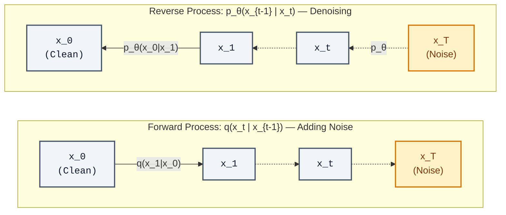
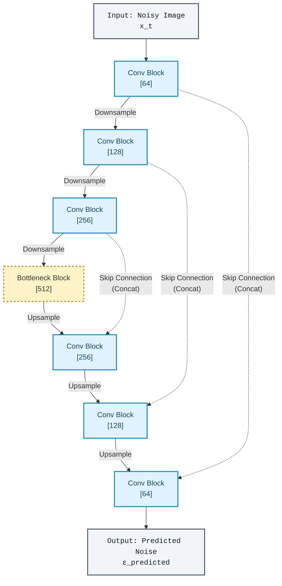
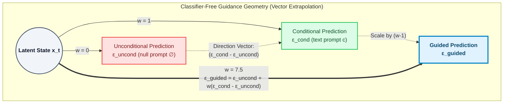
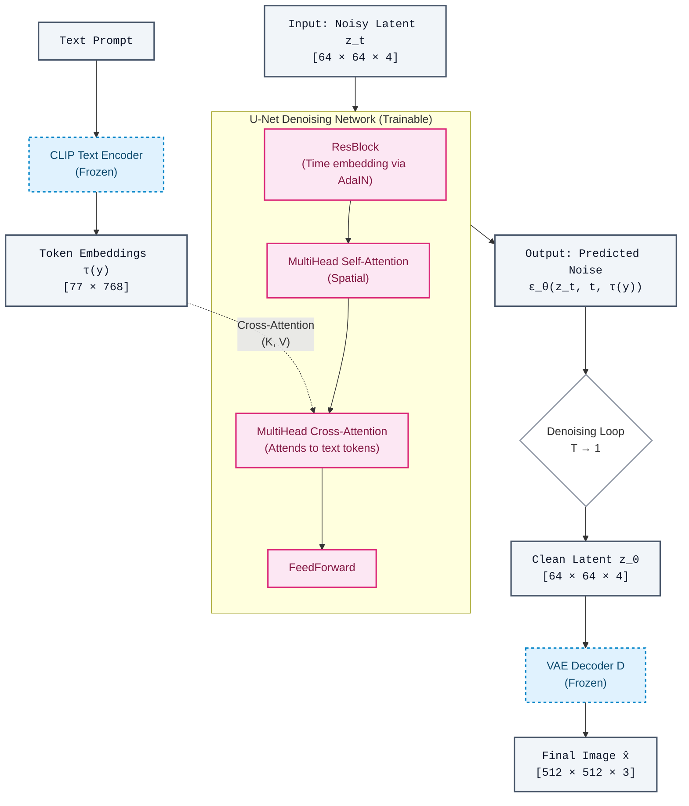

# Chapter 8: Diffusion Models and Stable Diffusion — The New Paradigm of Generation

## Prerequisites

This chapter assumes familiarity with:
- Variational Autoencoders (Chapter 2): encoder-decoder structure, the ELBO, reparameterization trick
- Transformer attention mechanisms (Chapter 4): self-attention, cross-attention, positional embeddings
- CLIP (Chapter 6): contrastive image-text pretraining
- Gaussian distributions and basic probability

---

## 8.1 Why Diffusion? The Generative Model Landscape

Before diffusion models, two architectures dominated image generation: GANs (Goodfellow et al., 2014) and VAEs (Kingma & Welling, 2013). Both have fundamental limitations that diffusion models address directly.

**GANs** are a two-player minimax game: a generator G tries to fool a discriminator D, while D tries to distinguish real from fake. The adversarial dynamics produce sharp, photorealistic samples — but training is notoriously unstable. The generator can suffer **mode collapse**, where it learns to produce a small set of convincing outputs while ignoring large portions of the data distribution. More fundamentally, the training objective is not a proper likelihood — you cannot directly evaluate $p(x)$ or measure how well the model covers the full distribution. Getting GANs to train reliably requires careful architectural choices, learning rate schedules, and regularization (spectral normalization, gradient penalties). This is brittle at scale.

**VAEs** optimize a tractable lower bound on the log-likelihood (the ELBO). This produces stable training and a well-defined probabilistic model, but the generated samples are characteristically blurry. The culprit is the reconstruction term in the ELBO: when the decoder maps a latent vector back to pixel space, the mean-squared error loss averages over uncertainty, smearing fine details. The model learns "what is probably there" rather than committing to sharp details.

**Diffusion models** sidestep both problems. They are likelihood-based (stable training, proper probabilistic framework) and produce samples with sharpness that rivals or surpasses GANs. The core insight is deceptively simple:

> *What if generation is just iterative denoising?*

Instead of learning to generate images in one shot, a diffusion model learns to take a small denoising step — removing a tiny amount of noise from an image. Repeat this step 100–1000 times, starting from pure Gaussian noise, and you converge to a sample from the data distribution. Each individual step is easy to learn; the composition of many steps produces complex, high-quality outputs.

This is the **denoising diffusion probabilistic model** (DDPM) framework, formalized by Ho et al. (2020), building on earlier work by Sohl-Dickstein et al. (2015) and the score matching connection by Song & Ermon (2019).

---

## 8.2 The Diffusion Framework (DDPM)



### 8.2.1 The Forward Process: Destroying Information Systematically

The forward process takes a clean image $x_0$ and gradually corrupts it by adding Gaussian noise over $T$ timesteps (typically $T = 1000$). Each step is a small perturbation:

$$q(\mathbf{x}_t \mid \mathbf{x}_{t-1}) = \mathcal{N}\!\left(\mathbf{x}_t;\, \sqrt{1 - \beta_t}\, \mathbf{x}_{t-1},\; \beta_t \mathbf{I}\right)$$

Here $\beta_t \in (0, 1)$ is a **noise schedule** — a small, carefully chosen value that controls how much noise is added at step $t$. The factor $\sqrt{1 - \beta_t}$ slightly shrinks the signal before adding noise, which keeps the variance bounded (otherwise the variance would grow without bound). At each step, you're taking the previous image, scaling it down slightly, and injecting fresh Gaussian noise.

The noise schedule $\beta_t$ is typically small at early timesteps (gentle corruption) and larger at later timesteps (aggressive corruption). By $t = T$, $x_T$ is approximately pure Gaussian noise regardless of what $x_0$ was — all information about the original image has been destroyed.

**The critical mathematical property** is that this Markov chain has a closed form for any arbitrary timestep $t$, skipping the intermediate steps entirely. Define:

$$\alpha_t = 1 - \beta_t, \quad \bar{\alpha}_t = \prod_{i=1}^{t} \alpha_i$$

Then:

$$q(\mathbf{x}_t \mid \mathbf{x}_0) = \mathcal{N}\!\left(\mathbf{x}_t;\, \sqrt{\bar{\alpha}_t}\, \mathbf{x}_0,\; (1 - \bar{\alpha}_t)\mathbf{I}\right)$$

**Derivation intuition.** Consider two consecutive steps. $\mathbf{x}_1 = \sqrt{\alpha_1}\, \mathbf{x}_0 + \sqrt{1-\alpha_1}\, \boldsymbol{\varepsilon}_1$ and $\mathbf{x}_2 = \sqrt{\alpha_2}\, \mathbf{x}_1 + \sqrt{1-\alpha_2}\, \boldsymbol{\varepsilon}_2$, where $\boldsymbol{\varepsilon}_1, \boldsymbol{\varepsilon}_2 \sim \mathcal{N}(\mathbf{0}, \mathbf{I})$. Substituting:

$$\mathbf{x}_2 = \sqrt{\alpha_2}\left(\sqrt{\alpha_1}\, \mathbf{x}_0 + \sqrt{1-\alpha_1}\, \boldsymbol{\varepsilon}_1\right) + \sqrt{1-\alpha_2}\, \boldsymbol{\varepsilon}_2$$
$$= \sqrt{\alpha_1 \alpha_2}\, \mathbf{x}_0 + \underbrace{\sqrt{\alpha_2(1-\alpha_1)}\, \boldsymbol{\varepsilon}_1 + \sqrt{1-\alpha_2}\, \boldsymbol{\varepsilon}_2}_{\text{sum of independent Gaussians}}$$

The sum of independent Gaussians is Gaussian with variance $\alpha_2(1-\alpha_1) + (1-\alpha_2) = 1 - \alpha_1\alpha_2 = 1 - \bar{\alpha}_2$. So $\mathbf{x}_2 \sim \mathcal{N}\!\left(\sqrt{\bar{\alpha}_2}\, \mathbf{x}_0,\, (1-\bar{\alpha}_2)\mathbf{I}\right)$. This extends by induction to any $t$.

This closed form is the key to efficient training: you can jump to any noise level $t$ in a single operation, without simulating all intermediate steps. In practice, training samples random $t$ uniformly, computes $x_t$ directly from $x_0$, and asks the model to undo that corruption.

### 8.2.2 The Reverse Process: Learning to Denoise

The reverse process runs the chain backwards. Given a noisy image $x_t$, predict the slightly less noisy $x_{t-1}$:

$$p_\theta(\mathbf{x}_{t-1} \mid \mathbf{x}_t) = \mathcal{N}\!\left(\mathbf{x}_{t-1};\, \boldsymbol{\mu}_\theta(\mathbf{x}_t, t),\; \sigma_t^2 \mathbf{I}\right)$$

The variance $\sigma_t^2$ is typically fixed (either $\beta_t$ or a related schedule). The neural network only needs to learn the mean $\boldsymbol{\mu}_\theta(\mathbf{x}_t, t)$.

Starting from $\mathbf{x}_T \sim \mathcal{N}(\mathbf{0}, \mathbf{I})$, sample $\mathbf{x}_{T-1}$ from $p_\theta(\mathbf{x}_{T-1} \mid \mathbf{x}_T)$, then $\mathbf{x}_{T-2}$, ..., and finally obtain $\mathbf{x}_0$. This is the generation procedure.

### 8.2.3 Training Objective: Predict the Noise

The theoretically grounded training objective comes from maximizing the evidence lower bound (ELBO) on $\log p(\mathbf{x}_0)$. The full derivation involves the KL divergence between the reverse process and the tractable forward process posterior $q(\mathbf{x}_{t-1} \mid \mathbf{x}_t, \mathbf{x}_0)$, but the simplified form Ho et al. derive is remarkably clean.

Instead of directly parameterizing $\boldsymbol{\mu}_\theta$, **reparameterize to predict the noise**. Since:

$$\mathbf{x}_t = \sqrt{\bar{\alpha}_t}\, \mathbf{x}_0 + \sqrt{1 - \bar{\alpha}_t}\, \boldsymbol{\varepsilon}, \quad \boldsymbol{\varepsilon} \sim \mathcal{N}(\mathbf{0}, \mathbf{I})$$

you can write:

$$\boldsymbol{\mu}_\theta(\mathbf{x}_t, t) = \frac{1}{\sqrt{\alpha_t}} \left( \mathbf{x}_t - \frac{\beta_t}{\sqrt{1-\bar{\alpha}_t}} \boldsymbol{\varepsilon}_\theta(\mathbf{x}_t, t) \right)$$

The network $\boldsymbol{\varepsilon}_\theta$ predicts the noise $\boldsymbol{\varepsilon}$ that was added to $\mathbf{x}_0$ to produce $\mathbf{x}_t$. The training loss simplifies to:

$$\mathcal{L}_{\text{simple}} = \mathbb{E}_{t,\, \mathbf{x}_0,\, \boldsymbol{\varepsilon}}\!\left[\|\boldsymbol{\varepsilon} - \boldsymbol{\varepsilon}_\theta(\mathbf{x}_t, t)\|^2\right]$$

This is a **mean-squared error loss between actual noise and predicted noise**. No adversarial training, no careful discriminator balancing. Just regression on noise prediction.

The training algorithm:
1. Sample a data point $\mathbf{x}_0$ from the training set
2. Sample a random timestep $t \sim \text{Uniform}(\{1, \ldots, T\})$
3. Sample noise $\boldsymbol{\varepsilon} \sim \mathcal{N}(\mathbf{0}, \mathbf{I})$
4. Compute $\mathbf{x}_t = \sqrt{\bar{\alpha}_t}\, \mathbf{x}_0 + \sqrt{1 - \bar{\alpha}_t}\, \boldsymbol{\varepsilon}$
5. Predict $\boldsymbol{\varepsilon}_\theta(\mathbf{x}_t, t)$ with the neural network
6. Backpropagate $\|\boldsymbol{\varepsilon} - \boldsymbol{\varepsilon}_\theta(\mathbf{x}_t, t)\|^2$

The simplicity is striking. The model sees a noisy image, is told what noise level was applied (via $t$), and must predict what noise was added. Intuitively: at low noise levels (small $t$), the image is mostly clean and small details matter; at high noise levels (large $t$), only coarse structure is distinguishable. The model learns denoising at every scale simultaneously.

### 8.2.4 Connection to Score Matching

Song & Ermon (2019) developed an equivalent perspective: **score matching**. The score function of a distribution is the gradient of its log-density: $\nabla_{\mathbf{x}} \log p(\mathbf{x})$. If you know the score, you can follow it to regions of high probability — this is **Langevin dynamics** for sampling.

The connection: predicting noise $\boldsymbol{\varepsilon}$ is equivalent to estimating the score of the noisy distribution. Specifically:

$$\nabla_{\mathbf{x}_t} \log q(\mathbf{x}_t \mid \mathbf{x}_0) = -\frac{\boldsymbol{\varepsilon}}{\sqrt{1 - \bar{\alpha}_t}}$$

So $\boldsymbol{\varepsilon}_\theta(\mathbf{x}_t, t) \approx -\sqrt{1 - \bar{\alpha}_t}\, \nabla_{\mathbf{x}_t} \log p(\mathbf{x}_t)$. The diffusion model is implicitly learning the score function of the data distribution at every noise level. This perspective explains why it works as generation: you start from noise (low score, far from data manifold) and follow the learned gradient toward high-density regions.

This unification — DDPM = noise prediction = score matching — is the theoretical foundation of the field and explains the stability: score matching is a well-conditioned regression problem with no adversarial dynamics.

---

## 8.3 The U-Net Architecture

The denoising network $\boldsymbol{\varepsilon}_\theta(\mathbf{x}_t, t)$ must take a noisy image and a timestep as input and return a noise estimate of the same spatial dimensions. This is a natural fit for a **U-Net**.

### 8.3.1 Encoder-Decoder with Skip Connections

The U-Net (Ronneberger et al., 2015, originally for medical image segmentation) uses an encoder that progressively downsamples the spatial resolution and a decoder that progressively upsamples, with **skip connections** passing feature maps from each encoder level to the corresponding decoder level.



Why does this work for denoising? The encoder captures context at multiple scales — local textures at high resolution, global structure at low resolution. The decoder must reconstruct fine detail at full resolution, but instead of doing so from a compressed bottleneck alone, it can directly access the encoder's high-resolution features via skip connections. This is critical: fine-grained detail (where noise estimation matters most) is preserved through the skip connections rather than having to be regenerated from scratch.

### 8.3.2 Time Conditioning via Sinusoidal Embeddings

The model must behave differently at different noise levels. At $t = 1$, the image is almost clean — predict tiny residual noise. At $t = 999$, the image is nearly pure noise — predict large structured noise. The timestep $t$ must be injected into every layer of the network.

The approach borrows directly from Transformer positional encodings (Chapter 4):

$$\text{emb}(t)_{2i} = \sin\!\left(\frac{t}{10000^{2i/d}}\right), \quad \text{emb}(t)_{2i+1} = \cos\!\left(\frac{t}{10000^{2i/d}}\right)$$

This $d$-dimensional embedding is then projected through a small MLP and added to the feature maps inside each residual block (via scale-and-shift, similar to AdaIN normalization). Every layer of the U-Net is conditioned on $t$, so the same weights implement different denoising functions at different noise levels.

### 8.3.3 Self-Attention at Multiple Resolutions

Pure convolutional networks have limited receptive fields — a pixel at one corner of the image has no direct pathway to the opposite corner unless the network is deep enough. For image generation, long-range coherence matters: if you're generating a face, the eyes must be consistent with each other and with the overall pose.

DDPM-family U-Nets add **self-attention layers at intermediate spatial resolutions** (typically 16×16 and 8×8, where the feature maps are small enough for attention to be computationally tractable). Each spatial position attends to all others, enabling global coherence.

The attention layers are standard multi-head self-attention with the spatial positions as sequence elements. At resolution 16×16 with 256 channels, the sequence length is 256 tokens — manageable.

Higher resolutions (64×64) remain purely convolutional for efficiency; lower resolutions (8×8 and below) use attention. This hybrid gives the best tradeoff: local structure from convolutions, global coherence from attention.

---

## 8.4 Sampling and Speed Improvements

### 8.4.1 DDPM Sampling: The Baseline (and Its Problem)

DDPM generation: sample $\mathbf{x}_T \sim \mathcal{N}(\mathbf{0}, \mathbf{I})$, then for $t = T, T-1, \ldots, 1$:

$$\mathbf{x}_{t-1} = \frac{1}{\sqrt{\alpha_t}}\left(\mathbf{x}_t - \frac{\beta_t}{\sqrt{1-\bar{\alpha}_t}}\boldsymbol{\varepsilon}_\theta(\mathbf{x}_t, t)\right) + \sigma_t \mathbf{z}, \quad \mathbf{z} \sim \mathcal{N}(\mathbf{0}, \mathbf{I})$$

With $T = 1000$, this requires 1000 neural network forward passes per image. For a U-Net operating on $256 \times 256$ images, this is seconds per sample on a GPU — far too slow for practical use.

### 8.4.2 DDIM: Deterministic Sampling

Song et al. (2020) observe that the DDPM forward process defines a family of non-Markovian processes that share the same marginals $q(\mathbf{x}_t \mid \mathbf{x}_0)$. This freedom allows defining a **deterministic** reverse process:

$$\mathbf{x}_{t-1} = \sqrt{\bar{\alpha}_{t-1}}\underbrace{\left(\frac{\mathbf{x}_t - \sqrt{1-\bar{\alpha}_t}\,\boldsymbol{\varepsilon}_\theta(\mathbf{x}_t,t)}{\sqrt{\bar{\alpha}_t}}\right)}_{\text{predicted } \hat{\mathbf{x}}_0} + \sqrt{1-\bar{\alpha}_{t-1}}\,\boldsymbol{\varepsilon}_\theta(\mathbf{x}_t, t)$$

The key insight: use the model's noise prediction to compute an estimate of $\mathbf{x}_0$, then re-noise it to level $t-1$ deterministically. No stochastic term. This is **DDIM** (Denoising Diffusion Implicit Models).

Because the process is deterministic, you can **skip timesteps**: instead of going $t = 1000, 999, 998, \ldots$, use a subsequence like $t = 1000, 980, 960, \ldots, 20, 1$ — only 50 steps instead of 1000, a 20x speedup. The stochastic DDPM was originally formulated to use every intermediate step to maintain the Markov property (though skipping is possible with degraded quality due to variance accumulation); DDIM's determinism allows arbitrary striding without this penalty.

Quality degrades somewhat with aggressive step reduction, but 50-100 DDIM steps typically match 1000-step DDPM quality for most applications.

A useful side effect: DDIM is a deterministic mapping from noise space to image space. The same noise vector $\mathbf{z}$ always produces the same image. This enables **image interpolation** — interpolate between two noise vectors and smoothly interpolate between the corresponding images.

### 8.4.3 DPM-Solver: ODE-Based Fast Sampling

Lu et al. (2022) reframe the reverse diffusion process as an **ordinary differential equation** (ODE). The probability flow ODE (Song et al., 2020) is:

$$\frac{d\mathbf{x}}{dt} = f(t)\mathbf{x} - \frac{1}{2}g(t)^2 \nabla_{\mathbf{x}} \log p_t(\mathbf{x})$$

Here $f(t)$ is the **drift coefficient** and $g(t)$ is the **diffusion coefficient** of the corresponding stochastic differential equation. For the variance-preserving schedule used in DDPM, $f(t) = -\frac{1}{2}\beta(t)$ and $g(t) = \sqrt{\beta(t)}$. The term $\nabla_{\mathbf{x}} \log p_t(\mathbf{x})$ is the score function, approximated by the learned $\boldsymbol{\varepsilon}_\theta$.

DPM-Solver applies high-order ODE solvers (similar to Runge-Kutta methods) to this equation. Higher-order methods achieve the same accuracy with far fewer function evaluations — the neural network calls are the bottleneck, so reducing those is the key metric. DPM-Solver and its successor DPM-Solver++ achieve high-quality samples in **10–20 steps**, a 50-100x speedup over vanilla DDPM. This makes real-time interactive generation feasible.

### 8.4.4 Classifier-Free Guidance: The Key Trick for Conditional Generation

**The problem**: we want conditional generation — given a text prompt, generate an image matching that description. Naive approach: train the model conditioned on text, then sample. But in practice, the model doesn't follow the conditioning strongly enough — samples are plausible images that somewhat relate to the prompt, not images that strongly match it.

**Classifier guidance** (Dhariwal & Nichol, 2021) solves this by using a separate classifier $p(c \mid \mathbf{x}_t)$ trained at each noise level to push the sampling toward the conditioned class. The modified score is:

$$\nabla_{\mathbf{x}_t} \log p(\mathbf{x}_t \mid c) = \nabla_{\mathbf{x}_t} \log p(\mathbf{x}_t) + w \cdot \nabla_{\mathbf{x}_t} \log p(c \mid \mathbf{x}_t)$$

This works but requires training a separate noise-level-aware classifier — additional overhead.

**Classifier-free guidance** (Ho & Salimans, 2022) achieves the same effect without any classifier. Train a single model that handles both conditional and unconditional generation:
- During training, randomly drop the condition $c$ with probability $p_\text{uncond}$ (typically 10-20%), replacing it with a null embedding $\emptyset$
- The same model now learns both $\boldsymbol{\varepsilon}_\theta(\mathbf{x}_t, t, c)$ (conditional) and $\boldsymbol{\varepsilon}_\theta(\mathbf{x}_t, t, \emptyset)$ (unconditional)

At inference, compute both and extrapolate:

$$\boldsymbol{\varepsilon}_{\text{guided}} = \boldsymbol{\varepsilon}_\theta(\mathbf{x}_t, t, \emptyset) + w \cdot \left(\boldsymbol{\varepsilon}_\theta(\mathbf{x}_t, t, c) - \boldsymbol{\varepsilon}_\theta(\mathbf{x}_t, t, \emptyset)\right)$$

This is vector extrapolation in noise-prediction space: start from the unconditional prediction and move further in the direction that the conditioning pushes you, scaled by guidance weight $w$.



- $w = 0$: pure unconditional generation (diverse, may not match prompt)
- $w = 1$: pure conditional generation
- $w \approx 7\text{--}10$: aggressive conditioning (strongly matches prompt, but less diverse, may over-saturate)

The tradeoff is classic precision vs. recall in distribution terms: higher $w$ increases the probability that samples match the condition (precision) but reduces diversity (recall). For text-to-image applications, $w \approx 7.5$ is a common default.

Why does this work? The difference $(\boldsymbol{\varepsilon}_\text{cond} - \boldsymbol{\varepsilon}_\text{uncond})$ is a vector pointing in the direction that most distinguishes conditioned from unconditioned generation. Amplifying this direction forces the sample to have properties more consistent with the condition. It's the noise-space analog of gradient ascent on a classifier.

---

## Code: Stable Diffusion Inference

> **Dependencies:** `pip install diffusers torch transformers accelerate`

This example loads SDXL-Turbo — a distilled variant of Stable Diffusion XL that generates images in 1–4 steps — and generates an image from a text prompt. It shows the `guidance_scale` parameter that controls classifier-free guidance strength, the key inference knob introduced in Section 8.4.4.

```python
# pip install diffusers torch transformers accelerate

import torch
from diffusers import AutoPipelineForText2Image

# sdxl-turbo is fast (1-4 steps) and small enough for CPU/MPS demo.
# AutoPipelineForText2Image picks the right pipeline class automatically.
pipe = AutoPipelineForText2Image.from_pretrained(
    "stabilityai/sdxl-turbo",
    torch_dtype=torch.float16,
    variant="fp16",
)
pipe = pipe.to("cuda" if torch.cuda.is_available() else "cpu")

prompt = "A photorealistic astronaut riding a horse on the moon, dramatic lighting"

# guidance_scale controls classifier-free guidance strength (Section 8.4.4):
#   w = 0.0 : ignore prompt (unconditional) — pure diversity
#   w = 7.5 : standard SD default — balanced prompt adherence
#   w > 10  : strong prompt lock-in — less diversity, possible over-saturation
# sdxl-turbo is a distilled model; it was trained with guidance_scale=0.0,
# so CFG is not needed and 1-4 steps suffice.
image = pipe(
    prompt=prompt,
    num_inference_steps=4,   # sdxl-turbo needs only 1-4 steps
    guidance_scale=0.0,      # distilled model: CFG not needed
).images[0]

image.save("generated.png")
print(f"Image saved to generated.png ({image.size[0]}x{image.size[1]} px)")
print(f"Prompt: {prompt}")

# To see the effect of guidance_scale on a standard (non-distilled) model,
# swap the model and try different values:
#
#   pipe = AutoPipelineForText2Image.from_pretrained(
#       "runwayml/stable-diffusion-v1-5", torch_dtype=torch.float16
#   )
#   for w in [1.0, 3.0, 7.5, 12.0]:
#       img = pipe(prompt, num_inference_steps=30, guidance_scale=w).images[0]
#       img.save(f"generated_w{w}.png")
#       print(f"guidance_scale={w} -> generated_w{w}.png")
```

**What to observe:**

- `AutoPipelineForText2Image.from_pretrained` handles model and scheduler selection automatically. For SDXL-Turbo it sets up the LCM (Latent Consistency Model) scheduler optimized for few-step generation.
- `guidance_scale=0.0` with 4 steps is the correct operating point for distilled models. Setting `guidance_scale=7.5` here would degrade quality because the model was not trained with CFG.
- The commented-out block at the bottom shows how to sweep `guidance_scale` on the standard SD v1.5 model to observe the precision-diversity tradeoff empirically: lower values produce varied but loosely-prompted images; higher values produce images that tightly match the prompt but look oversaturated.
- The pipeline runs the full LDM inference stack under the hood: CLIP text encoding → latent diffusion loop → VAE decode → PIL image.

---

## 8.5 Latent Diffusion Models (Stable Diffusion)

The central contribution of Rombach et al. (2022) is not a new type of diffusion model — it's a pragmatic observation about where to run diffusion.

### 8.5.1 The Computational Problem with Pixel-Space Diffusion

Running 1000-step DDPM on 512×512 RGB images means each forward pass processes a 512×512×3 tensor. At every denoising step, the U-Net processes the full-resolution feature maps through many layers. The computational cost of the attention layers scales quadratically with spatial resolution, though convolutions scale only linearly. In practice, the U-Net applies attention only at lower spatial resolutions (typically 32×32 and 16×16, not the full image resolution), so the quadratic cost is contained — but it still dominates at higher resolutions. The total cost also scales linearly with the number of denoising steps.

Training on large datasets at high resolution in pixel space requires enormous compute — prohibitive for most researchers. And the U-Net must simultaneously solve two distinct problems: **perceptual compression** (removing imperceptible high-frequency noise) and **semantic compression** (learning the structure and semantics of images). These are different problems that benefit from different inductive biases.

### 8.5.2 Two-Stage Decomposition

The LDM insight: separate these two problems.

**Stage 1: Perceptual Compression via VAE**

Train a convolutional VAE (Chapter 2) to compress images into a compact latent representation:
- Encoder $\mathcal{E}$: $x$ (e.g., 512×512×3) → $z$ (e.g., 64×64×4) — a 48x compression in total
- Decoder $\mathcal{D}$: $z$ → $\hat{x}$, trained to reconstruct $x$ faithfully

The VAE loss combines:
1. Reconstruction loss (L1 or perceptual loss using a pretrained VGG network)
2. KL regularization to keep the latent distribution close to $\mathcal{N}(0, \mathbf{I})$
3. Adversarial loss (a patch discriminator) to encourage sharp reconstruction

The perceptual loss and adversarial term are critical — pixel-wise MSE would produce blurry reconstructions. The adversarial discriminator encourages the decoder to commit to sharp details rather than averaging over uncertainty.

The VAE learns to encode images into a latent space that discards imperceptible details but preserves all semantically meaningful information. The reconstruction quality can be quantitatively verified before the diffusion training even begins.

**Stage 2: Semantic Compression via Diffusion in Latent Space**

With the VAE trained and frozen, run the entire diffusion process on latent vectors $z$ rather than images $x$:

$$\mathcal{L}_{\text{LDM}} = \mathbb{E}_{\mathcal{E}(x), \varepsilon, t}\!\left[\|\varepsilon - \varepsilon_\theta(z_t, t)\|^2\right]$$

where $z_t = \sqrt{\bar{\alpha}_t}\, \mathcal{E}(x) + \sqrt{1 - \bar{\alpha}_t}\, \varepsilon$.

The spatial dimensions are 8x smaller in each dimension (64×64 instead of 512×512), so the U-Net processes tensors that are 64× smaller in area. Self-attention at 64×64 latent resolution corresponds to global attention over the entire image structure. Training is dramatically cheaper.

**Why this works.** The VAE's encoder is not lossy in the semantic sense — a good VAE preserves all information a human would consider meaningful. The latent space is a compressed but semantically rich representation. Diffusion in this space learns the distribution over semantically meaningful images, not over pixel-level noise patterns. The two stages are cleanly separated: the VAE handles pixels, the diffusion model handles meaning.

### 8.5.3 Cross-Attention for Text Conditioning

Text conditioning is injected into the U-Net via **cross-attention layers** inserted into every transformer block of the U-Net. This is where Chapter 4 machinery becomes directly relevant.

The conditioning pipeline:
1. Tokenize the text prompt
2. Pass through the CLIP text encoder (Radford et al., 2021) to get token embeddings $\tau_\theta(y) \in \mathbb{R}^{N \times d}$ ($N$ tokens, $d$ dimensions)
3. In each transformer block of the U-Net, compute cross-attention between spatial features (queries) and text embeddings (keys and values):

$$\text{Attention}(Q, K, V) = \text{softmax}\!\left(\frac{QK^T}{\sqrt{d}}\right) V$$

$$Q = W_Q \cdot \phi_i(z_t), \quad K = W_K \cdot \tau_\theta(y), \quad V = W_V \cdot \tau_\theta(y)$$

where $\phi_i(z_t)$ is the flattened spatial feature map at layer $i$.

**Why cross-attention?** Each spatial position in the feature map independently attends to all text tokens, learning which tokens are relevant to what appears at that spatial location. A token like "cat" might be attended to by spatial positions in a region where a cat is being generated; "blue sky" might be attended to by background positions. The attention mechanism discovers these spatial-semantic correspondences during training without explicit supervision.

**Why CLIP?** CLIP (Contrastive Language-Image Pretraining) was trained on 400 million image-text pairs to align images and text in a shared embedding space. Its text encoder already understands visual concepts and their relationships — "golden retriever" and "labrador" are nearby in CLIP space, "dog" and "cat" are moderately near, "airplane" is far. This pretraining means the text embeddings fed into the U-Net arrive with rich visual semantics baked in, reducing the learning burden on the diffusion model. Using a randomly initialized text encoder would require learning these visual-semantic correspondences from scratch on image generation data — much harder.

This is a direct connection to the VLM content in Chapter 6: CLIP is the "vision-language backbone" of Stable Diffusion. The text-to-image generation system is built on top of a vision-language model.

### 8.5.4 Architecture Summary

The full Stable Diffusion architecture:



The transformer blocks in the U-Net each have three sub-layers: spatial self-attention (positions attend to each other), cross-attention to text (positions attend to tokens), and a feedforward network. This is the standard Transformer block structure, adapted for 2D spatial feature maps.

---

## 8.6 The Text Conditioning Pipeline in Detail

Understanding the full data flow clarifies what happens when you change a prompt:

**Tokenization.** The text is tokenized into at most 77 tokens (CLIP's context window). The token embeddings are computed, positional embeddings are added, and the sequence is processed by the CLIP transformer (12 layers of self-attention). The output is 77 context vectors of dimension 768 (for CLIP ViT-L/14 used in SD 1.x) or 1024 (for OpenCLIP ViT-H/14 used in SD 2.x).

**Conditioning injection.** These 77 vectors are used as keys and values in cross-attention at every transformer block of the U-Net, which may have 16-32 such blocks. The U-Net learns, during training, to extract information from these vectors via the attention weights. Early blocks (lower resolution, after downsampling) tend to capture global semantic content ("what is the scene"); later blocks (higher resolution, after upsampling) tend to capture local details ("what texture does this surface have").

**Prompt engineering as geometry.** Classifier-free guidance amplifies the direction from unconditional to conditional in noise space. Each token contributes to this direction through its cross-attention influence. Adding more descriptive tokens adds more dimensions to the conditioning vector, pushing the generation further from the unconditional prior. Negative prompts work by computing guidance as:

$$\varepsilon_{\text{guided}} = \varepsilon_\theta(z_t, t, c_{\text{neg}}) + w \cdot \left(\varepsilon_\theta(z_t, t, c_{\text{pos}}) - \varepsilon_\theta(z_t, t, c_{\text{neg}})\right)$$

where $c_\text{neg}$ is an explicit negative description. This moves samples away from the negative prompt while moving toward the positive.

---

## 8.7 The Stable Diffusion Ecosystem

Stable Diffusion became an open-source platform that spawned a rich ecosystem of extensions. Understanding these illuminates the modularity of the architecture.

### 8.7.1 ControlNet (Zhang et al., 2023)

**Problem**: text conditioning alone gives limited spatial control. "A person running on the beach" doesn't specify the exact pose, composition, or camera angle.

**Solution**: ControlNet adds a second copy of the U-Net encoder that processes a spatial conditioning signal (edge map, depth map, human pose keypoints, segmentation mask, etc.) alongside the noisy latent. The output is added to the U-Net's encoder feature maps via zero-initialized convolutions.

The zero initialization is crucial: at the start of training, ControlNet contributes nothing (zero weights), so the pretrained U-Net is not disturbed. The ControlNet gradually learns to modulate generation based on the spatial signal. The original U-Net weights are frozen; only ControlNet is trained.

Architecturally: ControlNet duplicates the U-Net encoder, processes the spatial condition through it, and connects the outputs to the main decoder via trainable zero-convolutions. This is a clean surgical intervention on a frozen model — a pattern that appears repeatedly in the LLM fine-tuning literature (Chapter 9).

### 8.7.2 IP-Adapter: Image Prompt Conditioning

Instead of text tokens, use image features from CLIP's vision encoder as the conditioning signal. Image → CLIP Vision Encoder → image tokens → cross-attention into U-Net alongside (or instead of) text tokens.

This enables using a reference image to control style or content. The adapter is a lightweight module that adds image-based cross-attention in parallel to text-based cross-attention. Only the adapter weights are trained; the base model is frozen.

### 8.7.3 Img2Img and Inpainting

**Img2Img**: instead of starting from pure noise $x_T$, encode the input image to latent space, add noise only up to timestep $t_\text{start} < T$, and denoise from there. The partially-noised latent retains structure from the input image; the denoising process modifies it according to the prompt. Controlling $t_\text{start}$ controls the balance between faithfulness to the input (low $t_\text{start}$) and freedom to change it (high $t_\text{start}$).

**Inpainting**: provide a binary mask indicating which regions to regenerate. In the masked region, replace the latent with noise at each step; in the unmasked region, use the encoded original image. The U-Net learns to generate coherent content in masked regions consistent with the visible context.

### 8.7.4 SDXL (Podell et al., 2023)

Key architectural improvements:
- **Dual text encoders**: both OpenCLIP ViT-G/14 and CLIP ViT-L/14 are concatenated as conditioning, giving a richer text representation ($1280 + 768 = 2048$ dimensional per token)
- **Larger U-Net**: more transformer blocks at higher resolutions
- **Refiner model**: a two-stage pipeline where a base model generates a 1024×1024 latent and a separate refiner model adds detail at high signal-to-noise ratio (low noise levels only)
- **Micro-conditioning**: original image size and crop coordinates are encoded and injected as additional conditioning, teaching the model the relationship between training image metadata and composition

SDXL demonstrates that LDMs scale with model size and conditioning richness, following trends seen across deep learning.

---

## 8.8 Connections to Other Chapters

Diffusion models are not a self-contained island — they are built from components you have seen or will see throughout this textbook.

**Chapter 2 (VAE)**: The Stable Diffusion autoencoder is a direct application. The perceptual + adversarial training losses on the VAE are discussed there. The KL regularization and the reparameterization trick are precisely the mechanism enabling $\mathcal{E}(x)$ to produce a continuous latent space over which diffusion is numerically stable.

**Chapter 4 (Transformers)**: The U-Net transformer blocks are standard Transformer encoder blocks adapted for 2D spatial inputs. Sinusoidal time embeddings are borrowed directly from positional encodings. Multi-head cross-attention is the mechanism connecting text to image synthesis. The spatial self-attention in U-Net bottleneck layers is the same operation as self-attention in language models.

**Chapter 6 (CLIP/VLMs)**: CLIP is the conditioning backbone of Stable Diffusion. Understanding contrastive pretraining and the structure of CLIP's text encoder explains why text prompts work as they do — and why prompts that reference visual concepts CLIP has seen behave more reliably than abstract or rare concepts. The "CLIP text embedding space" is the medium through which language controls image generation.

**Chapter 9 (LoRA/PEFT)**: Fine-tuning Stable Diffusion for specific styles, characters, or concepts uses the same parameter-efficient methods developed for LLMs. LoRA on the U-Net's attention weight matrices is the standard approach for fine-tuning. DreamBooth (Ruiz et al., 2023) fine-tunes the entire diffusion model on a small set of images (typically 3-5) of a specific subject, associating it with a rare token identifier so the model can generate that subject in novel contexts. Textual Inversion takes a lighter approach, learning only a new embedding vector for the concept while keeping model weights frozen. Both are diffusion-specific personalization methods. The architectural modularity of LDMs (frozen VAE + trainable U-Net + frozen CLIP) makes parameter-efficient fine-tuning particularly natural.

---

## 8.9 Summary and Key Takeaways

Diffusion models reframe generation as iterative denoising. The key ideas:

1. **Forward process**: a fixed Markov chain that gradually adds Gaussian noise, with a closed-form expression $q(x_t \mid x_0)$ for any timestep. This makes training efficient: sample random $t$, compute $x_t$ directly, train to predict the noise.

2. **Training objective**: predict the noise $\varepsilon$ that was added to $x_0$. Minimizing $\|\varepsilon - \varepsilon_\theta(x_t, t)\|^2$ is equivalent to learning the score function of the data distribution — a stable regression problem with no adversarial components.

3. **U-Net architecture**: encoder-decoder with skip connections for multiscale processing, sinusoidal time embeddings for noise-level conditioning, self-attention at bottleneck resolutions for global coherence.

4. **Fast sampling**: DDIM makes sampling deterministic and allows step skipping (50 steps vs. 1000). DPM-Solver applies high-order ODE solvers for 10-20 step generation.

5. **Classifier-free guidance**: train jointly on conditional and unconditional objectives; at inference, extrapolate in the direction of conditioning. The guidance weight $w$ controls the precision-diversity tradeoff.

6. **Latent Diffusion Models**: run diffusion in a compressed VAE latent space rather than pixel space. Separates perceptual compression (VAE) from semantic compression (diffusion). Reduces computation 64×. Enables training at scale.

7. **Text conditioning**: CLIP text encoder produces token embeddings that are injected into the U-Net via cross-attention. Spatial positions learn to attend to relevant semantic tokens. CLIP's pretrained visual-semantic knowledge enables rich prompt following.

The LDM architecture is exemplary modular design: pretrained components (VAE, CLIP) are frozen and reused; only the U-Net is trained from scratch. Extensions (ControlNet, IP-Adapter) follow the same pattern — add a trainable module that interfaces with the frozen base via clean boundaries.

---

## Code: Minimal DDPM Forward Process and Training Loop

> **Dependencies:** `pip install torch torchvision`

This example implements the DDPM forward noising process and the core training loop on MNIST. It shows exactly how $x_t$ is computed from $x_0$ in a single step, how the U-Net substitute (a small MLP for clarity) predicts the noise, and how the sampling (reverse) loop reconstructs an image from Gaussian noise.

```python
import torch
import torch.nn as nn
from torch.utils.data import DataLoader
from torchvision import datasets, transforms

# ── Noise schedule ────────────────────────────────────────────────────────────
T          = 300                                       # total diffusion timesteps
DEVICE     = "cuda" if torch.cuda.is_available() else "cpu"
BATCH_SIZE = 128
EPOCHS     = 10
LR         = 2e-4

# Linear schedule: β_t increases from β_start to β_end across T steps
beta       = torch.linspace(1e-4, 0.02, T, device=DEVICE)   # [T]
alpha      = 1.0 - beta                                       # α_t = 1 - β_t
alpha_bar  = torch.cumprod(alpha, dim=0)                      # ᾱ_t = ∏_{i=1}^t αi


# ── Forward process: q(x_t | x_0) in one shot ────────────────────────────────
def q_sample(x0, t, noise=None):
    """Add noise to x0 at timestep t using the closed-form expression:
       x_t = sqrt(ᾱ_t) * x0 + sqrt(1 - ᾱ_t) * ε,  ε ~ N(0, I)
    This skips simulating intermediate steps — the key efficiency property.
    """
    if noise is None:
        noise = torch.randn_like(x0)
    ab  = alpha_bar[t].view(-1, 1)           # [B, 1] — broadcast over pixels
    return alpha_bar[t].sqrt().view(-1, 1) * x0 + (1 - ab).sqrt() * noise, noise


# ── Denoising network: predicts ε given (x_t, t) ─────────────────────────────
# A small MLP stands in for the U-Net used in practice.
# The key interface: takes noisy image + timestep embedding, returns noise estimate.
class DenoiseMLP(nn.Module):
    def __init__(self, dim=784, hidden=512, t_emb_dim=64):
        super().__init__()
        # Timestep embedding: sinusoidal encoding → small MLP, matches Transformer PE
        self.t_embed = nn.Sequential(
            nn.Embedding(T, t_emb_dim),
            nn.Linear(t_emb_dim, t_emb_dim),
            nn.SiLU(),
        )
        self.net = nn.Sequential(
            nn.Linear(dim + t_emb_dim, hidden),
            nn.SiLU(),
            nn.Linear(hidden, hidden),
            nn.SiLU(),
            nn.Linear(hidden, dim),   # output has same shape as input image
        )

    def forward(self, x_t, t):
        # t: [B] integer timestep indices
        t_emb = self.t_embed(t)                # [B, t_emb_dim]
        x_in  = torch.cat([x_t, t_emb], dim=1)  # [B, dim + t_emb_dim]
        return self.net(x_in)                   # [B, dim] — predicted noise


# ── Reverse (sampling) process: iteratively denoise from x_T ~ N(0, I) ───────
@torch.no_grad()
def p_sample_loop(model, shape):
    """Run the full reverse chain x_T -> x_{T-1} -> ... -> x_0."""
    x = torch.randn(shape, device=DEVICE)   # start from pure Gaussian noise
    for t_idx in reversed(range(T)):
        t_tensor = torch.full((shape[0],), t_idx, device=DEVICE, dtype=torch.long)
        eps_pred = model(x, t_tensor)        # predict the noise at this step

        # Posterior mean: μ_θ(x_t, t) = (1/√α_t)(x_t - β_t/√(1-ᾱ_t) * ε_θ)
        a  = alpha[t_idx]
        ab = alpha_bar[t_idx]
        b  = beta[t_idx]
        mean = (1.0 / a.sqrt()) * (x - b / (1 - ab).sqrt() * eps_pred)

        if t_idx > 0:
            # Add noise scaled by sqrt(β_t) at all steps except the last
            x = mean + b.sqrt() * torch.randn_like(x)
        else:
            x = mean   # final step: no noise added
    return x


# ── Data ──────────────────────────────────────────────────────────────────────
transform  = transforms.Compose([
    transforms.ToTensor(),
    transforms.Normalize((0.5,), (0.5,)),   # scale to [-1, 1]
])
dataset = datasets.MNIST("./data", train=True, download=True, transform=transform)
loader  = DataLoader(dataset, batch_size=BATCH_SIZE, shuffle=True, drop_last=True)

# ── Training ──────────────────────────────────────────────────────────────────
model   = DenoiseMLP().to(DEVICE)
opt     = torch.optim.Adam(model.parameters(), lr=LR)

for epoch in range(1, EPOCHS + 1):
    total_loss = 0.0
    for imgs, _ in loader:
        x0    = imgs.view(BATCH_SIZE, -1).to(DEVICE)     # flatten: [B, 784]
        t     = torch.randint(0, T, (BATCH_SIZE,), device=DEVICE)   # random step
        x_t, noise = q_sample(x0, t)                     # noisy image + true noise

        eps_pred   = model(x_t, t)                        # predicted noise
        loss       = (noise - eps_pred).pow(2).mean()     # MSE on noise (L_simple)

        opt.zero_grad()
        loss.backward()
        opt.step()
        total_loss += loss.item()

    print(f"Epoch {epoch}/{EPOCHS}  loss: {total_loss / len(loader):.4f}")

# ── Sanity check: generate a sample from noise ────────────────────────────────
model.eval()
sample = p_sample_loop(model, shape=(1, 784))
print(f"\nGenerated sample shape: {sample.shape}")           # → [1, 784]
print(f"Value range: [{sample.min():.3f}, {sample.max():.3f}]")
```

**What to observe:**

- `q_sample` computes $x_t$ from $x_0$ in a single operation by exploiting the closed-form $q(x_t \mid x_0)$. No intermediate steps are simulated during training.
- The training loss is pure MSE between the actual noise $\varepsilon$ and the model's prediction $\varepsilon_\theta(x_t, t)$. This is `L_simple` from the DDPM paper — no adversarial components.
- In `p_sample_loop`, each reverse step uses the model's noise prediction to compute the posterior mean, then adds fresh noise (except at $t=0$). This is the DDPM ancestral sampling formula.
- After 10 epochs on MNIST the samples will be blurry but recognizably digit-shaped. For sharper results, replace `DenoiseMLP` with a convolutional U-Net and train for more epochs.

---

## Summary

- The forward diffusion process systematically destroys information by adding Gaussian noise over $T$ timesteps, with a closed-form expression $q(\mathbf{x}_t \mid \mathbf{x}_0) = \mathcal{N}(\sqrt{\bar{\alpha}_t}\,\mathbf{x}_0,\, (1-\bar{\alpha}_t)\mathbf{I})$ that enables jumping to any noise level in a single operation --- the key to efficient training.
- The reverse process learns to denoise iteratively. The training objective reduces to predicting the noise $\boldsymbol{\varepsilon}$ added to the clean image, yielding a simple MSE loss $\|\boldsymbol{\varepsilon} - \boldsymbol{\varepsilon}_\theta(\mathbf{x}_t, t)\|^2$ with no adversarial components. This noise prediction is equivalent to learning the score function of the data distribution.
- DDIM (Denoising Diffusion Implicit Models) reformulates the reverse process as deterministic, enabling step-skipping from 1000 steps down to 50 with minimal quality loss. DPM-Solver applies high-order ODE solvers to achieve high-quality samples in 10--20 steps.
- Classifier-free guidance is the essential technique for conditional generation: the model is trained on both conditional and unconditional objectives, and at inference the conditioning direction is extrapolated by a guidance weight $w$, controlling the precision-diversity tradeoff. Values of $w \approx 7.5$ are standard for text-to-image generation.
- Latent Diffusion Models (Stable Diffusion) separate perceptual compression from semantic compression by running diffusion in a VAE latent space (e.g., 64x64x4 instead of 512x512x3), reducing the area processed by the U-Net by approximately 64x and making large-scale training feasible.
- Text conditioning in Stable Diffusion is injected via cross-attention layers in the U-Net, where spatial feature positions attend to CLIP text encoder token embeddings. CLIP's pre-trained visual-semantic knowledge enables rich prompt following without learning these correspondences from scratch.
- ControlNet extends the frozen Stable Diffusion U-Net with a trainable copy of the encoder that processes spatial conditioning signals (edges, depth, pose), connected via zero-initialized convolutions. This surgical intervention pattern --- adding trainable modules to frozen base models via clean boundaries --- exemplifies the modularity that defines the LDM ecosystem.

---

## Key Equations Reference

| Name | Equation | Section |
|---|---|---|
| Forward process (single step) | $q(\mathbf{x}_t \mid \mathbf{x}_{t-1}) = \mathcal{N}(\mathbf{x}_t;\, \sqrt{1-\beta_t}\,\mathbf{x}_{t-1},\, \beta_t \mathbf{I})$ | 8.2.1 |
| Forward process (closed form) | $q(\mathbf{x}_t \mid \mathbf{x}_0) = \mathcal{N}(\mathbf{x}_t;\, \sqrt{\bar{\alpha}_t}\,\mathbf{x}_0,\, (1-\bar{\alpha}_t)\mathbf{I})$ | 8.2.1 |
| DDPM training loss | $\mathcal{L}_{\text{simple}} = \mathbb{E}_{t, \mathbf{x}_0, \boldsymbol{\varepsilon}}[\|\boldsymbol{\varepsilon} - \boldsymbol{\varepsilon}_\theta(\mathbf{x}_t, t)\|^2]$ | 8.2.3 |
| Reverse process mean | $\boldsymbol{\mu}_\theta(\mathbf{x}_t, t) = \frac{1}{\sqrt{\alpha_t}}\left(\mathbf{x}_t - \frac{\beta_t}{\sqrt{1-\bar{\alpha}_t}}\boldsymbol{\varepsilon}_\theta(\mathbf{x}_t, t)\right)$ | 8.2.3 |
| Score function connection | $\boldsymbol{\varepsilon}_\theta \approx -\sqrt{1-\bar{\alpha}_t}\,\nabla_{\mathbf{x}_t}\log p(\mathbf{x}_t)$ | 8.2.4 |
| Classifier-free guidance | $\boldsymbol{\varepsilon}_{\text{guided}} = \boldsymbol{\varepsilon}_\theta(\mathbf{x}_t, t, \emptyset) + w(\boldsymbol{\varepsilon}_\theta(\mathbf{x}_t, t, c) - \boldsymbol{\varepsilon}_\theta(\mathbf{x}_t, t, \emptyset))$ | 8.4.4 |
| LDM training loss | $\mathcal{L}_{\text{LDM}} = \mathbb{E}_{\mathcal{E}(x), \varepsilon, t}[\|\varepsilon - \varepsilon_\theta(z_t, t)\|^2]$ | 8.5.2 |
| Cross-attention conditioning | $Q = W_Q \cdot \phi_i(z_t),\; K = W_K \cdot \tau_\theta(y),\; V = W_V \cdot \tau_\theta(y)$ | 8.5.3 |

---

## Exercises

**Exercise 8.1** *(Computation)*

A linear noise schedule for $T = 1000$ steps sets $\beta_1 = 10^{-4}$ and $\beta_T = 0.02$, with $\beta_t$ increasing linearly.

(a) Compute $\bar{\alpha}_t = \prod_{i=1}^{t}(1 - \beta_i)$ for $t \in \{1, 100, 500, 999, 1000\}$ using the approximation $\log \bar{\alpha}_t \approx \sum_{i=1}^{t} \log(1 - \beta_i)$. At what timestep $t^*$ does $\bar{\alpha}_{t^*}$ first drop below $0.01$?

(b) The cosine schedule sets $\bar{\alpha}_t = \cos^2\!\left(\frac{\pi}{2} \cdot \frac{t/T + s}{1 + s}\right)$ with $s = 0.008$. Compute $\bar{\alpha}_{500}$ under both the linear and cosine schedules. Which schedule adds noise more slowly in the early timesteps, and why does this matter for learning fine-grained image details?

(c) The signal-to-noise ratio at timestep $t$ is $\text{SNR}(t) = \bar{\alpha}_t / (1 - \bar{\alpha}_t)$. Compute $\text{SNR}(t)$ at $t \in \{100, 500, 900\}$ for the linear schedule. The DDPM training objective $\mathcal{L}_\text{simple}$ weights all timesteps equally. Propose a weighting scheme based on $\text{SNR}(t)$ that would emphasize perceptually important timesteps, and describe a likely effect on sample quality.

**Exercise 8.2** *(Computation)*

DDPM requires $T = 1000$ sequential denoising steps. DDIM enables step-skipping via its deterministic update rule.

(a) If a single U-Net forward pass takes 20 ms, compute total generation time for: DDPM ($T = 1000$), DDIM with 50 steps, and DDIM with 20 steps.

(b) The DDIM update from $t$ to $t - \Delta t$ uses $\bar{\alpha}_{t-\Delta t}$ directly:
$$\mathbf{x}_{t-\Delta t} = \sqrt{\bar{\alpha}_{t-\Delta t}} \left(\frac{\mathbf{x}_t - \sqrt{1-\bar{\alpha}_t}\,\boldsymbol{\varepsilon}_\theta(\mathbf{x}_t, t)}{\sqrt{\bar{\alpha}_t}}\right) + \sqrt{1-\bar{\alpha}_{t-\Delta t}}\,\boldsymbol{\varepsilon}_\theta(\mathbf{x}_t, t)$$
Explain in one paragraph why DDIM can skip steps while DDPM cannot: specifically, what property of the DDIM process enables this, and what mathematical property of DDPM requires every sequential step.

(c) DDIM's determinism means the same initial noise vector $\mathbf{z} \sim \mathcal{N}(\mathbf{0}, \mathbf{I})$ always produces the same image. Describe two practical applications that this determinism enables, which would be impossible with stochastic DDPM sampling.

**Exercise 8.3** *(Conceptual)*

Classifier-free guidance (CFG) uses the update:
$$\boldsymbol{\varepsilon}_{\text{guided}} = \boldsymbol{\varepsilon}_\theta(\mathbf{x}_t, t, \emptyset) + w \cdot \left(\boldsymbol{\varepsilon}_\theta(\mathbf{x}_t, t, c) - \boldsymbol{\varepsilon}_\theta(\mathbf{x}_t, t, \emptyset)\right)$$

(a) What does $\boldsymbol{\varepsilon}_{\text{guided}}$ simplify to when $w = 0$? When $w = 1$? Interpret each case in terms of the precision-diversity tradeoff described in Section 8.4.4.

(b) A user reports that at $w = 15$ their images have blown-out colors and artifact patterns but the subject clearly matches the prompt; at $w = 2$ the images look natural but barely match. Using the precision-recall framing, explain the mechanism behind each failure mode. What is the geometric interpretation of what happens to $\boldsymbol{\varepsilon}_{\text{guided}}$ as $w \to \infty$?

(c) During training, conditioning is dropped with probability $p_\text{uncond} \approx 0.1$. Explain what breaks at inference if $p_\text{uncond} = 0$ during training. Then explain why very high $p_\text{uncond}$ (e.g., 0.9) would also degrade conditional generation quality.

**Exercise 8.4** *(Computation)*

Stable Diffusion's VAE compresses $512 \times 512 \times 3$ pixel images to $64 \times 64 \times 4$ latents.

(a) Compute the compression ratio (total input values to total latent values). The LDM paper claims an approximately $64\times$ reduction in the area processed by the diffusion U-Net per step — verify this analytically.

(b) Self-attention over spatial feature maps treats each spatial position as a sequence token. Compute the attention score matrix size (number of entries) at resolutions $64\times64$, $32\times32$, $16\times16$, and $8\times8$. Memory for a single-head attention score matrix scales as $O(n^2)$ where $n$ is sequence length. What is the ratio of attention memory at $64\times64$ latent resolution (Stable Diffusion) versus $512\times512$ pixel resolution (pixel-space diffusion)?

(c) SDXL uses dual text encoders: OpenCLIP ViT-G/14 (1280-dim) and CLIP ViT-L/14 (768-dim), concatenated per token. How does this change the dimensionality of $K$ and $V$ in cross-attention compared to SD 1.x? Write out the cross-attention key projection shape $W_K \in \mathbb{R}^{d_\text{model} \times d_\text{text}}$ for both SD 1.x and SDXL.

**Exercise 8.5** *(Implementation)*

Implement the DDPM reverse (sampling) loop from scratch using the noise schedule definitions from Section 8.2. Do not use a library scheduler.

```python
def ddpm_sample(eps_theta, T, betas, shape, device):
    """
    eps_theta: callable(x_t: Tensor, t: Tensor) -> predicted noise
    betas: 1-D tensor of length T
    Returns x_0 of given shape
    """
    alphas = 1.0 - betas
    alpha_bar = torch.cumprod(alphas, dim=0)
    x = torch.randn(shape, device=device)
    for t in reversed(range(T)):
        # Your implementation here
        ...
    return x
```

The reverse step formula is: $\mathbf{x}_{t-1} = \frac{1}{\sqrt{\alpha_t}}\!\left(\mathbf{x}_t - \frac{\beta_t}{\sqrt{1-\bar{\alpha}_t}}\boldsymbol{\varepsilon}_\theta(\mathbf{x}_t, t)\right) + \sqrt{\beta_t}\,\mathbf{z}$ for $t > 0$, with $\mathbf{z} = \mathbf{0}$ at $t = 0$.

Using the pretrained `DenoiseMLP` from the chapter's code section (or any checkpoint), run your DDPM sampler with $T = 300$ steps and compare output quality to a DDIM implementation using only 50 steps from the same starting noise. Report: (i) wall-clock time for each, and (ii) your qualitative assessment of sample quality. What does any quality difference tell you about the role of the stochastic term $\sqrt{\beta_t}\,\mathbf{z}$ in the reverse process?

---

## References

- Ho, J., Jain, A., & Abbeel, P. (2020). Denoising diffusion probabilistic models. *NeurIPS 33*.
- Song, Y., & Ermon, S. (2019). Generative modeling by estimating gradients of the data distribution. *NeurIPS 32*.
- Song, J., Meng, C., & Ermon, S. (2020). Denoising diffusion implicit models. *ICLR 2021*.
- Rombach, R., Blattmann, A., Lorenz, D., Esser, P., & Ommer, B. (2022). High-resolution image synthesis with latent diffusion models. *CVPR 2022*.
- Dhariwal, P., & Nichol, A. (2021). Diffusion models beat GANs on image synthesis. *NeurIPS 34*.
- Ho, J., & Salimans, T. (2022). Classifier-free diffusion guidance. *NeurIPS 2021 Workshop*.
- Lu, C., Zhou, Y., Bao, F., Chen, J., Li, C., & Zhu, J. (2022). DPM-Solver: A fast ODE solver for diffusion probabilistic model sampling in around 10 steps. *NeurIPS 35*.
- Radford, A., Kim, J. W., Hallacy, C., Ramesh, A., et al. (2021). Learning transferable visual models from natural language supervision. *ICML 2021*.
- Zhang, L., Rao, A., & Agrawala, M. (2023). Adding conditional control to text-to-image diffusion models. *ICCV 2023*.
- Podell, D., English, Z., Lacey, K., Blattmann, A., et al. (2023). SDXL: Improving latent diffusion models for high-resolution image synthesis. *ICLR 2024*.
- Ronneberger, O., Fischer, P., & Brox, T. (2015). U-Net: Convolutional networks for biomedical image segmentation. *MICCAI 2015*.
- Sohl-Dickstein, J., Weiss, E., Maheswaranathan, N., & Ganguli, S. (2015). Deep unsupervised learning using nonequilibrium thermodynamics. *ICML 2015*.
