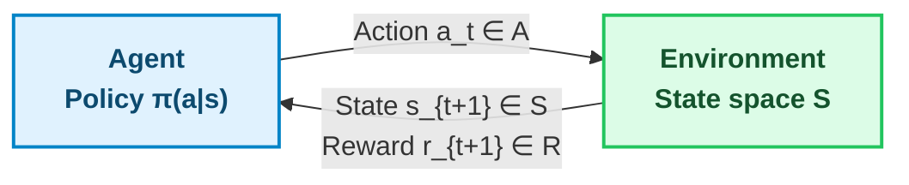
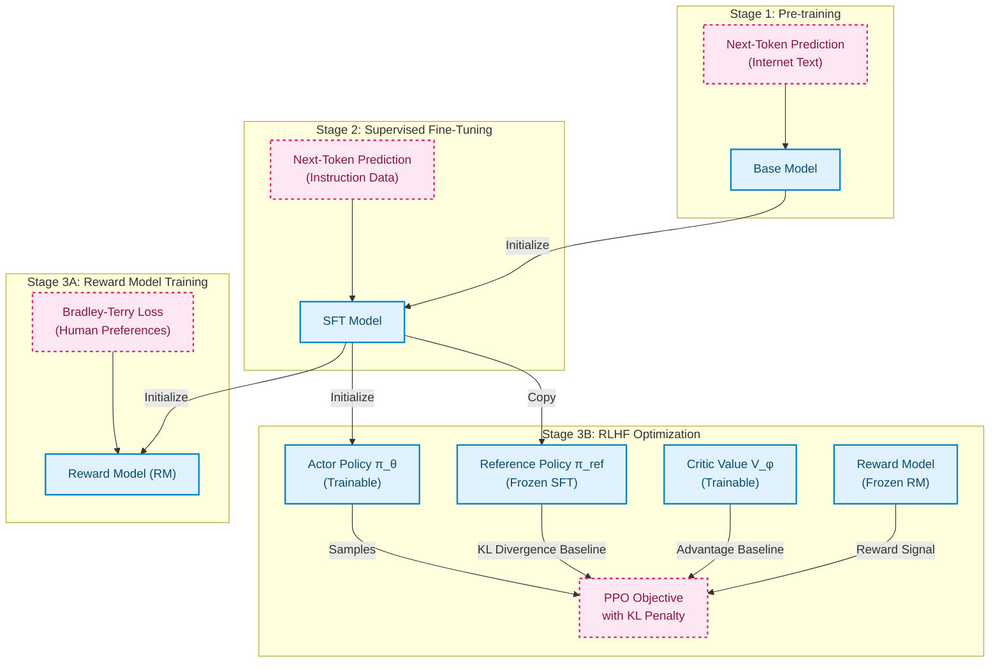
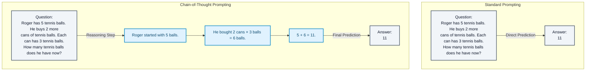
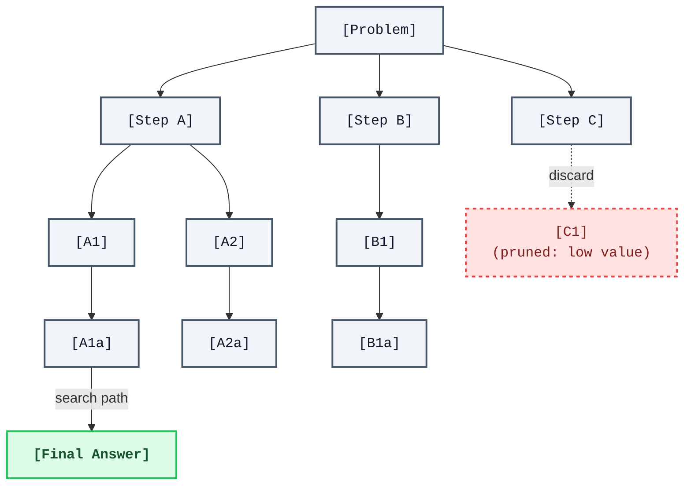
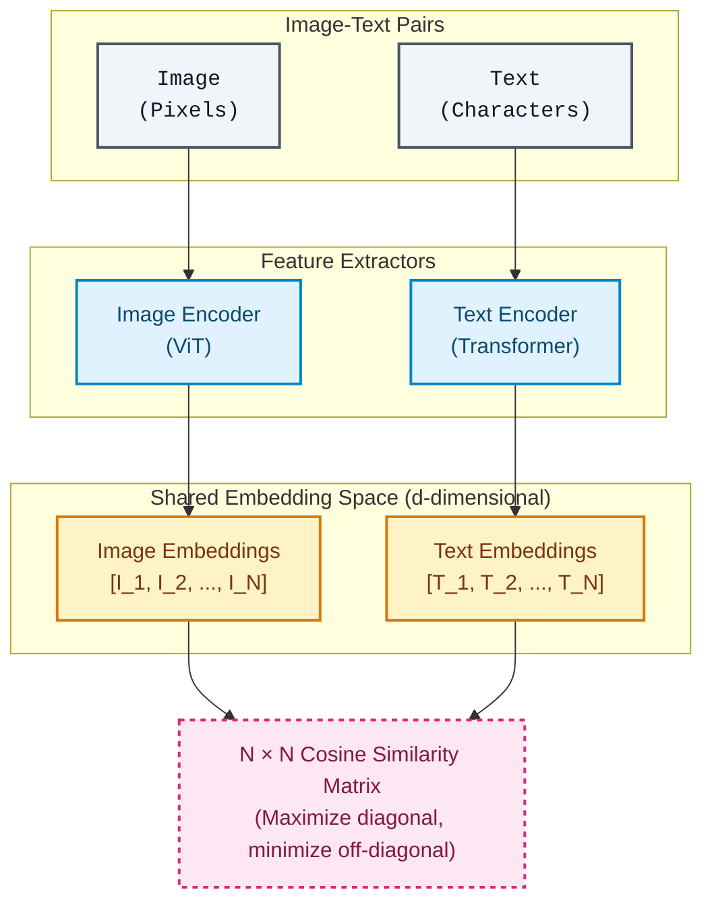
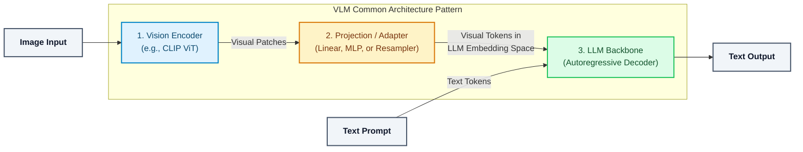

# Chapter 10: Frontiers --- Reinforcement Learning and Vision-Language Models

Everything we have built so far --- attention mechanisms, Transformer architectures, pre-training objectives, fine-tuning strategies --- converges in this chapter. Reinforcement learning (RL) provides a framework for optimizing objectives that gradient descent alone cannot reach. Vision-language models (VLMs) extend the Transformer paradigm from text into the visual world. Together, they represent the frontier of modern AI research.

This chapter is structured in three parts. Part A covers RL from first principles through its application to language model alignment and reasoning. Part B covers vision-language models, from CLIP's contrastive learning to the generative multimodal architectures driving current research. Part C provides a concrete research roadmap.

---

## Part A: Reinforcement Learning Meets Foundation Models

> **Prerequisite note.** This section covers RL from first principles — no prior RL knowledge is assumed. Readers familiar with MDPs, value functions, and policy gradients may skim to Section 10.2 (RLHF). For a comprehensive RL treatment, see Sutton & Barto (2018); this chapter covers the minimum needed to understand RLHF, DPO, GRPO, and RL for reasoning.

### 10.1 RL Fundamentals

Reinforcement learning solves a fundamentally different problem than supervised learning. In supervised learning, you have input-output pairs and minimize a differentiable loss. In RL, an agent interacts with an environment, receives sparse or delayed rewards, and must discover good behavior through trial and error. The objective --- cumulative reward over time --- is not differentiable with respect to the agent's parameters. This distinction matters: RL is how you optimize objectives that you can evaluate but cannot differentiate through.

**The Markov Decision Process (MDP).** An MDP is defined by the tuple $(S, A, P, R, \gamma)$:



- $\mathbf{S}$: the set of states the agent can occupy
- $\mathbf{A}$: the set of actions available to the agent
- $P(s' \mid s, a)$: the transition probability --- given state $s$ and action $a$, the probability of landing in state $s'$
- $R(s, a)$: the reward received for taking action $a$ in state $s$
- $\gamma \in [0, 1)$: the discount factor, controlling how much the agent values future rewards relative to immediate ones

The Markov property states that the future depends only on the current state, not the history of states. This is a modeling assumption, not a law of nature, but it makes the math tractable.

**Value Functions.** The value function $V^\pi(s)$ answers: "If I'm in state $s$ and follow policy $\pi$ from here on, what is my expected cumulative discounted reward?"

$$V^\pi(s) = \mathbb{E}_\pi \left[ \sum_{t=0}^{\infty} \gamma^t R(s_t, a_t) \;\middle|\; s_0 = s \right]$$

The action-value function $Q^\pi(s, a)$ is the same quantity, but conditioned on taking a specific first action:

$$Q^\pi(s, a) = \mathbb{E}_\pi \left[ \sum_{t=0}^{\infty} \gamma^t R(s_t, a_t) \;\middle|\; s_0 = s,\; a_0 = a \right]$$

The relationship between them is straightforward: $V^\pi(s) = \sum_a \pi(a \mid s) \cdot Q^\pi(s, a)$. The optimal policy $\pi^*$ selects the action with the highest $Q$-value in every state.

**Policy Gradient Methods.** Value-based methods (like Q-learning) learn $Q(s, a)$ and derive the policy from it. Policy gradient methods parameterize the policy directly as $\pi_\theta(a \mid s)$ and optimize $\theta$ by gradient ascent on expected return.

The **REINFORCE** algorithm (Williams, 1992) is the simplest policy gradient method. The key insight is the policy gradient theorem:

$$\nabla_\theta J(\theta) = \mathbb{E}_\pi \left[ \sum_{t=0}^{T} \nabla_\theta \log \pi_\theta(a_t \mid s_t) \cdot G_t \right]$$

where $G_t = \sum_{k=t}^{T} \gamma^{k-t} R(s_k, a_k)$ is the return from timestep $t$ onward.

The intuition: if an action led to high return, increase its probability. If it led to low return, decrease it. The log-probability gradient provides the direction; the return provides the magnitude. REINFORCE is unbiased but has high variance --- a single trajectory might not be representative. This variance problem motivates everything that follows.

**Actor-Critic Methods.** The variance of REINFORCE comes from using the raw return $G_t$ as the signal. Actor-critic methods reduce variance by subtracting a baseline --- specifically, a learned value function $V_\phi(s)$:

$$\nabla_\theta J(\theta) = \mathbb{E}_\pi \left[ \sum_t \nabla_\theta \log \pi_\theta(a_t \mid s_t) \cdot A_t \right]$$

where $A_t = Q(s_t, a_t) - V(s_t)$ is the **advantage function** --- how much better this action was compared to the average action from this state. In practice, you estimate the advantage using temporal difference (TD) errors:

$$A_t \approx r_t + \gamma \cdot V_\phi(s_{t+1}) - V_\phi(s_t)$$

The "actor" is the policy $\pi_\theta$. The "critic" is the value function $V_\phi$. Both are learned simultaneously: the critic provides a low-variance training signal for the actor.

**Proximal Policy Optimization (PPO).** PPO (Schulman et al., 2017) is the workhorse of modern RL, including all major RLHF implementations. The core problem it solves: policy gradient updates can be unstable. A large gradient step might move the policy into a bad region from which it cannot recover.

PPO uses a clipped surrogate objective. Let $r_t(\theta) = \frac{\pi_\theta(a_t \mid s_t)}{\pi_{\theta_{\text{old}}}(a_t \mid s_t)}$ be the probability ratio between the new and old policies. The PPO objective is:

$$L^{\text{CLIP}}(\theta) = \mathbb{E}_t \left[ \min\!\left( r_t(\theta) \cdot A_t,\; \text{clip}(r_t(\theta),\, 1-\varepsilon,\, 1+\varepsilon) \cdot A_t \right) \right]$$

where $\varepsilon$ is typically $0.1$ or $0.2$. The clipping prevents the ratio $r_t$ from moving too far from $1$, which means the new policy cannot deviate too much from the old policy in a single update. When the advantage is positive (good action), the ratio is clipped from above --- you cannot increase the action's probability too aggressively. When the advantage is negative (bad action), the ratio is clipped from below --- this prevents *reducing* the action's probability too aggressively, which could destabilize training by making the policy overly confident in avoiding that action.

```mermaid
graph TD
    classDef clip fill:#fee2e2,stroke:#ef4444,stroke-width:2px,color:#7f1d1d,font-weight:bold
    classDef unclip fill:#dcfce7,stroke:#22c55e,stroke-width:2px,color:#14532d,font-weight:bold
    classDef rule fill:#f1f5f9,stroke:#94a3b8,stroke-width:2px,color:#334155

    subgraph Objective ["PPO Clipping Objective: Behavior by Advantage"]
        direction TB
        
        subgraph PosAdv ["When Advantage A > 0 (Action was Good)"]
            direction LR
            P_Rule["Goal: Increase Probability<br/>(Push ratio r_t up)"]:::rule
            P1["r_t(θ) < 1+ε<br/>Gradient Flow Active"]:::unclip
            P2["r_t(θ) ≥ 1+ε<br/>Clipped (Gradient = 0)"]:::clip
            P_Rule --> P1 -->|"Reaches threshold"| P2
        end

        subgraph NegAdv ["When Advantage A < 0 (Action was Bad)"]
            direction LR
            N_Rule["Goal: Decrease Probability<br/>(Push ratio r_t down)"]:::rule
            N1["r_t(θ) > 1-ε<br/>Gradient Flow Active"]:::unclip
            N2["r_t(θ) ≤ 1-ε<br/>Clipped (Gradient = 0)"]:::clip
            N_Rule --> N1 -->|"Reaches threshold"| N2
        end
    end
```



Why PPO over alternatives like TRPO (Trust Region Policy Optimization)? TRPO uses a hard KL-divergence constraint and requires conjugate gradient methods to solve. PPO achieves similar stability with a simple clipped objective that works with standard gradient descent. It is easier to implement, easier to tune, and scales to large models. This practicality is why PPO became the default for RLHF.

### 10.2 RLHF --- RL for Language Model Alignment

**The alignment problem.** A language model trained on internet text learns to predict the next token. This objective does not inherently produce helpful, harmless, or honest behavior. The model might generate toxic content, confidently state falsehoods, or refuse to follow instructions --- all of which are consistent with "predict what the internet would say next." Alignment is the problem of steering model behavior toward human preferences.

**The three-stage pipeline.** The standard approach, established by InstructGPT (Ouyang et al., 2022), has three stages:



Stage 1 gives the model knowledge and language capability. Stage 2 (supervised fine-tuning, SFT) teaches the format --- how to follow instructions, when to refuse, etc. Stage 3 (RLHF) refines the behavior using a reward signal derived from human judgments.

**The reward model.** You cannot run RL without a reward signal. In RLHF, the reward model is trained on human preference comparisons. A human is shown two model outputs for the same prompt and indicates which they prefer. The reward model $R_\psi$ is trained to assign higher scores to preferred outputs using the **Bradley-Terry model** of pairwise comparisons:

$$P(y_w \succ y_l \mid x) = \sigma\!\left(R_\psi(x, y_w) - R_\psi(x, y_l)\right)$$

where $y_w$ is the preferred (winning) response, $y_l$ is the dispreferred (losing) response, and $\sigma$ is the sigmoid function. The loss is:

$$\mathcal{L}_{\text{RM}}(\psi) = -\mathbb{E}_{(x,\, y_w,\, y_l)} \left[ \log \sigma\!\left(R_\psi(x, y_w) - R_\psi(x, y_l)\right) \right]$$

This is binary cross-entropy over pairs. The reward model is typically initialized from the SFT model with a scalar head replacing the language modeling head.

**PPO for LLM fine-tuning.** With the reward model in hand, the LLM becomes an RL agent:

- **Policy**: the LLM $\pi_\theta$, parameterized by its weights
- **State**: the prompt $x$ plus all tokens generated so far
- **Action**: the next token to generate
- **Reward**: $R_\psi(x, y)$ applied to the complete generated response $y$

The objective maximizes expected reward while staying close to the SFT model $\pi_{\text{SFT}}$:

$$\max_\theta \; \mathbb{E}_{x \sim \mathcal{D},\; y \sim \pi_\theta(\cdot \mid x)} \left[ R_\psi(x, y) - \beta \cdot \text{KL}\!\left(\pi_\theta(\cdot \mid x) \;\|\; \pi_{\text{SFT}}(\cdot \mid x)\right) \right]$$

The **KL penalty** (controlled by $\beta$) is critical. Without it, the policy learns to exploit quirks in the reward model --- generating outputs that score high but are low-quality (reward hacking). The KL term forces the policy to stay close to the SFT model, acting as a regularizer. In practice, the KL divergence decomposes token-by-token:

$$\text{KL}(\pi_\theta \| \pi_{\text{SFT}}) = \sum_t \mathbb{E}\!\left[ \log \pi_\theta(y_t \mid x, y_{<t}) - \log \pi_{\text{SFT}}(y_t \mid x, y_{<t}) \right]$$

**InstructGPT** (Ouyang et al., 2022) demonstrated this pipeline at scale. Starting from GPT-3 (175B parameters), they collected ~13K instruction-following demonstrations for SFT, then ~33K comparison pairs for the reward model. The resulting InstructGPT models (trained at 1.3B, 6B, and 175B scales) were preferred by humans over the base GPT-3, with even the 1.3B InstructGPT variant outperforming the unaligned 175B GPT-3. This showed that alignment through RLHF can be more impactful than scaling alone.

**Direct Preference Optimization (DPO).** DPO (Rafailov et al., 2023) eliminates the reward model entirely. The key insight: under the RLHF objective with KL regularization, the optimal policy has a closed-form relationship with the reward function:

$$R(x, y) = \beta \log\frac{\pi_\theta(y \mid x)}{\pi_{\text{ref}}(y \mid x)} + \beta \log Z(x)$$

where $\pi_{\text{ref}}$ is the reference (SFT) policy and $Z(x)$ is a partition function. Substituting this into the Bradley-Terry preference model and canceling $Z(x)$:

$$P(y_w \succ y_l \mid x) = \sigma\!\left( \beta \log\frac{\pi_\theta(y_w \mid x)}{\pi_{\text{ref}}(y_w \mid x)} - \beta \log\frac{\pi_\theta(y_l \mid x)}{\pi_{\text{ref}}(y_l \mid x)} \right)$$

The DPO loss directly optimizes the policy on preference pairs:

$$\mathcal{L}_{\text{DPO}}(\theta) = -\mathbb{E}_{(x,\, y_w,\, y_l)} \left[ \log \sigma\!\left( \beta \left( \log\frac{\pi_\theta(y_w \mid x)}{\pi_{\text{ref}}(y_w \mid x)} - \log\frac{\pi_\theta(y_l \mid x)}{\pi_{\text{ref}}(y_l \mid x)} \right) \right) \right]$$

DPO is simpler (no reward model training, no RL loop), more stable (standard supervised training), and empirically competitive with PPO-based RLHF. However, DPO has notable limitations: (1) **distribution shift** — the policy drifts from the reference model during training, but the preference data was collected under the reference distribution; (2) **overfitting** with limited preference data, since there is no explicit reward model to generalize; and (3) **length exploitation** — the model can learn to produce longer outputs that score higher under the implicit reward without actually being more helpful.

**Group Relative Policy Optimization (GRPO).** GRPO (Shao et al., 2024), used in DeepSeek models, is a variant that eliminates the critic network. For each prompt, GRPO samples a group of outputs, scores them with a reward function, and computes advantages relative to the group mean. This avoids the need to train a separate value function, reducing memory and compute requirements. The advantage for output $y_i$ in a group $\{y_1, \ldots, y_G\}$ is:

$$A_i = \frac{R(y_i) - \text{mean}(R(y_1), \ldots, R(y_G))}{\text{std}(R(y_1), \ldots, R(y_G))}$$

This group-relative normalization acts as a built-in baseline, similar to how actor-critic methods use $V(s)$ as a baseline but without requiring a learned critic.

### 10.3 Chain-of-Thought Reasoning

Before we can train models to reason with RL, we must understand how reasoning in language models was discovered and progressively refined through prompting alone. The story begins with a deceptively simple observation: if you ask a large language model to show its work, it gets the right answer far more often. This section traces the intellectual lineage from chain-of-thought prompting through structured search over reasoning traces, culminating in the insight that made RL-for-reasoning possible --- that reasoning quality can be verified, and therefore optimized.

#### 10.3.1 Chain-of-Thought Prompting

**The core observation.** Wei et al. (2022) demonstrated that large language models possess latent reasoning capabilities that standard prompting fails to elicit. The key finding: when prompted to produce intermediate reasoning steps before a final answer, models achieve dramatic improvements on arithmetic, commonsense, and symbolic reasoning tasks. On the GSM8K benchmark (grade-school math word problems), chain-of-thought (CoT) prompting improved PaLM 540B from 18% to 57% accuracy --- a transformation achieved by changing nothing about the model and everything about how it was asked to respond.

The mechanism is straightforward. In standard prompting, the model maps directly from question to answer:



The few-shot variant provides several exemplars with reasoning traces in the prompt; the zero-shot variant simply appends "Let's think step by step" to the question (Kojima et al., 2022). Both work, though few-shot prompting with carefully constructed exemplars is more reliable.

**Why does this work?** The software engineering analogue is instructive: CoT is the computational equivalent of "showing your work." A programmer asked to compute the output of a nested function call in their head will make errors; the same programmer who writes out intermediate values on a whiteboard will not. The intermediate steps serve as external working memory, decomposing a multi-step computation into a sequence of individually tractable operations.

More precisely, each generated token in the reasoning trace conditions the probability distribution over subsequent tokens. When the model writes "2 cans × 3 balls = 6 balls," it has committed that intermediate result to its context window, where attention can retrieve it for the next step. Without the trace, the model must perform the entire computation implicitly within a single forward pass --- a much harder problem for any fixed-depth network.

**The scale dependence.** A critical finding from Wei et al. is that chain-of-thought prompting exhibits an emergent ability pattern: it provides little or no benefit for small models (below roughly 10B parameters) and substantial benefit for large models. On GSM8K, PaLM 8B achieved approximately the same accuracy with and without CoT, while PaLM 540B nearly tripled its accuracy. This suggests that smaller models lack the underlying capabilities that CoT unlocks --- they cannot reliably execute the individual reasoning steps, so writing them out does not help. Larger models possess the capabilities but need the structured prompting format to compose them correctly.

**Theoretical grounding.** Feng et al. (2023) provided a theoretical explanation for why chain-of-thought reasoning extends the computational power of Transformers. Their central result: a constant-depth Transformer can solve problems requiring $O(T)$ sequential computation steps if and only if it is allowed to generate $O(T)$ intermediate tokens. Without intermediate tokens, the model is limited to the complexity class $\mathsf{TC}^0$ (constant-depth threshold circuits); with a chain of thought of length $T$, it can simulate computations in $\mathsf{P}$ that require $T$ sequential steps.

The intuition maps to a familiar concept from computer architecture. A Transformer's forward pass is analogous to a combinational circuit --- it computes a fixed function in constant depth. Chain-of-thought generation is analogous to clocking a sequential circuit: each generated token corresponds to one clock cycle, and the context window serves as the register file. Without CoT, the model is a combinational circuit trying to solve inherently sequential problems. With CoT, it becomes a sequential processor whose computational depth scales with the length of the generated trace.

This result has a concrete implication: there exist problems (such as evaluating nested arithmetic expressions of arbitrary depth) that no fixed-depth Transformer can solve in a single forward pass, but that a Transformer generating a sufficiently long chain of thought can solve correctly. Chain-of-thought does not merely help models express what they already know --- it expands the class of problems they can solve in principle.

#### 10.3.2 Self-Consistency

Chain-of-thought prompting produces a single reasoning trace via greedy or nucleus sampling. But a single trace can go wrong at any step, and once an error is introduced, subsequent steps often compound it. Wang et al. (2023) proposed **self-consistency**, a simple but powerful improvement: sample multiple independent reasoning paths and take a majority vote on the final answer.

```
Self-consistency (k = 5 sampled paths):

  Path 1:  5 + (2 × 3) = 5 + 6 = 11  →  Answer: 11
  Path 2:  5 + 2 + 3 = 10             →  Answer: 10
  Path 3:  5 + (2 × 3) = 5 + 6 = 11  →  Answer: 11
  Path 4:  (5 + 2) × 3 = 21           →  Answer: 21
  Path 5:  5 + (2 × 3) = 5 + 6 = 11  →  Answer: 11

  Majority vote:  11 (3/5 paths agree)  ✓
```

The software engineering analogue is **ensemble voting** or, more precisely, N-version programming: run multiple independent implementations and take the consensus output. The key insight is that reasoning errors in different samples tend to be independent --- different paths fail in different ways --- so majority voting filters out stochastic errors while preserving the correct answer, which multiple paths converge upon.

Self-consistency improved CoT accuracy on GSM8K from 57% to 74% (PaLM 540B) with $k = 40$ sampled paths. The method requires no additional training, no architectural changes, and no reward model --- only the computational cost of sampling $k$ completions instead of one. It is a pure inference-time technique, trading compute for accuracy.

The deeper significance of self-consistency is what it revealed about the relationship between inference-time compute and reasoning quality. Before self-consistency, the prevailing assumption was that a model's reasoning ability was fixed at the end of training. Self-consistency showed that accuracy could be substantially improved after training, simply by spending more compute at inference time. This was the first clear signal that **test-time compute scaling** --- the idea that you can improve outputs by thinking longer rather than training longer --- was a viable research direction.

#### 10.3.3 Tree of Thoughts

Self-consistency samples multiple complete reasoning paths independently. But what if you could make smarter decisions about which paths to explore? Yao et al. (2023) proposed the **Tree of Thoughts (ToT)** framework, which structures reasoning as a search problem over a tree of partial solutions.



In ToT, the language model serves two roles: it **proposes** candidate next steps (expanding the tree), and it **evaluates** partial reasoning states (estimating which branches are promising). Search then proceeds via breadth-first search (BFS) or depth-first search (DFS) with backtracking over the tree of partial solutions.

The computer science analogue is explicit: ToT is **beam search** applied to reasoning, where the "beam" consists of the most promising partial reasoning states rather than the most probable token sequences. For readers familiar with classical AI, this is A* or best-first search with the language model serving as both the successor function and the heuristic evaluator.

Yao et al. demonstrated that ToT substantially outperforms standard CoT on tasks requiring lookahead and backtracking --- problems like the "Game of 24" (combining four numbers with arithmetic operations to reach 24), crossword puzzles, and creative writing planning. On the Game of 24, standard CoT prompting with GPT-4 solved 4% of problems; ToT with the same model solved 74%.

The limitation of ToT is cost: each node expansion and evaluation requires one or more LLM inference calls. A tree with branching factor $b$ and depth $d$ requires $O(b^d)$ calls in the worst case, though pruning via the evaluation function reduces this substantially. This cost is acceptable for high-value tasks (theorem proving, complex planning) but prohibitive for low-latency applications. ToT made explicit the tradeoff that defines all subsequent work in this area: **reasoning quality can be improved by spending more inference-time compute on structured search, but the cost grows combinatorially.**

#### 10.3.4 Least-to-Most Prompting

A complementary approach to structured search is structured decomposition. Zhou et al. (2023) proposed **least-to-most prompting**, which decomposes complex problems into a sequence of simpler subproblems, solves each subproblem in order, and uses earlier solutions as context for later ones.

```
Least-to-most prompting:

  Original problem:
    "If there are 3 cars in the parking lot and 2 more arrive,
     then 5 more arrive, how many cars are in the lot?"

  Decomposition:
    Subproblem 1: "How many cars after the first 2 arrive?"
    Subproblem 2: "How many cars after 5 more arrive?"

  Sequential solution:
    Sub 1: 3 + 2 = 5 cars
    Sub 2: 5 (from Sub 1) + 5 = 10 cars

  Final answer: 10
```

The software engineering analogue is **recursive decomposition** or top-down structured programming: break a complex function into subroutines, implement each subroutine independently, and compose the results. Least-to-most prompting is particularly effective on problems that require compositional generalization --- applying known solution strategies to novel combinations of subproblems. On the SCAN compositional generalization benchmark, least-to-most prompting improved GPT-3 accuracy from 16% (standard prompting) to 99.7%.

The key difference from chain-of-thought is that least-to-most prompting makes the decomposition structure explicit. In CoT, the model produces a linear trace and may or may not decompose the problem sensibly. In least-to-most, decomposition is a first-class operation: the model first generates the sequence of subproblems, then solves each one. This two-phase structure provides a form of planning before execution, analogous to query planning in database systems before query execution.

#### 10.3.5 The Prompting-to-Training Transition

The methods above --- CoT, self-consistency, ToT, least-to-most --- share a crucial property: they are all **inference-time** techniques. They improve reasoning without modifying a single model parameter. This is both their strength (any model can benefit, no training required) and their limitation (the model's underlying reasoning capability is fixed; prompting can only elicit what is already there).

The intellectual progression from these methods to RL-trained reasoning follows a clear logic:

1. **Chain-of-thought** showed that intermediate reasoning traces dramatically improve accuracy. Implication: the *format* of generation matters as much as the model's raw capability.
2. **Self-consistency** showed that sampling multiple traces and selecting the best answer yields further improvement. Implication: the model *already generates correct reasoning paths some fraction of the time* --- the challenge is identifying and reinforcing them.
3. **Tree of Thoughts** showed that structured search with evaluation of partial solutions outperforms naive sampling. Implication: if you could *train* a model to evaluate reasoning steps, you could guide generation more effectively.
4. **Least-to-most prompting** showed that explicit problem decomposition yields compositional generalization. Implication: reasoning strategies can be taught, not just elicited.

Each observation points toward the same conclusion: if reasoning traces can be evaluated (either by majority vote, by a search heuristic, or by a trained verifier), then they can be *optimized*. And optimization of a non-differentiable objective --- the correctness of a multi-step reasoning chain --- is precisely the domain of reinforcement learning. But before we turn to optimization via RL, a broader principle demands attention: the observation that spending more compute at inference time --- whether through sampling, search, or extended reasoning --- systematically improves output quality. This is the subject of the next section. After establishing the framework of test-time compute scaling, we will see how process reward models provide the evaluation signal and RL provides the optimization framework to train models that generate better reasoning traces from the start.

### 10.4 Test-Time Compute and Inference-Time Scaling

The preceding section traced a progression: chain-of-thought prompting showed that reasoning traces improve accuracy; self-consistency showed that sampling multiple traces and selecting among them improves it further; Tree of Thoughts showed that structured search over partial solutions improves it further still. Each step increased the amount of computation spent at inference time --- and each step improved the quality of the output. This pattern is not coincidental. It reflects a fundamental principle that has reshaped how the field thinks about language model capability: **you can improve a model's outputs by spending more compute at inference time, without changing a single parameter.**

Chapter 5 introduced training-time scaling laws. Kaplan et al. (2020) and Hoffmann et al. (2022) showed that language model performance improves as a smooth power law in training compute --- larger models trained on more data produce lower loss. These laws converted the research question "will scaling help?" into an engineering question: "how should I allocate my compute budget between model size and training data?" Inference-time scaling laws ask the complementary question: given a fixed, already-trained model, how does performance improve as a function of the compute spent generating each answer?

The answer, established empirically across multiple research groups, is that inference-time performance also follows approximate scaling laws --- roughly log-linear relationships where accuracy improves as a predictable function of the logarithm of inference compute. This regularity means that inference-time scaling is not a heuristic trick but a systematic and predictable lever for improving model behavior.

The implications for practitioners are significant. Training-time scaling requires retraining or fine-tuning a model --- weeks of GPU time at frontier scale, billions of dollars for the largest models. Inference-time scaling requires only additional forward passes through an existing model. For many workloads, especially those involving difficult problems at moderate query volumes, inference-time compute can *substitute* for model scale: a smaller model that "thinks longer" can match or exceed a larger model that answers in a single pass.

#### 10.4.1 The Software Engineering Analogy

The concept maps cleanly to everyday software engineering experience. Consider the difference between a senior engineer who answers a design question instantly and a more junior engineer who takes two hours to draft three candidate architectures, evaluate each against the requirements, identify failure modes, and select the best option. For routine questions, the senior's immediate answer is efficient and correct. For genuinely hard problems --- subtle race conditions, complex distributed system trade-offs --- the junior's methodical generate-and-test process may produce a superior answer, because the problem is hard enough that even an expert's first instinct is unreliable.

Test-time compute scaling is the AI equivalent. A language model's single forward pass is analogous to the senior's snap judgment: fast, usually good, but bounded by whatever pattern the model learned during training. Spending more inference compute --- generating multiple candidate answers, verifying each, searching over reasoning paths --- is analogous to the junior's deliberate process. The model compensates for the limitations of any single generation by exploring more of the solution space.

A second analogy is equally illuminating: **search plus verification is fundamentally easier than direct synthesis.** In computational complexity, $\mathsf{NP}$ is the class of problems where solutions are hard to find but easy to verify. Many real-world reasoning tasks share this asymmetry. Generating a correct proof of a mathematical theorem in one shot is extremely difficult; generating ten candidate proofs and checking each against the axioms is far more tractable. Test-time compute scaling exploits this asymmetry: the language model is the proposal generator, and a verifier (a reward model, a test suite, or a formal checker) is the solution validator. Together, they solve problems that neither could handle alone.

#### 10.4.2 Best-of-N Sampling

The simplest form of test-time compute scaling is **best-of-N sampling** (also called rejection sampling or re-ranking). Given a prompt, sample $N$ independent completions from the model, score each with a verifier, and return the highest-scoring completion. No additional training is required --- only the cost of $N$ forward passes and $N$ verifier evaluations.

The mathematics is straightforward. If a single sample has probability $p$ of being correct, and samples are independent, then the probability that at least one of $N$ samples is correct is:

$$P(\text{at least one correct out of } N) = 1 - (1 - p)^N$$

For $p = 0.3$ and $N = 10$, this is $1 - 0.7^{10} \approx 0.97$. For $p = 0.1$ and $N = 50$, it is $1 - 0.9^{50} \approx 0.995$. The improvement is dramatic for moderate $p$, though it exhibits diminishing returns: doubling $N$ when $p$ is already high yields little additional benefit.

The critical assumption is that the verifier can reliably distinguish correct from incorrect solutions. For domains with deterministic ground truth --- mathematics (check the numerical answer), coding (run the test suite), formal logic (verify the proof) --- the verifier can be exact, and best-of-N scaling is limited only by the model's ability to generate at least one correct solution in $N$ attempts. For open-ended domains (creative writing, general question answering), the verifier must be a learned model, and the quality of that verifier sets the ceiling on best-of-N performance.

The compute cost scales linearly with $N$: you pay for $N$ forward passes through the model plus $N$ verifier evaluations. For a model that costs $C$ FLOPs per completion, best-of-$N$ costs $N \cdot C$ FLOPs total. This linear scaling makes best-of-N predictable to budget, unlike tree search methods whose cost depends on branching factor and pruning effectiveness.

Self-consistency (Section 10.3.2) is a special case of best-of-N where the "verifier" is majority vote over final answers rather than a trained reward model. Best-of-N with a learned verifier generalizes this: the verifier can assess solution quality on dimensions that majority vote cannot --- for example, preferring a correct solution with sound reasoning over a correct solution that arrived at the right answer by accident.

#### 10.4.3 The Verifier: Outcome vs. Process Reward Models

The choice of verifier is the most consequential design decision in test-time compute scaling. It determines both the ceiling on performance and the rate at which additional compute translates into accuracy gains.

An **outcome reward model (ORM)** scores complete solutions: given a prompt and a full response, it produces a scalar score estimating correctness or quality. An ORM is trained on $(prompt, response, label)$ triples, where the label indicates whether the complete response is correct. When used as a verifier in best-of-N, the ORM scores each of the $N$ candidate solutions end-to-end and selects the highest-scoring one.

A **process reward model (PRM)** scores each intermediate reasoning step. Given a prompt and a partial solution up to step $k$, the PRM produces a score estimating the probability that step $k$ is correct, conditioned on all preceding steps being correct. When used as a verifier, the PRM aggregates step-level scores --- typically by taking the minimum step-level score (the "weakest link") or the product of step-level probabilities --- to produce a solution-level score for ranking.

The distinction matters because of the discrimination problem. Consider selecting among $N = 100$ candidate solutions to a 12-step mathematics problem. Many incorrect solutions contain only a single flawed step; the remaining 11 steps are correct and follow logically from each other (including from the flawed step). An ORM must detect these subtle, localized errors from the final output alone --- a difficult pattern-recognition task, especially when the error in step 3 produces a final answer that "looks plausible." A PRM examines each step independently and can pinpoint that step 3 introduced an error, even if all subsequent steps are internally consistent.

Lightman et al. (2023) provided the definitive empirical comparison. On the MATH benchmark, they generated $N$ candidate solutions per problem and selected the best according to either an ORM or a PRM. The PRM-based selection substantially outperformed ORM-based selection, and crucially, the gap *widened as $N$ increased*. At small $N$, both verifiers perform similarly because most candidates are clearly right or clearly wrong. At large $N$, the candidate pool contains many "almost correct" solutions that differ in subtle ways, and the PRM's step-level granularity becomes decisive.

**Training a PRM** requires step-level supervision: for each reasoning step in a solution, a binary label indicating whether that step is correct. Lightman et al. collected approximately 800,000 step-level human annotations --- human mathematicians evaluated individual reasoning steps in model-generated solutions. This is expensive, but the resulting PRM enables substantially more effective test-time compute scaling than an ORM trained on the same volume of data.

An alternative is **automatic step-level labeling via Monte Carlo rollouts**. From each intermediate step $k$ in a solution, sample $M$ independent completions to the final answer. If a large fraction reach the correct final answer, step $k$ is likely correct; if few or none do, step $k$ likely contains an error. This trades human annotation cost for compute cost. The quality of the resulting labels depends on $M$ and on the model's ability to recover from (or fail to recover from) errors in preceding steps, but in practice the approach produces PRMs that are competitive with those trained on human annotations.

The connection between PRMs and test-time compute is tight: a PRM is not merely a better reward model --- it is the *enabling component* for efficient test-time search. Without a reliable step-level verifier, scaling $N$ in best-of-N yields diminishing returns because the selector cannot distinguish genuinely sound solutions from plausible-looking wrong ones. With a strong PRM, each additional sample provides genuine discriminative information, and the accuracy curve as a function of $N$ remains steep far longer.

#### 10.4.4 Tree Search over Reasoning Traces

Best-of-N generates $N$ complete solutions independently. This is wasteful: if the first three steps of a reasoning chain are correct but step four is wrong, best-of-N discards the entire solution and starts fresh. A more compute-efficient approach is to search over *partial* solutions, pruning unpromising branches early and reallocating compute to promising ones.

This is the domain of **Monte Carlo Tree Search (MCTS)**, the algorithm behind AlphaGo's superhuman Go play, now adapted for language model reasoning. The adaptation treats each reasoning step as a node in a search tree:

```
                        [Problem]
                       /    |    \
                   Step 1a  Step 1b  Step 1c
                  /    \       |
            Step 2a  Step 2b  Step 2b'
            /                    \
       Step 3a               Step 3b
          |                     |
       [Answer: 42]          [Answer: 37]
```

The language model proposes candidate next steps (**expansion**). A value model --- often a PRM --- evaluates partial solutions (**evaluation**). The UCB1 (Upper Confidence Bound) formula balances **exploration** of under-visited branches against **exploitation** of branches with high estimated value. After each rollout, **backpropagation** updates the value estimates of ancestor nodes based on the outcome.

The connection to classical AI is direct. MCTS for LLM reasoning is structurally identical to MCTS for board games: the "board position" is the partial reasoning chain, the "legal moves" are candidate next steps proposed by the LLM, and the "evaluation function" is the PRM or value model. What has changed is the domain (natural language reasoning rather than Go) and the proposal mechanism (a language model rather than a rule-based move generator).

The progression from Tree of Thoughts (Section 10.3.3) to MCTS is natural. ToT uses the LLM itself as an ad hoc evaluator and employs simple BFS or DFS. MCTS replaces the ad hoc evaluator with a trained value model (such as a PRM) and uses a principled exploration-exploitation strategy to allocate search effort. Where ToT demonstrated that structured search over reasoning traces improves accuracy, MCTS demonstrates that *learned evaluation combined with principled search* improves it further --- and does so more compute-efficiently, because it prunes unpromising branches after one or two steps rather than completing every candidate solution.

#### 10.4.5 Internal Scaling: The o1/o3 Paradigm

The methods above --- best-of-N, PRM-guided selection, MCTS --- are all forms of **external scaling**: an outer loop generates multiple candidates, evaluates them, and selects or combines the results. The language model itself is unchanged; the additional compute is spent in the search and verification infrastructure that wraps around it.

A complementary approach is **internal scaling**: training the model to spend more compute *within a single generation* by producing extended reasoning traces before committing to an answer. OpenAI's o1 (2024) and o3 (2025) models are the most prominent examples of this paradigm. While full technical details remain unpublished, the general approach is understood from published descriptions and from open-source implementations, most notably DeepSeek-R1:

1. **Start with a strong base model** --- pre-trained and instruction-tuned using the standard pipeline (Chapters 5 and 9).
2. **Train with RL to produce reasoning traces.** Using reinforcement learning (PPO or GRPO, as covered in Section 10.2), train the model to generate extended chains of reasoning before producing a final answer. The reward signal is based on final-answer correctness. The model learns, through RL optimization, that producing intermediate reasoning steps increases expected reward.
3. **Scale inference compute at deployment.** At inference time, allow the model to generate long reasoning traces --- potentially thousands of tokens --- before committing to an answer. The length of the reasoning trace becomes the inference-time compute knob: more thinking tokens means more compute, and (up to a point) better answers.

This is not simply chain-of-thought prompting applied to a standard model. CoT prompting (Section 10.3.1) elicits reasoning from a model that was not specifically trained to reason in extended chains. The o1 paradigm goes further: the model is *trained with RL* to produce reasoning traces that lead to correct answers. Through RL training, the model develops internal reasoning behaviors --- exploring alternative approaches, checking intermediate results, backtracking from errors --- that *emerge from optimization pressure* rather than from explicit supervision on what "good reasoning" looks like.

The practical consequence is a new, continuous scaling axis. At inference time, you can control the compute budget by adjusting how many tokens the model generates before committing to an answer. A model that generates 100 thinking tokens will perform differently from the same model generating 10,000 thinking tokens --- analogous to giving a human test-taker five minutes versus two hours on a difficult problem.

#### 10.4.6 DeepSeek-R1: RL-Trained Reasoning in Detail

DeepSeek-R1 provides the most detailed published account of the o1 paradigm. The model is trained using GRPO (Section 10.2) with reward signals based on two components: (1) answer correctness for mathematics and coding tasks, verified against ground-truth solutions or test suites, and (2) format-compliance rewards that ensure the model wraps its reasoning in designated `<think>` tags, separating the reasoning trace from the final answer.

Through RL training alone --- without explicit supervision on what reasoning should look like --- DeepSeek-R1 develops sophisticated reasoning behaviors:

- **Exploration of multiple approaches**: the model generates one solution strategy, evaluates whether it is working, and switches to a different approach when the first one stalls.
- **Self-verification**: the model checks intermediate results ("Let me verify: 7 times 13 is 91, which matches") before proceeding.
- **Backtracking**: the model recognizes when a line of reasoning has led to a contradiction and explicitly returns to an earlier point to try a different path.
- **Adaptive effort allocation**: the model produces short reasoning traces for easy problems and long traces for hard ones, effectively learning to allocate its own inference compute based on problem difficulty.

These behaviors emerge from the reward signal alone. Early in RL training, the model's reasoning traces are short and disorganized. As training progresses, the traces become longer, more structured, and more effective. The model independently discovers strategies like "let me try a different approach" and "let me verify this result" --- strategies that were never present in the training data as explicit instructions. This emergence is reminiscent of how AlphaGo discovered novel Go strategies through self-play that human experts had never considered.

DeepSeek-R1 also reveals the synergy between internal and external scaling. The model's RL-trained reasoning traces are higher quality than those produced by a base model with CoT prompting, which means that external methods (best-of-N sampling, MCTS) applied *on top of* the RL-trained model yield even larger gains than when applied to a base model. The two forms of scaling are complementary, not redundant.

#### 10.4.7 The Compute-Optimal Frontier

Training-time and inference-time compute are not independent knobs; they interact. Consider a fixed total budget $C_{\text{total}}$ for deploying a model on $N$ queries:

$$C_{\text{total}} = C_{\text{train}} + N \cdot c_{\text{infer}}$$

where $C_{\text{train}}$ is the one-time cost of training the model and $c_{\text{infer}}$ is the per-query inference cost. A large model with single-pass inference places most budget in $C_{\text{train}}$ and minimizes $c_{\text{infer}}$. A smaller model with heavy test-time compute (best-of-N, tree search, long reasoning traces) shifts budget toward the second term.

The optimal split depends on two factors:

1. **Query volume $N$.** For billions of simple queries (autocomplete, classification), training a large, fast model dominates --- the per-query savings from single-pass inference compound across billions of queries. For a small number of hard queries (mathematical research, complex code generation), heavy inference-time compute on a smaller model can be more cost-effective.

2. **Difficulty distribution.** If most queries are easy and a few are hard, the optimal strategy is a fast model for easy queries with a "thinking mode" (extended reasoning or search) activated only for hard queries. This difficulty-adaptive routing is how modern systems like o1 operate in practice: the model estimates problem difficulty and allocates inference compute accordingly.

Snell et al. (2024) formalized the compute-optimal frontier for inference-time scaling, showing that the optimal allocation between training and inference compute depends on the specific performance target and the shape of both scaling curves. A key finding: for many practical settings, the field has historically *under-invested* in inference-time compute relative to the optimum. The intuition is that training-time scaling faces a hard wall (you train once, then deploy), whereas inference-time scaling can be applied selectively to the queries that benefit most.

This analysis extends the Chinchilla insight from Chapter 5. Chinchilla showed that for a fixed training budget, the optimal allocation between model size and data is roughly balanced (not skewed toward larger models, as was previously believed). The inference-time scaling analogue shows that for a fixed total deployment budget, the optimal allocation between training and inference is also more balanced than conventional practice assumes --- especially for high-difficulty workloads.

#### 10.4.8 Practical Implications

Test-time compute scaling reshapes how practitioners think about model deployment:

1. **Difficulty-adaptive compute.** Not all queries require the same inference budget. A factual recall question ("What is the capital of France?") needs a single forward pass. A competition-level mathematics problem benefits from thousands of tokens of reasoning or dozens of candidate solutions. Practical systems route queries to different compute tiers based on estimated difficulty, analogous to how a software system might route simple reads to a cache and complex queries to a database.

2. **Smaller models with more inference.** For low-volume, high-difficulty workloads (research, complex analysis), a smaller model with heavy test-time compute can be more cost-effective than a frontier-scale model with single-pass inference. This democratizes access to high-quality reasoning: organizations that cannot afford to train or host a trillion-parameter model can achieve comparable results by running a smaller model with search and verification.

3. **Verifier investment.** The quality ceiling of test-time compute scaling is set by the verifier. Investing in better PRMs, domain-specific verifiers, or formal verification tools (for code and mathematics) raises this ceiling. For software engineering applications, the most natural verifier is the test suite itself --- generate candidate code, run tests, select the implementation that passes. This is the principle behind AI coding agents that iterate on solutions until the test suite is green.

4. **Limits of inference scaling.** Test-time compute is bounded by the model's fundamental capability. A model that has never encountered a concept during training cannot reason its way to understanding it at inference time, regardless of how many tokens it generates. Test-time compute amplifies existing capability; it does not create capability from nothing. This mirrors the human case: deliberation helps with problems within your competence, but no amount of thinking will solve a problem that requires knowledge you do not possess.

With the framework of test-time compute scaling established, we can now examine how RL closes the loop: training models to generate better reasoning traces from the start, using the very verifiers (PRMs) that also guide test-time search.

### 10.5 RL for Reasoning

The preceding two sections established two halves of a whole. Section 10.3 showed that prompting techniques --- chain-of-thought, self-consistency, tree search --- can elicit and improve reasoning at inference time. Section 10.4 showed that test-time compute scaling is a systematic, predictable lever: more inference compute yields better outputs, with the verifier quality (particularly PRMs) setting the ceiling. The central question now is: rather than only searching over a base model's outputs at test time, can we *train* the model itself to reason better? The answer is yes, and RL provides the framework. Crucially, the verifiers developed for test-time compute scaling --- particularly process reward models --- serve double duty: they are both the selection mechanism at inference time and the reward signal for RL training.

**Process reward models for RL training** (Lightman et al., 2023). As introduced in Section 10.4.3, a process reward model (PRM) scores each intermediate reasoning step, while an outcome reward model (ORM) scores only the final answer. The significance of PRMs for RL training extends beyond their role as test-time verifiers. When used as the reward signal in an RL loop, PRMs provide **dense, step-level feedback** --- the model learns not just that its final answer was wrong, but *which step* went wrong. This dramatically accelerates RL training compared to sparse, outcome-only rewards, for the same reason that detailed code review accelerates developer learning more than a binary pass/fail from a test suite.

Lightman et al. (2023) collected approximately 800,000 step-level human annotations and demonstrated that PRM-guided best-of-$N$ selection substantially outperforms ORM-guided selection on the MATH benchmark. The gap widens with increasing $N$, confirming the theoretical prediction from Section 10.4.3: finer-grained verification becomes more valuable as the candidate pool grows and the discrimination problem becomes harder.

**Monte Carlo Tree Search (MCTS) for LLM reasoning.** With PRMs providing reliable step-level evaluation, MCTS (Section 10.4.4) becomes the natural search algorithm for RL-trained reasoning models. The PRM evaluates nodes in the search tree, enabling principled allocation of search budget: branches with low PRM scores are pruned early, while promising branches receive additional expansion. This is substantially more compute-efficient than best-of-N for the same effective search depth, because compute is not wasted completing solutions that contain early errors.

**DeepSeek-R1 and the o1 paradigm.** As detailed in Sections 10.4.5 and 10.4.6, DeepSeek-R1 applies RL (specifically GRPO, from Section 10.2) to train long-form reasoning, demonstrating that sophisticated reasoning behaviors --- self-correction, hypothesis testing, backtracking, adaptive effort allocation --- emerge from reward optimization alone. DeepSeek-R1 represents the culmination of the intellectual arc traced through these sections:

- **Chain-of-thought prompting** showed that reasoning traces help.
- **Self-consistency** showed that sampling multiple traces and selecting among them helps further.
- **Test-time compute scaling** showed that inference compute is a systematic and predictable lever.
- **Process reward models** showed that you can train dedicated verifiers to evaluate reasoning quality at each step.
- **DeepSeek-R1** (and OpenAI's o1 before it) showed that you can close the loop entirely: use RL to train the model itself to generate better reasoning traces, with correctness as the reward signal, and then further amplify that trained reasoning ability with test-time search and verification.

The model no longer needs to be prompted to reason --- it has internalized the reasoning strategy through optimization. And the internal and external scaling mechanisms are complementary: an RL-trained reasoning model benefits even more from best-of-N and MCTS than a base model does, because its individual reasoning traces are already higher quality, giving the search process a stronger starting distribution to work with.

### 10.6 Decision Transformer

The Decision Transformer (Chen et al., 2021) reframes RL as sequence modeling. Instead of learning value functions or policy gradients, it trains a Transformer on trajectories of (return-to-go, state, action) tuples:

```
Input sequence:  R_1, s_1, a_1, R_2, s_2, a_2, ..., R_t, s_t, a_t
                  ^                ^                    ^
              desired return   desired return       desired return
              from step 1     from step 2          from step t
```

At test time, you condition on a high desired return, and the Transformer generates actions consistent with achieving that return. The architecture is a standard causal Transformer --- the same one used for language modeling.

Why this matters:

1. **Unification.** RL and sequence modeling are no longer separate paradigms. The same architecture (Transformer) and training procedure (next-token prediction on trajectories) handles both.
2. **No bootstrapping.** Unlike Q-learning or actor-critic, there is no recursive value estimation, which eliminates a major source of instability.
3. **Conditioning on goals.** The return-to-go acts as a goal specification. Want cautious behavior? Condition on moderate returns. Want aggressive optimization? Condition on high returns.
4. **Offline RL.** Decision Transformer works naturally with fixed datasets of past experience, without needing to interact with the environment during training.

The limitation is that it requires pre-collected trajectory data --- it cannot explore on its own. But for many applications, especially those involving language models where generating trajectories is cheap, this is not a major constraint.

### 10.7 Multi-Agent RL and LLM Agents

Modern LLM agents combine language models with tool use, planning, and self-reflection. The framing: **RL provides the decision-making framework; LLMs provide the world knowledge.**

An LLM agent typically operates in a loop:

```
+----------+     +-----------+     +---------+     +----------+
| Observe  | --> |  Reason   | --> |   Act   | --> | Evaluate |
| (state)  |     | (LLM      |     | (tool   |     | (reward/ |
|          |     |  inference)|     |  call)  |     |  critic) |
+----------+     +-----------+     +---------+     +----------+
      ^                                                  |
      +--------------------------------------------------+
```

Key components:

- **Tool use**: The agent can call external tools (search engines, code interpreters, calculators). Each tool call is an action in the RL sense.
- **Planning**: The agent decomposes complex tasks into subtasks. Methods range from simple chain-of-thought to explicit plan generation and revision.
- **Self-reflection**: The agent critiques its own outputs and corrects errors. This is a form of online reward estimation --- the LLM acts as its own critic.
- **Memory**: The agent maintains a working memory (context window) and sometimes a long-term memory (retrieval-augmented).

Multi-agent systems extend this to multiple agents collaborating or competing. Agents might specialize (one for coding, one for searching, one for planning) and communicate through natural language. The multi-agent RL framework provides tools for analyzing equilibria and coordination, while LLMs provide the communication and reasoning substrate.

---

## Part B: Vision-Language Models

### 10.8 CLIP --- The Foundational VLM

> **Cross-reference note.** Chapter 6 introduces CLIP, LLaVA, and Flamingo from the architectural perspective — how ViT enables vision-language integration. This chapter covers these models in the context of training, alignment, and the convergence with reinforcement learning.

CLIP (Contrastive Language-Image Pre-training) (Radford et al., 2021) changed the relationship between vision and language in AI. Before CLIP, vision models were trained on fixed label sets (ImageNet's 1000 classes). CLIP showed that training on image-text pairs from the internet produces a model that understands both modalities and generalizes to tasks it was never explicitly trained for.

**Architecture.** CLIP has two encoders:



The image encoder is a Vision Transformer (ViT, as covered in Chapter 6). The text encoder is a standard Transformer. Both produce embeddings in the same $d$-dimensional space.

**Contrastive loss.** Given a batch of $N$ image-text pairs, CLIP computes an $N \times N$ similarity matrix. The diagonal entries (matching pairs) should be high; off-diagonal entries (non-matching pairs) should be low. The loss is symmetric cross-entropy:

$$\mathcal{L}_{\text{CLIP}} = \frac{1}{2}\left(\mathcal{L}_{\text{image} \to \text{text}} + \mathcal{L}_{\text{text} \to \text{image}}\right)$$

$$\mathcal{L}_{\text{image} \to \text{text}} = -\frac{1}{N} \sum_{i} \log \frac{\exp\!\left(\text{sim}(I_i, T_i) / \tau\right)}{\sum_{j} \exp\!\left(\text{sim}(I_i, T_j) / \tau\right)}$$

$$\mathcal{L}_{\text{text} \to \text{image}} = -\frac{1}{N} \sum_{i} \log \frac{\exp\!\left(\text{sim}(T_i, I_i) / \tau\right)}{\sum_{j} \exp\!\left(\text{sim}(T_i, I_j) / \tau\right)}$$

where $\text{sim}(I, T) = \frac{I \cdot T}{\|I\| \cdot \|T\|}$ is cosine similarity and $\tau$ is a learned temperature parameter. This is essentially an InfoNCE loss applied bidirectionally.

**Training scale.** CLIP was trained on 400 million image-text pairs scraped from the internet (the WIT dataset). This scale is what enables generalization --- the model sees enough diversity to learn genuinely general visual concepts.

**Zero-shot classification.** To classify an image into one of $K$ classes, encode each class name as text (e.g., "a photo of a dog", "a photo of a cat"), compute similarity with the image embedding, and select the highest-scoring class. No task-specific training is required. The largest CLIP model (ViT-L/14@336px) matched the performance of a supervised ResNet-50 on ImageNet using zero-shot transfer alone — smaller CLIP variants fell short of this benchmark.

**Why CLIP changed everything.** Before CLIP, vision and language were separate worlds with separate training pipelines. CLIP showed that a single pre-training objective (contrastive alignment of images and text) produces representations useful for both modalities. It enabled zero-shot transfer, open-vocabulary recognition, and --- crucially --- it provided the vision encoder that nearly every subsequent VLM builds upon.

### 10.8.1 Code: CLIP Zero-Shot Classification and Similarity Search

> **Dependencies:** `pip install transformers torch torchvision Pillow requests`

Two practical examples: zero-shot image classification using CLIP's text-image similarity, and embedding a batch of images to find the most similar one to a text query. Both run without any task-specific training.

```python
import torch
import requests
from PIL import Image
from transformers import CLIPProcessor, CLIPModel

DEVICE = "cuda" if torch.cuda.is_available() else "cpu"

# ── Load CLIP (ViT-B/32 backbone, ~150M params) ───────────────────────────────
model     = CLIPModel.from_pretrained("openai/clip-vit-base-patch32").to(DEVICE)
processor = CLIPProcessor.from_pretrained("openai/clip-vit-base-patch32")
model.eval()


# ── Helper: fetch a sample image from a URL ───────────────────────────────────
def load_image_from_url(url):
    return Image.open(requests.get(url, stream=True).raw).convert("RGB")


# Use a public domain image of a cat for demonstration
img_url = "http://images.cocodataset.org/val2017/000000039769.jpg"
image   = load_image_from_url(img_url)


# ── Part 1: Zero-shot classification ─────────────────────────────────────────
# CLIP compares the image against a set of text descriptions and picks the best match.
# No classifier was trained for these labels — similarity in the shared embedding
# space is sufficient.
candidate_labels = [
    "a photo of a cat",
    "a photo of a dog",
    "a photo of a car",
    "a photo of a person",
    "a photo of a bird",
]

inputs = processor(
    text=candidate_labels,
    images=image,
    return_tensors="pt",
    padding=True,
).to(DEVICE)

with torch.no_grad():
    outputs = model(**inputs)
    # logits_per_image: [1, num_labels] — raw cosine similarity * temperature
    probs = outputs.logits_per_image.softmax(dim=-1).squeeze()  # [num_labels]

print("=== Zero-shot Classification ===")
for label, prob in sorted(zip(candidate_labels, probs.tolist()), key=lambda x: -x[1]):
    print(f"  {prob:.3f}  {label}")


# ── Part 2: Text-to-image similarity search ───────────────────────────────────
# Encode multiple images into the shared embedding space, then find which image
# is most similar to a text query. This is the foundation of CLIP-based retrieval.

image_urls = [
    "http://images.cocodataset.org/val2017/000000039769.jpg",  # cats on sofa
    "http://images.cocodataset.org/val2017/000000397133.jpg",  # baseball
    "http://images.cocodataset.org/val2017/000000037777.jpg",  # tennis
]
images = [load_image_from_url(url) for url in image_urls]

# Encode all images into the CLIP visual embedding space
img_inputs = processor(images=images, return_tensors="pt", padding=True).to(DEVICE)
with torch.no_grad():
    img_embeds = model.get_image_features(**img_inputs)          # [N, 512]
    img_embeds = img_embeds / img_embeds.norm(dim=-1, keepdim=True)  # L2-normalize

# Encode the text query
query = "a cat sleeping on a couch"
txt_inputs = processor(text=[query], return_tensors="pt", padding=True).to(DEVICE)
with torch.no_grad():
    txt_embed = model.get_text_features(**txt_inputs)            # [1, 512]
    txt_embed = txt_embed / txt_embed.norm(dim=-1, keepdim=True)

# Cosine similarity = dot product of L2-normalized embeddings
similarities = (img_embeds @ txt_embed.T).squeeze()              # [N]

print("\n=== Text-to-Image Similarity Search ===")
print(f"Query: '{query}'")
for i, (url, sim) in enumerate(zip(image_urls, similarities.tolist())):
    marker = " <-- best match" if i == similarities.argmax().item() else ""
    print(f"  Image {i+1}: similarity={sim:.4f}{marker}")


# ── Part 3: Inspect the shared embedding space ────────────────────────────────
# Images and text near each other in this space are semantically related.
# This property enables zero-shot transfer: if you can describe a class in text,
# CLIP can recognize it in images without any labeled examples.
text_probes = ["cat", "kitten", "dog", "automobile", "sports"]
probe_inputs = processor(text=text_probes, return_tensors="pt", padding=True).to(DEVICE)
with torch.no_grad():
    probe_embeds = model.get_text_features(**probe_inputs)
    probe_embeds = probe_embeds / probe_embeds.norm(dim=-1, keepdim=True)  # [5, 512]

# Pairwise cosine similarity between text probes
sim_matrix = (probe_embeds @ probe_embeds.T).cpu()
print("\n=== Text-Text Similarity Matrix ===")
print(f"{'':12}", end="")
for p in text_probes:
    print(f"{p:10}", end="")
print()
for i, row_label in enumerate(text_probes):
    print(f"{row_label:12}", end="")
    for j in range(len(text_probes)):
        print(f"{sim_matrix[i, j]:.3f}     ", end="")
    print()
```

**What to observe:**

- Zero-shot classification requires no task-specific training: CLIP computes cosine similarity between the image embedding and each text embedding, then applies softmax. The text template "a photo of a ..." reliably outperforms bare class names because CLIP was trained on natural image descriptions, not label lists.
- `get_image_features` and `get_text_features` expose the two encoder outputs separately. L2-normalizing before dot-product gives cosine similarity — the scale of the raw embeddings is irrelevant, only direction matters.
- The text-text similarity matrix reveals the shared semantic space: "cat" and "kitten" should score highly, "cat" and "automobile" should be low. CLIP has grounded these relationships through contrastive training on image-text pairs.

### 10.9 Generative VLMs

CLIP aligns image and text representations but does not generate text. Generative VLMs take visual input and produce natural language output --- answering questions about images, describing scenes, following visual instructions.

**The common architecture pattern:**

**The common architecture pattern:**



The vision encoder (almost always a ViT, often CLIP's) produces visual tokens. A projection or adapter module maps these into the LLM's embedding space. The LLM then generates text conditioned on both visual and textual tokens.

**Flamingo** (Alayrac et al., 2022) was an early and influential generative VLM. Its design is notable for keeping both the vision encoder and the LLM frozen and only training two lightweight components that connect them: a **Perceiver Resampler** (which compresses variable-length visual tokens into a fixed number of latent vectors) and **gated cross-attention layers** (inserted between the frozen LLM blocks to inject visual information).

```
  Flamingo Architecture:

  Frozen ViT  --> Perceiver Resampler --> cross-attention into Frozen LLM
  (vision)        (learned, maps visual    (learned gated cross-attention
                   tokens to fixed-size     layers interleaved with
                   set of latent vectors)   frozen LLM layers)
```

The Perceiver Resampler takes a variable number of visual tokens and compresses them to a fixed number of latent vectors (typically 64). These latents are then injected into the LLM via gated cross-attention layers inserted between the frozen Transformer blocks. The gating starts at zero, so the model initially behaves exactly like the original LLM and gradually learns to incorporate visual information.

Flamingo demonstrated strong few-shot multimodal learning: given a few image-text examples in context, it could perform new visual tasks without any gradient updates.

**LLaVA** (Liu et al., 2023) took a simpler approach: visual instruction tuning. The architecture is minimal --- a CLIP ViT, a linear projection layer, and a Vicuna LLM (a fine-tuned Llama):

```
  LLaVA Architecture:

  CLIP ViT --> Linear Projection --> Vicuna LLM
  (frozen       (learned, maps         (fine-tuned on visual
   or tuned)     visual tokens          instruction-following
                 to LLM dim)            data)
```

The key innovation was not architectural but in the training data. The authors used GPT-4 to generate visual instruction-following data from image captions --- questions and answers about images that require visual understanding. This synthetic data, combined with the simple architecture, produced a model competitive with much more complex designs.

LLaVA demonstrated that the adapter between vision and language need not be complex. A linear projection (or a small MLP) is often sufficient, provided the training data quality is high.

**GPT-4V and Gemini.** Commercial multimodal models like GPT-4V (OpenAI) and Gemini (Google) represent the current state of the art. While their exact architectures are not fully published, they follow the same general pattern: powerful vision encoders connected to powerful LLMs through learned adapters, trained on massive multimodal datasets. Gemini is notable for being "natively multimodal" --- trained from scratch on interleaved image and text data, rather than connecting separately pre-trained components.

---

## Code: LLaVA-style VLM Inference

> **Dependencies:** `pip install transformers torch Pillow requests accelerate`

This example loads LLaVA-1.5-7B from HuggingFace --- an open-source VLM following the CLIP ViT + linear projection + LLM decoder architecture described above --- and uses it to answer questions about an image. It shows the full inference pipeline: image encoding, prompt formatting, and autoregressive text generation.

```python
# pip install transformers torch Pillow requests accelerate

import requests
import torch
from PIL import Image
from transformers import LlavaForConditionalGeneration, AutoProcessor

# LLaVA-1.5-7B: CLIP ViT-L/14 vision encoder + linear projection + Vicuna-7B LLM
# Total ~7B parameters. Requires ~14 GB GPU RAM in fp16, or runs on CPU with bfloat16.
model_id = "llava-hf/llava-1.5-7b-hf"

print(f"Loading {model_id} ...")
processor = AutoProcessor.from_pretrained(model_id)
model = LlavaForConditionalGeneration.from_pretrained(
    model_id,
    torch_dtype=torch.float16,
    low_cpu_mem_usage=True,
    device_map="auto",      # automatically shard across available GPUs/CPU
)
model.eval()

# Load a sample image (COCO val image: two cats on a sofa)
url = "http://images.cocodataset.org/val2017/000000039769.jpg"
image = Image.open(requests.get(url, stream=True).raw).convert("RGB")

# LLaVA uses a special prompt format: the <image> token marks where visual
# features are injected into the LLM's token sequence.
# The processor handles tokenization of both the text and the image patches.
questions = [
    "What animals are in this image?",
    "Describe the scene in detail.",
    "What is the mood or atmosphere of the image?",
]

print(f"\nImage: {url}\n")
for question in questions:
    # Wrap in LLaVA's expected chat format
    prompt = f"USER: <image>\n{question}\nASSISTANT:"

    inputs = processor(text=prompt, images=image, return_tensors="pt")
    inputs = {k: v.to(model.device) for k, v in inputs.items()}

    with torch.no_grad():
        output_ids = model.generate(
            **inputs,
            max_new_tokens=128,
            do_sample=False,        # greedy decoding for reproducibility
        )

    # Decode only the newly generated tokens (skip the prompt)
    generated = processor.decode(
        output_ids[0][inputs["input_ids"].shape[1]:],
        skip_special_tokens=True,
    )

    print(f"Q: {question}")
    print(f"A: {generated.strip()}")
    print()
```

**What to observe:**

- The `<image>` token in the prompt string is a placeholder that the processor replaces with the sequence of visual patch embeddings from CLIP ViT-L/14. These visual tokens are concatenated with the text tokens before being fed into the LLM decoder — the LLM attends to both.
- `device_map="auto"` uses HuggingFace's `accelerate` library to automatically place model layers across available devices. On a single GPU with 16+ GB VRAM the full model fits in fp16; on CPU it falls back to bf16 and runs slowly but correctly.
- `max_new_tokens=128` limits response length. LLaVA generates autoregressively token-by-token; the visual context is fixed and does not change across generated tokens — only the growing text prefix changes.
- The visual encoder (CLIP ViT) and the projection layer are frozen after pre-training; only the LLM was fine-tuned on visual instruction-following data. This is the minimal-adapter design philosophy: a linear projection suffices when training data quality is high.

---

### 10.10 Training VLMs

Training a VLM involves multiple stages, each with distinct objectives.

**Pre-training objectives:**

1. **Image-text contrastive (ITC)**: Align image and text representations in a shared space, as in CLIP. This teaches the model which images and texts go together.
2. **Image-text matching (ITM)**: Given an image-text pair, predict whether they match (binary classification). This requires finer-grained understanding than contrastive learning.
3. **Image captioning / language modeling**: Generate text descriptions of images. This trains the generative capability.

Models like BLIP-2 (Li et al., 2023) use all three objectives in a staged pre-training approach, with a lightweight Querying Transformer (Q-Former) that bridges the frozen image encoder and frozen LLM.

**Instruction tuning for VLMs.** After pre-training, VLMs are instruction-tuned on tasks like:

- Visual question answering (VQA): "What color is the car?"
- Visual reasoning: "Which object is closest to the camera?"
- Image description: "Describe this image in detail."
- Multi-turn visual dialogue: conversations that reference image content

The instruction tuning stage is analogous to the SFT stage in RLHF --- it teaches the model the format and style of interaction.

**The data challenge.** High-quality image-text data is harder to obtain than text-only data. Web-scraped image-alt-text pairs (like CLIP's WIT dataset or LAION) are abundant but noisy. Human-annotated datasets (like Visual Genome) are high-quality but small. Synthetic data generated by existing models (as in LLaVA's approach) is a practical middle ground but risks compounding model biases.

**PEFT for VLMs.** The parameter-efficient fine-tuning methods from Chapter 9 apply directly to VLMs. LoRA can be applied to both the vision encoder and the LLM decoder, allowing fine-tuning with a fraction of the parameters. This is especially important for VLMs, which tend to be large (the vision encoder, adapter, and LLM all contribute parameters). A common strategy: keep the vision encoder frozen, apply LoRA to the LLM, and fully train the adapter.

### 10.11 Advanced VLM Topics

**Video understanding.** Images are single frames; video adds temporal extent. Extending VLMs to video requires handling sequences of frames --- either by sampling key frames and treating them as multiple images, or by incorporating temporal modeling (e.g., temporal attention layers or 3D convolutions in the vision encoder). The computational cost scales linearly with the number of frames, making efficiency a central concern. Models like Video-LLaVA (Lin et al., 2023) and VideoChat (Li et al., 2023) address this by pooling or compressing temporal information before feeding it to the LLM.

**Grounding.** Grounding connects language to specific regions in an image. Given the text "the red car on the left," a grounded VLM should identify the corresponding bounding box or segmentation mask. This requires the model to output spatial coordinates, not just text. Approaches include:

- Outputting coordinates as text tokens (e.g., generating "[x1, y1, x2, y2]")
- Using a separate detection head that operates on visual features conditioned on text
- Region-text alignment during pre-training

**Visual reasoning and compositionality.** Current VLMs struggle with compositional understanding --- distinguishing "a cat sitting on a mat" from "a mat sitting on a cat." This is partly a data problem (image-text pairs rarely require fine-grained compositional understanding) and partly an architectural one (contrastive learning creates "bag-of-concepts" representations). Benchmarks like Winoground (Thrush et al., 2022) and ARO (Yuksekgonul et al., 2023) specifically test compositional reasoning.

**Multimodal RAG.** Retrieval-augmented generation (from Chapter 7) extends naturally to the multimodal setting. Given a query, retrieve relevant images and text, then generate an answer conditioned on the retrieved content. This is valuable for knowledge-intensive visual tasks --- for example, identifying a specific species of bird from a photo by retrieving from an encyclopedia. The retrieval step can use CLIP-style embeddings for cross-modal matching.

**Open vocabulary detection.** Traditional object detection requires training on fixed categories. Open vocabulary detection (OVD) models like OWL-ViT (Minderer et al., 2022) detect arbitrary objects specified by text queries. OWL-ViT uses a CLIP-style architecture with a detection head: the ViT processes the image into patch-level features, the text encoder processes the class names, and detection is performed by matching image patches to text embeddings. This eliminates the need for category-specific training data.

### 10.12 The Convergence: RL + VLM = Embodied AI

The frontier of AI research lies at the intersection of everything in this chapter:

- **Vision** provides perception --- understanding the visual world
- **Language** provides reasoning --- planning, explaining, communicating
- **RL** provides decision-making --- optimizing actions toward goals

Embodied AI agents --- robots, autonomous vehicles, interactive assistants --- need all three. A robot manipulating objects must perceive the scene (vision), understand instructions (language), and plan actions (RL). Current research explores:

1. **VLMs as reward models for RL.** Instead of hand-crafting reward functions, use a VLM to evaluate whether the agent's behavior matches a natural language description of the goal. "Did the robot put the cup on the table?" is easier to specify in language than as a mathematical reward function.

2. **VLMs as world models.** A VLM that can predict "what happens next" given an image and an action description can serve as a simulator for planning. The agent imagines the consequences of actions before committing.

3. **Language-conditioned RL.** The agent receives instructions in natural language and must ground them in perception and action. This requires the tight integration of all three capabilities.

4. **Foundation models for robotics.** Models like RT-2 (Brohan et al., 2023) train a VLM to output robot actions directly, representing motor commands as specially defined action tokens (discretized into bins and added to the vocabulary, not literally text). The model sees images from the robot's camera, processes language instructions, and outputs the action to take --- unifying perception, language, and control in a single Transformer.

This convergence is not speculative --- it is an active area of research with rapid progress. The components covered in this textbook (attention, Transformers, pre-training, fine-tuning, RL, vision-language alignment) are the building blocks.

---

## Part C: Research Roadmap

### 10.13 Recommended Reading Paths

**For RL depth:**
1. Start with Sutton and Barto, *Reinforcement Learning: An Introduction* (2018, 2nd edition). This is the standard textbook. Read Chapters 1--6 for fundamentals, Chapter 13 for policy gradient methods.
2. Policy gradient papers: Williams (1992) for REINFORCE, Schulman et al. (2015) for TRPO, Schulman et al. (2017) for PPO. Read them in order --- each solves a problem introduced by its predecessor.
3. RLHF pipeline: Ouyang et al. (2022) for InstructGPT, Rafailov et al. (2023) for DPO, Shao et al. (2024) for GRPO. These show the evolution from complex RL pipelines to simpler alternatives.
4. RL for reasoning: Lightman et al. (2023) for process reward models, then follow the DeepSeek-R1 work for RL-driven reasoning.

**For VLM depth:**
1. Start with Radford et al. (2021) for CLIP. Understand the contrastive objective thoroughly.
2. Read Liu et al. (2023) for LLaVA --- it is the clearest demonstration of the vision-adapter-LLM pattern.
3. Read Alayrac et al. (2022) for Flamingo --- a more sophisticated architecture with frozen components and cross-attention.
4. Follow current work: LLaVA-NeXT, InternVL, Qwen-VL, and the Gemini technical reports for the evolving state of the art.

**Key conferences:**
- **NeurIPS** (December): Broad ML, strong in RL and foundations
- **ICML** (July): Theoretical and methodological ML
- **ICLR** (May): Representation learning, Transformers, language models
- **CVPR** (June): Computer vision, VLMs, multimodal models
- **ACL** (July): Natural language processing
- **EMNLP** (December): Empirical NLP methods

**Key resources:**
- **arXiv** (arxiv.org): Pre-prints. Most AI research appears here before (or instead of) peer review. Follow cs.CL (computation and language), cs.CV (computer vision), and cs.LG (machine learning).
- **Papers With Code** (paperswithcode.com): Tracks state-of-the-art results and links to implementations. Invaluable for understanding where the field stands on any benchmark.
- **Semantic Scholar** (semanticscholar.org): Academic search engine with citation graphs. Use it to trace the lineage of ideas.
- **Hugging Face** (huggingface.co): Model hub and library. Most open-source VLMs and RL-tuned models are available here with code.

### 10.14 Open Problems

These are the problems that remain unsolved or under-explored. Each is a viable research direction.

**Hallucination in VLMs.** VLMs confidently describe objects that are not in the image, invent details, and contradict visual evidence. This is worse than text-only hallucination because the model is ignoring grounded evidence. Current mitigation approaches include RLHF with hallucination-focused reward models, contrastive decoding, and retrieval augmentation. None are fully satisfactory.

**Sample efficiency in RL.** RL for language models is expensive. Each training step requires generating complete outputs, scoring them, and computing policy gradients. GRPO helps by eliminating the critic, but the fundamental cost of online generation remains. Offline RL methods (like Decision Transformer) and more efficient on-policy methods are active research areas.

**Compositional reasoning.** Both LLMs and VLMs struggle with compositional generalization --- understanding novel combinations of known concepts. "A blue cube to the left of a red sphere" is easy for humans but hard for current models. Neuro-symbolic approaches, structured representations, and compositional training curricula are all being explored.

**Long-context multimodal understanding.** Processing a 2-hour video or a 100-page document with images requires handling extremely long sequences. Current approaches (frame sampling, hierarchical summarization) lose information. Efficient attention mechanisms and memory architectures for long multimodal contexts remain open problems.

**Efficient training at scale.** Training a state-of-the-art VLM requires thousands of GPUs for weeks. Mixture-of-Experts (MoE) architectures help, as do PEFT methods from Chapter 9, but the fundamental scaling challenge remains. Research into more efficient pre-training objectives, data curation (quality over quantity), and distillation methods continues.

**Reward model reliability.** RLHF is only as good as the reward model. Reward models can be gamed (reward hacking), can encode biases from annotators, and may not generalize to out-of-distribution inputs. Constitutional AI, debate, and recursive reward modeling are approaches to building more robust reward signals, but the problem is far from solved.

**Evaluation.** How do you measure whether a VLM "understands" an image? Current benchmarks test narrow capabilities (VQA accuracy, captioning metrics) but miss the holistic understanding humans have. Developing better evaluation frameworks --- ones that test genuine visual reasoning rather than pattern matching --- is itself a research problem.

---

## Summary

This chapter covered the two frontiers that define current AI research:

**Reinforcement learning** provides the framework for optimizing non-differentiable objectives. From MDPs and policy gradients to PPO, the field developed the tools needed to align language models with human preferences (RLHF, DPO, GRPO) and to train models that reason (process reward models, MCTS, DeepSeek-R1). The Decision Transformer showed that RL and sequence modeling are not separate paradigms but two views of the same problem.

**Vision-language models** extended the Transformer paradigm from text to multimodal understanding. CLIP established contrastive alignment of images and text. Generative VLMs (Flamingo, LLaVA) showed how to connect vision encoders to LLMs for instruction-following over images. The field now tackles video, grounding, and compositional reasoning.

The convergence of RL and VLMs in embodied AI --- agents that see, reason, and act --- represents the current frontier. The architectural components (Transformers, attention, ViTs), training methods (pre-training, fine-tuning, PEFT), and optimization frameworks (RL, RLHF) covered in this textbook are the complete toolkit for engaging with this frontier.

---

## Key Equations Reference

| Name | Equation | Section |
|---|---|---|
| PPO clipped objective | $L^{\text{CLIP}}(\theta) = \mathbb{E}_t\!\left[\min\!\left(r_t(\theta) A_t,\; \text{clip}(r_t(\theta), 1-\varepsilon, 1+\varepsilon) A_t\right)\right]$ | 10.1 |
| DPO loss | $\mathcal{L}_{\text{DPO}} = -\mathbb{E}\!\left[\log \sigma\!\left(\beta\left(\log\frac{\pi_\theta(y_w \mid x)}{\pi_{\text{ref}}(y_w \mid x)} - \log\frac{\pi_\theta(y_l \mid x)}{\pi_{\text{ref}}(y_l \mid x)}\right)\right)\right]$ | 10.2 |
| GRPO group-relative advantage | $A_i = \frac{R(y_i) - \text{mean}(R(y_1), \ldots, R(y_G))}{\text{std}(R(y_1), \ldots, R(y_G))}$ | 10.2 |
| RLHF KL-penalized objective | $\max_\theta\; \mathbb{E}_{x,\, y \sim \pi_\theta}\!\left[R_\psi(x, y) - \beta \cdot \text{KL}(\pi_\theta \| \pi_{\text{SFT}})\right]$ | 10.2 |
| CLIP contrastive loss | $\mathcal{L}_{\text{CLIP}} = \frac{1}{2}\!\left(\mathcal{L}_{\text{img} \to \text{txt}} + \mathcal{L}_{\text{txt} \to \text{img}}\right)$, where $\mathcal{L}_{\text{img} \to \text{txt}} = -\frac{1}{N}\sum_i \log \frac{\exp(\text{sim}(I_i, T_i)/\tau)}{\sum_j \exp(\text{sim}(I_i, T_j)/\tau)}$ | 10.7 |
| Reward model (Bradley-Terry) loss | $\mathcal{L}_{\text{RM}} = -\mathbb{E}\!\left[\log \sigma\!\left(R_\psi(x, y_w) - R_\psi(x, y_l)\right)\right]$ | 10.2 |

---

## References

Alayrac, J.-B., Donahue, J., Luc, P., Miech, A., Barr, I., Hasson, Y., ... & Simonyan, K. (2022). Flamingo: A visual language model for few-shot learning. *Advances in Neural Information Processing Systems*, 35.

Brohan, A., Brown, N., Carbajal, J., Chebotar, Y., Chen, X., Choromanski, K., ... & Zitkovich, B. (2023). RT-2: Vision-language-action models transfer web knowledge to robotic control. *arXiv preprint arXiv:2307.15818*.

Chen, L., Lu, K., Rajeswaran, A., Lee, K., Grover, A., Laskin, M., ... & Mordatch, I. (2021). Decision Transformer: Reinforcement learning via sequence modeling. *Advances in Neural Information Processing Systems*, 34.

DeepSeek-AI. (2025). DeepSeek-R1: Incentivizing reasoning capability in LLMs via reinforcement learning. *arXiv preprint arXiv:2501.12948*.

Feng, G., Zhang, B., Gu, Y., Ye, H., He, D., & Wang, L. (2023). Towards revealing the mystery behind chain of thought: A theoretical perspective. *Advances in Neural Information Processing Systems*, 36.

Kojima, T., Gu, S. S., Reid, M., Matsuo, Y., & Iwasawa, Y. (2022). Large language models are zero-shot reasoners. *Advances in Neural Information Processing Systems*, 35.

Li, J., Li, D., Savarese, S., & Hoi, S. (2023). BLIP-2: Bootstrapping language-image pre-training with frozen image encoders and large language models. *International Conference on Machine Learning*.

Li, K., He, Y., Wang, Y., Li, Y., Wang, W., Luo, P., ... & Qiao, Y. (2023). VideoChat: Chat-centric video understanding. *arXiv preprint arXiv:2305.06355*.

Lin, B., Ye, Y., Zhu, B., Cui, J., Ning, M., Jin, P., & Yuan, L. (2023). Video-LLaVA: Learning united visual representation by alignment before projection. *arXiv preprint arXiv:2311.10122*.

Lightman, H., Kosaraju, V., Burda, Y., Edwards, H., Baker, B., Lee, T., ... & Cobbe, K. (2023). Let's verify step by step. *arXiv preprint arXiv:2305.20050*.

Liu, H., Li, C., Wu, Q., & Lee, Y. J. (2023). Visual instruction tuning. *Advances in Neural Information Processing Systems*, 36.

Minderer, M., Gritsenko, A., Stone, A., Neumann, M., Weissenborn, D., Dosovitskiy, A., ... & Houlsby, N. (2022). Simple open-vocabulary object detection with vision transformers. *European Conference on Computer Vision*.

Ouyang, L., Wu, J., Jiang, X., Almeida, D., Wainwright, C., Mishkin, P., ... & Lowe, R. (2022). Training language models to follow instructions with human feedback. *Advances in Neural Information Processing Systems*, 35.

Radford, A., Kim, J. W., Hallacy, C., Ramesh, A., Goh, G., Agarwal, S., ... & Sutskever, I. (2021). Learning transferable visual models from natural language supervision. *International Conference on Machine Learning*.

Rafailov, R., Sharma, A., Mitchell, E., Ermon, S., Manning, C. D., & Finn, C. (2023). Direct preference optimization: Your language model is secretly a reward model. *Advances in Neural Information Processing Systems*, 36.

Schulman, J., Wolski, F., Dhariwal, P., Radford, A., & Klimov, O. (2017). Proximal policy optimization algorithms. *arXiv preprint arXiv:1707.06347*.

Snell, C., Lee, J., Xu, K., & Kumar, A. (2024). Scaling LLM test-time compute optimally can be more effective than scaling model parameters. *arXiv preprint arXiv:2408.03314*.

Shao, Z., Wang, P., Zhu, Q., Xu, R., Song, J., Zhang, M., ... & Guo, D. (2024). DeepSeekMath: Pushing the limits of mathematical reasoning in open language models. *arXiv preprint arXiv:2402.03300*.

Sutton, R. S., & Barto, A. G. (2018). *Reinforcement Learning: An Introduction* (2nd ed.). MIT Press.

Thrush, T., Jiang, R., Bartolo, M., Singh, A., Williams, A., Kiela, D., & Ross, C. (2022). Winoground: Probing vision and language models for visio-linguistic compositionality. *Computer Vision and Pattern Recognition*.

Wang, X., Wei, J., Schuurmans, D., Le, Q., Chi, E., Narang, S., ... & Zhou, D. (2023). Self-consistency improves chain of thought reasoning in language models. *International Conference on Learning Representations*.

Wei, J., Wang, X., Schuurmans, D., Bosma, M., Ichter, B., Xia, F., ... & Zhou, D. (2022). Chain-of-thought prompting elicits reasoning in large language models. *Advances in Neural Information Processing Systems*, 35.

Yao, S., Yu, D., Zhao, J., Shafran, I., Griffiths, T. L., Cao, Y., & Narasimhan, K. (2023). Tree of thoughts: Deliberate problem solving with large language models. *Advances in Neural Information Processing Systems*, 36.

Yuksekgonul, B., Bianchi, F., Kalluri, P., Jurafsky, D., & Zou, J. (2023). When and why vision-language models behave like bags-of-words, and what to do about it? *International Conference on Learning Representations*.

Zhou, D., Schärli, N., Hou, L., Wei, J., Scales, N., Wang, X., ... & Chi, E. (2023). Least-to-most prompting enables complex reasoning in large language models. *International Conference on Learning Representations*.

Williams, R. J. (1992). Simple statistical gradient-following algorithms for connectionist reinforcement learning. *Machine Learning*, 8(3-4), 229--256.

---

## Exercises

**Exercise 10.1** *(Conceptual)*

Formulate the following concrete problem as an MDP: a language model that must answer a multi-hop question requiring up to 3 retrieval steps (e.g., "What is the nationality of the director of the film that won the Oscar for Best Picture in 2019?").

(a) Define the state space $S$, action space $A$, and reward function $R(s, a)$ precisely. What does the Markov property assume about this problem, and is that assumption actually satisfied? If not, how would you augment the state to better satisfy it?

(b) Define the discount factor $\gamma$ for this problem. For a task where the answer is only rewarded at the final step, what is the effect of $\gamma = 0.99$ vs. $\gamma = 0.5$ on the gradient signal that reaches the first retrieval action? Show the discounted reward expression for a 3-step trajectory.

(c) An alternative to RL for this problem is supervised fine-tuning on (question, reasoning chain, answer) triples. Give two advantages of the RL framing over SFT for this specific task, and one advantage of SFT over RL.

**Exercise 10.2** *(Computation)*

The PPO clipped objective is:

$$L^{\text{CLIP}}(\theta) = \mathbb{E}_t \left[ \min\!\left( r_t(\theta) \cdot A_t,\; \text{clip}(r_t(\theta),\, 1-\varepsilon,\, 1+\varepsilon) \cdot A_t \right) \right]$$

where $r_t(\theta) = \pi_\theta(a_t \mid s_t) / \pi_{\theta_\text{old}}(a_t \mid s_t)$ and $\varepsilon = 0.2$.

(a) For each of the following $(r_t, A_t)$ pairs, compute the unclipped value $r_t \cdot A_t$, the clipped value $\text{clip}(r_t, 0.8, 1.2) \cdot A_t$, and which one the min selects: $(r_t=1.5, A_t=2.0)$, $(r_t=0.6, A_t=2.0)$, $(r_t=1.5, A_t=-2.0)$, $(r_t=0.6, A_t=-2.0)$.

(b) The clip acts asymmetrically depending on the sign of $A_t$. Complete the following: "When $A_t > 0$ (good action), clipping prevents the ratio from exceeding $1+\varepsilon$, which limits ____. When $A_t < 0$ (bad action), clipping prevents the ratio from going below $1-\varepsilon$, which limits ____."

(c) A practitioner doubles $\varepsilon$ from 0.2 to 0.4 to allow faster policy updates. What risk does this introduce? Conversely, if $\varepsilon \to 0$, what does the PPO objective degenerate to, and why is that problematic for learning?

**Exercise 10.3** *(Conceptual)*

Compare DPO and PPO-RLHF on three axes.

(a) **Algorithmic simplicity**: DPO eliminates the reward model and RL loop. Explain in terms of the DPO loss formula why the explicit reward model is unnecessary — what quantity implicitly acts as the reward signal in DPO?

(b) **Distribution shift**: DPO is trained offline on preference data collected under $\pi_\text{ref}$, but the policy $\pi_\theta$ drifts during training. PPO generates on-policy data at each step. Explain why this distribution shift is a fundamental problem for DPO and describe one practical mitigation.

(c) **Memory cost**: PPO-RLHF requires four models in memory (policy, reference, reward model, value function). DPO requires two (policy, reference). For a 70B model in bf16 ($\approx 140$ GB per copy), estimate total GPU memory for each approach. What does this imply for which organizations can run each method at 70B scale?

(d) **Length exploitation**: DPO models are known to produce increasingly verbose outputs over training. Explain the mechanism: what does the DPO loss inadvertently reward about response length, and what modification to the loss would mitigate this?

**Exercise 10.4** *(Computation)*

CLIP computes cosine similarity $\text{sim}(I, T) = \frac{I \cdot T}{\|I\| \cdot \|T\|}$ between L2-normalized image and text embeddings of dimension $d = 512$.

(a) You have image embedding $I = [0.6, 0.8, 0.0, \ldots, 0.0]$ (only first two dimensions nonzero) and text embeddings $T_1 = [0.8, 0.6, 0.0, \ldots]$ and $T_2 = [-0.6, 0.8, 0.0, \ldots]$. Compute $\text{sim}(I, T_1)$ and $\text{sim}(I, T_2)$. Which text is more similar to the image?

(b) The CLIP contrastive loss for image $i$ over a batch of $N = 4$ pairs uses temperature $\tau = 0.07$:
$$\mathcal{L}_i = -\log \frac{\exp(\text{sim}(I_i, T_i)/\tau)}{\sum_{j=1}^{N} \exp(\text{sim}(I_i, T_j)/\tau)}$$
Suppose $\text{sim}(I_i, T_i) = 0.9$ and $\text{sim}(I_i, T_j) = 0.1$ for all $j \neq i$. Compute $\mathcal{L}_i$. Now increase the positive similarity to 0.95 and recompute — by how much does the loss decrease?

(c) CLIP is trained with very large batch sizes (e.g., $N = 32{,}768$). Explain why large $N$ makes the contrastive task harder and why that is actually beneficial for learning high-quality embeddings. What is the memory cost of storing the $N \times N$ similarity matrix at $N = 32{,}768$ in fp32?

**Exercise 10.5** *(Conceptual)*

You are designing a generative VLM that takes an image and a text question and generates a text answer. Choose each architectural component and justify your choice.

(a) **Vision encoder**: You can use (i) a CLIP ViT-L/14 (pre-trained on 400M image-text pairs), (ii) a ViT-B trained only on ImageNet classification, or (iii) a convolutional ResNet-50. Rank these by expected quality for VQA, and explain your reasoning. Under what circumstances would the ImageNet-only ViT be preferable?

(b) **Vision-language adapter**: Choose between (i) a single linear projection layer, (ii) a 2-layer MLP, or (iii) a Q-Former with 32 learned query tokens (as in BLIP-2). Describe the tradeoff between adapter complexity and alignment quality. If you have abundant high-quality instruction-following data (>1M examples), which would you choose and why?

(c) **Training strategy**: You have a frozen CLIP ViT, a frozen Llama-2-7B, and only enough compute to train 50M parameters. Describe a two-stage training strategy (what to train at each stage, on what data, with what objective) that achieves strong VQA performance. Explain why a two-stage approach is better than training everything jointly from scratch.

(d) **Resolution**: The base CLIP ViT processes $224 \times 224$ images, producing $14 \times 14 = 196$ patch tokens. For a task requiring reading small text in an image, 196 tokens is insufficient. Describe one approach to handle higher resolution inputs without retraining the ViT from scratch, and compute the number of visual tokens it would produce for a $448 \times 448$ image.

**Exercise 10.6** *(Connection)*

Connect RL and VLMs through the lens of RLHF for multimodal models.

(a) A VLM is prone to hallucination: confidently describing objects not present in an image. Formulate a reward model training procedure specifically targeting hallucination. What would the preference pairs $(y_w, y_l)$ look like, and how would you collect them at scale without expensive human annotation for every image?

(b) Section 10.12 describes using VLMs as reward models for robotic RL, replacing hand-crafted reward functions. Concretely, a robot must "place the red cube on top of the blue cube." Describe how you would use a VLM as a binary reward function $R(s) \in \{0, 1\}$ for this task. What are two failure modes of VLM-based rewards compared to a ground-truth physics simulator?

(c) The Decision Transformer (Section 10.6) treats RL as sequence modeling by conditioning on return-to-go. Sketch how you would extend this to a vision-language setting: a robot that observes camera images, receives language instructions, and outputs joint torques. What would the input sequence look like, and what architecture changes to the standard Decision Transformer would be required?
